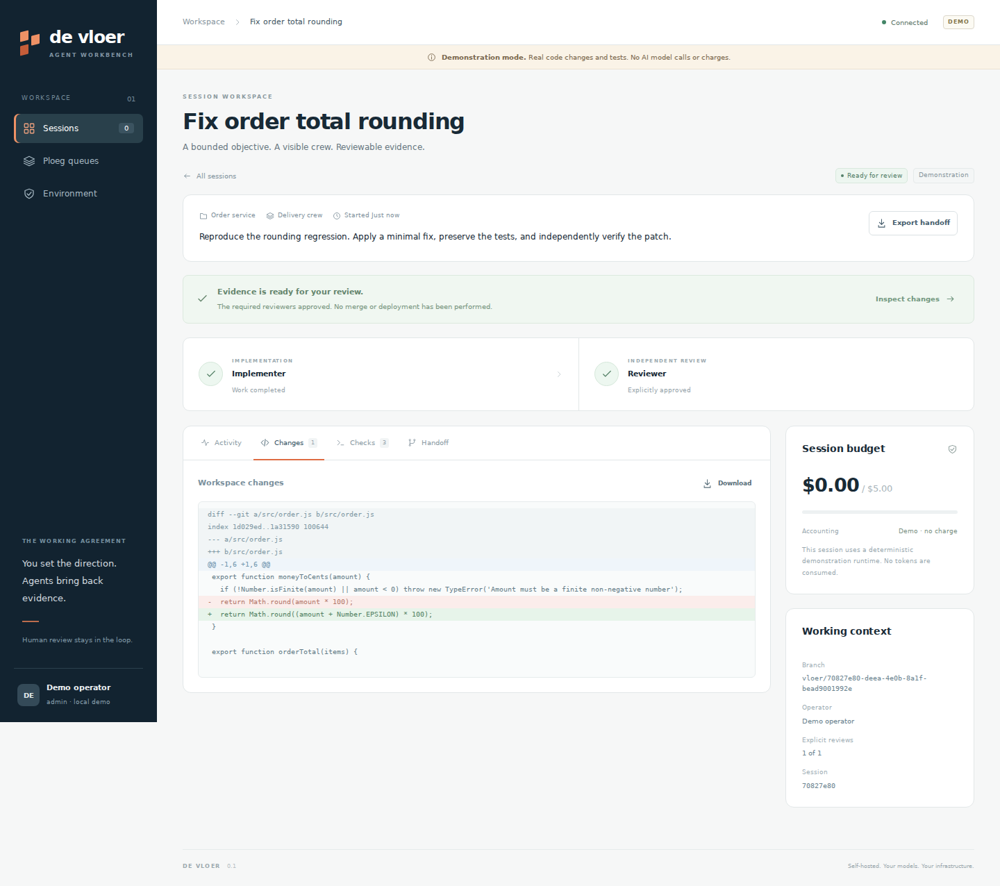
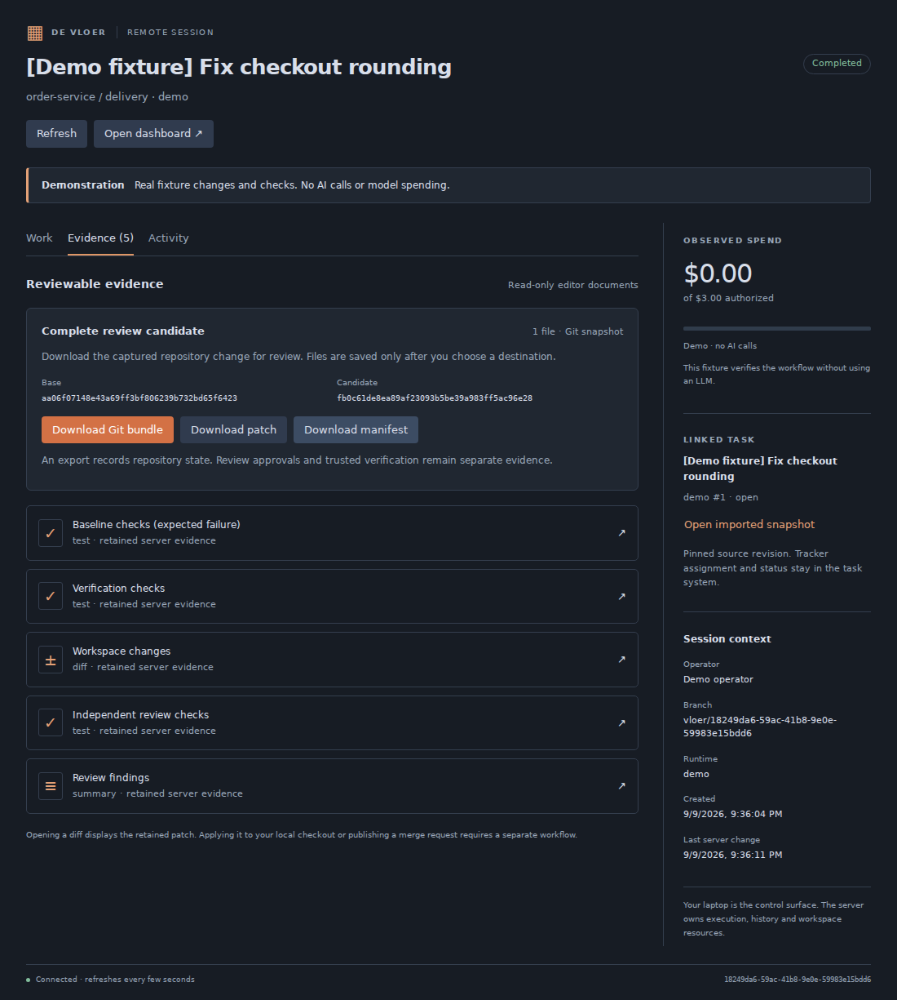

# De Vloer

A self-hosted workbench for people steering remote agent crews. Choose a repository, objective, reusable crew and budget; return to durable progress, review findings and actual check evidence from any browser.

De Vloer sits beside [Ploeg](https://forgejo.webgrip.dev/webgrip/ploeg). The tracker owns priorities, Ploeg owns unattended dispatch, and De Vloer owns interactive sessions and human intervention. The Ploeg connection is read-only.

## Try it in ten minutes

Requirements: Node **24**, Git and a modern browser. `mise install` selects the pinned tools if you use mise. No provider account, Kubernetes cluster or npm installation is needed for this demonstration.

```sh
npm run demo
```

Open **http://127.0.0.1:4080**. Create a session for **Order service**, choose **Delivery crew**, and ask it to fix the rounding regression. Start the crew and inspect the diff, failing baseline, repaired tests and independent review. [Follow the coworker walkthrough](docs/operations/demo.md).

This is an explicitly labeled deterministic demo. It copies an isolated Git fixture, modifies real source and executes real Node tests. It makes **zero AI calls** and records **zero model spend**. It demonstrates the operating workflow, not model quality.

With the server running, a second terminal can verify the full demonstration:

```sh
npm run smoke
```

## What v0.1 provides

- Durable sessions and event replay, operator instructions, pause/resume/cancel, and human permission responses.
- Reusable crews with one optional writer followed by explicit reviewers, a branch per session, and reviewable evidence.
- OpenCode server integration and a JSON-lines command bridge for additional harnesses.
- LiteLLM virtual-key lifecycle and visible accounting states; authorized budget additions are administrator actions.
- Local server workspaces and Kubernetes workspace provisioning; a browser can supervise a remote server without running agents on the laptop.

The application uses native Node TypeScript and browser modules, with **zero third-party npm runtime dependencies**. Development-only dependencies provide strict type checking. SQLite requires **one application replica** in v0.1. Live integrations have separate prerequisites and qualification limits; read the [validation matrix](docs/validation.md) before treating them as production-tested.



## Run real agents

Follow [live operation](docs/operations/live.md) to configure a registered repository, LiteLLM gateway and OpenCode runtime on a remote server or Kubernetes. Live mode is the default and requires deliberate setup; it does not silently substitute the demo. A shared pre-existing OpenCode endpoint cannot accept this implementation's per-session managed key safely and is not the managed live path.

For a shared team pilot, use the Kubernetes backend. The local backend shares the server’s OS user and is intended for trusted single-user development.

The portable model interface is the configured LiteLLM gateway. Subscription logins are not a shared token pool in this release. No vendor account or subscription is bundled with the application.

## Use it from VS Code

The [desktop extension](extensions/vscode/README.md) adds a native session tree, remote crew controls, a themed work/evidence/activity panel, human decisions and read-only evidence. Share a selection or file only after previewing its exact destination and content. Agents and model calls stay on the configured server.

The release archive includes `extensions/vscode/de-vloer-0.1.1.vsix`. Install it with **Extensions → … → Install from VSIX**, connect to the demo or your remote HTTPS workbench, and create a session. To build from source:

```sh
npm ci --prefix extensions/vscode
npm run extension:package
code --install-extension extensions/vscode/de-vloer-0.1.1.vsix
```

Actual-server integration tests, browser webview checks and packaging pass. Installation and native behavior in an actual VS Code Extension Host still require desktop qualification. The package is not published to a marketplace.



## Improve Vloer with Vloer

The [first implementation increment](docs/operations/implementation-progress.md) adds keyboard evidence navigation, stable reading/draft behavior and actionable failure guidance across browser and editor. It also includes [reviewable Ploeg prerequisite patches](integrations/ploeg/README.md), whose Go/PostgreSQL qualification remains pending.

Run the stable service separately from the candidate checkout, register the Vloer repository, and assign one bounded change with a small authorized LiteLLM budget. A human independently verifies the result, publishes the proposal and reviews the merge. The [self-improvement guide](docs/design/self-improvement.md) covers the exact first loop, including toolchain setup and current manual change-export limitations.

The [complete product and market design](docs/PRODUCT-DESIGN.md) specifies the next system: one Ploeg work authority, ClickUp/Forgejo intake, immutable candidates, trusted verification and publication, browser/editor intervention, client boundaries and operational recovery. It includes competitive research and a marketing/pilot plan. These target features are explicitly distinguished from the implemented prototype.

The [78-ticket backlog](backlog/README.md) maps every one of [30 audited gaps](docs/design/gap-register.md) to acceptance criteria and dependencies. [Import instructions](docs/operations/backlog.md) cover the included ClickUp CSV and Forgejo payloads. No external tickets have been created. To inspect the first candidate and its remaining acceptance work:

```sh
npm run backlog -- validate
node scripts/backlog.mjs brief PV-001
```

## Develop and review

```sh
npm ci
npm run typecheck
npm test
npm run check
npm run design:check
helm lint ops/helm/de-vloer
helm template de-vloer ops/helm/de-vloer
```

`npm run check` verifies erasable source syntax, relative source imports, JSON and basic committed-secret hygiene without executing application entrypoints. It is not a security audit. GitHub and Forgejo quality jobs make the checks fatal. The Forgejo runner must supply the `ubuntu-latest` label with a compatible Linux environment and access to the pinned tool downloads.

Read [architecture](docs/architecture.md), [decisions](docs/adrs/README.md), the [HTTP contract](docs/contracts/api.md) and [source research](docs/research/conventions-and-alternatives.md). The [operator skill](skills/operate-agent-session/SKILL.md) is portable procedure; its [local contract](.agents/contracts/operate-agent-session.md) contains repository facts. Copying it does not install client hooks.

The distributable ZIP contains a complete Git repository on `development`, including its commit history, design, importable backlog and packaged extension. No remote is configured. Create an empty repository on your forge, add it as `origin`, and push `development` to run the hosted checks.

Trunk: `development`. License: [Apache-2.0](LICENSE).
