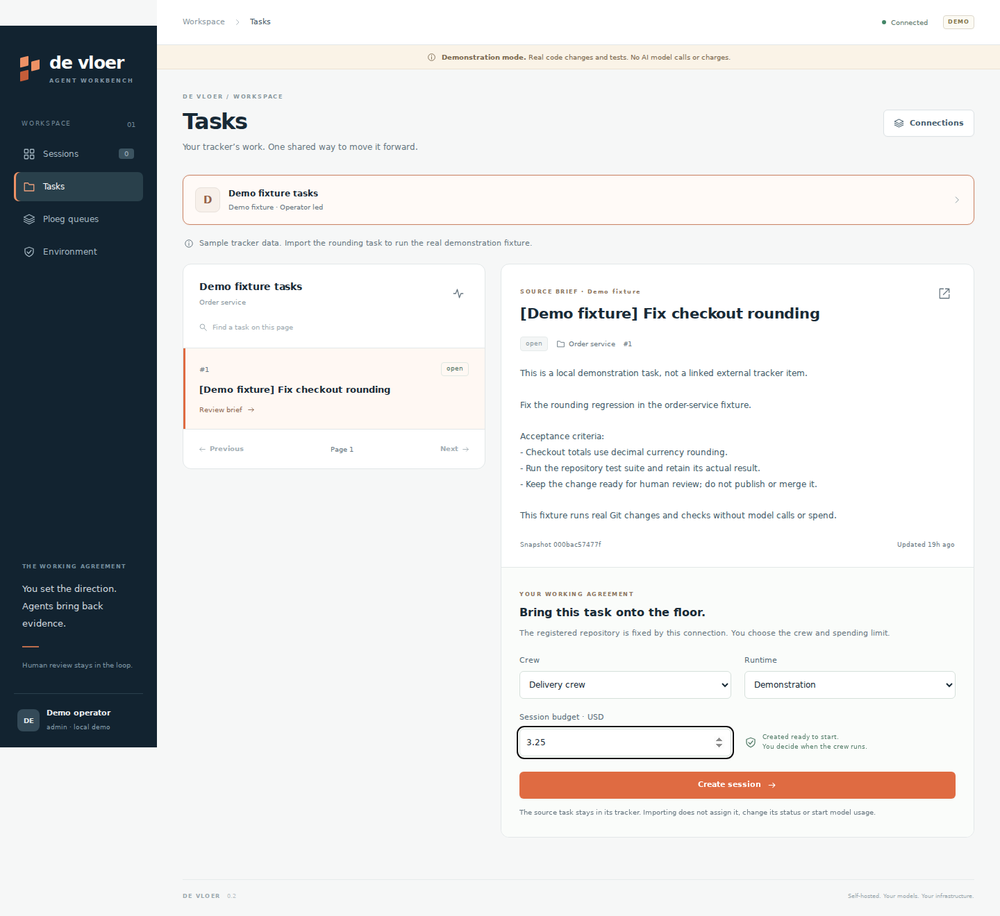

A self-hosted workbench for people steering remote agent crews. Bring a task from **Vikunja, ClickUp, Forgejo, GitHub or GitLab**, choose a reusable crew and budget, and supervise the work from a browser or VS Code. Your configured server runs the agents; your workstation remains the place you steer and review them.

De Vloer sits beside [Ploeg](https://forgejo.webgrip.dev/webgrip/ploeg). The tracker owns priorities, Ploeg owns unattended dispatch, and De Vloer owns interactive sessions and human intervention. The Ploeg workbench now exposes scoped work, evidence and spending snapshots. An opt-in shared execution path lets Ploeg admit interactive sessions while De Vloer provides their workspace and human controls. [Run the unified baseline](docs/operations/unified-baseline.md). A completed shared session can now pass through a [canonical candidate, independent Docker checks and candidate-bound approval](docs/contracts/candidate-delivery.md); Ploeg retains the authority and evidence. Live publication remains disabled.

## Try it in ten minutes

Requirements: Node **24**, Git and a modern browser. `mise install` selects the pinned tools if you use mise. No provider account, Kubernetes cluster or npm installation is needed for this demonstration.

```sh
npm run demo
```

Open **http://127.0.0.1:4080** → **Tasks**. Preview **[Demo fixture] Fix checkout rounding**, choose **Delivery crew**, then **Create session**. Select **Start crew**, inspect the diff, failing baseline, repaired tests and independent review, then download the candidate from **Repository handoff**. You can also create an **Order service** session directly. [Follow the 0.2.0 coworker walkthrough](docs/operations/iteration-0.2.0.md).

This is an explicitly labeled deterministic demo. It copies an isolated Git fixture, modifies real source and executes real Node tests. It makes **zero AI calls** and records **zero model spend**. It demonstrates the operating workflow, not model quality.

To test the shared execution with real Ploeg and PostgreSQL, use `mise exec -- npm run demo:unified`. Keep the matching Ploeg checkout beside this one and follow the [local shared execution guide](docs/operations/local-unified-demo.md) for prerequisites and cleanup. The launcher prints a browser URL and prepares a session you can start, pause and supervise.

With the server running, a second terminal can verify the full demonstration:

```sh
npm run smoke
```

## Current capabilities

- One task connection contract for Forgejo issues, GitHub issues, GitLab issues, ClickUp List tasks and Vikunja project tasks. An administrator registers each connection once; browser and editor use the same sources.
- An explicit task preview and import into a queued session, with source identity and revision retained. Importing a task does not start a model request or change the tracker.
- Durable sessions and event replay, operator instructions, pause/resume/cancel, and human permission responses.
- Reusable crews with one optional writer followed by explicit reviewers, a branch per session, and reviewable evidence.
- Retained candidate export for supported workspaces, with a manifest, binary-capable Git patch and self-contained snapshot bundle. Export availability and limits are visible; see the [iteration guide](docs/operations/iteration-0.2.0.md).
- OpenCode server integration and a JSON-lines command bridge for additional harnesses.
- LiteLLM virtual-key lifecycle and visible accounting states; authorized budget additions are administrator actions.
- Sandboxes that dial out, an Agent Host Protocol endpoint for VS Code and other clients, warm Kata pools through the Sandbox CRDs, and candidates signed with in-toto provenance and Agent Trace records.
- Per-session workspace placement: a hardened container on the workbench host, a pod in a Kubernetes workspace namespace, or a plain working directory for trusted development; a browser can supervise a remote server without running agents on the laptop.

The application uses native Node TypeScript and browser modules, with **zero third-party npm runtime dependencies**. Development-only dependencies provide strict type checking. SQLite requires **one application replica**. Live integrations have separate prerequisites and qualification limits; read the [validation matrix](docs/validation.md) before treating them as production-tested.



## Run real agents

Follow [live operation](docs/operations/live.md) to configure a registered repository, LiteLLM gateway and OpenCode runtime on a remote server or Kubernetes. Live mode is the default and requires deliberate setup; it does not silently substitute the demo. A shared pre-existing OpenCode endpoint cannot accept this implementation's per-session managed key safely and is not the managed live path.

On a workstation, enable the Docker backend so agents run in a sandboxed container from the pinned agent image. For a shared team pilot, deploy the workbench in the cluster and use the Kubernetes backend. The local backend shares the server’s OS user and is intended for trusted single-user development ([ADR 0009](docs/adrs/0009-workspace-placement-is-a-session-choice.md)).

The portable model interface is the configured LiteLLM gateway. Use API-backed model credentials for the managed budget path. This release does not turn a personal coding subscription into shared LiteLLM credit.

## Connect your task system and forge

[Task connections](docs/operations/task-connections.md) includes copyable configuration for all five providers. Start with [config/task-sources.example.json](config/task-sources.example.json), retain the connections you use, and supply their tokens to the server through the named environment variables.

Task management and code hosting are independent choices. For example, a Vikunja project can map to a repository hosted on Forgejo, or a ClickUp List can map to GitLab. Repository registration fixes the clone URL and branch; a task cannot choose its own execution endpoint. A source marked for Ploeg remains available for context, while standalone execution is restricted to repositories assigned to Vloer. Shared execution uses an explicit Ploeg registration. [Vikunja and ClickUp binding](docs/contracts/ploeg-tracker-binding.md) adopts an existing unstarted Ploeg Work Item after source, scope and routing checks.

Connection registration in this iteration is administrator configuration. OAuth installation, a graphical connection-management wizard, bidirectional task updates and unattended intake are roadmap items.

## Use it from VS Code

The [desktop extension](extensions/vscode/README.md) adds a native session tree, task import, remote crew controls, a themed work/evidence/activity panel, human decisions and evidence export. Share a selection or file only after previewing its exact destination and content. The configured workbench runs the session's workspace and harness; it may be on your machine or on a remote host.

Use the VSIX included in the chosen release. Install it with **Extensions → … → Install from VSIX**, connect to the demo or your remote HTTPS workbench, and import a task or create a session. To build from source:

```sh
npm ci --prefix extensions/vscode
npm run extension:package
```

The [validation matrix](docs/validation.md) records actual-server integration, browser webview and package checks. Installation and native behavior in an actual VS Code Extension Host still require desktop qualification. See the [release guide](docs/operations/release.md#extension-distribution) for distribution conditions and the [extension guide](extensions/vscode/README.md#install) for VSIX installation.


## Improve Vloer with Vloer

The [0.2.0 iteration](docs/operations/iteration-0.2.0.md) connects task selection to an interactive session and retained review evidence. The earlier [implementation increment](docs/operations/implementation-progress.md) added keyboard evidence navigation, stable reading/draft behavior and actionable failures. The release also includes [reviewable Ploeg prerequisite patches](integrations/ploeg/README.md), whose historical qualification notes are superseded for this increment by the [real cross-service baseline](docs/operations/unified-baseline.md#reproduce-qualification).

Run the stable service separately from the candidate checkout, register the Vloer repository, and connect the task source that holds its backlog. Preview one bounded task, import it, authorize a small LiteLLM budget and start the crew. Export and independently verify the candidate before a human publishes the proposal and reviews the merge. The [iteration guide](docs/operations/iteration-0.2.0.md) records the 0.2.0 loop; the [self-improvement design](docs/design/self-improvement.md) specifies its planned automation.

Use the [documentation index](docs/index.md) for current guidance. The [design chapter guide](docs/PRODUCT-DESIGN.md) links the September planning baseline and market hypotheses. Those chapters contain proposals and dated gaps; the [architecture](docs/architecture.md) describes current behavior. Universal Ploeg authority and a common local or remote runner remain [open choices](docs/landscape/questions.md).

The [planning backlog](backlog/README.md) maps every one of [30 audited gaps](docs/design/gap-register.md) to acceptance criteria and dependencies. [Import instructions](docs/operations/backlog.md) cover the included ClickUp CSV and Forgejo payloads. No external tickets have been created. To inspect the first candidate and its remaining acceptance work:

```sh
npm run backlog -- validate
node scripts/backlog.mjs brief PV-001
```

## Develop and review

```sh
npm ci
npm run typecheck
npm test
npm run check
npm run design:check
helm lint ops/helm/de-vloer
helm template de-vloer ops/helm/de-vloer
```

`npm run check` verifies erasable source syntax, relative source imports, JSON and basic committed-secret hygiene without executing application entrypoints. It is not a security audit. GitHub and Forgejo quality jobs make the checks fatal. The Forgejo runner must supply the `ubuntu-latest` label with a compatible Linux environment and access to the pinned tool downloads.

Releases, images, the chart and the extension ship from one Forgejo train; see [releases](docs/operations/release.md). Read [architecture](docs/architecture.md), [decisions](docs/adrs/README.md), the [HTTP contract](docs/contracts/api.md) and [source research](docs/research/conventions-and-alternatives.md). The [operator skill](skills/operate-agent-session/SKILL.md) is portable procedure; its [local contract](.agents/contracts/operate-agent-session.md) contains repository facts. Copying it does not install client hooks.

The [Forgejo repository](https://forgejo.webgrip.dev/webgrip/de-vloer) is the source home. Release-specific walkthroughs and screenshots retain the version they actually demonstrate.

Trunk: `development`. License: [Apache-2.0](LICENSE).

## Name and mark

*Vloer* is Dutch for floor, and *de werkvloer* is where the work actually happens. The
[brand identity](docs/brand/README.md) draws that: a capital V standing on a floor that carries
it, with the construction, the palette and its measured contrast, and the type choices written
down. Every asset is generated by [scripts/build-brand.mjs](scripts/build-brand.mjs); run
`npm run brand:build` after changing it and `npm run brand:check` to confirm the committed files
still match.

The name *De Vloer* and the De Vloer mark are trademarks — §6 of the Apache licence grants no
rights in them, deliberately. [docs/brand/TRADEMARK.md](docs/brand/TRADEMARK.md) says what you
may do without asking (reproduce them, link, say your software works with De Vloer) and the two
things that need permission (shipping a fork under the name, implying endorsement). Settled in
[ADR 0020](docs/adrs/0020-the-name-and-mark-are-trademarks.md).
