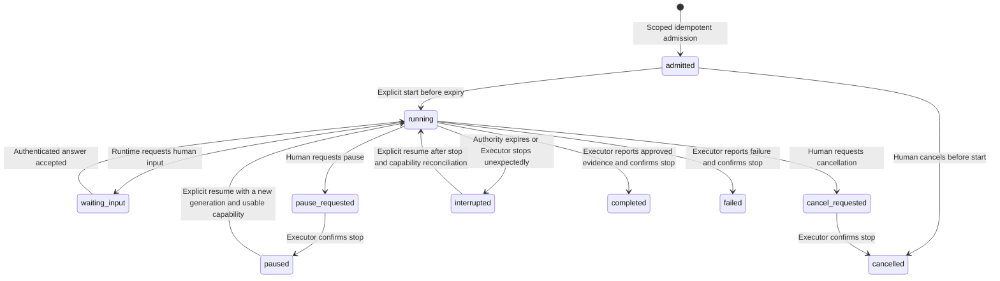

# Entities — Ploeg

*Generated from `model.yaml` — do not edit by hand.*

## Operator Execution
*Context: Dispatch*

A consumer-owned session binding and serialized execution lifecycle.

| Attribute | Type | Required | Description |
|---|---|---|---|
| `id` | `string` | yes | Stable identity derived from consumer and session; admission is idempotent. |
| `generation` | `integer` | yes | Incremented on explicit resume; stale executors cannot authorize new turns. |
| `revision` | `integer` | yes | Transactionally serialized command and event position for this execution. |
| `supervision` | `enum(human, background)` |  | Human attention mode; it does not move or replace the Executor. |
| `stop_confirmed` | `boolean` |  | Whether the delegated Executor acknowledged that its turn stopped. |

**Relationships**
- has_one **Work Item** — One manual item or atomically adopted pristine tracker item outside unattended queue claims.
- has_one **Shift** — One retained authorization pool.
- has_one **Run** — One operator Role whose delegated Steps Vloer performs until Glide ADR-0002 is implemented.

**Lifecycle**



## Work Item
*Context: Dispatch*

Ploeg's execution record for tracker, follow-up or operator work.

| Attribute | Type | Required | Description |
|---|---|---|---|
| `id` | `string` | yes | Ploeg-internal id. |
| `provider` | `string` |  | Tracker provider name (e.g. "vikunja"); empty for Follow-Ups. |
| `external_id` | `string` |  | Provider-scoped id of the mirrored Tracker Item. |
| `external_scope` | `string` |  | The tracker's own container id (its Scope) for the item; the input to Work Target resolution, recorded even when no Routing Rule matched. |
| `revision` | `string` |  | Provider revision/etag for staleness detection. |
| `team` | `string` |  | Team the item is queued for — the claiming crew, not the codebase; empty until assigned. |
| `target` | `Work Target` |  | Forge coordinates the item's Runs act on; absent means unresolved (R11). |
| `route_rule` | `string` |  | Id of the Routing Rule that decided team and target; recorded for audit. |
| `state` | `enum(ingested, proposed, queued, leased, needs_human, awaiting_review, stale, done, withdrawn)` | yes | Dispatch lifecycle position. proposed means a Run created the item and it waits for a person to approve or reject it; no Team can claim it. awaiting_review means Ploeg's work succeeded and its pull request is ready for human review. withdrawn means a person took the mandate back by unassigning the Tracker Item or cancelling it through the operator API. |
| `origin` | `enum(assignment, follow_up, operator)` | yes | Whether the item came from a tracker, Forge Event or Operator Consumer. |
| `priority` | `integer` |  | Rank mirrored from the tracker; drives Team Queue order. |

**Relationships**
- has_one **Shift** — At most one live Shift at a time (unique per Work Item).
- has_one **Work Target** — Pinned at ingest; absent until resolved, and then not claimable (R11).
- has_many **Run** — All executions across roles, retries, and resumes.
- has_many **Checkpoint** — Progress records; the latest one drives resume.

**Lifecycle**

```mermaid
stateDiagram-v2
    [*] --> ingested : Tracker webhook received; Tracker Item mirrored
    [*] --> queued : Follow-Up created from a Forge Event, routed to the owning Team
    [*] --> proposed : A Run created the item within its Team's created-work limits (ADR-0031)
    [*] --> queued : A Run created the item and its Team sets autoDispatch; not-Ready work only with a refinement target
    proposed --> queued : A person approves it through the operator API
    proposed --> done : A person rejects it with a reason; its allotted budget is released
    ingested --> queued : Assignment matches a Routing Rule, resolving a Team and a Work Target
    queued --> leased : Team claims the item, acquiring a Lease
    leased --> queued : Lease expired or Run failed, retries remaining
    leased --> stale : Lease expired repeatedly without an Outcome (threshold reached)
    leased --> needs_human : stuck Outcome reported (mandatory reason)
    leased --> done : Terminal Outcome reported (issue_updated, follow_up_created, no_change_needed)
    leased --> awaiting_review : A pull request was opened or updated and the Shift closed successfully
    awaiting_review --> queued : Re-assignment in the tracker is a fresh mandate
    needs_human --> queued : Human re-queues after resolving the blocker
    needs_human --> done : Human closes the item
    stale --> queued : Human or explicit policy re-queues
    queued --> withdrawn : Tracker Item unassigned or cancelled by an operator; the live Shift closes
    leased --> withdrawn : Tracker Item unassigned or cancelled by an operator; running Runs are stopped
    withdrawn --> queued : Re-assignment in the tracker is a fresh mandate
```

## Work Target
*Context: Dispatch*

Value object: the forge coordinates one Work Item's Runs act on. A coordinate, not a connection — it names a Forge by id and carries no URL and no credential.

| Attribute | Type | Required | Description |
|---|---|---|---|
| `forge` | `string` | yes | Id of a registered Forge; the registry resolves it, never the Work Item. |
| `owner` | `string` | yes | Owner or organisation on that Forge. |
| `repo` | `string` | yes | Repository name within the owner. |
| `base_branch` | `string` | yes | Branch Runs branch from and open PRs against. |

**Relationships**
- references **Forge** — By id; the registry resolves endpoint, dialect, identity, and credential source.

## Shift
*Context: Dispatch*

One Team's engagement with one Work Item — owns the branch, the budget pool, the roster and the Round counter (ADR-0010).

| Attribute | Type | Required | Description |
|---|---|---|---|
| `work_item_id` | `string` | yes | Unique among live Shifts — two Teams never work one item. |
| `team` | `string` | yes |  |
| `branch` | `string` | yes | The single branch every writing Run in this Shift pushes to. |
| `round` | `int` | yes | Runs started together share a Round and never observe each other. |
| `budget` | `decimal` | yes | The pool for the whole item, in USD (ADR-0012). |
| `spent` | `decimal` | yes | Settled spend across every Run in this Shift. Reserved is NOT stored — it is summed over running Runs, so it cannot drift (ADR-0012). |

**Relationships**
- belongs_to **Work Item** — Unique per Work Item among live Shifts.
- has_one **Lease** — At most one live Lease — held by the writing Run, if any.
- has_many **Run** — Readers and writers across every Round.

## Lease
*Context: Dispatch*

The exclusive right to write a Shift's branch, crash-safe and TTL-renewed. Held only by a writing Run.

| Attribute | Type | Required | Description |
|---|---|---|---|
| `shift_id` | `string` | yes | Unique per Shift — one writer at a time. |
| `run_id` | `string` | yes | The writing Run holding it. Readers never appear here. |
| `forge_token_id` | `string` | yes | The scoped push credential minted for this Run, revoked when the Lease lapses (ADR-0013). |
| `expires_at` | `timestamp` | yes | Expiry revokes the push credential and releases the Run's budget authorization in the same sweep. |
| `renewed_at` | `timestamp` |  | Last renewal by the running Run. |

**Relationships**
- belongs_to **Shift** — Unique per Shift.
- references **Run** — The writing Run holding write access.

## Run
*Context: Execution*

One execution of one Role, realized as a Kubernetes Job or a delegated workbench execution.

| Attribute | Type | Required | Description |
|---|---|---|---|
| `work_item_id` | `string` | yes |  |
| `team` | `string` | yes |  |
| `role` | `string` | yes | The Role this Run executes. |
| `job_name` | `string` |  | The Kubernetes Job realizing this Run, when an executor uses one. |
| `round` | `int` |  | The Round this Run belongs to; Runs sharing a Round never observe each other. |
| `writes` | `boolean` |  | A writer takes the Shift's Lease and runs alone; a reader takes none and runs beside others. |
| `state` | `enum(pending, running, finished)` |  | A Round materialises its Runs as pending rows; pending rows are also the scale signal. |
| `authorized` | `decimal` |  | The budget hold, summed over running Runs to give the Shift's reserved figure (ADR-0012). |
| `expires_at` | `timestamp` |  | This Run's own liveness deadline. Not the Lease's — a reader has no Lease to expire. |
| `outcome` | `enum(pr_opened, pr_updated, issue_updated, follow_up_created, stuck, failed, no_change_needed)` |  | Reported terminal result, or failure recorded by controller recovery when the applicable expiry rule fires. |
| `started_at` | `timestamp` |  |  |
| `finished_at` | `timestamp` |  |  |

**Relationships**
- belongs_to **Work Item**
- references **Team**

## Checkpoint
*Context: Dispatch*

Small durable progress record enabling resume.

| Attribute | Type | Required | Description |
|---|---|---|---|
| `work_item_id` | `string` | yes |  |
| `phase` | `string` | yes | e.g. branch_created, changes_made, pr_opened. |
| `branch` | `string` |  |  |
| `pr_url` | `string` |  |  |
| `at` | `timestamp` |  |  |

**Relationships**
- belongs_to **Work Item**

## Team
*Context: Dispatch*

Declarative manifest of Roles; the unit of claiming. A Team never names a repository, forge, or credential — those belong to the Work Item's Work Target (R11).

| Attribute | Type | Required | Description |
|---|---|---|---|
| `name` | `string` | yes |  |
| `roles` | `list(Role: name, harness image, model)` | yes | The specialist slots and their bindings. |
| `strategy` | `enum(sequential, parallel)` |  | How Roles coordinate within one Lease, on a shared branch. |
| `budget` | `string` |  | Resource/token budget for the Team's Runs. |
| `concurrency` | `integer` |  | Maximum Leases the Team may hold at once. |

**Relationships**
- has_many **Lease** — One live Lease per held Work Item.

## Routing Rule
*Context: Dispatch*

One ordered, first-match-wins mapping from a normalized tracker event to a Team and a Work Target. Operator-declared; the rules are the only source of reachable Work Targets.

| Attribute | Type | Required | Description |
|---|---|---|---|
| `id` | `string` | yes | Recorded on every Work Item this rule routed, for audit. |
| `provider` | `string` | yes | Tracker provider whose events this rule may match. |
| `match` | `(scope, actor, hint)` | yes | Compared for equality only; never parsed or pattern-matched (R7). |
| `team` | `string` | yes | Team the matched work is queued for. |
| `target` | `Work Target` | yes | A pre-registered target; never constructed from tracker text. |
| `order` | `integer` | yes | Evaluation position; the first matching rule wins. |

**Relationships**
- references **Work Target**
- references **Team**

## Forge
*Context: Integration*

Registry entry for one git forge instance, keyed by the id a Work Target carries. Configuration, not a per-Team knob and not a per-item field.

| Attribute | Type | Required | Description |
|---|---|---|---|
| `id` | `string` | yes | Stable key a Work Target names. |
| `base_url` | `string` | yes | Endpoint of this instance. |
| `dialect` | `string` | yes | Which Forge Provider speaks to this instance. |
| `identity` | `string (git name + email)` |  | Identity Runs commit as on this Forge. |
| `credential_ref` | `string` |  | Reference to the credential source — a reference only, never a value (R8). |

## Task Spec
*Context: Harness*

Input contract of an Agent Container. The harness contract already carries the coordinate as a struct (harness.RepoRef: forge url, owner, name, base branch); here the model catches up.

| Attribute | Type | Required | Description |
|---|---|---|---|
| `work_item` | `Work Item snapshot` | yes |  |
| `role` | `string` | yes |  |
| `checkpoint` | `Checkpoint` |  | Present on resume; absent on first Run. |
| `target` | `Work Target` | yes | The Work Item's pinned coordinate. |
| `forge_endpoint` | `string` | yes | Base URL the target's Forge id resolves to; never a credential (R8). |

**Relationships**
- references **Work Item**
- references **Work Target**
- references **Checkpoint**

## Outcome Report
*Context: Harness*

Output contract of an Agent Container; mandatory before exit.

| Attribute | Type | Required | Description |
|---|---|---|---|
| `outcome` | `Outcome` | yes |  |
| `summary` | `string` | yes |  |
| `links` | `list(string)` |  | PRs, commits, created Follow-Ups. |
| `checkpoint` | `Checkpoint` |  | New progress to persist. |
| `stuck_reason` | `string` |  | Mandatory when outcome is stuck. |

**Relationships**
- references **Checkpoint**
