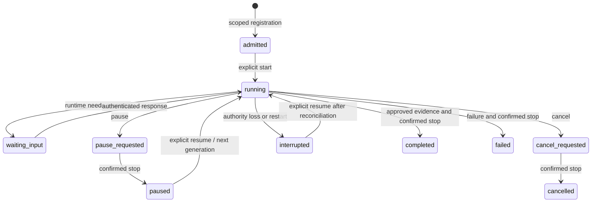

# Shared Ploeg execution

This is the opt-in execution contract implemented by [the authority client](../../src/execution-authority.ts) and [the session engine](../../src/engine.ts). The [operating guide](../../../../docs/workflows/managed-execution.md) covers configuration and qualification. Standalone sessions retain their existing contract when `execution` is absent; a session already bound to Ploeg cannot fall back to standalone execution.

## Ownership

| Owner | Durable responsibility |
| --- | --- |
| Tracker | Existing tracker content, priority and assignment |
| Ploeg | Admission, Work Item, Shift, operator Run, command revisions, generation and inference authorization |
| De Vloer | Authenticated human session, registered repository, delegated crew execution, native workspace, intervention and candidate evidence |
| Harness | Reasoning, tools and its opaque native conversation state |
| LiteLLM | Scoped key enforcement, routing and available metering records |

One manual session admits one manual-origin Work Item, one Shift and one `operator` Run. Successful completion retains the operator report and marks its Run finished; it does not infer a forge Outcome such as a published proposal or no change needed. De Vloer's sequential crew roles remain visible as local runs; they do not become separate Ploeg Runs in this increment. The consumer authorizes the registered repository and attests the session owner's identity. This is a trusted service boundary, not end-user OIDC verification inside Ploeg.

The read model is separate: De Vloer exposes bounded snapshots of existing Ploeg work to the browser and editor. [Registered tracker imports](ploeg-tracker-binding.md) bind an existing pristine Vikunja or ClickUp Work Item through the optional admission `source` pin. They do not create another manual item. Unmapped and unsupported sources remain unavailable for shared import.

## Protocol

All Ploeg endpoints use `/api/v1/operator`. Responses carry `schemaVersion: "1.0"`. Consumer bearer credentials are server-only. Execution requests carry `X-Ploeg-Actor`, the stable session owner; operator commands additionally identify the authenticated acting user for audit. De Vloer checks local ownership, operator role and the configured team mapping before user-controlled execution.

| Method and path | Purpose |
| --- | --- |
| `POST /executions` | Idempotently admit the immutable consumer/session registration |
| `GET /executions/{id}` | Read the caller-owned current execution |
| `POST /executions/{id}/commands` | Apply an identified command against an expected revision and generation |
| `GET /executions/{id}/events?after={revision}` | Replay up to 200 serialized execution events after a committed revision |
| `POST /executions/{id}/credential` | Issue the initial scoped credential once for the live generation |
| `POST /executions/{id}/block` | Attempt gateway capability blocking without deleting accounting history |
| `GET /executions/{id}/spend` | Read capability state and provisional observed spend, or explicit uncertainty |

Commands include `start`, `resume`, `pause`, `cancel`, `message`, `handback`, `take-control`, `heartbeat` and executor `report`. Command IDs and payloads are persisted before submission. Duplicate identical commands return their original result; changed payloads, stale revisions and stale generations fail. A lost response is reconciled using the same identity. It never authorizes a second paid submission.

Per-execution event revisions are serialized by the execution row transaction. This guarantee does **not** apply to the legacy fleet audit sequence: that API provides snapshot pagination, not lossless replication. Native browser session events remain durable in De Vloer's SQLite store.

## Lifecycle

Pending stop intent survives expiry and interruption. Cancellation cannot become a resumable pause. A browser disconnect does not stop the server-owned execution. `handback` and `take-control` change human supervision of the same execution and workspace; they do not migrate a native harness session or adopt an existing unattended ACP worker.

Ploeg grants 90 seconds of liveness, renewed by the workbench at a configured 1–20 second interval. De Vloer checks the pinned generation before each role. Losing authority aborts its runtime and attempts credential blocking; Ploeg's sweeper independently retries blocking. This is cooperative executor fencing. A 90-second grant does not intercept every model HTTP request, kill a copied key, or fence arbitrary Git writes. Gateway key budgets and TTL remain the independent inference bounds.

## Credentials and accounting

The workbench uses Ploeg's scoped credential instead of its local management broker. The inference key is stored encrypted in the workbench's internal state and is never part of a public session, command event or model prompt. Ploeg stores the gateway identity and accounting state, not the returned key. Issuance validates the execution generation before minting and again before recording the result; a stale result is blocked and retained as uncertain accounting.

A confirmed pause preserves the same capped key for explicit resume. The key can remain usable until its gateway TTL; this is unsuitable as a hostile-process revocation boundary. Unknown or blocked keys cannot be silently replaced. Restart or uncertain interruption attempts to block the key; paid continuation then requires reconciliation rather than a fresh hidden authorization. A failed shared execution remains terminal, and the workbench cannot increase its budget.

Observed spend remains provisional. De Vloer exposes it through `observedUsd` with pending or unknown `costStatus`; it does not treat a quiet meter as final settlement. Ploeg retains unresolved authorization after expiry and blocking. Trusted final accounting is a distinct control-plane operation. Demo sessions explicitly report no model calls and zero spend.

## Current operating envelope

Keep one De Vloer server replica with its durable SQLite volume. The workbench's existing concurrency limit still applies; this implementation makes no thousand-agent throughput claim. Ploeg's unattended scheduler and existing Kubernetes executors continue alongside delegated operator executions. Queue claims and legacy retry sweeps exclude delegated executions.

The [tracker binding contract](ploeg-tracker-binding.md) extends this boundary for existing source work. Durable cross-agent messages, general research/plan/measure loops, fleet AHP projection, multi-replica De Vloer, live gateway settlement and live-cluster qualification remain separate milestones.
