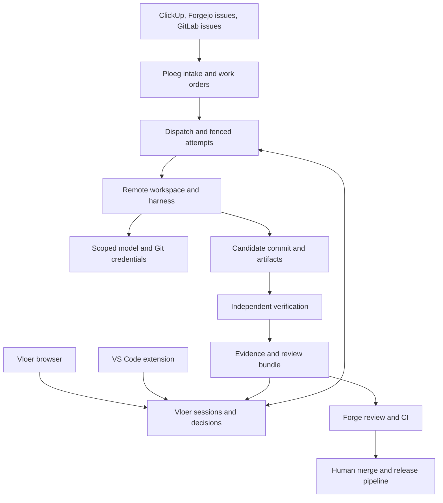
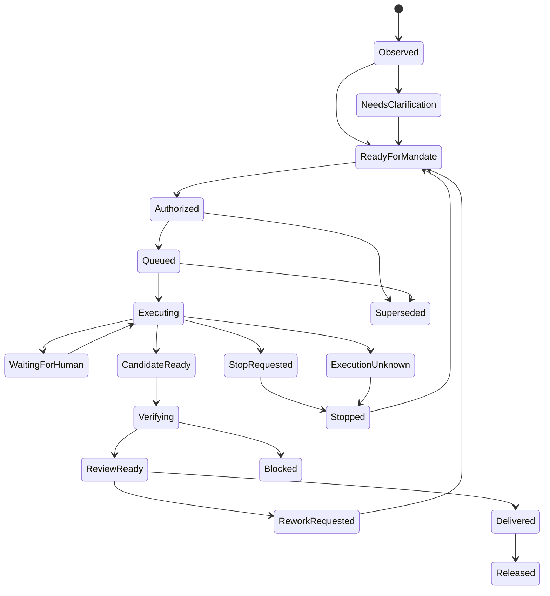

# Ploeg and De Vloer product and system design

> Design baseline: September 2026. This chapter preserves proposals and the original audit; some gaps have since closed. Check [current architecture](../architecture.md), [contracts](../contracts/ploeg-execution.md) and [open product choices](../../../../docs/landscape/questions.md) before treating a statement as current behavior.

## Product decision

Build an open delivery control plane for teams that work across client repositories, trackers, model providers and execution environments. The product should make delegated engineering work attributable, bounded, inspectable and easy to take over. The unit of value is an accepted change with evidence and an accountable human owner. Agent count, token volume and an attractive chat window are insufficient measures of success.

Ploeg is the dispatch and delivery engine. De Vloer is the operator workbench, available in a browser and VS Code. Both operate on the same governed work identity. A tracker retains the business priority and acceptance criteria; the forge retains code, review and merge authority; the deployment platform retains release authority. No component quietly becomes a second project-management system.

This is an expansion design, not a claim that the original proof of concept already implements the product. The initial De Vloer baseline is commit `491c3a6`; the inspected Ploeg baseline is development commit `67c4bc968455a99ef767bc8a24791ea1a87319cb`. Implementation evidence, unresolved defects, proposed contracts and market hypotheses are distinguished throughout. Current market evidence was checked on 2026-09-09; a deployment must still qualify its actual installed versions.

The [first implementation increment](../operations/implementation-progress.md) adds keyboard/scroll behavior and durable actionable failures to Vloer, including the editor panel. It also distributes Ploeg source corrections for scope, webhook authentication order and explicit review approval. Those Ploeg corrections still require Go/PostgreSQL and deployment qualification; their presence in a patch does not close the broader audit gaps.

### The short answer to self-improvement

Run the previous stable Vloer release as a service and register the Vloer source repository as an allowed target. A crew edits a candidate branch in a separate remote workspace. The running service survives the candidate's mistakes. The result returns as changes, actual checks and review findings; a human reviews and merges, and the existing release pipeline deploys the next stable version. Improving Vloer does not grant an agent the right to deploy it, change its own budget or modify the rules governing its run.

That first loop can be supervised manually with the existing Vloer API. Automated ticket intake, canonical change export, trusted independent verification, team identity and a single claim shared with Ploeg require the backlog in this repository. Until those controls are implemented and qualified, the first tasks should be small UI, documentation or test improvements in a disposable branch, with human-run verification before merge.

### The short answer to tickets

Extend Ploeg's existing tracker/provider layer. ClickUp already has an adapter, but current routing and update handling have concrete gaps. Forgejo's existing forge adapter handles code-review events; it is not an issue-to-work tracker adapter. Implement that distinction explicitly. Webhooks notify the system; authenticated authoritative reads establish the current task. A versioned work order freezes the material instructions, approved repository, policy and budget before dispatch. Vloer joins or takes over that same work order through a fenced claim, so a click in the editor cannot accidentally start a second worker for the same ticket.

## Intended customers and their jobs

The initial customer hypothesis is a software agency or internal platform team supporting several delivery teams and many client applications. These organizations commonly have existing trackers, CI, a forge, identity, secrets management and deployment infrastructure. They need consistency across projects without forcing every engineer into one coding vendor. This is a segment hypothesis to test with interviews and pilots; it is not a measured market-size assertion.

| Person | Job the product must improve | Evidence that matters |
| --- | --- | --- |
| Developer | Delegate a bounded change and return to an understandable result inside the editor | Correct diff, relevant checks, provenance, context, easy takeover |
| Reviewer or technical lead | Decide whether a change is acceptable without reconstructing an opaque conversation | Base/candidate identity, policy, independent checks, findings, unresolved risks |
| Product owner | See whether a ticket is progressing and what decision is needed | Tracker-linked outcome, blockers, acceptance criteria, realistic completion state |
| Platform engineer | Operate agent execution once for many projects | Reproducible images, quotas, cancellation, diagnosable failures, upgrade/restore procedure |
| CTO or engineering manager | Decide whether delegation improves delivery economics and autonomy | Human effort per accepted change, escaped defects, total cost, lead time, adoption |
| Client owner or budget owner | Keep work, secrets and charges inside the correct client boundary | Scoped identity, approved models/network, attribution, export and deletion evidence |

For an initial Code14-style deployment, use the existing internal identity, GitLab review/CI, Harbor images, Kubernetes capacity and GitOps workflow where they are available. Do not make ClickUp mandatory: an organization can retain its own tracker. Do not assume a public SaaS webhook can reach a LAN-only service. Deployment and connector profiles must express whether polling, a narrow ingress or a controlled webhook relay is available.

### Where to say no

A single developer who only wants a faster inline assistant may be better served by an existing coding agent. An organization already satisfied with its forge's coding-agent workflow may not need another control plane. A team without a useful acceptance or review process should improve that process before adding unattended agents. A prospective customer that requires validated multi-tenant isolation, high availability or a compliance certificate cannot be told the current prototype already provides them.

## Product structure

| Component | Responsibility | Current or proposed |
| --- | --- | --- |
| Ploeg Engine | External work identity, dispatch, leases, shifts/runs, delivery evaluation | Existing engine; unified work-order and takeover contracts proposed |
| De Vloer Workbench | Interactive sessions, operator decisions, evidence browsing and handoffs | Existing browser application; editor extension added separately |
| Crew library | Versioned role procedures, skills, repository contracts and model profiles | Basic crew/config and portable skill exist; registry/pinning/evaluation proposed |
| Runtime adapters | Translate approved runs into harness sessions and normalized evidence | Vloer OpenCode and command bridge exist; Ploeg has its own published harness seam |
| Workspace service | Provision and reconcile isolated execution environments | Local and Kubernetes implementations exist; shared lifecycle hardening proposed |
| Credential and budget broker | Issue minimal credentials, authorize reservations, revoke and settle | LiteLLM integration exists; stronger cross-client budget and identity controls proposed |
| Connector packages | Normalize tracker and forge events and manage limited writeback | Ploeg providers partly exist; issue intake and durable reconciliation gaps remain |
| Verification and evidence service | Independently verify immutable candidates and attest outcomes | Proposed; writer tool output alone is not this service |

Keep Ploeg's Go domain and De Vloer's TypeScript operator code separate. Reuse contracts and protocol fixtures, not each other's internal database tables. A service boundary should have an explicit owner, state machine and migration plan. Do not add a microservice for every row in this table during the pilot: several responsibilities can be modules in the current deployables.

### Architecture

The arrows describe ownership and data flow, not an invitation for an agent to hold every credential in the graph. The model gateway, forge API, tracker API and Kubernetes API have different audiences and scopes. A worker that can request model inference should not thereby be able to assign a ticket, approve a deployment or administer a client namespace.

## Domain language and invariants

Use these names consistently across APIs, UI, tickets and documentation. Existing Ploeg types can remain as implementation details while mappings are introduced; replacing all established terminology at once would add migration risk without delivering user value.

| Term | Meaning | Owner |
| --- | --- | --- |
| Source connection | One authenticated external tracker or forge installation | Ploeg connector administration |
| Source item | A native ticket identified within its connection and scope | External tracker |
| Work order | Immutable approved task revision and execution mandate | Ploeg |
| Delivery attempt | One fenced execution attempt for a work order | Ploeg |
| Shift / Run | Existing Ploeg crew lifecycle and role execution objects | Ploeg |
| Session | Human-facing interaction and evidence context linked to an attempt | Vloer |
| Mandate | Capabilities, client/repository scope, budget and approval needed for execution | Policy/authorization owner |
| Crew version | Immutable role graph, skill digests and model requirements | Crew registry |
| Workspace | Disposable execution environment plus retained change/state references | Workspace service |
| Candidate | A base SHA, candidate SHA and complete retrievable change set | Forge/artifact service |
| Check run | Actual independent execution against the candidate and policy version | Verification service |
| Decision | A human approval/rejection bound to a specific subject and revision | Vloer authorization |
| Evidence bundle | Candidate, checks, findings, decisions, cost and provenance | Evidence service |
| Release | Deployment performed by the existing delivery system | CI/GitOps/release owner |

The primary invariants are:

1. One external item revision has at most one current execution owner. An abandoned owner cannot resume writing after its lease generation has been superseded.
2. Material ticket changes invalidate an old execution mandate. Cosmetic changes are recorded without unnecessarily restarting work.
3. A work order never resolves its repository from model-generated text. An unresolved or ambiguous mapping is a visible blocker.
4. A completed model turn is not proof of a completed work order. Check success, review, merge and release remain distinct outcomes.
5. A human approval applies to a particular candidate, policy and budget. It does not approve every future edit to that ticket or branch.
6. Credentials are issued for the actual client, repository, role and attempt. A prompt cannot increase their scope.
7. Unknown money, execution status or synchronization state remains explicitly unknown. It is never silently converted to zero, success or permission to retry.
8. Every external side effect is attributable and idempotent or reconciled. A webhook, repeated button click or reconnect cannot intentionally produce duplicate work.
9. A worker can propose a change to the platform's policies; it cannot apply that proposal to its own active mandate.
10. A human can stop the system and restore its last stable release without asking that system for permission.

These invariants are acceptance properties. They need adversarial tests and actual target-environment qualification. They are not satisfied merely by writing them into AGENTS.md or a model prompt.

## The complete delivery loop

### 1. Register a project once

An administrator creates a source connection, client/team project, allowed repository and verification profile. Registration resolves native identifiers, confirms the base branch, checks credential scope, records reachable network destinations and runs a small connector/workspace probe. A project is not ready merely because its configuration is syntactically valid.

A project has an owner, accepted task types, model capability requirements, retention rules and a definition of done. The connection's secret is stored independently of repository files. Verification commands and allowed images are pinned in an administrator-controlled policy version. Changes to privileged policy are reviewed through the platform repository and do not silently affect already approved work.

### 2. Make the task ready

A ticket contains a concrete objective, acceptance criteria, repository mapping and a human owner. The product owner sets business priority in the tracker. A label, assignee or custom field can request agent work, but only a configured interpretation creates eligibility. Text that merely mentions an agent does not authorize execution.

For nontrivial changes, follow the repository's existing OpenSpec/ADR discipline: proposal, required behavior, design, architectural decision and tasks. The planner may identify missing information or suggest task decomposition. It may not invent product priorities, silently manufacture approvals or assign executable work to itself.

### 3. Normalize and approve

The intake layer verifies delivery authenticity, durably records the notification and reads the authoritative task. It computes separate content and material hashes. The proposed work order includes source identity, instruction snapshot, acceptance criteria, allowed repository/base SHA, crew version, policy version, resource/budget limits and external write permissions.

Small pre-approved task classes can use a standing mandate. Higher-risk work requires an explicit human decision. Standing mandates still have owners, expiry, limits and exclusions; they are not a permanent unrestricted agent account. Changes to authentication, budget accounting, Kubernetes RBAC, release credentials or agent policy always require a separate review path in the initial product.

### 4. Claim and execute

Ploeg creates a delivery attempt and issues a monotonic ownership generation. The dispatcher chooses an allowed runtime/workspace profile and reserves money and capacity atomically with the attempt's state transition. Execution obtains only the credentials needed for the approved role. A queue with available work is not permission to exceed a client's budget or concurrency limit.

Within an attempt, begin with one writer and explicit reviewers. Parallel read-only research can be introduced after independent workspace and result-merging semantics are defined. Parallel writers require separate branches/workspaces and an integration task; they should not share one writable checkout. The first commercial pilot should prefer predictable task boundaries over dynamic, unbounded agent conversations.

### 5. Intervene without duplication

Vloer displays the current attempt, its last durable update and the actions the current human is allowed to take. Pause means an interruption has been requested; stop-confirmed is a separate fact. A takeover waits for worker termination and any in-flight publication barrier to resolve, then invalidates the previous writer's generation before admitting the new owner. Runtime-native session state can be retained, but the work-order ownership contract is authoritative.

Only a trusted publisher holds Git write capability in the governed lane. Publication reserves a durable barrier under the same serialized ownership authority before calling the forge. Ownership cannot transfer while that call is in flight or has an unknown result; the publisher/reconciler checks the remote ref and proposal before closing the barrier. Merely checking a database generation immediately before an HTTP request leaves a race with takeover. A timeout or negative remote read cannot prove a delayed write will never complete. Confirm that the old actor and remote operation ended or are fenced; if that cannot be established, handover remains blocked. Compatibility modes with direct worker write tokens cannot claim this stronger guarantee.

An instruction shows whether it is saved, delivered to the harness, accepted for the next turn or superseded. Permission requests are structured and expire with their subject. A comment in the conversation is not equivalent to an approval. Reconnecting an editor replays evidence and refreshes the current state; it does not resubmit the previous instruction or execution request.

### 6. Produce an immutable candidate

A writer submits a candidate from the approved base SHA. Preserve added, modified, deleted, renamed and binary files, relevant submodule changes, and the exact candidate commit. A plain chat summary or a JSON description of file differences is not a complete deliverable. The result must be retrievable after the worker Pod is deleted.

Separate the untrusted candidate from the platform's trusted verifier policy. The agent can propose test changes, but cannot replace the policy defining which checks are required. Save both baseline and candidate check evidence, with exit codes, image/command identity and artifact hashes. Identify tests that were added, removed or weakened.

### 7. Verify and review

A fresh verifier checks out the immutable candidate and executes the pinned check profile. It receives no write token, no model master key and no production deployment credentials. A successful command is still insufficient if no tests were discovered; check adapters should report discovery counts and expected suites. Network failures and missing tools are blocked checks, not passes.

Reviewers inspect the actual candidate and independent evidence. A model reviewer is a useful additional critic, but does not replace human approval for privileged work or the forge's required review rules. Findings should cite files and candidate lines where possible and distinguish verified defects from questions. A failed or inconclusive review should stop or return a bounded rework request rather than trigger an unlimited retry loop.

### 8. Deliver into the existing forge workflow

The forge adapter creates or updates a draft PR/MR for the attempt. A deterministic marker links it to the work-order revision and prevents duplicate requests after ambiguous failures. Required CI and branch protection remain authoritative. A reviewer never approves a stale candidate when the branch has moved.

The tracker receives one concise status summary with the review URL, current blocker and next human action. Avoid streaming every token into comments. A PR opened is not a ticket done; map tracker completion to the organization's definition of done, which may include merge, deployment and observation. Ploeg's existing delivery discipline already recognizes this distinction.

### 9. Settle and learn

Reconcile key usage and release capacity separately from the work's delivery result. A failed task can still incur cost. A reviewed task can still have unsettled charges. Meter model usage, runtime minutes and relevant external services as distinct quantities, and include human review effort when evaluating productivity.

Learning is an evaluated configuration change: update a skill, model profile, tool image or crew definition through version control, replay a representative benchmark, and compare acceptance quality and cost. Do not automatically promote every successful run's instructions into global memory. A client's code or findings must never become another client's implicit context.

## Shared execution and takeover state

This is the proposed work-order/attempt product view, not a direct replacement for the existing Vloer `SessionStatus` enum. Implementation should introduce explicit mappings and a versioned read model. Avoid forcing business delivery, worker liveness, approval and money into one status string: each evolves independently.

| Dimension | Example values | Why separate it |
| --- | --- | --- |
| Business work | ready, blocked, delivered, released, abandoned | The tracker may retain authority after execution stops |
| Attempt | queued, executing, stopping, stopped, unknown | A cancellation request does not prove process death |
| Human decision | none, required, approved, rejected, expired | A branch or policy change can invalidate approval |
| Verification | not_started, running, passed, failed, blocked | A reviewer saying approve is not an executed check |
| Accounting | reserved, accruing, reconciling, settled, unresolved | A terminal task can still have unpaid or delayed usage |
| Synchronization | current, delayed, conflict, unavailable | A stale tracker view should not appear live |

## Interoperability without pretending everything is portable

Use the Vloer HTTP API for the operator control plane and durable evidence. Use runtime adapters for harness-native sessions. Where an agent supports ACP, negotiate its actual capabilities and preserve the distinction between editor interaction and server-owned execution. The VS Code extension does not need to launch a local agent process to supervise a remote Ploeg/Vloer attempt.

MCP is a tool/data interface, not the queue, lease store or budget authority. A future Ploeg/Vloer MCP server can expose narrowly scoped read tools and explicit mutation tools for an already authenticated operator or approved role. It must enforce the same work-order policy as the HTTP API. Never hand a coding agent a generic administrative connector simply because it speaks MCP.

A2A may eventually help exchange bounded tasks with an independently operated specialist service. It should remain behind an adapter with an explicit identity, data policy, deadline, budget and evidence contract. It is not necessary to implement the first ticket-to-reviewed-change loop. Interoperability is valuable when a tested workflow uses it, not when a product page lists more acronyms.

Native conversation state is not portable across models and harnesses. Portable assets are the task contract, repository state, tool/evidence records, approved capabilities, skills and human decisions. Switching the harness during an attempt should produce an explicit continuation event and, where required, a new mandate; it should not imply that opaque model context migrated perfectly.

## Roadmap with release gates

| Milestone | Outcome | Exit evidence | Exclusions |
| --- | --- | --- | --- |
| M0: supervised dogfooding | A developer improves Vloer using a stable remote Vloer instance | One small candidate, human-run checks, explicit review, manual merge and rollback demonstration | No unattended queue, team isolation or automatic release claim |
| M1: trustworthy delivery | Every accepted candidate has complete changes and independently executed required checks | Adversarial verifier tests, immutable artifacts, policy binding, no false pass on absent checks | General parallel writer orchestration |
| M2: one tracker loop | A ClickUp or Forgejo task reaches one claimed attempt and one PR/MR | Replay/update/cancel tests, exact mapping, polling repair, no duplicate effect | Broad connector marketplace |
| M3: team workbench | Browser and VS Code share scoped identity, decisions and controlled takeover | Cross-client deny tests, expired identity behavior, stop-confirmed and fencing evidence | Public multi-tenant SaaS |
| M4: repeatable customer pilot | A second team or client project onboards without bespoke engine changes | Setup time, reviewed outcomes, attributable cost, operational drills and documented support load | Universal enterprise readiness claims |
| M5: paid offering decision | Real buyers choose this workflow over credible alternatives | Structured interviews, paid-pilot evidence and a maintained comparison benchmark | Unmeasured productivity percentages and speculative TAM |

Milestones are capability gates, not calendar promises. The backlog carries relative effort and dependencies; it does not assert that agent generation time equals engineering delivery time. Prefer a thin vertical slice with one tracker, one forge, one harness and one cluster before completing every component in the target architecture.

## Definition of product readiness

A release is ready for the next audience when its claims match its evidence. The demo may be ready for a coworker while the managed execution path still needs qualification. An editor package may be installable while its Web Extension host is unsupported. A connector may read tickets while automatic writeback remains disabled. Publish these distinctions as a compatibility matrix, not as caveats buried in a sales call.

The minimum pilot evidence bundle records the component versions and image digests, identity and tenant boundary, fixture/repository revision, exact scenario, resulting candidate/check IDs, human decision, cost state and cleanup outcome. Include at least these failure cases: duplicated webhook, edited ticket, unavailable model, lost editor connection, expired login, worker death, control-plane restart, uncertain cancellation, delayed spend, stale approval and unreachable tracker writeback.

For marketing, the first strongest demonstration is deliberately ordinary: a real ticket, a reproducible defect, a small patch, independent checks, a developer intervention inside VS Code, a draft review request and an attributable cost record. A failed run with a clear, recoverable blocker can demonstrate maturity better than a curated conversation that hides the hard parts.

## Design source notes

Repository facts above come from the pinned local source snapshots and are examined in the gap register and connector design. Protocol distinctions use the official [Agent Client Protocol introduction](https://agentclientprotocol.com/get-started/introduction), [Model Context Protocol architecture](https://modelcontextprotocol.io/docs/learn/architecture) and [A2A specification](https://a2a-protocol.org/latest/specification/). Product positioning is a recommendation; validation metrics and release gates are proposed acceptance criteria. The market chapter documents competing capabilities and situations in which adopting an existing solution is the better decision.
