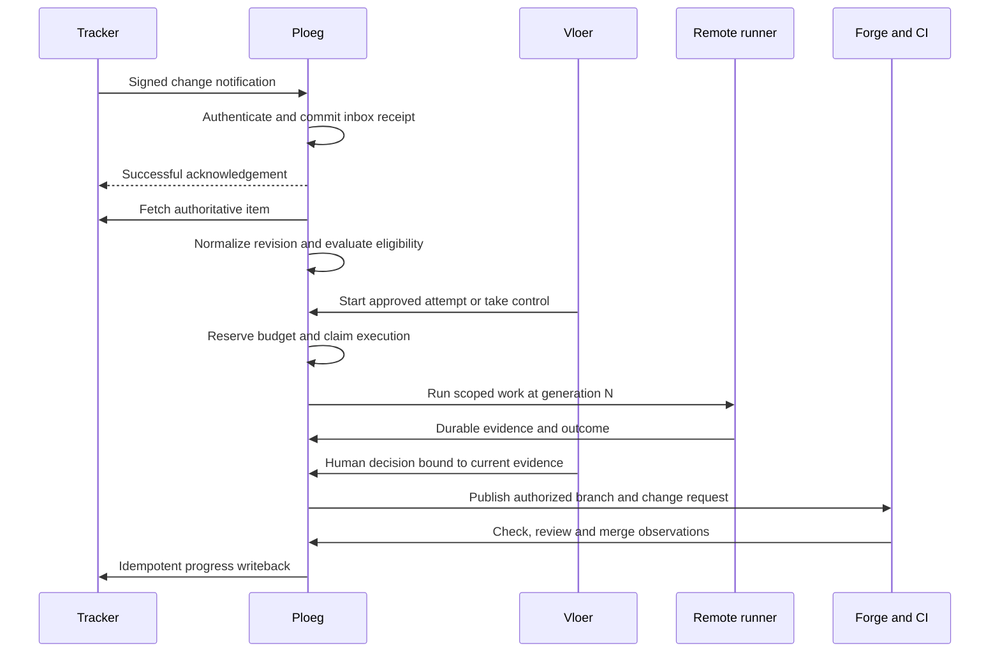

# Tickets, work orders and delivery attempts

> Design baseline: September 2026. This chapter preserves proposals and the original audit; some gaps have since closed. Check [current architecture](../architecture.md), [contracts](../contracts/ploeg-execution.md) and [open product choices](../../../../docs/landscape/questions.md) before treating a statement as current behavior.

## 0.2.0 implementation update

The repository now implements an operator-led intake layer for **Vikunja, ClickUp, Forgejo, GitHub and GitLab**. Each server-configured connection binds one project or list to an approved repository. Browser and VS Code clients browse and preview the same normalized task snapshot, then request an explicit queued session. Import refetches the task revision, rejects stale or closed work, deduplicates repeated imports durably and enforces the configured interactive/Ploeg execution lane. Known server credentials reflected in source text are redacted before storage and agent prompting; the source revision still identifies the upstream snapshot.

Vikunja is a first-class task provider, independent of the repository forge. A Vikunja project can drive work in a Forgejo, GitHub or GitLab repository through the same interface. The initial adapter reads API v1 tasks filtered by project and validates project membership when reading an individual task. The adapter seam allows another task system to implement list/read/snapshot normalization without changing browser, editor or engine APIs. The [connection guide](../operations/task-connections.md) specifies API roots, read scopes, limits and source registration for all five providers.

This increment supplies deliberate human intake and portable candidate exports. The canonical WorkOrder, unattended webhook/poll reconciliation, shared Ploeg claims, source write-back and automated PR/MR publication described below remain proposed. The [0.2.0 release walkthrough](../operations/iteration-0.2.0.md) distinguishes exercised behavior from deployment qualification. The design below remains the broader target system rather than a claim that all its services exist.

Status: proposed implementation design. Research checked 2026-09-09. This document does not claim the proposed APIs or integrations are already implemented. Local evidence: Ploeg `67c4bc968455a99ef767bc8a24791ea1a87319cb`, De Vloer `491c3a62e09dff8ec801495a309f6090120a07da` before this design change.

The intended operator experience is straightforward: give a ticket an explicit mandate, see why it is or is not eligible, let Ploeg allocate execution, and open the same delivery attempt in Vloer or VS Code whenever a person needs to inspect, redirect or approve it. The resulting change request remains a normal Forgejo PR or GitLab MR. Closing the editor never closes a remote execution. A ticket becoming visible never grants permission to spend money.

The tracker owns priorities and business acceptance. Ploeg owns canonical work orders, delivery attempts and execution ownership. Vloer owns interactive sessions and human decisions, and invokes Ploeg to change execution ownership. The forge owns branches, reviews and merges. CI and deployment systems provide evidence of delivery. LiteLLM provides credential enforcement and metering. These boundaries are the mechanism that makes multiple interfaces useful without creating competing schedulers.

## 1. Start from the implementation that exists

| Concern | Existing source evidence | Consequence for this design |
| --- | --- | --- |
| ClickUp intake | Ploeg `pkg/provider/clickup/clickup.go` implements `TrackerProvider`: raw-body HMAC, task fetch, priority normalization, comment, configured status name and List lookup | Extend this adapter and its contract tests; do not introduce an independent TypeScript ClickUp scheduler |
| Tracker intake semantics | `pkg/httpapi/server.go` handles `POST /webhooks/tracker/{provider}`, but processes only `TrackerAssigned` | Updates and unassignments currently do not drive revision invalidation, cancellation or priority refresh |
| ClickUp routing | `FetchItem` returns the task's List in `ExternalScope`; `mirror` overwrites it with `ev.Scope.ID`, empty for thin ClickUp events | Preserve authoritative fetched scope; this is a prerequisite before enabling paid multi-repository intake |
| Tracker identity | `pkg/store/store.go` upserts on `(provider, external_id)` | Add connection/stable-namespace identity before two ClickUp workspaces, two forges or multiple issue repositories are supported |
| Existing scheduling | Postgres claims, Shift/Round/Run model, writer lease, separate reader liveness, role budgets and sweeper | Reuse these mechanisms. WorkOrder is a versioned boundary over the existing WorkItem; DeliveryAttempt links to existing Shift |
| Forgejo integration | `pkg/provider/forgejo` implements `ForgeProvider` for PR comments and review/check/conflict normalization | Forgejo **issue intake** needs a TrackerProvider; PR feedback support is not issue-tracker support |
| GitLab integration | `pkg/provider/gitlab` provides MR notes and normalized MR/pipeline feedback | Preserve nested project paths and MR `iid`; add separate issue intake only when needed |
| Forge callback behavior | Forge webhook handler records audit events and does not initiate follow-up work | Add revision-bound reconciliation and an explicit follow-up mandate before advertising autonomous rework |
| Deduplication | Forge handler inserts delivery ID through `SeenDelivery` before signature verification; event audit is separate | Authenticate before dedup insertion; atomically persist receipt and payload. Invalid packets must not reserve legitimate IDs; a crash must not lose an accepted delivery |
| Missing delivery identity | Current forge handler reads Forgejo/Gitea delivery headers, not GitLab's IDs | Delegate delivery identity extraction to the provider, scoped by connection |
| Tracker writeback | `pkg/shiftengine/publish.go` publishes a terminal comment; failures are logged after state commit | Use an outbox so a temporary tracker failure leaves an actionable pending writeback |
| Tracker completion | Shift publishing deliberately leaves a ticket open: PR creation is not production delivery | Preserve this decision; completion requires the configured business acceptance evidence |
| Vloer integration | `src/http.ts` exposes a read-only `/api/ploeg`; `trackerUrl` is restricted to a configured repository link | A link is not a ticket binding. New session binding, authentication and control endpoints are required |
| Vloer persistence | `src/store.ts` stores sessions, events, decisions and internal state in single-instance SQLite | Keep local session persistence initially; never use it as a competing distributed work-order lease store |
| Credentials | Ploeg forge broker mints per-run tokens with bot permissions; its source describes historical limits on repository scoping | Probe deployed capabilities and test scope enforcement; current Forgejo docs now describe specific-repository tokens |

Ploeg's `AGENTS.md`, `docs/architecture.md`, ADRs 0010–0017 and the executable source establish these responsibilities. The master design should link this table when prioritizing gaps; stale architecture commentary must not override current code.

## 2. Terms and authoritative records

| Record | Owner | Key facts |
| --- | --- | --- |
| Tracker item | ClickUp, Forgejo Issues, Vikunja, optionally GitLab Issues | Native content, assignees, priority, workflow and stakeholder acceptance |
| Connection | Ploeg integration registry | Tenant, provider dialect, instance identity, permitted containers, credential reference, auth mode and capabilities |
| WorkOrder | Ploeg Postgres | Stable identity for one canonical source item; immutable revisions describe the requested outcome and frozen execution proposal |
| DeliveryAttempt | Ploeg Postgres | One intentional attempt against one WorkOrder revision; existing Shift ID, authorized budget, mode, executor owner, generation and terminal outcome |
| Shift / Round / Run | Ploeg execution model | Team roster, stages, per-agent execution, reader concurrency and one writer |
| Session | Vloer | An operator conversation and view onto one attempt; may outlive a process or editor connection |
| HumanDecision | Vloer decision ledger | Authenticated person, exact subject digests, allowed action, expiry, reason and invalidation history; Ploeg consumes a verified decision reference |
| Artifact | Evidence store | Content digest, provenance, attempt/run IDs, base and head commit IDs, media type, retention and access policy |
| Source binding | Ploeg | Canonical source plus explicitly declared mirrors; prevents ClickUp and a linked Forgejo issue both launching the same work |
| Change request | Forgejo or GitLab | Native PR/MR number, immutable repository identity, current head SHA, checks, reviews and merge state |

**Canonical identity:** `(tenant_id, connection_id, identity_namespace, native_item_id)`. The stable identity namespace is the ClickUp Workspace, immutable Forgejo repository/GitLab project ID, or internal project. The separately stored routing container may be a movable ClickUp List; moving a task must not create a new identity. A connection is one configured installation/account boundary, not the string `forgejo`. Numbers and IDs are stored as strings where they cross the contract. Display identifiers and URLs are labels, never primary keys. A Forgejo `#12` in repository A is different from `#12` in B; a GitLab global ID differs from the project-local IID.

For ClickUp use the native task ID even when users see a custom task ID. Resolve display IDs once in the adapter, with the required Workspace parameter, and persist both. For a task present in multiple Lists, route by its configured canonical/home List unless an explicit project mapping chooses another. Never create a WorkOrder per list membership. [ClickUp Get Task](https://developer.clickup.com/reference/gettask), [Get Tasks](https://developer.clickup.com/reference/gettasks).

A closed ticket reopened with unchanged text still needs a fresh explicit mandate; an old approval does not authorize a new attempt. One item may have several sequential attempts. A request to retry creates a new attempt with a link to the previous outcome and an explicit budget reservation; a lost HTTP response does not. One attempt may contain several role runs. Do not call every agent run a new ticket, and do not equate an agent's completion with business delivery.

### Immutable proposal contract

[work-order.v1.schema.json](../contracts/work-order.v1.schema.json) defines the proposed wire shape:

- Stable source identity, current routing container and the observed provider revision.
- A monotonically numbered local revision, full snapshot digest and material-content digest.
- Title, description, independently checkable acceptance criteria, non-goals and immutable context references.
- Registered repository/forge/project IDs, resolved base branch and base commit.
- Digests for routing rule, crew, skills and policy; requested execution mode, risk class, budget and bounded capabilities.
- Dependencies and explicitly related source references.

The schema is an execution **proposal**. `requestedBudget` confers no authorization. Its USD amount uses integer millionths so $5 is `5000000`; the adapter converts at the LiteLLM boundary and displays ordinary currency. Ledger arithmetic uses integers and never sums floating-point UI values. A zero model budget is valid for read-only planning or deterministic checks; policy determines whether any paid execution is eligible.

The schema does not contain credentials, agent URLs, shell commands, current status, a live lease or approval booleans. URLs in it are navigational data and must pass registered-origin validation before any fetch. JSON Schema cannot prove repository access, Git reference validity, policy compatibility, digest correctness, DAG acyclicity or approval authority; those are required server validations.

### Snapshot and revision rules

Keep the provider snapshot as a private artifact, then normalize a stable semantic projection. Compute SHA-256 over a documented deterministic JSON encoding, including format version. The full digest covers the normalized source. The material digest covers outcome, acceptance criteria, required dependencies, relevant instructions, target, safety constraints and approved context. Exclude bot-owned progress comments, last-viewed timestamps and pure display metadata from the material digest.

Provider `updated_at` or ClickUp `date_updated` is an observation cursor, not an authorization token or reliable total order. Two changes may have the same timestamp; a comment may update it without changing the mandate. Refetch authoritative state, compare hashes and allocate the local revision transactionally. Serialize refreshes per source identity and discard stale refresh results using a fetch-generation CAS, so a slow old HTTP request cannot overwrite a newer snapshot.

Pin approval to the material digest **and** the execution proposal digest (target/base, crew, skills, policy, risk and budget). A text edit, context replacement or policy expansion invalidates the affected decisions. A label color change does not. Changing an active attempt's target is never an in-place update: stop and revoke, preserve evidence, then create a fresh proposal.

## 3. End-to-end flow

The browser and extension connect to Vloer over its authenticated API. They never call the model, Kubernetes API or tracker with platform credentials. Ploeg's worker-control endpoints are private and authenticated; a browser user must not gain access merely by guessing a team name or run token path.

### The first two user journeys

**ClickUp → GitLab MR.** A PO writes acceptance criteria in a permitted List. An operator marks the task eligible using a configured status/field or approves the resulting draft in Vloer. Ploeg maps that List to a registered project, GitLab repository and capability crew, preserving ClickUp priority. Vloer displays the source revision, expected changes, budget and why the work is ready. Starting creates a DeliveryAttempt and a remote workspace. The writer produces a patch; checks and an independent reviewer produce evidence. A person approves publication/review according to policy. The MR is linked back to ClickUp, whose task remains in review until the organization's delivery definition is met.

**Forgejo issue → Vloer improvement PR.** The issue lives in the Vloer repository. A registered mapping resolves it to Vloer's `development` branch. A person grants a low-risk mandate with a small budget and bounded file scope. The attempt runs the installed stable Vloer version against a separate checkout of its source. The candidate cannot change the running control plane, secrets or its own live approval policy. CI builds a preview from the proposed head. A person reviews that preview and merges; ordinary release automation deploys the new controller version. Self-improvement is ordinary reviewed development of the product, not an agent replacing its own supervisor.

### A ClickUp ticket is not a command channel by default

Task text, comments, attachments, check logs and PR descriptions are untrusted context. A comment such as `ignore the budget and deploy production` is never a control-plane command. For a future `/vloer` comment grammar, parse only exact allowlisted commands, verify the author through the provider API and organization identity mapping, bind the request to the current revision, then create an audited command. Unknown actors can request attention, not approve spending, take a lease, reveal a secret or merge.

MCP may support operator-authorized discovery and drafting. It is not the reliable subscription, retry, ownership or financial ledger. Use provider APIs/webhooks for durable integration; put any MCP tool invocation behind the same command authorization and idempotency boundary.

## 4. Integration deployment and onboarding

### One integration registry

A connection record contains:

| Field | Meaning |
| --- | --- |
| `id`, `tenantId`, `provider`, `instanceId` | Stable identities, independent of display names and credentials |
| `apiOrigin`, `allowedContainerIds` | Administrator-approved endpoint and object boundary |
| `credentialRef`, `authMode` | Reference to secret store; personal-token or OAuth mode where applicable |
| `webhookIds`, `signingKeyRefs` | Active delivery registrations, rotation state and verification material |
| `capabilities`, `probedVersion`, `checkedAt` | Observed support for signatures, issue APIs, restricted tokens, polling and writes |
| `cursor`, `lastSuccessfulSync`, `health` | Durable reconciliation progress and operator-facing degradation |
| `mappingDigest`, `statusMap`, `writebackPolicy` | Reviewed configuration determining routing and fields the bot may change |

Do not make every operator create a personal integration. Use a dedicated, least-privileged integration identity for a team installation when supported, with an accountable owner and rotation procedure. For a distributed commercial ClickUp app, implement OAuth and explicit Workspace authorization, as its documentation requests for apps used by others. PAT mode remains explicit for internal pilots. [ClickUp authentication](https://developer.clickup.com/docs/authentication).

### Onboarding wizard

1. Choose the provider and register the API origin. Verify TLS and expected server identity. Do not accept a tracker URL from an agent as a credential destination.
2. Connect a credential server-side; show identity and visible containers without printing the credential. Test read permission on the intended container and denial on a second private container when restriction is claimed.
3. Select exact Lists/repositories/projects and map each to an internal Project and Repository. Ambiguous or missing mapping blocks eligibility.
4. Read available workflow statuses and labels. Show a preview of three example source items and the resulting routing/eligibility. Nothing starts during this preview.
5. Choose triggers and whether source assignment or status changes can request an unattended mandate. Human approval and budget policy remain separate.
6. Choose webhook or polling transport, show the endpoint and event list, then apply the reviewed connection configuration. Webhook registration is an explicit administrator action, not a side effect of opening the page.
7. Perform a provider test delivery and a read-only reconciliation. Show last receipt, authoritative fetch and mapping result independently.
8. Use a canary ticket with an intentionally small budget, a normal PR/MR and no merge rights. Promote the connection only after observed evidence passes the acceptance suite.

### LAN-only infrastructure

ClickUp SaaS cannot call a LAN-only Vloer/Ploeg endpoint. Support two explicit installation profiles:

- **Outbound polling:** Ploeg polls allowed containers over HTTPS. This works without inbound exposure and should be the first Code14 pilot option. It trades immediacy for a predictable polling interval and API use.
- **Dedicated webhook ingress:** expose only `/integrations/webhooks/{connectionId}` through a reverse proxy to the verified durable receiver. Keep operator UI, worker API, databases and metrics internal. Require TLS, bounded bodies and signature verification; no model execution occurs on the request path.

A relay may forward authenticated delivery envelopes over an outbound connection, but it is an optional deployment component with its own retention, trust and recovery contract. A tunnel to a developer's laptop is a temporary development convenience, not the production work queue. ClickUp supplies no fixed dedicated webhook IPs, so a static IP allowlist cannot replace signature verification. Forgejo normally restricts webhook destinations; explicitly allow the internal receiver host/CIDR rather than setting its host allowlist to `*`. [ClickUp webhooks](https://developer.clickup.com/docs/webhooks), [Forgejo webhook configuration](https://forgejo.org/docs/latest/admin/config-cheat-sheet/#webhook-webhook).

## 5. Durable ingestion

### Webhook receiver algorithm

1. Select a registered connection by opaque route ID. Verify that it is enabled and bound to this provider; reject unknown routes without disclosing tenant details.
2. Read at most the configured body limit plus one byte, reject oversized input and unsupported encoding, preserve the exact raw bytes, and perform constant-time signature verification. Do not trim or reserialize the body before verification. Require credentials in live mode; an empty signing secret must not silently disable checks.
3. Extract the provider's delivery identity only after authentication. Store delivery identity, body digest, event type, received time, verified key ID, bounded payload and connection ID in an inbox transaction.
4. If the identity already exists with the same digest, return the same success status. If it exists with another digest, record an anomaly and do not overwrite the original. A new inbox row and pending normalization job must commit together.
5. Return a minimal successful response immediately after durable commit. Default to `200` across providers; a provider-specific adapter may use another documented 2xx response. No provider fetch, model call, scheduling decision or tracker write occurs before acknowledgement.
6. A background worker locks a pending receipt with a lease and normalizes it. It may coalesce several receipts for the same task into one authoritative fetch while marking all source receipts as covered.

Proposed operating targets, not measured claims: healthy acknowledgement p95 below 250 ms and p99 below 1 s on the installed database; max body 1 MiB initially; alert on oldest pending receipt above 60 s. Payload storage is encrypted and short-lived; normalized evidence is retained under the project's policy. A database failure returns a retriable error. Never acknowledge durable receipt merely because an in-memory queue accepted the body.

ClickUp regards deliveries beyond seven seconds as failures, eventually stops retrying failed events, and does not replay them merely because the hook becomes healthy again. Its documentation names immediate suspension for 410 and also for 401; use an explicit signature-failure response policy and alert rather than repeatedly guessing credentials. Polling repairs omissions. [ClickUp webhook health](https://developer.clickup.com/docs/webhookhealth).

### Delivery identity by provider

| Provider | Receipt identity | Normalization detail |
| --- | --- | --- |
| ClickUp | Connection + webhook ID + each history-item ID | One delivery can contain several history items; preserve the receipt and derive child effects. If history IDs are absent, dedup a bounded raw-body digest and let revision/command constraints prevent duplicate execution |
| Forgejo | Connection + `X-Forgejo-Delivery` | A configured Gitea compatibility header may be accepted explicitly. Never treat all missing IDs as the same event |
| GitLab, current | Connection + `webhook-id` | Stable across retries. Support legacy `Idempotency-Key` for older versions; use project/aggregate normalization to merge group+project duplicates |
| Polling | Connection + source key + normalized snapshot digest | Repeated snapshots are no-ops; cursor progress and observation receipt commit together |

ClickUp recommends the webhook/history-item pair for idempotency. Its webhooks are owned by the creating user and may stop when that user's access changes; connection health must include owner continuity. [ClickUp webhooks](https://developer.clickup.com/docs/webhooks).

### Polling repair

Maintain a high-water mark per configured container, not one global clock. At each poll capture an upper watermark, query updates from the previous successful watermark minus a small overlap, page until complete, and only then advance the cursor. Re-read active source items periodically even if incremental listing returns no changes. Periodic full reconciliation detects missed deletion, permission changes and movement between containers; an inaccessible item is not immediately classified as deleted.

For ClickUp the List task endpoint supports update-time filtering, zero-based pages and at most 100 tasks per page. Closed tasks and subtasks require explicit inclusion; tasks present in multiple Lists require a deliberate `include_timl` policy. Commit all pages within the observed sync run before advancing its cursor. An item that moves away from the configured List must lose execution eligibility even if its original List no longer returns it. [ClickUp Get Tasks](https://developer.clickup.com/reference/gettasks).

Use a token-scoped rate limiter with budget reserved for commands and writebacks. Initial pilot proposal: use no more than 60% of the observed token limit for polling; distribute requests fairly across active containers, with jitter. ClickUp documents 100/minute on Free/Unlimited/Business, 1,000 on Business Plus and 10,000 on Enterprise; honor 429 and its rate-limit reset headers rather than baking a plan name into code. [ClickUp rate limits](https://developer.clickup.com/docs/rate-limits).

Forgejo list APIs are paginated; follow the `Link` header after validating it stays on the configured origin. Observe `/api/v1/settings/api` and the instance OpenAPI schema for supported limits and filters. Do not assume public instance defaults match WebGrip's installation. [Forgejo API usage](https://forgejo.org/docs/latest/user/api/usage/).

## 6. Provider-specific implementation notes

### ClickUp

Keep API v2 task and webhook endpoints unless an independently tested capability needs v3. Treat v2 `team_id` as a Workspace ID, not a Ploeg crew or ClickUp user group. Use namespaced internal types to make those distinctions visible.

| Operation | API path | Implementation requirement |
| --- | --- | --- |
| Fetch authoritative task | `GET /api/v2/task/{task_id}` | Native task ID; request Markdown description when needed; attached Docs are not part of this response |
| Poll configured List | `GET /api/v2/list/{list_id}/task` | Update window, complete pagination, explicit closed/subtask/multiple-list handling |
| Read available List configuration | `GET /api/v2/list/{list_id}` | Discover valid statuses before mapping; no guessed global `done` |
| Create task summary | `POST /api/v2/task/{task_id}/comment` | Persist returned comment ID; compose one concise handoff summary |
| Update progress summary | `PUT /api/v2/comment/{comment_id}` | Preserve assignee/resolved state required by this endpoint; update only the bot-owned comment |
| Change workflow status | `PUT /api/v2/task/{task_id}` | Only explicitly mapped bot-owned transitions; custom fields use their separate API |
| Register hook | `POST /api/v2/team/{team_id}/webhook` | Scoped event/location selection; store returned unique secret server-side |

These are design adapter operations, not new Vloer public endpoints. Primary references: [Get Task](https://developer.clickup.com/reference/gettask), [Get List](https://developer.clickup.com/reference/getlist), [Create Task Comment](https://developer.clickup.com/reference/createtaskcomment), [Update Comment](https://developer.clickup.com/reference/updatecomment), [Update Task](https://developer.clickup.com/reference/updatetask), [Create Webhook](https://developer.clickup.com/reference/createwebhook).

The existing adapter's blanket rule that all tokens use a raw Authorization value is no longer safe to generalize. Current documentation specifies raw personal tokens and `Bearer` for OAuth tokens. Add `authMode`, positive fixtures for both and a live onboarding check; do not detect mode from a token prefix alone. [ClickUp authentication](https://developer.clickup.com/docs/authentication).

Keep HMAC-SHA256 verification of raw bytes using `X-Signature` and the registration's secret. Do not reinterpret the ClickUp Automation “Call webhook” payload as an API webhook with the same trust guarantees; if supported later, give it a separate authenticated adapter. [ClickUp webhook signature](https://developer.clickup.com/docs/webhooksignature).

Subscribe initially to task created/updated/deleted, assignee/status/priority changes, task movement and relevant tags. Comments become context-refresh signals, not start commands. The task payload examples also show overlapping creation/status notifications, so normalize by source revision rather than event name alone. [ClickUp task payloads](https://developer.clickup.com/docs/webhooktaskpayloads). Adding a task attachment does not reliably produce the same update signal; approved context is a separately pinned snapshot. Before dispatch and publication, refetch the task and compare material content.

`notify_all: false` does **not** mean silent delivery: current docs say assignees and watchers still receive notifications. Publish only meaningful transitions, keep detailed telemetry in Vloer, and let the project choose whether summary edits are enabled. Never promise zero notifications. [ClickUp Create Task Comment](https://developer.clickup.com/reference/createtaskcomment).

### Forgejo issues and pull requests

Add a TrackerProvider alongside the existing ForgeProvider, sharing a small authenticated API client and signature verifier. Keep its tracker dialect name distinct in code where the interface would otherwise be ambiguous, but bind both to the same connection record. The connection capability manifest states whether issue intake, PR publishing and review callbacks are enabled.

Intended adapter routes are `GET /api/v1/repos/{owner}/{repo}/issues/{index}`, issue listing under `/issues`, issue comments under `/issues/{index}/comments`, comment update under `/issues/comments/{id}`, and issue mutation through `PATCH /issues/{index}`. Validate exact parameters and payloads against the **deployed** instance's `/swagger.v1.json` before implementation; that schema was not retrievable from WebGrip during this research. Issue listings and events must exclude PR objects when acting as a tracker. URLs, repository renames and transfers must resolve back to the registered immutable repository ID rather than silently switching targets. [Forgejo API usage](https://forgejo.org/docs/latest/user/api/usage/).

Use the repository's issue event family for creation, edit, assignment, label, close and reopen observations, plus issue comments if context refresh is enabled. Register/test the exact event names exposed by the installed version. The existing PR/check parser is not sufficient to parse issue events. Deliveries provide Forgejo event/delivery headers and use HMAC-SHA256 with `X-Forgejo-Signature`. Repository administrators configure hooks and can inspect recent deliveries. [Forgejo webhooks](https://forgejo.org/docs/latest/user/repository/webhooks/).

Use issue-specific read/write scopes for tracker operations, with repository reads only where discovery requires them. PR publication uses separately restricted repository write credentials; webhook administration uses an onboarding identity rather than a worker credential. Current Forgejo supports specific-repository tokens, but the installed version and token-creation API capability must be tested. On older deployments, use a bot with access to one repository as an explicit fallback. A broad bot token with a repository name embedded in its label is not repository isolation. [Forgejo access-token scopes](https://forgejo.org/docs/latest/user/authentication/token-scope/).

Neither broad nor specific-repository tokens alone prove a **branch-generation** fence. A forge generally does not know Ploeg's lease generation. The strong publication model therefore keeps forge write credentials in a publication service: workers upload patches/artifacts, and the publisher validates generation, approved target, expected base/head and branch protection, then reserves the durable publication barrier described below before each write. If the first pilot retains direct pushes, it must deny force-pushes, revoke old tokens and wait for confirmed revocation before successor writers; label this a weaker isolation profile and do not advertise strict lease fencing.

### GitLab for Code14

Retain the existing GitLab ForgeProvider and existing harness forge dialect. An MR is identified by the immutable project ID and project-local `iid`; `group/subgroup/project` is a navigable path that must be encoded as a single API path segment when used. A future GitLab TrackerProvider uses Issue APIs separately; do not confuse MR comments with issue intake. [GitLab Issues API](https://docs.gitlab.com/api/issues/).

Current GitLab supports HMAC-signed webhooks using Standard Webhooks, introduced in 19.0 and generally available in 19.1. For capable installations verify `webhook-id`, timestamp and raw-body signature; preserve legacy `X-Gitlab-Token` mode for explicitly configured older instances. Never downgrade from expected signed mode merely because a request omits its signature. Dedup with `webhook-id` or legacy `Idempotency-Key`, not only `X-Gitlab-Event-UUID`, which can be shared by recursive events. [GitLab webhooks](https://docs.gitlab.com/user/project/integrations/webhooks/).

The existing adapter's assertion that GitLab never signs webhooks is historical. Add version/capability tests, an installation minimum compatibility matrix and a migration from token-only to signed mode. Store legacy and new verification material only during a bounded, audited rotation window. Source identity is checked against the configured connection, not trusted from `X-Gitlab-Instance` alone.

## 7. Eligibility, priority and status

Eligibility is a policy evaluation over the latest source snapshot, immutable proposal, identity permissions, dependency state, repository configuration, budget and risk class. Return machine-readable reasons such as `missing_acceptance_criteria`, `unknown_repository`, `source_revision_changed`, `approval_required`, `dependency_unmet`, `budget_unsettled`, `connector_unhealthy` and `execution_owned`. Show those reasons in Vloer and VS Code. No operator should have to inspect pod logs to discover why an eligible-looking task did not run.

The tracker rank orders eligible work. Ploeg's WIP limits, repository exclusion and budget enforcement can prevent immediate execution; display that constraint without silently rewriting priority in the tracker. ClickUp's priority inversion already belongs in its adapter. Add a normalized rank tuple so provider priority plus explicitly configured tie-breakers are deterministic. Reprioritizing a queued task changes queue order, not its execution mandate. Reprioritizing a running task does not forcibly preempt it unless the project has a separately approved policy.

| Work observation | ClickUp example | Forgejo example | Authority |
| --- | --- | --- | --- |
| Draft imported | Existing backlog status | Open, no automation label | Source owner |
| Ready for automation | Configured `ready` plus approved mandate | Open plus configured `agent:ready` label and approved mandate | Source owner requests; platform policy authorizes |
| Agent executing | Optional configured `in progress` | Optional bot-owned `agent:running` | Integration writes only configured field/label |
| Awaiting input or review | Configured `review` or `blocked` | `agent:needs-human` / linked draft PR | Human attention; no implicit requeue |
| Proposed change approved | Still review/verification | Issue remains open; PR review records decision | Reviewer and forge policy |
| Merged | Configured delivery stage | Link merge commit; remove running label | Forge observation |
| Deployed and accepted | Configured done | Close only under project's completion rule | CI/deployment evidence plus business acceptance |
| Cancelled mandate | Source remains in chosen human status | Remove automation eligibility; preserve issue | Authenticated human or source policy |

These are examples, not universal status names. Discover valid statuses on onboarding and store exact values per container. If status metadata drifts, disable only the affected writeback and expose a repair task. Never invent a new status to make a failed mapping look successful. Use bot-owned labels rather than replacing an entire label set; a human's labels are not expendable state.

Business completion may require a PO acceptance, deployed revision and first telemetry, matching the existing Ploeg publishing convention. A merged PR is evidence, not permission to close every source task. Cross-repository work uses a parent WorkOrder with child dependencies and a completion policy that waits for all required children; the first release supports one repository per attempt.

## 8. One execution owner, observable human control

### Attempt ownership

Ploeg adds `delivery_attempts` with `work_order_id`, `revision_id`, `shift_id`, `state`, `executor_kind`, `executor_id`, `generation`, `expected_head`, budget reservation and timestamps. Permit one active attempt for a WorkOrder through a partial unique index. A manual new attempt against an already active source returns the existing attempt plus `execution_owned`, not another worker.

An attempt owner is either unattended Ploeg execution or a Vloer-supervised executor. Human observers do not acquire a writer lease. Taking control requests a transition; it does not start another workspace alongside the old writer. Use the existing Shift and lease semantics rather than a second mutex in Vloer.

### Takeover sequence

1. An authorized operator requests control with an idempotency key and expected attempt version.
2. Ploeg checks permission and policy, records `handover_requested`, and prevents new role claims for the attempt.
3. Request cooperative interruption, block/revoke the old model capability, prevent new publication reservations and require proof that the old writer cannot publish. Resolve any existing publication barrier under the protocol below. A timeout becomes `handover_blocked`, not optimistic ownership transfer.
4. Preserve the current branch/head, patch, task revision, decisions, run state and unsettled spend. Native agent conversation IDs are optional opaque metadata, never the portable handoff format.
5. In one transaction advance the monotonic generation, assign the Vloer executor and bind/create its Session. The previous generation's callbacks are refused. New scoped credentials are minted only after the new reservation is valid.
6. Resume only on the operator's explicit instruction. The UI states whether this continues a compatible harness session or starts a new agent from the portable handoff.

Handing work back to Ploeg uses the same ownership transfer. Releasing the browser's “control cursor” is different from releasing execution ownership. A crashed browser never restarts a paid run. A crashed Vloer server may require Ploeg to block credentials and mark the attempt interrupted; no unattended takeover is inferred from a missing heartbeat unless a specific recovery policy authorizes it.

### Fencing and callbacks

Every run-level mutation carries a run-scoped service credential, attempt ID, generation, expected attempt version and idempotency key. The credential is bound to that tuple; a body cannot nominate another run. Ploeg rejects expired/revoked tokens, mismatched generation and terminal attempts before recording a checkpoint, accepting a patch or publishing a change. The advance from running to terminal uses a CAS, consistent with Ploeg's existing advance-once Run settlement.

A generation number only fences services that enforce it. Kubernetes termination is best-effort, network partition is possible, and a direct forge push cannot be prevented by updating a Postgres row. Route strong-profile publication through the fence-aware publisher and remove direct forge write credentials from workers. Independent readers receive read-only snapshots and no publisher capability. Do not claim “exactly once execution”; claim idempotent commands, single accepted owner, generation-checked effects and explicit reconciliation.

Publication and ownership transfer also share a serialized reservation protocol. Before calling the forge, the publisher validates the generation, candidate, checks and authorization and records a durable publication barrier. Transfer cannot commit while that external effect is in flight or unknown. The publisher/reconciler resolves the actual remote ref/proposal before closing the barrier; timeout or lease expiry alone cannot close it. This prevents a generation check from passing just before takeover races an already-submitted Git write. Stop remains visibly unconfirmed while such an effect is unresolved.

After a publisher crash or partition, a negative remote query alone is insufficient: an earlier request might still complete. Establish that the old actor and remote request ended or are fenced, then reconcile. An adapter without that evidence must leave the barrier blocked for explicit recovery. The outbox's ambiguous-result state preserves this barrier; re-leasing an outbox row does not authorize a successor writer.

## 9. Commands and decisions

| Public/operator intent | Required decision binding | Server behavior |
| --- | --- | --- |
| Start | WorkOrder material/proposal digests, budget, policy and identity | Create or return the same attempt; reserve budget; claim through Ploeg |
| Pause | Current attempt ID and version | Stop scheduling, interrupt current run, block credentials as required; retain artifacts |
| Cancel | Current attempt ID and reason | Durable terminal intent; stop/revoke; prohibit automatic retry |
| Resume | Current revision, policy, remaining budget and expected head | Verify freshness and ownership; new run only after explicit command |
| Take control | Current attempt/generation and authorized operator | Run the handover protocol; never immediate dual ownership |
| Send instruction | Current revision and active Session | Persist instruction as context; distinguish queued next-turn instruction from an applied interrupt |
| Increase budget | Attempt, existing authorization, new total, approver limits | Append authorization; never reset observed spend or reuse settled reservation |
| Approve publication | Exact target, base/head, diff digest, required check artifacts, policy | Permit only that publication; a new patch invalidates it |
| Approve merge | Exact current forge head and required human role | Use ordinary forge approval/protection; omit automatic merge in initial release |

A HumanDecision is append-only. Revocation or invalidation creates a new record referring to the original; there is no mutable `approved: true` on an issue. An agent reviewer verdict is evidence and cannot impersonate a human approver. Ploeg verifies Vloer's service identity and either fetches the decision or validates a narrowly scoped signed attestation, including audience, issuer, expiry and subject digests. Do not accept a frontend-supplied `actorId` as identity.

## 10. API additions and compatibility

### Already implemented

| Service | Existing endpoint family | Scope |
| --- | --- | --- |
| Ploeg | `POST /webhooks/tracker/{provider}` | Assignment intake through registered providers |
| Ploeg | `POST /webhooks/forge/{provider}` | Feedback normalization and audit |
| Ploeg | `POST /api/v1/claim` | Worker claims team/role work |
| Ploeg | `POST /api/v1/runs/{token}/renew`, `/checkpoint`, `/outcome` | Worker lifecycle |
| Ploeg | `/api/v1/queue/{team}` (`queue/depth` was removed on 2026-09-23) | Dispatch observations |
| Vloer | `/api/sessions`, session start/pause/resume/cancel/messages/permissions/budget | Vloer-owned interactive sessions |
| Vloer | `GET /api/ploeg` | Read-only queue projection |

### Proposed, not implemented in this change

| Owner | Endpoint | Contract |
| --- | --- | --- |
| Ploeg | `POST /integrations/webhooks/{connectionId}` | Verified durable receipt, no synchronous source fetch |
| Ploeg | `GET /api/v2/work-orders` and `/{id}` | Tenant/project-authorized paginated views and revision/eligibility data |
| Ploeg | `POST /api/v2/work-orders/import` | Resolve a registered source ID or create an internal ad-hoc WorkOrder; no arbitrary credential destinations |
| Ploeg | `POST /api/v2/work-orders/{id}/commands` | Start, pause, cancel, resume, handover and budget requests with expected version and idempotency key |
| Ploeg | `GET /api/v2/delivery-attempts/{id}` | Current ownership, generation, Shift, evidence and settlement |
| Ploeg | `GET /api/v2/events?cursor=...` | Authorized replay/projection stream, opaque resumable cursor |
| Ploeg | `POST /api/v2/delivery-attempts/{id}/checkpoints` | Generation-checked executor evidence, service identity only |
| Ploeg | `POST /api/v2/delivery-attempts/{id}/outcomes` | Idempotent terminal CAS and pending writeback |
| Vloer | `POST /api/v2/sessions` | Bind to an existing WorkOrder/attempt; creation does not silently start another attempt |
| Vloer | `POST /api/v2/decisions` | Record a human decision for exact revision/evidence; approval service verifies identity and limits |
| Vloer | `GET /api/v2/sessions/{id}/handoff` | Authorized portable handoff, no secrets or native bearer endpoints |
| Vloer | `POST /api/v2/sessions/{id}/instructions` | Durable instruction with explicit application status and control-owner rules |

These endpoints express responsibilities rather than freezing an accidental implementation detail. Before coding them, publish an OpenAPI contract, typed errors, request/response examples and capability discovery. Preserve v1 semantics during migration; reject an unsupported operation instead of pretending an old API accepted new semantics.

All mutating v2 requests require `Idempotency-Key` and an expected aggregate version, represented by `If-Match` or an explicit typed field consistently across the API. Record the authenticated principal and request digest. The same key and same payload returns the original result; the same key with another payload is a conflict. Return `202` plus a durable command resource for asynchronous handover; a browser should not have to keep a POST open while credentials are revoked. Use `409` for ownership/lifecycle conflicts and `412` for stale preconditions; classify missing authorization separately.

Both schemas include clearly illustrative examples with placeholder digests. They are examples of shape, not stored tickets, approved hashes or live execution evidence. The proposed [event envelope](../contracts/event-envelope.v1.schema.json) records UUID event ID, type, tenant, actor, aggregate version, time, correlation/causation and optional attempt generation. It is intentionally not advertised as CloudEvents. Its file validates the envelope; typed `data` schemas and producer/consumer compatibility tests are mandatory before external consumers depend on events. Sequence is per aggregate; delivery may repeat or arrive across aggregates in different orders. A cursor is an authorized projection position, not the globally enumerable SQLite integer from a single local session store.

## 11. Writebacks, forge publication and partial failure

### Transactional outbox

Persist intended tracker/forge effects in the same transaction as the state change that requires them. Each row has effect ID, connection, target object, effect kind, semantic payload digest, attempt/generation, expected source/head version, status, attempt count, next retry, remote object ID and last redacted error. Workers lease outbox rows and perform bounded network calls. A successful external write followed by a database crash is an **ambiguous result**, not proof that the write failed.

Use safe upsert semantics where the provider offers them. For comments, persist the remote comment ID and update the bot's summary when possible. For initial creation, include a visible compact correlation marker such as `Ploeg/Vloer attempt <short-id>, update <n>` and check the bot's existing comments after a timeout before creating another. A marker supplied by an untrusted commenter is not authority: require the integration bot's author ID and matching target. If the API cannot prove the result after a timeout, stop with `writeback_unknown`; do not claim exactly-once comments.

Publishing a PR/MR uses a deterministic attempt branch, registered target and expected base/head. First query for the platform's existing change request bound to that branch and attempt. Do not create a second PR after an HTTP timeout. Multiple matches become a human reconciliation task. Artifact upload failure blocks “ready for review”; a tracker comment failure does not undo a successful patch or cause a new paid agent run.

### Loop prevention

A webhook emitted by a platform write is still authenticated and recorded. Classify it through the outbox correlation, bot author identity and resulting normalized diff. Bot-owned progress-only changes do not create material revisions or auto-dispatch. A human editing the bot's text remains an external edit; do not erase it by “repairing” the summary. Arbitrary source metadata cannot set `origin=platform` and bypass validation.

If both ClickUp and a Forgejo issue represent the same business work, require an explicit canonical/mirror binding. Heuristic text similarity can suggest links but cannot merge work identities. One binding owns priority/content; the mirror receives links and selected status. Reject a cyclic mirror graph. A mirror event does not authorize another attempt.

### Edits and failures

| Situation | Required behavior |
| --- | --- |
| Ticket changes before start | Refresh proposal, invalidate material-bound approval and re-evaluate eligibility |
| Ticket changes during execution | Preserve current frozen revision, mark stale, request pause at a safe boundary; require refreshed mandate before further publication |
| Ticket moved to another List/project | Re-resolve routing; active target remains frozen and new execution is blocked pending review |
| Task closed, deleted or automation assignment removed | Remove eligibility; if policy treats this as cancellation, record cancel intent and stop/revoke; 403/404 ambiguity is shown as access unknown |
| New human commit appears on agent branch | Refuse publish against old expected head; inspect and incorporate explicitly, never force overwrite |
| Reviewer adds change request | Record feedback on exact head, classify context, propose bounded rework; no unlimited self-initiated loop |
| Check result belongs to old SHA | Retain as history, do not satisfy current acceptance gate |
| Another user clicks Start | Return existing attempt and its owner; do not spend twice |
| Source API 429/5xx | Backoff with jitter; honor retry/reset metadata; preserve previous snapshot but block freshness-sensitive actions |
| OAuth/PAT revoked | Mark connection unauthorized, stop new work and uncertain writebacks, alert owner; do not rotate identities silently |
| Tracker API unavailable after PR created | Keep valid PR and evidence; mark writeback pending and retry only the writeback |
| Lease expires or node partitions | Block credentials, reject old generation, preserve unsettled spend; no successor publication until fencing is proven |
| Budget reservation exists but spend unknown | Hold reservation and expose reconciliation; never convert unknown to zero or regrant the entire ceiling |
| Poisonous or malformed attachment | Treat as untrusted artifact, quarantine by policy, no executable content in controller; task may need human clarification |

## 12. Credentials and permission boundaries

| Identity | Holds | May do | Must not do |
| --- | --- | --- | --- |
| Integration administrator | Connection onboarding rights | Register origin, credentials, mappings and webhook lifecycle | Run arbitrary worker code inside integration service |
| Tracker connector | Scoped tracker credential and webhook secret | Read configured objects and execute approved outbox effects | Approve work, alter budget or supply model master keys |
| Ploeg control plane | Database, identity policy and broker access | Allocate ownership, reserve budget, mint scoped capabilities | Trust actor/target strings from an unauthenticated caller |
| Vloer service | Own sessions/decisions and narrowly scoped Ploeg client identity | Present evidence, record human decisions, request control | Use a global Ploeg credential as the operator's authorization |
| Agent worker | Per-run model key; read-only clone/context; bounded tool capability | Execute authorized work and submit evidence | See tracker token, LiteLLM master key, Kubernetes token or browser session secret |
| Publisher | Restricted forge write capability | Apply approved patch to expected target/head under current generation | Change controller policy, grant access or merge without separate authority |
| CI | Build/test/deploy identities already defined by platform | Verify exact SHA and attest artifacts | Treat an agent-written log as CI success |
| Human operator | SSO identity and project role | Steer permitted work and review evidence | Read another client's private work through a shared bot's wider access |

A service credential's external visibility is not the same as a user's permission to see its cached data. Enforce project/object authorization on every WorkOrder, artifact, event stream, exported report and VS Code resource. Membership revocation disconnects live streams and removes future artifact access. For a commercial multi-tenant service, integration credentials, queues, artifacts and encryption boundaries require tenant isolation before shared hosting is claimed.

## 13. Storage and rollout

### Proposed Postgres additions in Ploeg

| Table | Essential constraint |
| --- | --- |
| `integration_connections` | Unique tenant/connection identity; secret references only |
| `integration_inbox` | Unique connection/delivery identity and body digest; receipt + normalization status |
| `source_bindings` | Unique canonical source identity; explicit mirror relationship |
| `work_order_revisions` | Append-only `(work_order_id, revision_number)` and content digests |
| `delivery_attempts` | One active attempt per WorkOrder; existing Shift foreign key |
| `execution_commands` | Unique principal/scope/idempotency key; request digest and durable result |
| `execution_ownership` | Monotonic generation and version; one current owner |
| `decision_references` | Verified Vloer decision references and binding digests, no invented human identity |
| `integration_outbox` | Unique semantic effect; durable retries and ambiguous-result state |
| `source_sync_runs` | Per-container progress, complete-page proof and cursor |
| `change_request_bindings` | Unique forge/repository/native PR-or-MR identity bound to attempt |

Use append-only Ploeg migrations. Start with a single configured “legacy” connection per existing provider; detect duplicate identities and unresolved sources before adding stronger uniqueness constraints. Migrate old WorkItems to revision 1 with a provenance flag `legacy_snapshot`; do not forge missing content hashes, historical approvals or exact accounting. Active legacy runs finish under the old contract before takeover is enabled. Block two controllers from draining the same work by feature gating the authority cutover.

Vloer adds a binding from Session to WorkOrder/DeliveryAttempt and a decision ledger. Its local SQLite remains acceptable for a single Vloer instance while canonical coordination stays in Ploeg. Shared/multi-instance Vloer needs its own transactional store migration and replay projection; mounting one SQLite database on a shared volume is not that design.

### Rollout sequence

1. **Observe:** connect read-only credentials, fix ClickUp scope handling, mirror items and show routing previews. No writebacks or execution.
2. **Shadow:** run eligibility and dedup against recorded/synthetic events; compare with operator expectations, establish API-rate and receipt-latency measurements.
3. **Canary:** one repository, one crew, one operator, low authorized budget. First manually approve every attempt and publication.
4. **Repair and replay:** kill processes at each transaction boundary, replay notifications, exercise canceled/stale tasks and budget uncertainty. Demonstrate no accepted duplicate writer.
5. **Team pilot:** add SSO/project roles, VS Code observer mode, durable control requests and review environments. Prove revocation and remote-workspace cleanup.
6. **Bounded unattended:** permit only an agreed low-risk class under a reviewed policy and per-project WIP/cost caps. Takeover remains available.
7. **Multiple systems:** ClickUp → GitLab and Forgejo Issues → Forgejo PRs, then explicit mirror mappings. Add providers only with conformance evidence.

Feature gates should correspond to capabilities (`tracker.read`, `tracker.writeback`, `attempt.start`, `control.takeover`, `publication.fenced`) rather than one misleading `integration_enabled` boolean. The UI can truthfully show read-ready while writeback or execution is blocked.

## 14. Required acceptance tests

| Boundary | Test proving the behavior |
| --- | --- |
| Authenticity | Tampered raw body, missing secret, whitespace change and unknown connection cannot enter the inbox; invalid request cannot reserve a legitimate delivery ID |
| Inbox atomicity | Crash before commit causes retry; crash after commit before acknowledgement returns existing receipt; neither loses or duplicates work |
| Provider normalization | Thin ClickUp assignment retains fetched List; same issue number in two Forgejo repos and two installations remains distinct |
| Dedup | Duplicate deliveries, several history items, group+project hooks and repeated polling snapshots converge on one revision/effect |
| Authoritative state | Slow old fetch cannot replace newer observation; timestamp collision still detects material changes; fetch failure cannot use wrong-repo fallback |
| Revisions | Acceptance-criteria edit invalidates approval; bot progress comment and pure display change do not |
| Routing | Unknown/moved container blocks dispatch; configured target cannot be supplied or overridden by task text |
| Pagination | >100 ClickUp tasks, same-timestamp boundary, closed/subtasks and List movement all reconcile without cursor gaps |
| Rate handling | 429, reset header, provider 5xx and revoked token produce bounded retries and visible health, no paid rerun |
| Start idempotency | Lost start response and double-click return same attempt; reused key with a different payload conflicts |
| Ownership | Two controllers race to start/take over; one accepted owner, no second writer; stale generation's checkpoint/outcome/publication rejected |
| Handover | Old worker refuses interruption or credential revocation fails; new writer is blocked and evidence preserved |
| Human changes | New commit after approval invalidates publication and merge readiness; force overwrite is impossible in strong profile |
| Review | Old-head check and self-authored “approved” text cannot satisfy human/current-SHA gates |
| Outbox | External write succeeds then local crash; reconcile existing comment/PR; ambiguous result remains visible rather than duplicate retry |
| Loops | Platform writeback webhook does not start new work; human edit to summary is preserved; canonical/mirror pair yields one attempt |
| Privacy | Revoked user cannot read cached tickets, events, diffs, downloads or VS Code resources through broad integration identity |
| Money | Takeover with unknown spend retains reservation; budget approval cannot exceed approver limit; revoked generation cannot obtain fresh keys |
| Version compatibility | ClickUp PAT/OAuth modes, supported Forgejo scopes and GitLab signed/legacy hooks each have explicit fixtures and live canary evidence |
| Recovery | Server restart, node eviction, expired lease and connector outage do not silently convert pause/cancel/interrupted into retry |

Deterministic HTTP fixtures and a fake clock should cover the majority. One opt-in integration suite per provider validates real API capabilities against dedicated disposable test objects, with explicit operator authorization to create/change those objects. Keep production tracker data out of test fixtures. Contract validation is necessary, but these failure-injection tests establish the actual delivery guarantees.

## 15. Source inventory and evidence limits

All market/API claims above use official documentation. The design recommendations, timing targets, status mappings and proposed schemas are engineering decisions to test, not provider guarantees. The target WebGrip Forgejo OpenAPI document was not retrievable during this research; the deployed Forgejo/GitLab versions, ClickUp plan and account permissions were not verified. No webhook was registered, no ticket posted, and no credentials or external state were changed.

| Primary source | What it establishes |
| --- | --- |
| [ClickUp authentication](https://developer.clickup.com/docs/authentication) | PAT versus OAuth, Workspace authorization and current header distinction |
| [ClickUp webhooks](https://developer.clickup.com/docs/webhooks) | Scope, creating-user dependency, event shapes, identity recommendation and event catalog |
| [ClickUp signature](https://developer.clickup.com/docs/webhooksignature) | Shared-secret HMAC verification |
| [ClickUp webhook health](https://developer.clickup.com/docs/webhookhealth) | Timeout/failure/suspension behavior; missed-event repair requirement |
| [ClickUp rate limits](https://developer.clickup.com/docs/rate-limits) | Token-scoped plan limits and 429 reset headers |
| [ClickUp Get Task](https://developer.clickup.com/reference/gettask) | Native/custom ID lookup, Markdown and attachment/Docs boundary |
| [ClickUp Get Tasks](https://developer.clickup.com/reference/gettasks) | Pagination, update filters and multiple-List semantics |
| [ClickUp comment create](https://developer.clickup.com/reference/createtaskcomment) | Comment operation and notification behavior |
| [ClickUp task update](https://developer.clickup.com/reference/updatetask) | Status update and separate custom-field operation |
| [Forgejo webhooks](https://forgejo.org/docs/latest/user/repository/webhooks/) | Event/delivery/signature headers and registration responsibility |
| [Forgejo API usage](https://forgejo.org/docs/latest/user/api/usage/) | Instance OpenAPI, token header and pagination |
| [Forgejo token scopes](https://forgejo.org/docs/latest/user/authentication/token-scope/) | Current issue/repository scopes and specific-repository restrictions |
| [Forgejo configuration](https://forgejo.org/docs/latest/admin/config-cheat-sheet/) | Webhook timeout and internal-host restriction |
| [GitLab webhooks](https://docs.gitlab.com/user/project/integrations/webhooks/) | Signed webhook compatibility, current stable IDs and legacy token migration |
| [GitLab Issues API](https://docs.gitlab.com/api/issues/) | Distinct project issue API and native identity conventions |
