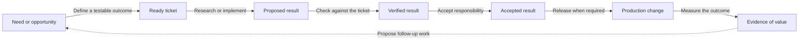

# What changes the bottleneck

The owner's reported constraints are insufficient implementation time, unclear work, and excessive reviewing. The aim is a supported way of working with AI that increases useful delivery while retaining insight into costs and decisions. We do not have measured team throughput or a demonstrated 1,000-agent capacity.

## Follow one outcome all the way through

This is a proposed operating process, not an implemented workflow engine. Research that establishes “do not build” can finish with an accepted result without a production change. The [domain rules](../domain/rules.md) capture that distinction.

## What more agents can and cannot change

More independent execution slots can reduce waiting for research or implementation when that is the limiting step. They can also produce more changes than people can review. Work that depends on other unfinished work cannot simply be multiplied across machines. More revisions, conflicting edits, weak tests, and failed checks consume capacity too.

A first-order capacity illustration is:

`accepted results per week <= min(ready tickets per week, candidate production per week, review capacity per week)`

For changes that must reach production, release capacity supplies another limit. Actual throughput can be lower because of dependencies, rework, variability, incidents, and rejected results. This is a planning bound, not a forecast.

**Illustration for ticketed software work, not a measurement:** if we can prepare 20 good tickets, produce 50 candidate changes, and review 8 per week, the ceiling is 8 accepted changes per week. Doubling candidate production to 100 does not change that ceiling. Improving tests and evidence enough to support 16 sound reviews per week might. We still have to measure whether review quality stays acceptable. Open conversations are also workloads, but should be measured by their usefulness and human effort rather than forced into a ticket-to-production count.

## Where each component helps

**Vloer** can reduce the effort of understanding and reviewing work by putting the ticket, actual changes, executed checks, unresolved questions, and decisions together. It should make weak evidence easy to see. A readable transcript is useful, but it does not prove correctness.

**Ploeg** can coordinate authorized work, avoid competing claims, limit concurrent execution and spending, and stop or expose failed work. A future admission rule could hold back more work when review capacity is full. That feedback rule is a proposal, not a current capability.

**The harness and model** influence how quickly a useful candidate is produced and how often it needs rework. **Kubernetes and KEDA** provide execution capacity. **LiteLLM and the provider** affect model access, rate limits, latency, and cost. None of these decides whether a business outcome was achieved. Their responsibilities are defined in the [component guide](components.md).

## Measurements for a pilot

Every measurement needs a start event, an end event, and an owner. The following set is proposed; no baseline is claimed.

1. **Time to accepted result:** from work meeting its readiness conditions to a person or authorized rule accepting its result. For a free conversation, agree what a useful response means rather than requiring a ticket. Break out waiting, execution, and review time for deliverables.
2. **Human time per accepted result:** ticket preparation, intervention, review, and rework time. Pair lower time with quality checks; hiding review effort is not improvement.
3. **Acceptance and rework:** how often the first result meets the agreed conditions, and how much work returns after review or release.
4. **Cost per accepted result:** observed and later reconciled model cost, workspace cost, and human time. Include failed attempts.
5. **Time to production:** for results that need deployment, measure acceptance to successful release separately. Pair it with rollback and escaped-defect rates.
6. **Visibility completeness:** whether we can link each execution to its workload, optional external ticket, responsible person or policy, authorized budget, model route, actions, result, relevant checks, and acceptance decision. “We logged something” is insufficient.

## A credible claim to leadership

“We are establishing a supported way for developers and agents to work with AI. We can increase execution capacity while retaining records of work, cost, and decisions. We will judge it by useful results delivered, human time required, and quality—not by how many agents we can start.”

## The next architecture decision

Agree on one representative journey: a good ticket, a human working with AI, independent agent execution when useful, a reviewable result, and a safe release. Include a research ticket that concludes not to build. Use those journeys to compare the current implementation with alternatives before broadening the platform.

The immediate recommendation is to remove ambiguity about execution ownership and acceptance, then measure the entire journey. A general autonomous research-to-production loop and a 1,000-agent rollout remain aspirations until this baseline is understood and measured.
