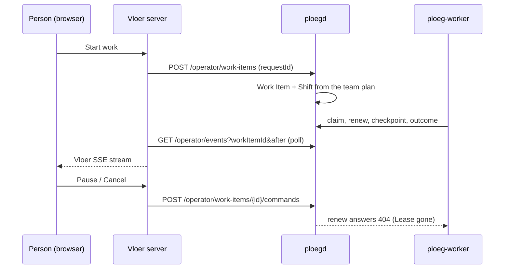

# Vloer as Ploeg's front end (proposal)

**Status: proposed. Nothing on this page is implemented yet.** It explains how to finish [Glide ADR-0002](../../../docs/adr/adr-0002-ploeg-is-the-only-engine.md) in small, safe steps. Under that decision Ploeg executes every Run and Vloer only presents, steers and reviews. [Vloer ADR-0023](adrs/0023-vloer-submits-work-to-ploeg-and-never-executes-it.md) records the choices recommended here. The [current architecture](architecture.md) and the [shared execution contract](contracts/ploeg-execution.md) still describe what runs today.

## Where we start

Today a "managed" Vloer session does not run in Ploeg. Vloer asks Ploeg to admit an **Operator Execution**, then runs the whole Crew itself: it builds the workspace, drives OpenCode over HTTP, calls the model with a key that Ploeg issued, and sends heartbeats and reports back. Ploeg keeps records and one inference key. The [22 September inventory](../../../docs/research/2026-09-22-glide-inventory.md) counts the result: two harness drivers, two LiteLLM brokers, two spend-hold state machines, two review orchestrators and two liveness protocols.

For this, Ploeg writes placeholder rows. [`AdmitOperatorExecution`](../../ploeg/pkg/store/operator_execution.go) inserts a Work Item with `operator_owned = true`, a Shift on branch `vloer/<session>`, an `operator` Run and a Lease. The scheduler must then skip these rows in ten queries in [`shift.go`](../../ploeg/pkg/store/shift.go). Seven of those check `NOT EXISTS (… operator_executions …)` and three check `NOT operator_owned`, and [`IngestAssigned`](../../ploeg/pkg/store/store.go) has more `operator_owned` cases.

The target shape needs no placeholders. Vloer creates an ordinary Work Item, and Ploeg dispatches it like tracker work. Ploeg's worker claims the Run, and Vloer watches and sends commands.

## Submit a Work Item

**Proposed route:** `POST /api/v1/operator/work-items`. It uses the existing operator bearer token, the `X-Ploeg-Actor` header and a consumer that has `execute` permission.

| Field | Meaning |
| --- | --- |
| `requestId` | Vloer's durable identifier for this submission. Vloer stores it before it sends the request. |
| `team` | A team in the consumer's scope. Its team plan chooses the Roles, Rounds, pool and harness. |
| `target` | The key of a repository that Ploeg already knows from its target registry. Ploeg never accepts a raw repository URL from Vloer. |
| `title`, `description` | The Work Item content. |
| `budgetUsd` (optional) | A cap below the team plan's pool. It can never raise the pool. |

What Ploeg does:

1. Checks the consumer, the team scope and the target.
2. Inside one transaction, inserts a Work Item with `provider = 'vloer'`, `external_id = <consumer>:<requestId>`, `origin = 'operator'` and state `queued`, and records a fingerprint of the payload. The row is **not** `operator_owned`: ordinary dispatch owns it.
3. Calls [`Engine.EnsureShift`](../../ploeg/pkg/shiftengine/engine.go). The team plan opens the Shift and its first Round, exactly as it does for a tracker webhook.
4. Returns `{ workItemId, shiftId, created }`.

Replaying the same `requestId` with the same fingerprint returns the existing Work Item. A different payload returns `409`. This must be a new store function, not `IngestAssigned`. On conflict, `IngestAssigned` re-queues an item that is `done`, `stale` or `needs_human`, so a replay after a lost response could silently start paid work again. The Vloer rule "a restart never silently repeats paid work" forbids that.

Tracker-bound work is already covered. A Tracker Item assigned to a team reaches Ploeg through the webhook. Vloer's import then only needs to find it: the existing lookup `GET /operator/work-items/lookup` stays, and the `source` pin on admission goes.

## Show Shifts and Runs live

### What exists

| Route | Returns | Limits for a live view |
| --- | --- | --- |
| `GET /operator/work-items/{id}` | Work Item, Shifts, Runs, checkpoints, the latest audit events | A snapshot of at most 500 of each |
| `GET /operator/runs/{id}` | One Run with its outcome, summary, findings, verdict and usage | Snapshot |
| `GET /operator/events?team&workItemId&after&limit` | Audit-log rows after a cursor, up to 200 per page, with `nextCursor`, `lastCursor` and `hasMore` | Polling only (`consistency: "snapshot"`), and nothing in Vloer calls it today |
| `GET /operator/executions/{id}/events` | Operator Execution events | Belongs to the path being retired |

The audit log already records the lifecycle: `work_item.*`, `round.opened`, `round.reopened`, `run.claimed`, `lease.acquired`, `checkpoint.written`, `outcome.*`, `run.expired`, `shift.closed`, `llm.reserved` and `llm.reconciled`. Vloer's parser in [`ploeg.ts`](../src/ploeg.ts) keeps only a whitelisted part of each event's `detail`.

### What is missing

* **Push.** Nothing pushes changes to a client; every consumer has to poll.
* **Agent activity.** A Run shows only phase checkpoints. The ACP adapter sends `plan_ready`, `changes_made` and a `progress` heartbeat every five minutes, at most 15 per Run. There are no tool calls and no agent messages, so a person cannot follow what the agent is doing.
* **Per-person scope.** Ploeg scopes events per consumer, not per person. Vloer must keep filtering by `userTeams`, as `PloegClient` already does.
* **Command results.** Commands proposed below need their own audit actions (`operator.command.*`) so the stream shows who paused or cancelled.

### Recommendation

1. **First, poll the existing endpoint from the Vloer server.** While a browser watches a Work Item, Vloer polls `/operator/events?workItemId=…&after=<cursor>` every two seconds, stores the cursor, and feeds the rows into its existing [SSE stream](../src/http.ts). SSE (server-sent events) is a one-way HTTP stream from the server to the browser. The browser never talks to Ploeg, and the operator token stays on the server. This needs no change in Ploeg.
2. **Add a Ploeg SSE endpoint later, and only if polling measurably costs too much.** It would be `GET /operator/events/stream`, with the audit id as SSE `id` so `Last-Event-ID` resumes the stream. It would read Postgres on a one-second tick and add no new infrastructure. The cursor contract stays the same, so Vloer can switch without a migration.
3. **Add bounded Run activity as a separate increment.** The worker would send a throttled activity summary: tool-call titles and a truncated last agent message. It would go through a new Run-capability route, `POST /runs/{token}/activity`, and pass through the same secret redaction as outcome reports. This adds data to show; the event path stays the same.

## Steer a running worker

"Steering" covers three requests: send a message, pause, and take control. Ploeg's worker runs in a sandboxed pod that can reach only the model gateway, the forge and ploegd. Every channel to a running Run therefore has to be something the worker **pulls**. The worker already pulls one: [`renewLoop`](../../ploeg/pkg/worker/worker.go) renews the Lease every TTL/3 and cancels the harness when the renew answers `404`.

How a harness could receive a message today:

* Spawn-and-wait adapters (OpenHands, Claude Code, `exec`) take one prompt at start. They cannot receive anything later.
* The [ACP adapter](../../ploeg/pkg/harness/adapters/acp/acp.go) runs one `session/prompt` turn and then shuts down. ACP allows a second `session/prompt` in the same session after a turn ends, and `session/cancel` to end a turn early. It does not define adding text to a turn that is still running. At best, a message lands **between turns**.
* ACP permission requests are answered at once by a fixed policy ([`permission.go`](../../ploeg/pkg/harness/adapters/acp/permission.go)), because the handler runs on the protocol read loop and must never block. Sending them to a human would break that design.

### Options

| Option | How it works | Worker changes | Good | Bad |
| --- | --- | --- | --- | --- |
| **S1. Steer between Runs** | A message becomes a note on the Work Item, and Ploeg adds it to the prompt of the next Run (next Round, fix round or resume). Pause and cancel act on the Shift. Take-control hands the branch to a person. | None for messages. Cancel uses the existing renew `404`. | No new protocol. Works for every harness. Stays inside the sandbox model. | The running Run does not see the message. Feedback waits for the Run to finish. |
| **S2. Steer between turns (ACP only)** | The worker polls `GET /runs/{token}/directives?after=`. After a turn ends, the ACP adapter sends waiting messages as a new `session/prompt` in the same session. An explicit "interrupt" sends `session/cancel` first. | A new Run route, a directive poller in `pkg/worker`, an optional `Directives` channel on `harness.RunEnv`, a follow-up-turn loop in the ACP adapter, and a `directive.delivered` or `directive.undeliverable` audit event | The person's text reaches the same agent session and keeps its context. | ACP only. Adds a turn cap and a latency of one poll. Follow-up turns spend from the same Run key. |
| **S3. Attach live** | A person opens a terminal, editor or Agent Host Protocol view into the worker pod. | An inbound tunnel or relay into pods, session hosting in the worker, and human approval of permission requests | Full interactive control | Breaks the worker's network boundary and the non-blocking permission design. It rebuilds the Vloer engine inside the worker. |

### Recommendation

Adopt **S1** now. Consider **S2** as an optional later increment, and only after people have used S1 and missed mid-Run messages. Reject **S3**.

* **Message:** Vloer stores a note on the Work Item through a `message` command. Ploeg's prompt composer adds the Work Item's unconsumed notes to the next Run's prompt and marks them consumed in the audit log. The Vloer interface says "applies to the next Run". Vloer's current `message` already records `applies: 'next_execution'`, so the product promise does not change.
* **Take control:** this means taking over the branch, not the agent. Vloer sends `take-control`. Ploeg pauses the Shift, stops the writing Run the same way cancel does, and revokes its Push Credential. The Shift keeps the branch, and Vloer shows the branch so the person can check it out and push. `hand-back` resumes the Shift. The next writing Run gets a fresh Lease, starts from the branch as the person left it, and receives the notes.
* **What S2 would add:** the steps in the S2 row. Only the ACP adapter would implement `Directives`. Every other adapter would record the message as undeliverable, and Ploeg would fall back to S1 delivery.

## Pause and cancel through Ploeg commands

**Proposed route:** `POST /api/v1/operator/work-items/{id}/commands` with `{ commandId, action, expectedShiftId, text? }`. It is idempotent by `commandId`, like today's execution commands. `expectedShiftId` guards against acting on a newer Shift than the one the person was looking at.

| Action | Ploeg effect | Running Run |
| --- | --- | --- |
| `cancel` | In one transaction: close the live Shift with reason `cancelled`, delete its Lease, mark its open Runs as stopping, and set the Work Item to its cancelled state. Then block every Run's LiteLLM key through `LLMControl.Block`, so spend stops even before the worker reacts. | The next renew answers `404`, and the worker cancels the harness and reports an outcome. The report is recorded against a closed Shift and never reopens a Round. |
| `pause` | Set `paused_at` on the Shift. `ClaimRole` skips paused Shifts, so no new Run starts. | The current Run finishes. Paid work in progress is not thrown away. |
| `resume` | Clear `paused_at` and call `EvaluateItem`. A paused Shift resumes only on this explicit command. | None |
| `message` | Record a note for the next Run's prompt. | None under S1 |
| `take-control` / `hand-back` | Pause plus stopping the writing Run, then resume | The writing Run stops as for cancel, but the Shift stays open. |

Two rules carry over from the Vloer rules: an intentional pause or cancel never becomes an automatic retry, and a restart never silently repeats paid work. The riskiest code path is a **cancel racing the failed-writer rule** ([Ploeg ADR-0019](../../ploeg/docs/adrs/0019-a-failed-writing-run-reopens-its-round.md)). A stopped writing Run looks like a failed Run, and the evaluator reopens its Round. Closing the Shift in the same transaction as the Lease delete prevents that, because `LiveShifts` never returns a closed Shift. A regression test must prove it.

## What gets deleted

### In Vloer

| Remove | Why |
| --- | --- |
| [`broker.ts`](../src/broker.ts) and the `litellm` config block | Only Ploeg mints keys. |
| [`execution-authority.ts`](../src/execution-authority.ts) and the `execution` config block | Operator Executions are retired. |
| The non-demo parts of [`engine.ts`](../src/engine.ts): authority admission and heartbeats, reservations, spend settlement and reconciliation, retry, adding budget, and runtime launch | Standalone and shared execution both end. |
| [`runtime/opencode.ts`](../src/runtime/opencode.ts), `command.ts`, `workspace.ts`, `docker.ts`, `kubernetes.ts`, `sandbox.ts`, `relay.ts`, `git-access.ts` | Workspaces and harnesses run in `ploeg-worker`. |
| Their tests: `broker`, `execution`, `runtime-*` except `runtime-demo`, and the standalone `api-*` cases | The behavior is gone. |

**Kept:** the demo runtime ([`runtime/demo.ts`](../src/runtime/demo.ts)) and whatever it needs from the engine, sign-in and identity, the session record as a person's notes and history, `ploeg.ts` (which grows the submit, events and commands calls), the task-binding lookup, and the Ploeg demo fixture.

**Depends on an owner decision:** candidate capture and signing, the delivery verifier ([Vloer ADR-0014](adrs/0014-signed-candidates.md), [Vloer ADR-0019](adrs/0019-verify-canonical-candidates-outside-agent-workspaces.md)), and the Agent Host Protocol host ([Vloer ADR-0012](adrs/0012-agent-host-protocol-host.md)). All three work on a workspace that Vloer owns. Once Ploeg runs every Run, the result is Ploeg's pull request ([Ploeg ADR-0011](../../ploeg/docs/adrs/0011-the-pull-request-is-the-blackboard.md)), and nothing produces a Vloer candidate any more.

### In Ploeg

| Remove | Notes |
| --- | --- |
| The Operator Execution handlers in [`operator_execution.go`](../../ploeg/pkg/httpapi/operator_execution.go) and the store in [`store/operator_execution.go`](../../ploeg/pkg/store/operator_execution.go) | First answer `410 Gone` for new admissions. Delete the code after the last open execution is closed. |
| The placeholder writes: `operator_owned` Work Items, `vloer/<session>` Shifts, `operator` Runs and their Leases | Nothing creates them any more. |
| The ten scheduler exclusions in [`shift.go`](../../ploeg/pkg/store/shift.go) and the `operator_owned` cases in `IngestAssigned` | Remove them only once no open placeholder rows remain. |
| `LLMControl.IssueOperator`, the `ReconcileOperatorExecutions` sweep and the 30-second credential timeout in `operatorAuth` | Worker keys use `Issue` through the Run API. |
| The `operator_executions`, command and event tables | Drop them in a **new** migration. Never edit an existing migration. |

The delivery routes in [`operator_delivery.go`](../../ploeg/pkg/httpapi/operator_delivery.go) are keyed by execution id. They follow the owner's decision on Vloer candidates.

## One OpenCode driver

Two OpenCode drivers exist: Vloer's HTTP driver for `opencode serve` and Ploeg's ACP adapter for `opencode acp`, which uses the `opencode` profile in [`profiles.go`](../../ploeg/pkg/harness/adapters/acp/profiles.go). Keep **only the ACP adapter**. It already supports several agents through profiles, it has a conformance suite ([`harnesstest`](../../ploeg/pkg/harness/harnesstest/conformance.go)), and harness changes come fastest at this boundary. Maintaining it twice is the cost ADR-0002 set out to remove.

The team plan chooses the harness for each Role. Vloer stops choosing a runtime or model per session and shows the team's plan instead, so a Vloer Crew becomes a Ploeg Team. What the HTTP driver did and the ACP adapter does not do goes away: answering permission prompts and questions interactively, the pre-flight brief check, and per-Step events. S2 would bring back only follow-up messages.

## Migrate the cross-application check

[`scripts/integration.mjs`](../../../scripts/integration.mjs) runs two checks today. `standalone` runs Vloer's own API tests. `managed` runs `TestOperatorWorkbench(Inference)Qualification`, where Ploeg's handlers drive Vloer's `qualify-ploeg.ts` scripts against a fake LiteLLM. Neither check runs `ploeg-worker`.

Proposed checks:

| Check | What it runs | What it asserts |
| --- | --- | --- |
| `demo` | Vloer's demo tests without Ploeg | The fixture completes and says it is a demo. Zero model calls, zero spend. |
| `front-end` (new) | A Go test with real PostgreSQL, the ploegd handlers, an in-process `worker.Worker` using the `exec` adapter on a deterministic script, a local bare Git repository, an `httptest` fake forge and the fake LiteLLM. Vloer's new `qualify-front-end.ts` submits, watches and sends commands through `PloegClient`. | Vloer observes events in order until `shift.closed`. A pull request is opened on the fake forge. Exactly one capped key is minted and blocked per Run. No inference request reaches the gateway. A second Work Item is paused, resumed and cancelled, and is never re-queued. |

`standalone` and `managed` are removed in the increments that delete their code. For the first time, the cross-application check runs the Go worker.

## Increment plan

Each increment can ship and be reverted on its own, and it lands with the test named in the table. Increments 1 to 7 add the new path next to the old one. Increment 8 switches over, and increments 9 and 10 delete. Priority stays on the tracker.

| # | Increment | Application | Test that proves it |
| --- | --- | --- | --- |
| 0 | Publish `operator-work.v1.schema.json` for submission, commands and events | Ploeg contract | A Go contract test pins the schema to the types, and a Vloer test validates a fixture against it. |
| 1 | `POST /operator/work-items`: fingerprinted and idempotent, target from the registry, `EnsureShift` | Ploeg | An `httpapi` test: a replay returns the same Work Item and one Shift, a changed payload returns 409, an out-of-scope team returns 403, an unknown target returns 400, and `ClaimRole` claims the Run with no exclusion. |
| 2 | Vloer "Submit to Ploeg" behind a `ploeg.submit` flag. The `requestId` is persisted before the call. | Vloer | Against a fake Ploeg: a response lost before a restart replays to the same Work Item, and no local runtime is launched. |
| 3 | Live view: poll `/operator/events` on the server and feed the Vloer SSE stream | Vloer | The fake Ploeg emits events; the SSE client receives them in order, resumes from the cursor after a reconnect and sees no duplicates. |
| 4 | `cancel` command | Ploeg | A store and `httpapi` test: the Shift closes, the key is blocked, renew returns 404, the outcome is recorded, and `EvaluateAll` plus the sweep never reopen the Round (fails on the old failed-writer path). |
| 5 | `pause` and `resume` at the Run boundary | Ploeg | A paused Shift has no claimable Run, it stays paused across a ploegd restart, and only `resume` makes it claimable. |
| 6 | Vloer controls for pause, resume and cancel, and `message` notes in the next Run's prompt | Both | A Ploeg prompt test includes the unconsumed notes once. A Vloer test replays a `commandId` without a second effect. |
| 7 | The `front-end` check in `integration.mjs` | Both | The check itself |
| 8 | Switch the default: Start submits to Ploeg. The `execution` and `litellm` config blocks are rejected with a migration message. Non-demo runtimes are refused. | Vloer | A config test rejects the old blocks, and the demo check still passes. |
| 9 | Delete Vloer's broker, execution authority, non-demo runtimes and engine paths | Vloer | `npm test` and `npm run check`, plus a test that no module imports the removed files. This completes the first confirmation item of ADR-0002. |
| 10 | Retire Operator Executions: `410 Gone`, then remove the exclusions and drop the tables in a new migration once no open row remains | Ploeg | The scheduler query tests pass without the exclusions, and a migration test runs on a database that has closed placeholder rows. |
| 11 | Optional: `take-control` and `hand-back` | Both | The Push Credential is revoked, and the next writing Run starts from the person's commit. |
| 12 | Optional: S2 between-turn messages for ACP | Ploeg | An ACP adapter test with a fake agent receives a second `session/prompt` after the first turn. Other adapters record `directive.undeliverable`. |
| 13 | Optional: Ploeg SSE endpoint and Run activity | Ploeg | An SSE resume test with `Last-Event-ID`, and a redaction test on activity text |

## Risks

* **Vloer loses interactivity until S2 exists, and partly after.** People can no longer answer permission prompts, watch every tool call or work in the agent's workspace. The front end becomes a place to watch and command, not to drive.
* **A cancel can turn into a retry.** A stopped writing Run looks like a failed one. The Shift must close in the same transaction, and increment 4's regression test is the guard.
* **Vloer work competes with tracker work.** Submitted Work Items join the normal queue, and today's `priority` comes from trackers. The Vloer submission needs a defined priority.
* **Targets live outside this repository.** A Vloer repository must be in Ploeg's target map. That map is production desired state in `webgrip/homelab-cluster` and is not changed by this refactor.
* **The budget model changes.** Budgets come from the team plan's pool and Role caps, not from a per-session number that a person types.
* **Operator Executions may still be open during migration.** They have to drain before increment 10. The sweep already expires stale ones and blocks their keys.
* **Polling adds load.** Each watched Work Item costs one poll every two seconds, bounded by Vloer's cap of 100 streams. Increment 13 is the relief valve.
* **The demo can drift from the real path.** If the demo keeps its own engine, it exercises code that nothing else uses. Running the demo against a deterministic Ploeg fixture behind `PloegClient` would avoid that.
* **Laptop use needs a running Ploeg.** ADR-0002 already accepted this.

## Decisions for the owner

1. Budget for Vloer submissions: the team pool only, or an optional lower cap?
2. The end state of a cancelled Work Item: `needs_human`, `done` with a reason, or a new `cancelled` state?
3. Pause semantics: at the Run boundary only (recommended), or also "stop now"?
4. Steering: S1 now with S2 deferred (recommended), or S2 in the first release?
5. Take-control as a branch hand-over: wanted, or dropped?
6. Vloer candidates, the delivery verifier and the Agent Host Protocol host: retire them, or keep them for another purpose?
7. The demo: keep the demo runtime, or move it onto a Ploeg fixture?
8. Crews: retire them in favour of Ploeg team plans?
9. The priority of Vloer-submitted Work Items relative to tracker work
