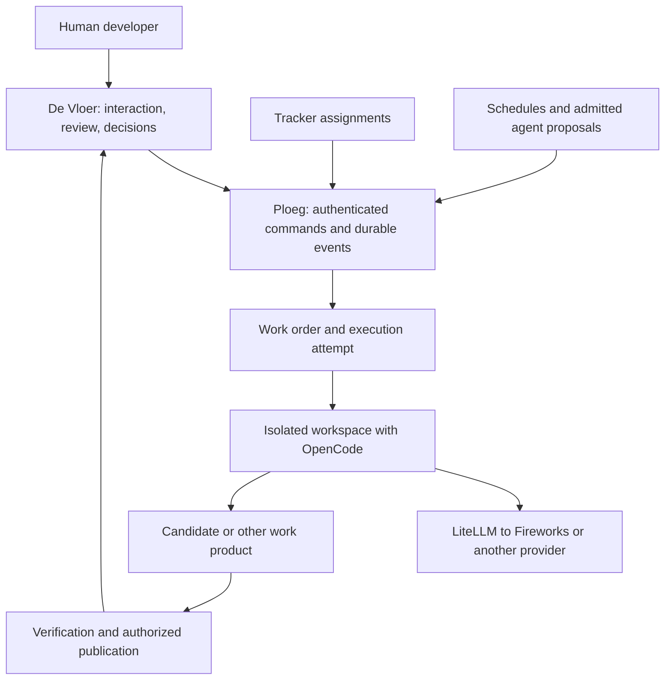

# One workbench and one execution authority

Implementation follow-through: [the unified operating guide](../operations/unified-baseline.md) and [connected qualification evidence](evidence/unified-2026-09-10/README.md) record what was built after this source survey. The findings below retain their inspected baseline.

> Research date: 2026-09-10. Method: local source inspection and primary-source web research, with three parallel research agents covering implementation seams, competing products and protocol/workflow components. This is a recommendation, not an accepted architecture change or a delivered integration. The condensed verdict is in the [alternatives ledger](conventions-and-alternatives.md#alternatives-worth-comparing-against-a-real-workflow); conditional adoption triggers are in the [backlog guide](../operations/backlog.md#unification-baseline-and-adoption-triggers).

Make De Vloer the human entry point to a Ploeg-owned execution system. Interactive and unattended work should use the same admission, identity, budget and execution lifecycle. The next baseline should demonstrate a person starting, leaving, rejoining and steering one real execution, followed by a reviewable result. The authenticated operator read API is the first increment toward this; a read-only dashboard alone does not finish the unification.

## Evidence and scope

De Vloer was inspected at `60e8737f0b16ba9bfeff2b8dfaa5de7dbbf92a55`, Ploeg at `67c4bc968455a99ef767bc8a24791ea1a87319cb`, both on `development`. Remote branch checks confirmed the Ploeg revision. De Vloer's remote revision `caf03fdc03ba05eda4d3bba0992b788446c16ee9` contains only release metadata changes beyond the inspected checkout. Forgejo pages did not render in the web tool, so repository claims use the local source plus Git remote checks. No deployed service or competitor was exercised, and no paid inference was requested.

No Protocol research contract is present in the repository instructions. Landing locations are inferred: the existing alternatives table is the ledger, the operations backlog guide holds conditional adoption triggers, and this directory holds the dossier. Existing [market research](market-landscape.md) and the earlier [Ploeg/Vloer comparison](2026-09-10-ploeg-and-de-vloer-split.md) remain useful evidence; this note sharpens the decision around the owner's interactive and autonomous workflow rather than commercial positioning.

## What exists

De Vloer's only Ploeg execution-system read is queue depth in [the HTTP handler](../../src/http.ts#L260). Its own [engine](../../src/engine.ts#L530) mints credentials, prepares workspaces and runs the crew. Ploeg's [worker](https://forgejo.webgrip.dev/webgrip/ploeg/src/commit/67c4bc968455a99ef767bc8a24791ea1a87319cb/pkg/worker/worker.go#L322) independently owns those operations for unattended work. The configured `executionOwner` restriction in [De Vloer](../../src/engine.ts#L136) prevents some conflicting local starts, but is not a distributed claim.

The proposed direction is already recorded in [ADR 0005](../adrs/0005-one-work-authority.md): Ploeg owns WorkOrders and fenced DeliveryAttempts, while Vloer sessions and human decisions refer to them. [ADR 0015](../adrs/0015-ploeg-operator-read-api.md) describes an authenticated operator read API and projection. Both remain proposed. The [WorkOrder schema](../contracts/work-order.v1.schema.json) also explicitly describes proposed behavior.

Preserve De Vloer's durable interactions, candidate capture, remote runtime integration and conservative restart behavior. Its [recovery code](../../src/engine.ts#L294) does not silently restart paid work. Ploeg already has an [OpenCode ACP profile](https://forgejo.webgrip.dev/webgrip/ploeg/src/commit/67c4bc968455a99ef767bc8a24791ea1a87319cb/pkg/harness/adapters/acp/profiles.go#L101), and its [harness contract](https://forgejo.webgrip.dev/webgrip/ploeg/src/commit/67c4bc968455a99ef767bc8a24791ea1a87319cb/pkg/harness/contract.go#L13) already carries briefings and findings between roles. Harness support and bounded collaboration have a foundation; a shared attachable execution does not.

## Proposed ownership

| Responsibility | Proposed owner | Boundary |
| --- | --- | --- |
| Human conversation, review, intervention and navigation | De Vloer | May retain its own interaction state and backend; execution authority is not independently recreated there |
| Admission, scheduling, execution identity, control ownership, budget reservations and recovery | Ploeg | One authority for manual, tracker, scheduled and agent-originated work |
| Native reasoning, tool use and conversation continuation | OpenCode first; interchangeable harness adapters | A native session handle stays opaque; another harness receives an explicit artifact-based handoff |
| Compute, storage and resource lifecycle | Workspace provider under Ploeg's authority | Reuse the existing De Vloer implementation behind a service boundary during migration; physical code moves can follow |
| Model routing and usage records | Existing LiteLLM gateway | Execution authorization and observed spend must remain distinct |
| Priority and accepted task content | Existing tracker for tracked work | Manual exploration can be admitted without first manufacturing an external issue |
| Code review, merge and release | Existing forge and delivery policy | An agent's successful turn does not establish an accepted change |

Do not merge the repositories or share their database as the first step. Introduce the versioned operator contract, then move one execution path behind it. De Vloer's existing adapters and workspace behavior can be reused while Ploeg becomes their lifecycle authority. Stop admitting new governed sessions through the independent Vloer path once that path is qualified; retain clearly identified compatibility sessions until deliberately migrated or completed. This extends the current [architecture boundary](../architecture.md), which still assigns only unattended dispatch to Ploeg, and needs an explicit decision before implementation.

Being attached to a running session is different from taking over its execution. Reading events or answering an allowed permission request should not create a replacement attempt. One controller must serialize mutating instructions. If a takeover replaces an executor, require a confirmed stop, retained artifacts and a new admitted generation, including the publication reconciliation required by [ADR 0006](../adrs/0006-trusted-verifier-and-publisher.md). Human and scheduled control should not race to submit paid turns to the same native session.

## Existing products that deserve a real comparison

These are documented/source-backed capabilities as of the research date, not compatibility or capacity certifications.

| Product | Concrete overlap | Decision for this project |
| --- | --- | --- |
| [OpenHands Agent Canvas](https://github.com/OpenHands/OpenHands) | Self-hosted, MIT workbench; ACP-compatible harnesses; multiple agent backends; separate Agent Server and Automation Server | Closest reference for the requested workbench/execution/automation separation. Its [community Helm deployment](https://docs.openhands.dev/openhands/usage/agent-canvas/backend-setup/kubernetes) shares one Pod/PVC and lacks user RBAC and tenant isolation; it does not establish the intended fleet boundary |
| [Paperclip](https://github.com/paperclipai/paperclip) | MIT orchestration centered on goals, tasks, agent roles, budgets, approvals and recurring work; a documented [OpenCode adapter](https://docs.paperclip.ing/reference/adapters/opencode/) | Closest comparison for the longer-term agent-operated research/business loop. Its own work authority competes with Ploeg and the tracker; evaluate as an alternative, not an invisible second scheduler. Its [Kubernetes provider](https://docs.paperclip.ing/reference/adapters/sandbox-providers/#kubernetes-driver-kubernetes) is alpha |
| [Kandev](https://github.com/kdlbs/kandev) | Agent workbench, workflow/review surfaces and a documented [per-session Kubernetes executor](https://kandev.ai/docs/k8s) | Strong alternative for hands-on development. [Feature status](https://kandev.ai/docs/feature-status) distinguishes execution support from experimental shared control-plane capabilities and unfinished Office coordination |
| [Coder Agents](https://coder.com/docs/ai-coder/agents) | Self-hosted chat/API, workspace provisioning, subagents and persistent conversations | Relevant complete alternative or workspace infrastructure reference. Its current agent is its own Go implementation in the control plane; it does not preserve OpenCode as the harness |

OpenHands' split is particularly useful design evidence: the workbench consumes an agent API, while a separate automation service schedules work. That does not prove its policies match Ploeg's delivery contract. Paperclip's broader organizational model deserves more consideration for the owner's stated research/plan/measure ambition than a software-delivery-only comparison would give it. This reaffirms the existing ledger's rejection of a second hidden priority queue, while reopening Paperclip as a deliberate replacement if its work model is preferable.

Use a small, identical workflow trial in Kandev and Paperclip before another substantial platform expansion, with OpenHands as an additional architectural reference: the actual OpenCode/LiteLLM route where supported, one representative repository, one intervention, one disconnect/reconnect and one reviewable output. Record setup and human review effort and explain any unsupported leg. Paperclip's gateway helpers are documented for local adapter targets, so cluster configuration must be qualified separately. OpenHands' [Canvas ACP picker documentation](https://docs.openhands.dev/openhands/usage/agent-canvas/acp-agents) does not establish a selectable OpenCode integration; generic ACP compatibility is insufficient to claim a tested combination. Keep existing systems if their particular tracker, forge and authority integration earns its maintenance cost; prior investment alone is insufficient evidence.

## Next focus: one execution that a person can join

1. **Expose the existing work.** Implement the authenticated operator read API and De Vloer projection from [ADR 0015](../adrs/0015-ploeg-operator-read-api.md): existing plan items PV-079, PV-080 and then PV-081 in the [planning seed](../../backlog/README.md). Show running work, blockers, evidence and spend with source identity. This makes the integration useful early.
2. **Establish common execution authority.** Advance the existing WorkOrder, attempt and operator-command sequence PV-022 through PV-025, respecting its prerequisite graph. Include manual-origin work. Command idempotency, object authorization and deliberate recovery are part of this contract. Port the working OpenCode/workspace behavior behind the boundary incrementally rather than rebuilding it in one change.
3. **Qualify the complete interaction.** Start from De Vloer, detach while the job continues, reconnect to the same history and workspace, intervene, return control to unattended execution, then inspect the frozen result and real usage. PV-026 covers replacement-executor takeover and handback with its verification/publication prerequisites. A duplicate Start returns the existing operation. Explicit cancellation survives restart. A crash after uncertain prompt acceptance results in reconciliation or an explicit blocker, never an automatic fresh paid prompt. Session loss results in a visible handoff, never a claim that hidden context migrated.

There are concrete source-confirmed foundations to finish before widening unattended access. Ploeg's [HTTP routes](https://forgejo.webgrip.dev/webgrip/ploeg/src/commit/67c4bc968455a99ef767bc8a24791ea1a87319cb/pkg/httpapi/server.go#L72) lack operator/worker authentication middleware. The [worker pod environment](https://forgejo.webgrip.dev/webgrip/ploeg/src/commit/67c4bc968455a99ef767bc8a24791ea1a87319cb/ops/helm/ploeg/templates/_helpers.tpl#L286), [environment forwarding](https://forgejo.webgrip.dev/webgrip/ploeg/src/commit/67c4bc968455a99ef767bc8a24791ea1a87319cb/pkg/worker/worker.go#L277) and [filter](https://forgejo.webgrip.dev/webgrip/ploeg/src/commit/67c4bc968455a99ef767bc8a24791ea1a87319cb/pkg/worker/git.go#L69) allow its LiteLLM management credential into the harness environment. No credential values were inspected. Existing PV-071 through PV-073 cover management-authority isolation, authenticated worker control and preserving cost holds after worker death. The prepared Ploeg patch, later removed unapplied, explicitly left these prerequisites separate and unqualified.

The baseline completion criterion is an actual accepted result with measured human effort and recovery evidence. The current [validation record](../validation.md) does not establish live Fireworks billing, the target Kubernetes deployment or thousand-agent throughput. Keep provider tests opt-in and qualify one scoped run before increasing concurrency.

## Then add the research, planning and measurement loop

Model the work product separately from a Git change. A research job can produce a sourced brief; planning produces proposed work; execution produces a candidate; measurement produces an observation linked to the original hypothesis. The existing repository-first experience needs an explicit path for work without a repository, already represented by PV-084 in the [planning seed](../../backlog/README.md).

Start with three roles and a bounded graph: researcher produces evidence and a proposed task, builder executes an admitted task, evaluator checks the result and may propose follow-up work. Define the outcome metric and observation window before execution; passing tests alone does not establish a market outcome. New tickets can be created through scoped tracker capabilities, but creation and eligibility for paid execution are separate decisions. The current Ploeg [tracker interface](https://forgejo.webgrip.dev/webgrip/ploeg/src/commit/67c4bc968455a99ef767bc8a24791ea1a87319cb/pkg/provider/provider.go#L49) does not include task creation.

Agent communication should first be durable, work-scoped messages and artifacts: named sender/recipient, parent work reference, message identity, request/result kind and expected response. Use shared findings and explicit child work to extend Ploeg's existing round briefings. Persist messages while recipients are stopped, deduplicate redelivery and bound fan-out, depth, retries, total budget and time. Reading a shared artifact is preferable to copying every conversation into every agent's context.

[Kandev's communication guide](https://kandev.ai/docs/agent-communication) documents task/session addressing, durable queued delivery and correlated questions. This is a concrete implementation to inspect before designing an internal message protocol.

This permits many registered agents without requiring many continuously running Pods. Admit runnable work according to model capacity, workspace resources, budget and review capacity. If work awaiting review grows, reduce production and route attention to review. Measure accepted outcomes, intervention minutes, review queue age and cost per accepted result; increase concurrency only while those remain acceptable. Thousands of simultaneous executions require measured controller, database, gateway and cluster capacity, not just a scheduler setting.

## Components to retain or evaluate at specific boundaries

- **OpenCode HTTP and ACP:** retain both behind runtime capability contracts. [OpenCode's server](https://opencode.ai/docs/server/) supports multiple clients, async prompts, messages, events and abort. Its API does not promise exactly-once paid execution or durable replay. Ploeg's ACP adapter is already implemented; do not recreate it merely to achieve protocol symmetry.
- **AHP:** preserve the existing workbench projection from [ADR 0012](../adrs/0012-agent-host-protocol-host.md). Current [channel stability documentation](https://microsoft.github.io/agent-host-protocol/specification/versioning.html) distinguishes stable session surfaces from early automation channels. This is a client synchronization boundary, not Ploeg's workflow authority.
- **A2A:** defer until an independently deployed agent service must interoperate. Its [specification](https://a2a-protocol.org/latest/specification/) covers agent discovery, tasks, messages and artifacts; send-message idempotency is optional. Internal typed messaging does not require immediate protocol adoption.
- **Durable workflow engines:** consider [Temporal](https://docs.temporal.io/activity-execution) or [DBOS](https://docs.dbos.dev/architecture) behind Ploeg when durable timers, long human waits and branching recovery dominate implementation work. Persist operation identities and reconcile side effects: recoverable workflow execution does not make an arbitrary external model call exactly once. A workflow engine must not become a second domain authority.
- **Agent Sandbox:** retain the provisioner seam already selected in [ADR 0013](../adrs/0013-sandbox-crd-placement-with-warm-kata-pools.md). Upstream [v1.0.1](https://github.com/kubernetes-sigs/agent-sandbox/releases/tag/v1.0.1) is a useful qualification target; API release maturity does not establish the local adapter's compatibility or cluster isolation. Keep dependency updates under the existing Renovate policy.

Bounded absence checks found no verified ready-made Ploeg/De Vloer integration for the shortlisted workbenches or durable-workflow engines. They did find Ploeg's existing public [ACP adapter](https://pkg.go.dev/github.com/webgrip/ploeg/pkg/harness/adapters/acp). These are limits of the inspected sources, not claims of internet-wide absence. Adoption can be reopened using the explicit tests and triggers in the [backlog guide](../operations/backlog.md#unification-baseline-and-adoption-triggers).
