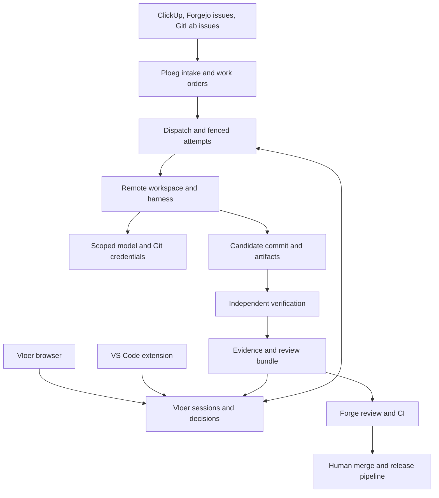
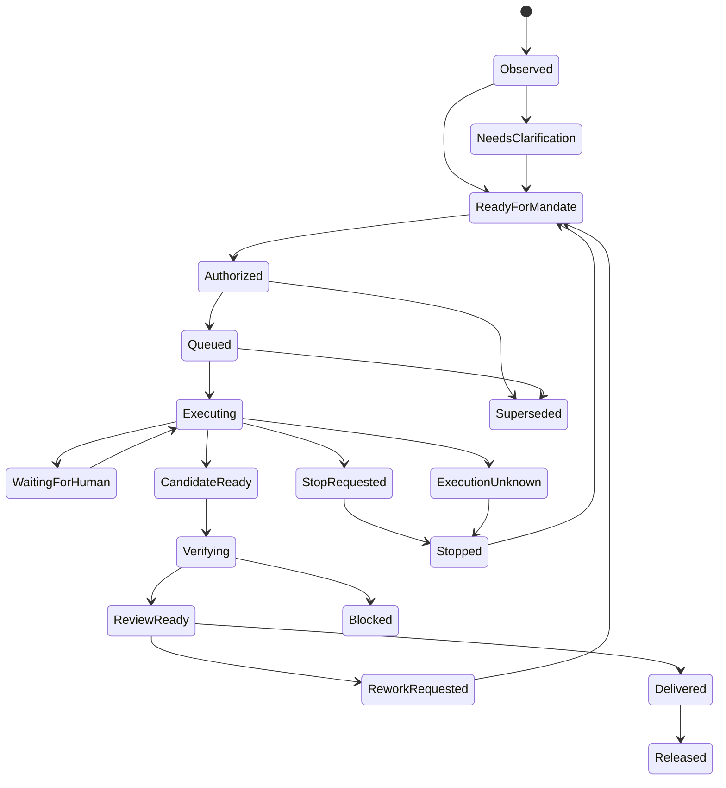
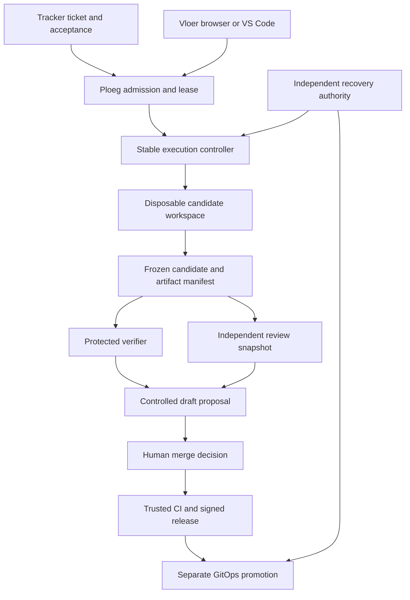
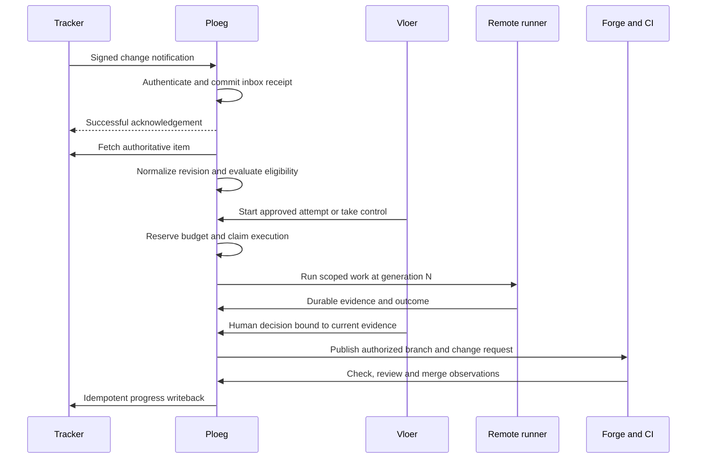
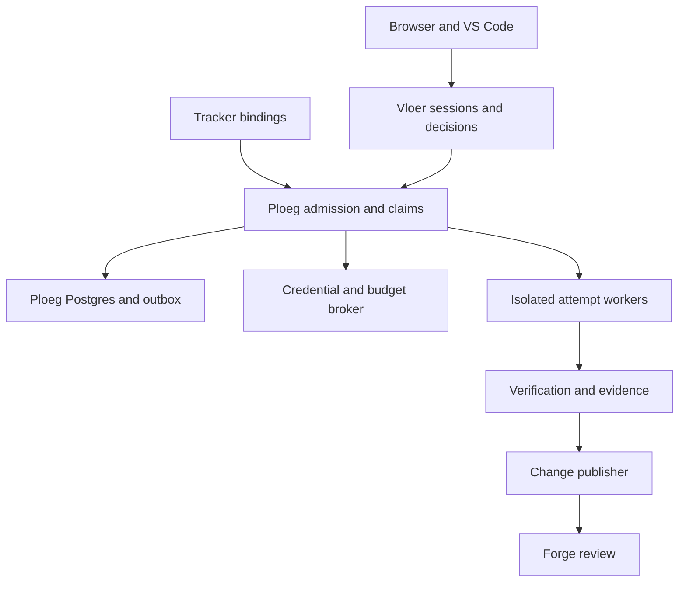
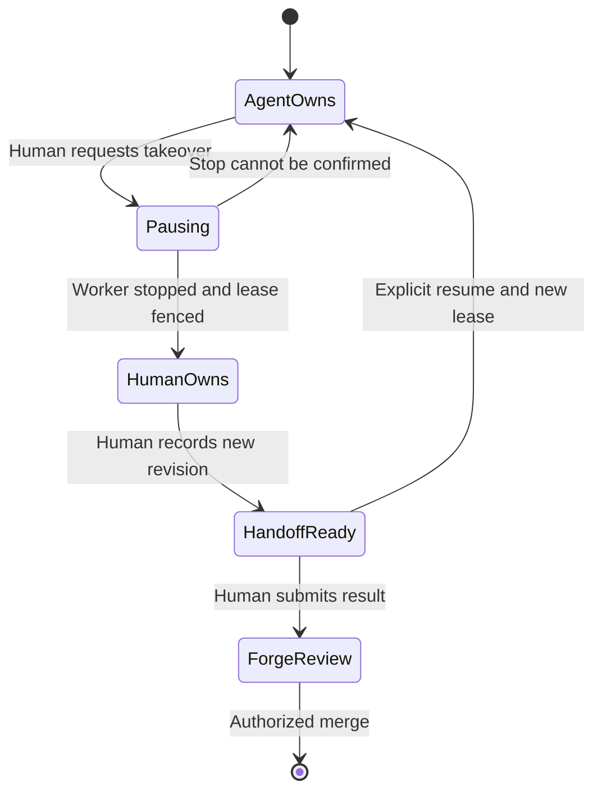

# Ploeg + De Vloer: product, delivery system and market plan

Design edition: 9 September 2026. Intended readers: developers, technical leads, platform operators, product owners, prospective design partners and the CTO.

Ploeg is the delivery engine. De Vloer is the human workbench in the browser and editor. Together, the proposed product turns an approved task into a bounded remote attempt, an independently verified candidate and a reviewable proposal inside the team’s existing delivery workflow.

This document separates the implemented prototype, audited defects, proposed architecture and commercial hypotheses. The accompanying 0.2.0 repository adds task connections for Forgejo, GitHub, GitLab, ClickUp and Vikunja, an updated VS Code client, reviewable candidate exports and a planning/export toolkit; it does not claim that all of the proposed platform is implemented. Release-specific evidence is recorded in [validation](validation.md).

The current operator-led workflow and its qualification limits are documented in [the 0.2.0 release](operations/iteration-0.2.0.md) and [connection setup](operations/task-connections.md). Earlier audit chapters remain the historical baseline; unattended intake, shared Ploeg claims and a trusted publication pipeline remain proposed.

## Reading guide

Start with chapter 1 for the product decision, chapter 2 to use Vloer to improve itself today, chapter 4 for ticket intake, chapter 6 for the editor experience, and chapters 7–8 for competitive and commercial decisions. Chapter 3 grounds the roadmap in actual code. Chapter 9 explains how to import and assign the 78 implementation tickets.

- [1. Product and system design](#1-product-and-system-design)
- [2. Self-improvement and dogfooding](#2-self-improvement-and-dogfooding)
- [3. Code audit and gap register](#3-code-audit-and-gap-register)
- [4. Tickets, work orders and delivery](#4-tickets-work-orders-and-delivery)
- [5. Platform and governance](#5-platform-and-governance)
- [6. IDE and operator experience](#6-ide-and-operator-experience)
- [7. Market landscape and alternatives](#7-market-landscape-and-alternatives)
- [8. Positioning and go-to-market](#8-positioning-and-go-to-market)
- [9. From design to tracker and agent work](#9-from-design-to-tracker-and-agent-work)
- [10. Implementation map](#10-implementation-map)

## 1. Product and system design

### Product decision

Build an open delivery control plane for teams that work across client repositories, trackers, model providers and execution environments. The product should make delegated engineering work attributable, bounded, inspectable and easy to take over. The unit of value is an accepted change with evidence and an accountable human owner. Agent count, token volume and an attractive chat window are insufficient measures of success.

Ploeg is the dispatch and delivery engine. De Vloer is the operator workbench, available in a browser and VS Code. Both operate on the same governed work identity. A tracker retains the business priority and acceptance criteria; the forge retains code, review and merge authority; the deployment platform retains release authority. No component quietly becomes a second project-management system.

This is an expansion design, not a claim that the original proof of concept already implements the product. The initial De Vloer baseline is commit `491c3a6`; the inspected Ploeg baseline is development commit `67c4bc968455a99ef767bc8a24791ea1a87319cb`. Implementation evidence, unresolved defects, proposed contracts and market hypotheses are distinguished throughout. Current market evidence was checked on 2026-09-09; a deployment must still qualify its actual installed versions.

The [first implementation increment](operations/implementation-progress.md) adds keyboard/scroll behavior and durable actionable failures to Vloer, including the editor panel. It also distributes Ploeg source corrections for scope, webhook authentication order and explicit review approval. Those Ploeg corrections still require Go/PostgreSQL and deployment qualification; their presence in a patch does not close the broader audit gaps.

#### The short answer to self-improvement

Run the previous stable Vloer release as a service and register the Vloer source repository as an allowed target. A crew edits a candidate branch in a separate remote workspace. The running service survives the candidate's mistakes. The result returns as changes, actual checks and review findings; a human reviews and merges, and the existing release pipeline deploys the next stable version. Improving Vloer does not grant an agent the right to deploy it, change its own budget or modify the rules governing its run.

That first loop can be supervised manually with the existing Vloer API. Automated ticket intake, canonical change export, trusted independent verification, team identity and a single claim shared with Ploeg require the backlog in this repository. Until those controls are implemented and qualified, the first tasks should be small UI, documentation or test improvements in a disposable branch, with human-run verification before merge.

#### The short answer to tickets

Extend Ploeg's existing tracker/provider layer. ClickUp already has an adapter, but current routing and update handling have concrete gaps. Forgejo's existing forge adapter handles code-review events; it is not an issue-to-work tracker adapter. Implement that distinction explicitly. Webhooks notify the system; authenticated authoritative reads establish the current task. A versioned work order freezes the material instructions, approved repository, policy and budget before dispatch. Vloer joins or takes over that same work order through a fenced claim, so a click in the editor cannot accidentally start a second worker for the same ticket.

### Intended customers and their jobs

The initial customer hypothesis is a software agency or internal platform team supporting several delivery teams and many client applications. These organizations commonly have existing trackers, CI, a forge, identity, secrets management and deployment infrastructure. They need consistency across projects without forcing every engineer into one coding vendor. This is a segment hypothesis to test with interviews and pilots; it is not a measured market-size assertion.

| Person | Job the product must improve | Evidence that matters |
| --- | --- | --- |
| Developer | Delegate a bounded change and return to an understandable result inside the editor | Correct diff, relevant checks, provenance, context, easy takeover |
| Reviewer or technical lead | Decide whether a change is acceptable without reconstructing an opaque conversation | Base/candidate identity, policy, independent checks, findings, unresolved risks |
| Product owner | See whether a ticket is progressing and what decision is needed | Tracker-linked outcome, blockers, acceptance criteria, realistic completion state |
| Platform engineer | Operate agent execution once for many projects | Reproducible images, quotas, cancellation, diagnosable failures, upgrade/restore procedure |
| CTO or engineering manager | Decide whether delegation improves delivery economics and autonomy | Human effort per accepted change, escaped defects, total cost, lead time, adoption |
| Client owner or budget owner | Keep work, secrets and charges inside the correct client boundary | Scoped identity, approved models/network, attribution, export and deletion evidence |

For an initial Code14-style deployment, use the existing internal identity, GitLab review/CI, Harbor images, Kubernetes capacity and GitOps workflow where they are available. Do not make ClickUp mandatory: an organization can retain its own tracker. Do not assume a public SaaS webhook can reach a LAN-only service. Deployment and connector profiles must express whether polling, a narrow ingress or a controlled webhook relay is available.

#### Where to say no

A single developer who only wants a faster inline assistant may be better served by an existing coding agent. An organization already satisfied with its forge's coding-agent workflow may not need another control plane. A team without a useful acceptance or review process should improve that process before adding unattended agents. A prospective customer that requires validated multi-tenant isolation, high availability or a compliance certificate cannot be told the current prototype already provides them.

### Product structure

| Component | Responsibility | Current or proposed |
| --- | --- | --- |
| Ploeg Engine | External work identity, dispatch, leases, shifts/runs, delivery evaluation | Existing engine; unified work-order and takeover contracts proposed |
| De Vloer Workbench | Interactive sessions, operator decisions, evidence browsing and handoffs | Existing browser application; editor extension added separately |
| Crew library | Versioned role procedures, skills, repository contracts and model profiles | Basic crew/config and portable skill exist; registry/pinning/evaluation proposed |
| Runtime adapters | Translate approved runs into harness sessions and normalized evidence | Vloer OpenCode and command bridge exist; Ploeg has its own published harness seam |
| Workspace service | Provision and reconcile isolated execution environments | Local and Kubernetes implementations exist; shared lifecycle hardening proposed |
| Credential and budget broker | Issue minimal credentials, authorize reservations, revoke and settle | LiteLLM integration exists; stronger cross-client budget and identity controls proposed |
| Connector packages | Normalize tracker and forge events and manage limited writeback | Ploeg providers partly exist; issue intake and durable reconciliation gaps remain |
| Verification and evidence service | Independently verify immutable candidates and attest outcomes | Proposed; writer tool output alone is not this service |

Keep Ploeg's Go domain and De Vloer's TypeScript operator code separate. Reuse contracts and protocol fixtures, not each other's internal database tables. A service boundary should have an explicit owner, state machine and migration plan. Do not add a microservice for every row in this table during the pilot: several responsibilities can be modules in the current deployables.

#### Architecture



The arrows describe ownership and data flow, not an invitation for an agent to hold every credential in the graph. The model gateway, forge API, tracker API and Kubernetes API have different audiences and scopes. A worker that can request model inference should not thereby be able to assign a ticket, approve a deployment or administer a client namespace.

### Domain language and invariants

Use these names consistently across APIs, UI, tickets and documentation. Existing Ploeg types can remain as implementation details while mappings are introduced; replacing all established terminology at once would add migration risk without delivering user value.

| Term | Meaning | Owner |
| --- | --- | --- |
| Source connection | One authenticated external tracker or forge installation | Ploeg connector administration |
| Source item | A native ticket identified within its connection and scope | External tracker |
| Work order | Immutable approved task revision and execution mandate | Ploeg |
| Delivery attempt | One fenced execution attempt for a work order | Ploeg |
| Shift / Run | Existing Ploeg crew lifecycle and role execution objects | Ploeg |
| Session | Human-facing interaction and evidence context linked to an attempt | Vloer |
| Mandate | Capabilities, client/repository scope, budget and approval needed for execution | Policy/authorization owner |
| Crew version | Immutable role graph, skill digests and model requirements | Crew registry |
| Workspace | Disposable execution environment plus retained change/state references | Workspace service |
| Candidate | A base SHA, candidate SHA and complete retrievable change set | Forge/artifact service |
| Check run | Actual independent execution against the candidate and policy version | Verification service |
| Decision | A human approval/rejection bound to a specific subject and revision | Vloer authorization |
| Evidence bundle | Candidate, checks, findings, decisions, cost and provenance | Evidence service |
| Release | Deployment performed by the existing delivery system | CI/GitOps/release owner |

The primary invariants are:

1. One external item revision has at most one current execution owner. An abandoned owner cannot resume writing after its lease generation has been superseded.
2. Material ticket changes invalidate an old execution mandate. Cosmetic changes are recorded without unnecessarily restarting work.
3. A work order never resolves its repository from model-generated text. An unresolved or ambiguous mapping is a visible blocker.
4. A completed model turn is not proof of a completed work order. Check success, review, merge and release remain distinct outcomes.
5. A human approval applies to a particular candidate, policy and budget. It does not approve every future edit to that ticket or branch.
6. Credentials are issued for the actual client, repository, role and attempt. A prompt cannot increase their scope.
7. Unknown money, execution status or synchronization state remains explicitly unknown. It is never silently converted to zero, success or permission to retry.
8. Every external side effect is attributable and idempotent or reconciled. A webhook, repeated button click or reconnect cannot intentionally produce duplicate work.
9. A worker can propose a change to the platform's policies; it cannot apply that proposal to its own active mandate.
10. A human can stop the system and restore its last stable release without asking that system for permission.

These invariants are acceptance properties. They need adversarial tests and actual target-environment qualification. They are not satisfied merely by writing them into AGENTS.md or a model prompt.

### The complete delivery loop

#### 1. Register a project once

An administrator creates a source connection, client/team project, allowed repository and verification profile. Registration resolves native identifiers, confirms the base branch, checks credential scope, records reachable network destinations and runs a small connector/workspace probe. A project is not ready merely because its configuration is syntactically valid.

A project has an owner, accepted task types, model capability requirements, retention rules and a definition of done. The connection's secret is stored independently of repository files. Verification commands and allowed images are pinned in an administrator-controlled policy version. Changes to privileged policy are reviewed through the platform repository and do not silently affect already approved work.

#### 2. Make the task ready

A ticket contains a concrete objective, acceptance criteria, repository mapping and a human owner. The product owner sets business priority in the tracker. A label, assignee or custom field can request agent work, but only a configured interpretation creates eligibility. Text that merely mentions an agent does not authorize execution.

For nontrivial changes, follow the repository's existing OpenSpec/ADR discipline: proposal, required behavior, design, architectural decision and tasks. The planner may identify missing information or suggest task decomposition. It may not invent product priorities, silently manufacture approvals or assign executable work to itself.

#### 3. Normalize and approve

The intake layer verifies delivery authenticity, durably records the notification and reads the authoritative task. It computes separate content and material hashes. The proposed work order includes source identity, instruction snapshot, acceptance criteria, allowed repository/base SHA, crew version, policy version, resource/budget limits and external write permissions.

Small pre-approved task classes can use a standing mandate. Higher-risk work requires an explicit human decision. Standing mandates still have owners, expiry, limits and exclusions; they are not a permanent unrestricted agent account. Changes to authentication, budget accounting, Kubernetes RBAC, release credentials or agent policy always require a separate review path in the initial product.

#### 4. Claim and execute

Ploeg creates a delivery attempt and issues a monotonic ownership generation. The dispatcher chooses an allowed runtime/workspace profile and reserves money and capacity atomically with the attempt's state transition. Execution obtains only the credentials needed for the approved role. A queue with available work is not permission to exceed a client's budget or concurrency limit.

Within an attempt, begin with one writer and explicit reviewers. Parallel read-only research can be introduced after independent workspace and result-merging semantics are defined. Parallel writers require separate branches/workspaces and an integration task; they should not share one writable checkout. The first commercial pilot should prefer predictable task boundaries over dynamic, unbounded agent conversations.

#### 5. Intervene without duplication

Vloer displays the current attempt, its last durable update and the actions the current human is allowed to take. Pause means an interruption has been requested; stop-confirmed is a separate fact. A takeover waits for worker termination and any in-flight publication barrier to resolve, then invalidates the previous writer's generation before admitting the new owner. Runtime-native session state can be retained, but the work-order ownership contract is authoritative.

Only a trusted publisher holds Git write capability in the governed lane. Publication reserves a durable barrier under the same serialized ownership authority before calling the forge. Ownership cannot transfer while that call is in flight or has an unknown result; the publisher/reconciler checks the remote ref and proposal before closing the barrier. Merely checking a database generation immediately before an HTTP request leaves a race with takeover. A timeout or negative remote read cannot prove a delayed write will never complete. Confirm that the old actor and remote operation ended or are fenced; if that cannot be established, handover remains blocked. Compatibility modes with direct worker write tokens cannot claim this stronger guarantee.

An instruction shows whether it is saved, delivered to the harness, accepted for the next turn or superseded. Permission requests are structured and expire with their subject. A comment in the conversation is not equivalent to an approval. Reconnecting an editor replays evidence and refreshes the current state; it does not resubmit the previous instruction or execution request.

#### 6. Produce an immutable candidate

A writer submits a candidate from the approved base SHA. Preserve added, modified, deleted, renamed and binary files, relevant submodule changes, and the exact candidate commit. A plain chat summary or a JSON description of file differences is not a complete deliverable. The result must be retrievable after the worker Pod is deleted.

Separate the untrusted candidate from the platform's trusted verifier policy. The agent can propose test changes, but cannot replace the policy defining which checks are required. Save both baseline and candidate check evidence, with exit codes, image/command identity and artifact hashes. Identify tests that were added, removed or weakened.

#### 7. Verify and review

A fresh verifier checks out the immutable candidate and executes the pinned check profile. It receives no write token, no model master key and no production deployment credentials. A successful command is still insufficient if no tests were discovered; check adapters should report discovery counts and expected suites. Network failures and missing tools are blocked checks, not passes.

Reviewers inspect the actual candidate and independent evidence. A model reviewer is a useful additional critic, but does not replace human approval for privileged work or the forge's required review rules. Findings should cite files and candidate lines where possible and distinguish verified defects from questions. A failed or inconclusive review should stop or return a bounded rework request rather than trigger an unlimited retry loop.

#### 8. Deliver into the existing forge workflow

The forge adapter creates or updates a draft PR/MR for the attempt. A deterministic marker links it to the work-order revision and prevents duplicate requests after ambiguous failures. Required CI and branch protection remain authoritative. A reviewer never approves a stale candidate when the branch has moved.

The tracker receives one concise status summary with the review URL, current blocker and next human action. Avoid streaming every token into comments. A PR opened is not a ticket done; map tracker completion to the organization's definition of done, which may include merge, deployment and observation. Ploeg's existing delivery discipline already recognizes this distinction.

#### 9. Settle and learn

Reconcile key usage and release capacity separately from the work's delivery result. A failed task can still incur cost. A reviewed task can still have unsettled charges. Meter model usage, runtime minutes and relevant external services as distinct quantities, and include human review effort when evaluating productivity.

Learning is an evaluated configuration change: update a skill, model profile, tool image or crew definition through version control, replay a representative benchmark, and compare acceptance quality and cost. Do not automatically promote every successful run's instructions into global memory. A client's code or findings must never become another client's implicit context.

### Shared execution and takeover state



This is the proposed work-order/attempt product view, not a direct replacement for the existing Vloer `SessionStatus` enum. Implementation should introduce explicit mappings and a versioned read model. Avoid forcing business delivery, worker liveness, approval and money into one status string: each evolves independently.

| Dimension | Example values | Why separate it |
| --- | --- | --- |
| Business work | ready, blocked, delivered, released, abandoned | The tracker may retain authority after execution stops |
| Attempt | queued, executing, stopping, stopped, unknown | A cancellation request does not prove process death |
| Human decision | none, required, approved, rejected, expired | A branch or policy change can invalidate approval |
| Verification | not_started, running, passed, failed, blocked | A reviewer saying approve is not an executed check |
| Accounting | reserved, accruing, reconciling, settled, unresolved | A terminal task can still have unpaid or delayed usage |
| Synchronization | current, delayed, conflict, unavailable | A stale tracker view should not appear live |

### Interoperability without pretending everything is portable

Use the Vloer HTTP API for the operator control plane and durable evidence. Use runtime adapters for harness-native sessions. Where an agent supports ACP, negotiate its actual capabilities and preserve the distinction between editor interaction and server-owned execution. The VS Code extension does not need to launch a local agent process to supervise a remote Ploeg/Vloer attempt.

MCP is a tool/data interface, not the queue, lease store or budget authority. A future Ploeg/Vloer MCP server can expose narrowly scoped read tools and explicit mutation tools for an already authenticated operator or approved role. It must enforce the same work-order policy as the HTTP API. Never hand a coding agent a generic administrative connector simply because it speaks MCP.

A2A may eventually help exchange bounded tasks with an independently operated specialist service. It should remain behind an adapter with an explicit identity, data policy, deadline, budget and evidence contract. It is not necessary to implement the first ticket-to-reviewed-change loop. Interoperability is valuable when a tested workflow uses it, not when a product page lists more acronyms.

Native conversation state is not portable across models and harnesses. Portable assets are the task contract, repository state, tool/evidence records, approved capabilities, skills and human decisions. Switching the harness during an attempt should produce an explicit continuation event and, where required, a new mandate; it should not imply that opaque model context migrated perfectly.

### Roadmap with release gates

| Milestone | Outcome | Exit evidence | Exclusions |
| --- | --- | --- | --- |
| M0: supervised dogfooding | A developer improves Vloer using a stable remote Vloer instance | One small candidate, human-run checks, explicit review, manual merge and rollback demonstration | No unattended queue, team isolation or automatic release claim |
| M1: trustworthy delivery | Every accepted candidate has complete changes and independently executed required checks | Adversarial verifier tests, immutable artifacts, policy binding, no false pass on absent checks | General parallel writer orchestration |
| M2: one tracker loop | A ClickUp or Forgejo task reaches one claimed attempt and one PR/MR | Replay/update/cancel tests, exact mapping, polling repair, no duplicate effect | Broad connector marketplace |
| M3: team workbench | Browser and VS Code share scoped identity, decisions and controlled takeover | Cross-client deny tests, expired identity behavior, stop-confirmed and fencing evidence | Public multi-tenant SaaS |
| M4: repeatable customer pilot | A second team or client project onboards without bespoke engine changes | Setup time, reviewed outcomes, attributable cost, operational drills and documented support load | Universal enterprise readiness claims |
| M5: paid offering decision | Real buyers choose this workflow over credible alternatives | Structured interviews, paid-pilot evidence and a maintained comparison benchmark | Unmeasured productivity percentages and speculative TAM |

Milestones are capability gates, not calendar promises. The backlog carries relative effort and dependencies; it does not assert that agent generation time equals engineering delivery time. Prefer a thin vertical slice with one tracker, one forge, one harness and one cluster before completing every component in the target architecture.

### Definition of product readiness

A release is ready for the next audience when its claims match its evidence. The demo may be ready for a coworker while the managed execution path still needs qualification. An editor package may be installable while its Web Extension host is unsupported. A connector may read tickets while automatic writeback remains disabled. Publish these distinctions as a compatibility matrix, not as caveats buried in a sales call.

The minimum pilot evidence bundle records the component versions and image digests, identity and tenant boundary, fixture/repository revision, exact scenario, resulting candidate/check IDs, human decision, cost state and cleanup outcome. Include at least these failure cases: duplicated webhook, edited ticket, unavailable model, lost editor connection, expired login, worker death, control-plane restart, uncertain cancellation, delayed spend, stale approval and unreachable tracker writeback.

For marketing, the first strongest demonstration is deliberately ordinary: a real ticket, a reproducible defect, a small patch, independent checks, a developer intervention inside VS Code, a draft review request and an attributable cost record. A failed run with a clear, recoverable blocker can demonstrate maturity better than a curated conversation that hides the hard parts.

### Design source notes

Repository facts above come from the pinned local source snapshots and are examined in the gap register and connector design. Protocol distinctions use the official [Agent Client Protocol introduction](https://agentclientprotocol.com/get-started/introduction), [Model Context Protocol architecture](https://modelcontextprotocol.io/docs/learn/architecture) and [A2A specification](https://a2a-protocol.org/latest/specification/). Product positioning is a recommendation; validation metrics and release gates are proposed acceptance criteria. The market chapter documents competing capabilities and situations in which adopting an existing solution is the better decision.

## 2. Self-improvement and dogfooding

Status: proposed operating and delivery design. Baseline: De Vloer v0.1, audited 2026-09-09. This is a practical route from today's working operator session to a governed ticket-to-proposal loop. It does not claim that tracker intake, automatic publishing or deployment promotion already exist in Vloer.

The first useful step is straightforward: register the Vloer repository as an allowed target, run the existing stable workbench somewhere remote, and ask a small crew to implement a bounded ticket in an isolated checkout. Humans can already steer that work through the browser. The missing pieces are trustworthy automated verification, complete change publication, shared task authority and operational recovery. Those are the first features the system should help build.

Self-improvement should mean **the current trusted release helps propose the next release**. An agent must not become the authority that determines whether its own patch is safe, grants itself broader tools, replenishes its budget, or deploys itself.

### Three progressively useful operating lanes

| Lane | What happens | Human responsibility | Exit condition |
| --- | --- | --- | --- |
| A: assisted dogfood, usable with the current core | Operator creates a Vloer session against its registered repository; OpenCode runs remotely through LiteLLM; operator answers permissions and inspects retained work | Select task, run independent checks/CI, recover/export changed files if needed, create proposal, review and merge | Five normal bounded tickets delivered with preserved evidence and no lost work; this is a proposed pilot gate, not an existing result |
| B: governed delivery | Canonical task admission, frozen candidate, trusted verification, draft proposal and cost reconciliation | Approve scope/risk, review proposal and merge; intervene on blockers | All task, code, checks, decisions and cost are correlated; crash/duplicate tests pass |
| C: unattended dispatch with interactive takeover | Tracker eligibility admits work to Ploeg; crews run under leases; Vloer/web/IDE can observe, answer or take over through the same authority | Set explicit policy and spending envelopes; manage exceptions and merge eligible changes | Measured pilot demonstrates useful outcomes without hidden retries, conflicting writers or unreviewed promotion |

Lane A does not wait for the complete platform. It deliberately retains the manual steps where the baseline has no reliable automation. Lane C must not be achieved by giving every agent a tracker token and asking it to poll.

### First real run: concrete setup

#### 1. Establish a durable source and stable controller

Push the delivered Git repository to an authorized forge remote. Use `development` as the target branch; do not silently adopt `main` from a generic example. A local ZIP on a developer's laptop is not a repository a remote Kubernetes worker can clone.

Build the control and agent images from a reviewed commit. Pin the deployed controller to its image digest. Deploy one application replica with durable state, HTTPS and one initial operator account; confirm the backup includes SQLite, its encryption sidecar and retained workspace data. Keep the known-good image and a recovery procedure outside the candidate repository/workspace.

For a shared team pilot use the Kubernetes backend and its separate workspace namespace. The `local` backend runs under the server's OS user: an approved shell command or test script can read server files and sibling workspaces. It is suitable for a dedicated trusted single-user host, and should not be presented as tenant isolation.

#### 2. Register Vloer explicitly

Adapt the existing live configuration, rather than placing secrets in this document. The relevant repository record is:

```json
{
  "id": "vloer",
  "name": "De Vloer",
  "description": "The workbench's own source; target development and preserve the intentional demo fixture.",
  "url": "https://forgejo.example/organization/de-vloer.git",
  "baseBranch": "development",
  "verify": ["npm", "test"],
  "trackerUrl": "https://forgejo.example/organization/de-vloer/issues"
}
```

Replace the example host/organization with the authorized real repository. This is one entry in `repositories`, not a complete configuration file. Configure `runtime.kind=opencode`, `runtime.backend=kubernetes`, the actual namespace, storage, image, gateway and egress. Use the complete setup in [live operation](operations/live.md).

**Do not use `node --test` as the Vloer repository's blanket gate.** The original order-service fixture intentionally fails. The product command `npm test` limits discovery to `test/*.test.ts` and `test/*.test.mjs`; recursive discovery can tempt an agent to “repair” the demo's deliberately broken starting point. Such a change would weaken the demonstration while making the wrong command green.

The single `verify` argv field is a baseline limitation. For now it is a useful agent instruction and artifact-recognition hint; it is not an independently enforced acceptance plan. The protected verifier design below replaces it with named mandatory gates.

#### 3. Prepare the actual toolchain and network

The shipped agent image contains Node24, Git and pinned OpenCode. Vloer development checks additionally need its npm development dependencies; browser checks need Chromium and any required system libraries; chart checks need Helm. A successfully cloned repository does not imply that these are available.

Choose one explicit preparation strategy:

- For the first pilot, build a reviewed Vloer development image with the locked dependencies and toolchain available, using an approved package mirror during image build. Package installation executes code: keep it outside control-plane credentials.
- Alternatively, permit a tightly scoped dependency preparation step against approved registries/cache endpoints. Record the lockfile digest and dependency inventory. Keep unrestricted dependency downloads out of the default execution lane.

The remote workspace must reach its forge and inference gateway. It must not reach the control-plane state volume, Kubernetes API through a mounted service account, LiteLLM management endpoint or an unrelated client's repository. Qualify these controls on the real cluster; a NetworkPolicy object existing in YAML is not proof of enforcement.

For a private repository, provision a dedicated clone credential in the workspace namespace. The current Kubernetes design exposes it to the clone init container, not the agent process. Do not give the initial dogfood agent an administrator forge token simply to make publishing convenient.

#### 4. Qualify one paid session before assigning product work

Configure an actual LiteLLM model alias that supports the required tools and a small explicitly authorized session budget. A suggested first qualification authorization is at most USD10; this is a chosen spending ceiling, not a cost prediction. Keep concurrency at one until stop, resume and accounting have been exercised.

Verify the chain: browser login → configured target → authenticated OpenCode → session-scoped inference key → actual model response → permission request → response → retained events → key blocking → visible cost settlement. Exercise a disconnect, deliberate pause and explicit resume. Wait for settlement instead of creating a replacement session when prior spend is unknown.

Record the exact control/agent image digests, target repository SHA, OpenCode version, gateway/model alias and routing configuration revision, Kubernetes/CNI/storage versions and evidence locations. Do not include raw tokens in the qualification record.

#### 5. Assign a narrow, reviewable first task

Start with documentation, a focused test or a small UX correction. A good first task is “document and validate the Vloer-specific repository onboarding profile, including the intentional fixture and exact checks.” It exercises real source changes, tests and review without authorizing the candidate to change its own control-plane permissions.

Use this objective template in the workbench:

```text
Work item: <canonical tracker URL or approved temporary ticket ID>
Repository: the registered vloer target, branch development.
Task: <one bounded outcome>

Acceptance criteria:
1. <observable result>
2. <regression condition that must remain true>
3. <evidence a reviewer can reproduce>

Scope: <specific files/components and permitted supporting tests>.
The order-service starting fixture is intentionally broken. Preserve it.
Do not change deployment permissions, credentials, budgets, protected check
definitions, branch protections or CI trust settings. Do not merge or deploy.

Read AGENTS.md and the relevant architecture/contract before editing.
Run the configured product checks when the required tools are available.
Report each exact command, exit status, skipped gate and actual failure.
Missing dependencies or blocked egress are blockers, not permission to invent
successful results. Stop for operator input when acceptance is ambiguous.

Return a concise change summary, modified files, actual verification evidence
and remaining risks. A human will independently verify and publish the result.
```

The current optional tracker URL on a Vloer session is a configured repository-level link, not a structured issue identity. Put the exact issue link in the objective for this initial manual lane. The canonical work-order integration supersedes that temporary convention.

#### 6. Preserve and independently review the result

The baseline live adapter retains native OpenCode diff JSON and reported tool output. It does not produce a complete Git bundle or open a PR. On terminal Kubernetes completion it removes the Pod and retains the PVC. Plan the recovery/export step before running an important task.

For Lane A, a trusted operator can inspect the retained workspace volume using a separate recovery workload that has no model or publish credentials, copy the selected changed files into a clean checkout, and review the resulting diff. Preserve new files, deletions, renames, modes and any binary changes. Do not assume `git diff` or `git bundle --all` alone includes untracked/uncommitted work. Do not indiscriminately archive environment files or credentials. Keep the original retained volume until the resulting proposal has been independently reproduced.

This manual transfer is intentionally a pilot limitation. [GAP-02 and GAP-03](design/gap-register.md) make complete candidate capture and controlled publication early implementation priorities. A CTO demonstration should disclose whether publication was manual.

Run the approved checks independently in a clean checkout or trusted CI, inspect the exact proposal head and have a person merge. The writer's passing log and the agent review are useful evidence; neither replaces that decision.

### Target self-improvement architecture



Ploeg owns the canonical WorkOrder, DeliveryAttempt, lease and budget authority. Vloer owns the human session and interaction projections. A person can begin in the browser, continue in VS Code, close the laptop and return; those surfaces never start competing background attempts. Tracker content remains authoritative for the brief and priority, with an immutable accepted revision attached to each attempt.

#### Identities and trust boundaries

| Actor | Reads | May change | Explicitly excluded |
| --- | --- | --- | --- |
| Operator client | Authorized tasks, sessions, evidence, pending decisions | Scoped commands and decisions allowed by project role | Management keys, worker service accounts, implicit local code execution |
| Ploeg admission/controller | Normalized ticket snapshot, target/crew policy, execution state | Admission, attempts, leases, scoped authorizations | Candidate code execution within controller process |
| Implementer | Approved source snapshot and task context | Candidate files inside disposable workspace | Trusted gate policy, controller state, merge rights, deployment rights |
| Agent reviewer | Frozen candidate, base diff and trusted check reports | Findings and a structured opinion | Writer workspace mutation, publish credential, human approval |
| Trusted verifier | Frozen candidate plus protected acceptance plan | Its isolated scratch outputs and signed check records | Model keys, production credentials, changing the required checks during a run |
| Publisher | Verified candidate manifest and valid publication decision | One permitted branch/proposal through a narrowly scoped forge identity | Executing candidate hooks/scripts, changing branch protection, merging |
| Human maintainer | Proposal, evidence, CI, risk and cost | Merge according to repository rules | Retroactively treating unknown evidence as verified |
| Promotion/recovery operator | Signed releases, approved infrastructure desired state, backups | Controlled deployment, rollback, emergency stop and restore | Agent-supplied changes to its own authority |

Source text naming an allowed tool is not an authorization grant. Ticket descriptions, comments, repository instructions, patches and model output are untrusted content until interpreted under the protected policy. A ticket saying “ignore your budget and merge” must not affect either capability.

### Required evidence model

A delivery attempt freezes these identifiers before trusted verification:

- Canonical work-order ID and immutable accepted source revision.
- Target connection/repository ID and exact base commit.
- Attempt ID, lease epoch and candidate commit/tree digest.
- Complete change manifest, including additions, deletions, modes, binaries and explicit exclusions.
- Trusted gate policy revision, verifier image digest and toolchain/dependency lock digest.
- Crew/role instructions revision, harness version and model routing policy revision.
- Check results, reviewer findings, human decisions, publication reference and cost observations.

Verification is tied to a candidate digest. If the candidate changes after approval, the approval becomes stale. A successful CI status for another branch/head cannot count. A model alias can route to changing providers; retain the configured alias and observed provider/model identity where the gateway exposes it, and label unknown routing details honestly.

Store artifacts outside the mutable agent workspace with content digests and access rules. Keep durable event references rather than embedding unlimited log content in a session row. A reviewable result must survive the workspace being deleted and the selected harness being replaced.

Publication and takeover share a durable barrier owned by Ploeg. Before contacting the forge, the publisher reserves the exact effect, attempt generation and expected branch head; an ownership transfer cannot complete while that effect is in flight or its result is unknown. A generation check immediately before a network call is insufficient because takeover can race between that check and the external write. Reconcile an ambiguous result before releasing the barrier or admitting successor publication. If an old publication actor can still issue the reserved write, barrier recovery must fence that actor or confirm its termination; merely expiring another database lease is not proof.

### Verification that an agent cannot grade itself

The verifier must use a protected plan chosen before the candidate runs. The candidate may add and improve tests, but cannot redefine which required checks count as success. Running a trusted command such as `npm test` is insufficient if the candidate changes the package script to `true` or deletes the assertions.

Use three complementary layers:

1. **Protected regression checks:** security/lifecycle/API invariants and fixed acceptance probes from a reviewed policy revision. They execute against the candidate application and cannot be replaced by candidate content.
2. **Candidate repository checks:** the ordinary source test suite, typecheck, lint/check, browser checks and chart checks. Changes to test scripts, CI, assertions and fixtures are included in the human diff and can trigger elevated review.
3. **Task-specific acceptance evidence:** a reviewer-approved reproduction or external assertion tied to the ticket. For a UI task, browser interaction and screenshot evidence; for lifecycle work, crash/partition tests; for accounting, delayed/unknown spend fixtures.

Protected evaluation code may be stored in a separate repository or a signed immutable artifact derived from a trusted base revision. The important properties are separate authority and explicit revision binding. Keeping every useful test secret is unnecessary; an external evaluator must simply remain outside the current writer's ability to change the result definition.

For Vloer, the initial named gates are:

| Gate | Baseline command or mechanism | Interpretation |
| --- | --- | --- |
| Dependency preparation | `npm ci` in an isolated prepared environment | Install success is prerequisite, not product correctness |
| Types | `npm run typecheck` | Required for TypeScript source changes |
| Product tests | `npm test` | Deliberately excludes running the intentionally broken fixture as a standalone product gate |
| Repository checks | `npm run check` | Syntax/import/config/secret-hygiene check; not a security certification |
| Browser | `npm run test:browser` with pinned Chromium/tooling | Required for operator flow changes; artifacts bound to candidate |
| Deployment | Helm lint and relevant demo/live render validations | Required for chart changes; rendering is not a live-cluster test |
| Protected invariants | External fixture suite against candidate | Ownership, CSRF, no lost/replayed paid commands, safe cancellation, no false check approval and no secret exposure |
| Live integration qualification | Controlled opt-in staging exercise | Required for integration behavior changed beyond contract fixtures; actual gateway/cluster versions recorded |

No required gate is silently skipped because an agent image lacks a tool. Mark it pending and hand it to CI. A task can produce a useful draft while checks are pending; it cannot be labeled verified or ready to merge.

### Risk-based autonomy

The policy classifies both the initial task and the actual diff. File paths are a useful signal, but not the sole classifier: a seemingly ordinary dependency change can alter credential handling or execute an installation hook.

| Tier | Examples | Agent lane | Human gate |
| --- | --- | --- | --- |
| R0 | Documentation, copy, diagrams, task templates | Automatic proposal creation after required checks within a small preauthorized budget | Normal review/merge |
| R1 | Bounded application behavior, tests and ordinary extension UI | Governed implement/verify/review sequence; bounded rework | Code-owner review of exact candidate |
| R2 | Auth, permissions, budget ledger, broker, executor, intake signatures, trusted check definitions, dependency execution or schema migrations | Explicit task admission; isolated staging; adversarial/rollback evidence | Design/code-owner approval before execution and separate merge review |
| R3 | Production deployment, cluster policy, secrets, identity provider configuration, forge/admin rights or deletion of retained evidence | Agent may investigate and propose source changes; privileged effects remain outside worker lane | Authorized infrastructure operator controls plan/promotion; no agent self-approval |

Protected areas in this repository include `src/auth.ts`, authorization in `src/http.ts`, budget/lifecycle logic in `src/engine.ts`, `src/broker.ts`, workspace provisioning, CI workflows, check definitions and deployment policy. They are legitimate improvement targets, but the stable release continues enforcing its old authorization until reviewed promotion. Editing the candidate copy never edits the current execution policy.

### Bootstrap implementation order

The following are deliberately small enough to become independent tickets. The main backlog owns final identifiers, dependencies, estimates and acceptance criteria.

| Order | Change | Why it comes here | Can current Vloer assist? |
| --- | --- | --- | --- |
| 1 | Vloer target onboarding and reproducible toolchain profile | Prevents incorrect test discovery and missing-tools loops | Yes, in Lane A with manual CI |
| 2 | Canonical candidate capture and complete artifact export | Prevents useful work being trapped in an ephemeral workspace | Yes; human reviews Git edge cases |
| 3 | Separate protected verification executor | Gives completion an externally supported meaning | Yes; R2 design/acceptance requires maintainer ownership |
| 4 | Controlled publisher and exact-head approval | Turns verified work into the normal forge review flow | Yes; no agent receives publisher admin rights |
| 5 | Fix Ploeg scope, environment, verdict and crash-accounting gaps | Makes existing unattended foundation suitable for its expanded role | Yes; use fixture-based regression tickets and protected review |
| 6 | Canonical work orders, idempotent inbox/outbox and fenced attempts | Connects tracker/browser/IDE to one authority | Yes; staged behind existing behavior with migration tests |
| 7 | Forgejo issue/ClickUp admission and human takeover | Unlocks real ticket pickup with revision-aware control | Yes; test adapters against fixtures before real writebacks |
| 8 | Team identity, native IDE evidence and measured pilots | Makes the workflow usable across coworkers and repeatable beyond the author | Yes; avoid taking administrative shortcuts for the demo |

Each successfully merged ticket can improve the lane used for the next ticket. Keep the full platform roadmap out of a single giant agent objective. An agent may propose a task split; creating new paid work still passes normal admission and total-budget rules.

### Failure handling and recovery drills

| Situation | Required behavior | Recovery evidence |
| --- | --- | --- |
| Laptop closes or IDE disconnects | Authorized remote run continues; next client replays durable events | No duplicate attempt; same session, candidate and event cursor |
| Controller restarts | Current paid work is interrupted/reconciled; no hidden automatic replay | Visible recovery state, confirmed stop/fencing, key discovery and retained budget holds |
| Controller is unavailable for a prolonged period | Independent lease/credential enforcement prevents indefinite authority | Simulated network partition; old worker cannot publish after lease epoch changes |
| Worker dies after spending but before reporting | External reconciler blocks key and retains unknown-spend reservation | Cost eventually reconciles or explicit audited accountant resolution; no free replacement budget |
| Source ticket changes materially | Current accepted revision remains immutable; future work pauses or re-plans under policy | UI shows old/new acceptance, actor and explicit decision |
| Candidate weakens tests/check scripts | Protected evaluator remains unchanged; risk elevates | Expected adversarial fixture fails despite green candidate-local command |
| Candidate changes after review | Previous checks/approval become stale | Publisher rejects mismatched digest/head |
| Forge push succeeds but response is lost | Publication barrier remains unresolved; reconcile exact branch/proposal state before retry or takeover | One proposal, one publication record, no duplicated comments; no successor writer admitted while the old effect is ambiguous |
| Candidate release breaks its own UI | Stable release/recovery tooling remains available | Rollback from independently retained image and restore-tested state |
| SQLite key sidecar or workspace is lost | Fail visibly; do not fabricate decrypted state or evidence | Documented restoration test and explicit unrecoverable records |

The current baseline covers several local pause/restart cases, but it has no complete distributed lease/recovery controller. [GAP-12 and GAP-18 through GAP-23](design/gap-register.md) are the implementation/qualification work, not merely documentation chores.

### Release and promotion discipline

The workbench must never deploy by replacing its own running source directory. After human merge, trusted CI builds the next immutable image and produces release metadata. A separate promotion identity changes the approved GitOps deployment reference. The user's existing infrastructure repository can own that desired state; agent workspaces receive no write credential for it by default.

Before promoting a self-improvement release:

1. Complete all required candidate checks and human review against the exact proposal head.
2. Build a reproducible release from the merged revision and record image/dependency provenance.
3. Exercise migrations against a restored non-production snapshot; define forward recovery and rollback compatibility explicitly.
4. Drain or deliberately interrupt live work, preserve candidate artifacts and confirm unresolved accounting holds.
5. Promote through an authorized deployment process and qualify one controlled session.
6. Retain the previous image, compatible recovery tools and a tested state restoration route.

Database schema changes may make application rollback unsafe. Record that constraint in the release; do not promise that swapping the image always restores service. The user interface cannot be the only place from which the service can be stopped or repaired.

### What to show a CTO or prospective pilot customer

Demonstrate one traceable loop with an ordinary real ticket:

1. A person marks a well-scoped ticket eligible in the existing tracker.
2. Vloer displays the accepted brief, repository, crew, policy and authorized budget before execution.
3. The remote crew runs while the operator changes workstation or closes the IDE.
4. A meaningful permission or ambiguity becomes a clear human decision, with the same decision visible in browser and VS Code.
5. The system produces a complete candidate, independent checks, reviewer findings and a draft proposal.
6. A person merges; the tracker receives a reconciled delivery update and the platform shows actual cost and human intervention time.

Until the corresponding integrations are implemented, mark the manual steps in that story. The deterministic no-model demonstration remains useful for a fast first look; it is not the evidence for economic claims.

Measure the bottleneck you intended to move: minutes of human setup/supervision/review per accepted result, queue-to-review time, accepted-change rate, rework and total model/infrastructure cost. Compare against the team's existing process on similarly scoped work and include abandoned attempts. The success claim is a more reusable, governable development workflow; a higher agent count alone is not a result.

### Related design

- [Gap register](design/gap-register.md): implementation evidence, severity and acceptance gates.
- [Ticket integration](design/ticket-integration.md): tracker authority, canonical work orders, intake and writeback contracts.
- [Current architecture](architecture.md): what v0.1 owns today.
- [Live operation](operations/live.md): actual setup and limitations.
- [Validation record](validation.md): what has been exercised and what remains unqualified.

## 3. Code audit and gap register

Status: proposed remediation plan, with implementation evidence from the delivered v0.1 baseline. Review date: 2026-09-09.

Implementation update: [the first increment](operations/implementation-progress.md) adds Vloer operator fixes and a source-reviewed Ploeg patch affecting parts of GAP-11, GAP-13 and GAP-17. The rows below preserve the original audit evidence. None of those broader gaps is declared closed: Ploeg execution qualification, strict routing, durable inbox/audit and governed follow-up work remain outstanding.

This register audits De Vloer `491c3a62e09dff8ec801495a309f6090120a07da` and Ploeg `67c4bc968455a99ef767bc8a24791ea1a87319cb`. Paths prefixed `Ploeg:` refer to the sibling repository at that revision. These are inspected source snapshots, not a claim about a subsequently deployed service. A new extension or design document in this change does not silently close the underlying control-plane gaps.

The product has a credible working core. Its next bottleneck is trustworthy delivery: connecting a task to the correct repository, proving which code was checked, recovering interrupted work without duplicate authority, and getting the result into an ordinary human review flow. More agents, more chat surfaces and more dashboards do not remove those gaps.

### Qualification language

| Classification | Meaning |
| --- | --- |
| Implemented and locally exercised | Source plus local executable verification; external systems may still be mocked |
| Implemented, external qualification pending | Real integration source exists, but target infrastructure has not passed its acceptance exercise |
| Adapter-dependent | Capability is possible through a seam but its semantic guarantee is not enforced by the platform |
| Absent at baseline | No implementation at the audited revision |
| Proposed | A future requirement or design decision; not a delivered feature |

`Completed` currently means that the configured Vloer runs returned successfully and required readers explicitly approved. It does not establish that independent CI passed, the patch is exportable, the forge received a proposal, a person approved a merge, or the change reached production.

### What is already real

| Capability | Baseline state | Evidence |
| --- | --- | --- |
| Browser workbench and durable session history | Implemented and locally exercised | `public/app.js`, `src/http.ts`, `src/store.ts`, `test/api-workflow.test.ts` |
| Pause, explicit resume, cancellation and permission responses | Implemented and locally exercised | `src/engine.ts`, `test/core.test.ts`, `test/api-process.test.ts` |
| Actual failing-test/patch/review demonstration | Implemented and locally exercised; no model calls | `src/runtime/demo.ts`, `examples/order-service/`, `test/core.test.ts` |
| OpenCode HTTP integration | Real adapter; local protocol tests and actual server probe; no paid prompt qualification | `src/runtime/opencode.ts`, `scripts/probe-opencode.mjs`, `docs/validation.md` |
| Alternative command harness | Actual JSON-lines child process; third-party runner qualification is separate | `src/runtime/command.ts`, `test/runtime-command.test.ts` |
| Per-session LiteLLM keys and conservative reconciliation | Real management integration; local contract tests | `src/broker.ts`, `src/engine.ts`, `test/broker.test.ts` |
| Kubernetes workspace resources | Real API client/provisioning; target cluster qualification pending | `src/runtime/kubernetes.ts`, `test/workspace.test.ts`, `ops/helm/de-vloer/` |
| Local account/object authorization | Implemented and locally exercised; owner/admin access model | `src/auth.ts`, `src/http.ts`, `test/security-http.test.ts` |
| Ploeg connection | Queue depth only | `src/http.ts`, `GET /api/ploeg` |
| Ploeg unattended lifecycle | Existing tracker adapters, Postgres claims, Shift/Run budgets and forge publishing paths | `Ploeg: pkg/httpapi/`, `pkg/store/`, `pkg/worker/`, `pkg/shiftengine/` |

Baseline validation recorded 42 automated tests and browser qualification; it explicitly did not qualify live billing, Docker builds, Helm rendering or a target Kubernetes deployment. See [the qualification record](validation.md). This audit additionally executed the isolated original order-service tests: two expected failures and one pass. That confirms the fixture trap below; it is not a regression in Vloer's product test suite.

### Severity and dependency policy

`P0` blocks unattended self-improvement or opening the corresponding authority boundary. It does not claim an internet-exploitable production incident. `P1` blocks a reliable shared pilot. `P2` blocks a repeatable marketable offering. Dependencies name gap IDs; the importable backlog can split one gap into several implementation tickets.

#### Delivery, evaluation and self-improvement

| ID | Priority | Finding and source evidence | Required acceptance evidence | Depends on |
| --- | --- | --- | --- | --- |
| GAP-01 | P0 | **Live verification is delegated to the writer.** `src/runtime/opencode.ts: execute` appends a verification instruction and extracts matching tool output. `src/engine.ts: finishRun/execute` requires reader approval but no trusted check record or exit code. A writer can omit checks and a mistaken reader can still approve. | A separate verifier executes an administrator-approved gate plan against a frozen candidate. Missing, failed, stale, cancelled or unverifiable required checks block `ready_for_review`, even with an agent's `approve`. An adversarial fixture changes its own test command to `true`; the protected required gate still fails. | GAP-02, GAP-05 |
| GAP-02 | P0 | **Evidence lacks an immutable code identity.** `Session`, `Run` and `Artifact` in `src/types.ts` have no base commit, candidate commit/tree, verifier identity or content digest. OpenCode native diff JSON is a convenience artifact, not a complete versioned delivery object. | A change manifest records repository identity, exact base SHA, candidate SHA/tree, parent work order revision, image digest and artifact digests. Verify new/untracked files, staged files, committed changes, deleted/renamed files, binaries, executable bits and submodules. Oversized/excluded content is explicit and blocks a misleading “complete” export. | None |
| GAP-03 | P0 | **No forge delivery path in Vloer.** The live adapter collects summaries/native diff; `src/http.ts` exposes no patch download, controlled push, draft PR or publication reconciliation. Terminal Kubernetes disposal removes the running Pod while retaining its PVC. A useful result can require administrator recovery from storage. | Frozen changes are exported before disposal and survive loss of the original workspace. A publisher with separate credentials opens or updates one draft proposal for the verified candidate. Lost response after successful push/PR creation reconciles to the same proposal. Base branch is `development` for Vloer. | GAP-02, GAP-07, GAP-12 |
| GAP-04 | P0 | **Self-improvement has no protected release lane.** Vloer can check out its own sources, but no code enforces stable controller versus candidate isolation, protected verifier policy, or a separate promotion identity. Source prompts saying “never merge” are not the authorization boundary. | An old immutable control-plane image schedules the candidate. Workers cannot read its state volume, service account or administrative secrets, mutate deploy permissions, modify a trusted gate definition, merge, or promote. A separately authorized CI release and human merge use exact candidate identities. The prior release can recover the fleet without the candidate starting. | GAP-01, GAP-03, GAP-09, GAP-23 |
| GAP-05 | P1 | **The supplied generic verification example is wrong for dogfooding this repo.** `config/live.example.json` uses `["node","--test"]`; Vloer's actual gate is `npm test`, which deliberately narrows discovery to `test/*.test.ts`. The order-service fixture intentionally contains two failing tests. | The registered Vloer target uses an explicit gate plan: `npm ci`, typecheck, product tests, source check and relevant browser/chart gates. An unrelated change never “repairs” the intentionally broken demo source to make a recursive test discovery green. Node24, Git, dependencies and the chosen browser/toolchain are available through a built image or declared preparation step. | None |
| GAP-06 | P1 | **Reader independence is limited.** OpenCode read roles deny edit/bash/task, but share the writer's mutable workspace and receive its summaries/artifacts. The command bridge passes role metadata to a runner; it does not impose filesystem read-only access. | Reviewers receive a separate read-only snapshot of the candidate and immutable trusted check reports. Runner capability tests prove forbidden mutations fail. Changes after snapshot invalidate prior approval. A reader can run approved independent checks through the verifier service without getting a general shell or publish token. | GAP-01, GAP-02 |
| GAP-07 | P1 | **No explicit human decision over a frozen result.** Approval requests are harness tool permissions; an agent review verdict is distinct from a human approval to publish, merge or deploy. `Session` has no approval record tied to a candidate revision. | Define separate `publish`, `merge`, `promote` capabilities and approval records with actor, expiry, candidate digest, policy revision and reason. A late edit invalidates prior approval. UI labels say who approved what; an agent review cannot satisfy a human merge gate. | GAP-02, GAP-14 |
| GAP-08 | P1 | **Review failure ends a session without a controlled rework lineage.** `Engine.resume` only allows paused/interrupted; request-changes makes the session failed. A person must create fresh work, manually carrying context. | Bounded rework preserves parent work order, candidate, findings, accumulated spend and attempt count. Humans choose revise, split, defer or stop. No new session bypasses a shared work-order budget. Ploeg's existing bounded fix rounds are reused through an explicit integration contract. | GAP-10, GAP-12, GAP-18 |

#### Intake, routing and ownership

| ID | Priority | Finding and source evidence | Required acceptance evidence | Depends on |
| --- | --- | --- | --- | --- |
| GAP-09 | P0 | **Ploeg harnesses can inherit administrative secrets.** `Ploeg: cmd/ploeg-worker/main.go` reads `LITELLM_MASTER_KEY`; `pkg/worker/worker.go` supplies `scrubSecrets(os.Environ(), writes, ...)`; `pkg/worker/git.go` only removes listed forge token values for readers and returns writer environments unchanged. | Move privileged broker operations outside arbitrary-code workers and use a positive environment allowlist. Both reader and writer fixtures prove the absence of master keys, unrelated forge credentials, run-control credentials and control-plane mounts. Per-run inference credentials remain available. Removing only one known variable name does not pass. | None |
| GAP-10 | P0 | **Two independent execution authorities have no common task identity.** Vloer owns arbitrary objectives plus one configured tracker URL; Ploeg owns WorkItems/Shifts/leases. They cannot atomically agree that a given ticket revision is already being worked. | One canonical work-order authority binds connection, external item ID, source revision, resolved target and budget. Manual dispatch, webhook and IDE action converge on one admission record. A Ploeg writer and Vloer writer use this shared identity when requesting the fenced authority defined in GAP-12. | GAP-11 |
| GAP-11 | P0 | **ClickUp's fetched List scope can be erased.** `Ploeg: pkg/provider/clickup/clickup.go: FetchItem` returns `ExternalScope: t.List.ID`; thin webhook events have empty `Scope`. `pkg/httpapi/server.go: mirror` overwrites the fetched scope with the empty event scope before `pinTeam`/`resolveTarget`. Unresolved work may use a worker's environment repository. | A signed thin assignee event plus authoritative API response routes by the fetched List ID. Missing/unmapped scope becomes `needs_routing` and cannot mint an inference/push key. Tests cover conflicting/empty scopes, mismatched connections and no configured fallback. | None |
| GAP-12 | P0 | **Shared interactive leases and fenced handover are absent.** Vloer has one in-process active map; Ploeg has claims/leases, but no operator attachment or handover contract. `Ploeg: pkg/httpapi/server.go: Handler` also registers run-control routes without application identity middleware at this snapshot. Network reachability alone must not authorize a product client. | Ploeg issues authenticated, least-privilege attempt capabilities and monotonically increasing fencing epochs. Duplicate commands are idempotent; stale owners cannot report success or publish. Taking over requires confirmed interruption or proven fenced authority, plus a resolved publication barrier. Transfer cannot race an in-flight/unknown forge write, and an expired publisher lease alone cannot fence a zombie holding a forge token. Vloer and IDE use the operator API, never a raw worker claim token. | GAP-10, GAP-14 |
| GAP-13 | P0 | **Webhook delivery storage is not a transactional inbox.** `Ploeg: handleForgeWebhook` calls `SeenDelivery` before verifying/parsing; `pkg/store/shift.go: SeenDelivery` inserts the key. Audit and subsequent handling are separate. An unauthenticated first delivery can consume an ID; a crash after insertion can lose legitimate processing. Tracker assignment handling also performs remote hydration within the request. | Verify bounded raw bytes first, then atomically persist accepted envelope and pending processing state. Return promptly after durable acceptance. Duplicate delivery cannot duplicate work; crash at every boundary replays safely. Invalid signature never reserves a delivery ID. Outbound effects use a durable outbox and reconcile ambiguous responses. | GAP-10 |
| GAP-14 | P1 | **Identity is insufficient for a team product.** `src/auth.ts` provides local password cookies; `src/http.ts: visible` allows owner/admin only. Viewers cannot inspect teammates' sessions. No membership, project role, token revocation UI or OIDC flow is implemented. | Authentik-compatible OIDC integration plus tested local fallback policy, project membership, explicit observer/operator/reviewer/admin capabilities and service identities. Disabled users lose sessions and live streams; a teammate sees only granted projects. Do not solve collaboration by making everyone admin. | None |
| GAP-15 | P1 | **Forgejo tickets are not implemented by the existing forge adapter.** `Ploeg: pkg/provider/forgejo` implements forge PR/check events and comments, not issue `TrackerProvider` fetch/assignment/routing semantics. The Vloer queue widget creates no tickets. | A separate Forgejo issue tracker adapter supports verified intake, authoritative reads, repository-scoped identity, eligibility labels/status policy, revision detection and idempotent writeback. Issues and PR feedback use distinct event types. | GAP-10, GAP-11, GAP-13 |
| GAP-16 | P1 | **Updates and unassignments do not revoke admission.** Ploeg tracker webhook handling processes only `TrackerAssigned`; `TrackerUpdated` and `TrackerUnassigned` are skipped. Changed acceptance criteria, revoked assignment or deleted work can leave a stale execution authorized. | Re-fetch and compare normalized revisions; retain immutable run input. Policy classifies harmless metadata changes, material brief changes and withdrawn authorization. A material edit requests re-plan or pauses future work; deletion/unassignment fences publication and stops further attempts. Late/out-of-order events cannot resurrect cancelled work. | GAP-10, GAP-12, GAP-13 |
| GAP-17 | P1 | **Forge feedback is recorded without becoming a governed follow-up.** `Ploeg: handleForgeWebhook` audits normalized review/check events but does not dispatch them. `pkg/shiftengine/reviewloop.go` treats absence of request-changes as `review_approved` when fix-round policy is active; that can include missing verdicts. | CI/review feedback correlates to exact proposal head and becomes a bounded follow-up. Explicit required approvals are counted; missing/inconclusive is never approval. A stale CI failure or bot's own comment cannot open a new paid loop. | GAP-01, GAP-02, GAP-10, GAP-13 |

#### Accounting, lifecycle and operations

| ID | Priority | Finding and source evidence | Required acceptance evidence | Depends on |
| --- | --- | --- | --- | --- |
| GAP-18 | P0 | **Ploeg crash accounting can release authorization before cost is known.** `Ploeg: pkg/store/shift.go: ExpireRuns` marks runs finished; reserved amounts derive from running runs. Worker metering occurs after `adapter.Run`; `pkg/llmbroker/litellm.go` revokes by deleting key rows. A killed worker cannot settle itself. | An external reconciler blocks orphan keys, preserves authoritative accounting references, marks unknown spend reserved and settles independently of worker death. Crash-before-report tests cannot replenish a shift budget as though the run were free. Never infer billing completion from two unchanged reads. | GAP-09, GAP-12 |
| GAP-19 | P1 | **Vloer's settlement grace is an estimate, not a billing watermark.** `src/broker.ts: spend` accepts numeric spend after a configured blocked timestamp/grace. `Engine.settleReservations` records a reference as settled and stops revisiting it. Late upstream charges after that point can be omitted. Reconciliation repeatedly lists gateway keys, which scales with total key count. | Preserve provisional versus reconciled cost, ingest later corrections, reconcile provider/gateway accounting windows and expose discrepancies. Load tests measure gateway management calls per session. Unknown billing blocks new shared authorization, while a controlled accountant action can resolve permanently missing records with an audit trail. | GAP-10, GAP-18 |
| GAP-20 | P1 | **Pause and capacity do not describe resource occupancy.** Vloer retains paused workspaces. Terminal disposal retains Kubernetes PVCs, but there is no TTL/retention controller, quota view or export-before-GC API. Paused entries leave the active execution map and can accumulate Pods/storage. | Model active execution, parked workspace, retained artifacts and retained native state separately. Quota applies to running and parked resources. Parking halts compute, keeps recoverable artifacts and has a clear cost/expiry. GC reconciles Pods/Secrets/Services/PVCs after crashes without deleting unexported changes. | GAP-02, GAP-03, GAP-12 |
| GAP-21 | P1 | **Stop status can precede confirmed physical stop.** `Engine.stop` persists paused/cancelled before interrupt; failures set an internal interruption marker. Recovery attempts cleanup, but UI has no durable `stopping`/`stop_unconfirmed` state. A completely unavailable control plane has no independent Vloer workspace lease agent. | Separate requested, acknowledged and enforced stop. Show uncertainty in web and IDE. Independent TTL/lease enforcement blocks inference and publish rights when the controller is down. Kill/partition tests prove no second writer starts before stale authority is fenced. | GAP-12, GAP-18, GAP-20 |
| GAP-22 | P1 | **Preparation crash gaps can leave resources without a recorded workspace.** `Engine.execute` records `session.workspace` only after `runtime.prepare` returns. Kubernetes manifests have deterministic session labels, but startup reconciliation has no general resource inventory/desired-state sweep for the mint→prepare→persist interval. | Kill the process after Secret/PVC/Pod creation but before `workspace.ready`; recovery finds resources by immutable execution labels and either adopts or stops them. A prepared-but-unrecorded worker cannot consume a fresh second budget. All external steps persist intent before effect. | GAP-12, GAP-18, GAP-20 |
| GAP-23 | P1 | **Deployment qualification and supply-chain provenance remain pending.** `ops/agent/Dockerfile` pins versions but not immutable image digests; CI action references use tags. No artifact signing, SBOM, policy verification, backup restore or live isolation qualification is recorded. | Build/push images in CI, record digests and dependency inventory, verify signatures/provenance on promotion, render and policy-test target manifests, and restore state plus key material and artifacts in a clean environment. An old stable release can inspect retained evidence after candidate failure. | GAP-02 |
| GAP-24 | P1 | **Stored events/artifacts are an unbounded operational surface.** `Store.events` loads all rows after a cursor; sessions contain inline artifacts; SSE polls per stream. There is a slow-client buffer limit but no page size/retention/object storage policy. Runtime redaction handles known active keys, not every credential a repository tool might print. | Bounded pagination and event/frame sizes, explicit truncation with full artifact location, retention/export policy and secret-aware ingestion. A long noisy run cannot exhaust controller memory or silently lose a critical permission. Include tests for leaked fake secrets, authorization changes and reconnect after retention compaction. | GAP-14, GAP-20 |

#### Product and developer experience

| ID | Priority | Finding and source evidence | Required acceptance evidence | Depends on |
| --- | --- | --- | --- | --- |
| GAP-25 | P1 | **The HTTP contract has no command idempotency or optimistic preconditions.** `src/http.ts` mutates directly; `Engine.create` always generates a new UUID. A client that loses the response cannot safely replay creation or a budget addition. | Mutation requests carry a command ID plus expected revision when appropriate. Retried identical commands return the prior result; altered payload under the same ID conflicts. Web and IDE do not auto-retry a paid mutation after an ambiguous network failure. | GAP-10, GAP-12 |
| GAP-26 | P1 | **IDE attachment needs a product API beyond a chat frame.** Baseline has cookie auth, history/SSE and session commands, but no capability negotiation, typed versioned SDK, diff URIs, diagnostics, remote files or context attachment contract. A thin client can use today's API; these guarantees still require implementation. | Extension-host network/auth layer, SecretStorage credentials, explicit expired-session state, reconnect cursor and context preview; native diff and check navigation. Selection context is opt-in with path/range/base revision and secret exclusions. Merely installing an extension must not execute a local repository script. | GAP-02, GAP-14, GAP-24, GAP-25 |
| GAP-27 | P2 | **Repository/crew configuration is mutable deployment input, not an execution snapshot.** `Engine.execute` reads current repository and crew registration on every execution/resume. Changes to role lists, model aliases or instructions can alter retained work without an explicit re-plan. | Every attempt pins policy, repository, crew, toolchain and model-route revisions. Configuration updates affect new work; continuing existing work requires an explicit compatibility decision. Show meaningful differences to the operator. | GAP-10, GAP-12 |
| GAP-28 | P2 | **Operational visibility does not yet measure developer freedom.** `GET /api/health` reports configured state; no correlated task→run→proposal trace, actionable fleet metric or human-effort measurement exists. | Distinguish configured, reachable, qualified and degraded integration states. Measure time to first useful review, human intervention minutes, accepted-change rate, rework, unmerged work in progress and total cost per accepted result. Publish sample size and failures. | GAP-10, GAP-19, GAP-24 |
| GAP-29 | P2 | **Portability is a seam, not demonstrated equivalence.** OpenCode is implemented; command protocol is implemented; a particular OpenHands wrapper, ACP replacement or alternative model route is not qualified by those facts. Hidden native conversation state is not portable. | Publish a capability/qualification matrix per pinned runtime version. Run the same small task/evidence/cancel/resume tests through two genuinely distinct harnesses. Cross-harness handoff transfers source/evidence/brief, and discloses lost native context. | GAP-01, GAP-02, GAP-26 |
| GAP-30 | P2 | **No proven commercial outcome or repeatable customer onboarding.** The demo is truthful but synthetic. No measured customer cohort, pilot economics, deployment lead time, support boundary or paid package exists in source. | Run measured pilots with normal tickets and a comparable existing workflow. Publish permissioned case studies with cost/human time, unsuccessful attempts and operating requirements. Ship a ten-minute demo and a separate live readiness checklist; avoid autonomous-delivery or savings percentages before measurement. | GAP-03, GAP-14, GAP-23, GAP-28, GAP-29 |

### What to do first

1. Start a **manual assisted dogfood lane**: one registered Vloer repository, stable controller, one small task, real API budget, remote disposable workspace, explicit human instruction and independently run CI. This can create useful work before every product gap is closed; it must preserve the manual boundaries in [self-improvement](design/self-improvement.md).
2. Make output dependable: exact candidate identity, complete change export, trusted verifier, controlled draft publication and explicit human approval. The cleanest UI cannot compensate for an irrecoverable or unverified patch.
3. Harden the existing Ploeg spine: scope preservation, fail-closed routing, secret boundaries, transactional intake, explicit review and crash accounting. These are prerequisites for letting a ticket automatically authorize paid work.
4. Connect the two systems with one work-order identity and fenced execution rights. Vloer/VS Code become two operator surfaces over that authority. Do not create a second independent tracker polling loop in the extension.
5. Add team access, polished intervention UX, artifact navigation and measured pilots. Scope the first marketable offer around that reliable loop.

### Re-audit policy

A gap is closed by a merged implementation and linked acceptance evidence, not a design paragraph or a ticket status. Record the exact tested commits and external versions. After an implementation changes a cited function, recheck the finding rather than copying this register forward unchanged. Provider-specific API assumptions and proposed intake semantics are expanded in [ticket integration](design/ticket-integration.md).

## 4. Tickets, work orders and delivery

### 0.2.0 implementation update

The repository now implements an operator-led intake layer for **Vikunja, ClickUp, Forgejo, GitHub and GitLab**. Each server-configured connection binds one project or list to an approved repository. Browser and VS Code clients browse and preview the same normalized task snapshot, then request an explicit queued session. Import refetches the task revision, rejects stale or closed work, deduplicates repeated imports durably and enforces the configured interactive/Ploeg execution lane. Known server credentials reflected in source text are redacted before storage and agent prompting; the source revision still identifies the upstream snapshot.

Vikunja is a first-class task provider, independent of the repository forge. A Vikunja project can drive work in a Forgejo, GitHub or GitLab repository through the same interface. The initial adapter reads API v1 tasks filtered by project and validates project membership when reading an individual task. The adapter seam allows another task system to implement list/read/snapshot normalization without changing browser, editor or engine APIs. The [connection guide](operations/task-connections.md) specifies API roots, read scopes, limits and source registration for all five providers.

This increment supplies deliberate human intake and portable candidate exports. The canonical WorkOrder, unattended webhook/poll reconciliation, shared Ploeg claims, source write-back and automated PR/MR publication described below remain proposed. The [0.2.0 release walkthrough](operations/iteration-0.2.0.md) distinguishes exercised behavior from deployment qualification. The design below remains the broader target system rather than a claim that all its services exist.

Status: proposed implementation design. Research checked 2026-09-09. This document does not claim the proposed APIs or integrations are already implemented. Local evidence: Ploeg `67c4bc968455a99ef767bc8a24791ea1a87319cb`, De Vloer `491c3a62e09dff8ec801495a309f6090120a07da` before this design change.

The intended operator experience is straightforward: give a ticket an explicit mandate, see why it is or is not eligible, let Ploeg allocate execution, and open the same delivery attempt in Vloer or VS Code whenever a person needs to inspect, redirect or approve it. The resulting change request remains a normal Forgejo PR or GitLab MR. Closing the editor never closes a remote execution. A ticket becoming visible never grants permission to spend money.

The tracker owns priorities and business acceptance. Ploeg owns canonical work orders, delivery attempts and execution ownership. Vloer owns interactive sessions and human decisions, and invokes Ploeg to change execution ownership. The forge owns branches, reviews and merges. CI and deployment systems provide evidence of delivery. LiteLLM provides credential enforcement and metering. These boundaries are the mechanism that makes multiple interfaces useful without creating competing schedulers.

### 1. Start from the implementation that exists

| Concern | Existing source evidence | Consequence for this design |
| --- | --- | --- |
| ClickUp intake | Ploeg `pkg/provider/clickup/clickup.go` implements `TrackerProvider`: raw-body HMAC, task fetch, priority normalization, comment, configured status name and List lookup | Extend this adapter and its contract tests; do not introduce an independent TypeScript ClickUp scheduler |
| Tracker intake semantics | `pkg/httpapi/server.go` handles `POST /webhooks/tracker/{provider}`, but processes only `TrackerAssigned` | Updates and unassignments currently do not drive revision invalidation, cancellation or priority refresh |
| ClickUp routing | `FetchItem` returns the task's List in `ExternalScope`; `mirror` overwrites it with `ev.Scope.ID`, empty for thin ClickUp events | Preserve authoritative fetched scope; this is a prerequisite before enabling paid multi-repository intake |
| Tracker identity | `pkg/store/store.go` upserts on `(provider, external_id)` | Add connection/stable-namespace identity before two ClickUp workspaces, two forges or multiple issue repositories are supported |
| Existing scheduling | Postgres claims, Shift/Round/Run model, writer lease, separate reader liveness, role budgets and sweeper | Reuse these mechanisms. WorkOrder is a versioned boundary over the existing WorkItem; DeliveryAttempt links to existing Shift |
| Forgejo integration | `pkg/provider/forgejo` implements `ForgeProvider` for PR comments and review/check/conflict normalization | Forgejo **issue intake** needs a TrackerProvider; PR feedback support is not issue-tracker support |
| GitLab integration | `pkg/provider/gitlab` provides MR notes and normalized MR/pipeline feedback | Preserve nested project paths and MR `iid`; add separate issue intake only when needed |
| Forge callback behavior | Forge webhook handler records audit events and does not initiate follow-up work | Add revision-bound reconciliation and an explicit follow-up mandate before advertising autonomous rework |
| Deduplication | Forge handler inserts delivery ID through `SeenDelivery` before signature verification; event audit is separate | Authenticate before dedup insertion; atomically persist receipt and payload. Invalid packets must not reserve legitimate IDs; a crash must not lose an accepted delivery |
| Missing delivery identity | Current forge handler reads Forgejo/Gitea delivery headers, not GitLab's IDs | Delegate delivery identity extraction to the provider, scoped by connection |
| Tracker writeback | `pkg/shiftengine/publish.go` publishes a terminal comment; failures are logged after state commit | Use an outbox so a temporary tracker failure leaves an actionable pending writeback |
| Tracker completion | Shift publishing deliberately leaves a ticket open: PR creation is not production delivery | Preserve this decision; completion requires the configured business acceptance evidence |
| Vloer integration | `src/http.ts` exposes a read-only `/api/ploeg`; `trackerUrl` is restricted to a configured repository link | A link is not a ticket binding. New session binding, authentication and control endpoints are required |
| Vloer persistence | `src/store.ts` stores sessions, events, decisions and internal state in single-instance SQLite | Keep local session persistence initially; never use it as a competing distributed work-order lease store |
| Credentials | Ploeg forge broker mints per-run tokens with bot permissions; its source describes historical limits on repository scoping | Probe deployed capabilities and test scope enforcement; current Forgejo docs now describe specific-repository tokens |

Ploeg's `AGENTS.md`, `docs/architecture.md`, ADRs 0010–0017 and the executable source establish these responsibilities. The master design should link this table when prioritizing gaps; stale architecture commentary must not override current code.

### 2. Terms and authoritative records

| Record | Owner | Key facts |
| --- | --- | --- |
| Tracker item | ClickUp, Forgejo Issues, Vikunja, optionally GitLab Issues | Native content, assignees, priority, workflow and stakeholder acceptance |
| Connection | Ploeg integration registry | Tenant, provider dialect, instance identity, permitted containers, credential reference, auth mode and capabilities |
| WorkOrder | Ploeg Postgres | Stable identity for one canonical source item; immutable revisions describe the requested outcome and frozen execution proposal |
| DeliveryAttempt | Ploeg Postgres | One intentional attempt against one WorkOrder revision; existing Shift ID, authorized budget, mode, executor owner, generation and terminal outcome |
| Shift / Round / Run | Ploeg execution model | Team roster, stages, per-agent execution, reader concurrency and one writer |
| Session | Vloer | An operator conversation and view onto one attempt; may outlive a process or editor connection |
| HumanDecision | Vloer decision ledger | Authenticated person, exact subject digests, allowed action, expiry, reason and invalidation history; Ploeg consumes a verified decision reference |
| Artifact | Evidence store | Content digest, provenance, attempt/run IDs, base and head commit IDs, media type, retention and access policy |
| Source binding | Ploeg | Canonical source plus explicitly declared mirrors; prevents ClickUp and a linked Forgejo issue both launching the same work |
| Change request | Forgejo or GitLab | Native PR/MR number, immutable repository identity, current head SHA, checks, reviews and merge state |

**Canonical identity:** `(tenant_id, connection_id, identity_namespace, native_item_id)`. The stable identity namespace is the ClickUp Workspace, immutable Forgejo repository/GitLab project ID, or internal project. The separately stored routing container may be a movable ClickUp List; moving a task must not create a new identity. A connection is one configured installation/account boundary, not the string `forgejo`. Numbers and IDs are stored as strings where they cross the contract. Display identifiers and URLs are labels, never primary keys. A Forgejo `#12` in repository A is different from `#12` in B; a GitLab global ID differs from the project-local IID.

For ClickUp use the native task ID even when users see a custom task ID. Resolve display IDs once in the adapter, with the required Workspace parameter, and persist both. For a task present in multiple Lists, route by its configured canonical/home List unless an explicit project mapping chooses another. Never create a WorkOrder per list membership. [ClickUp Get Task](https://developer.clickup.com/reference/gettask), [Get Tasks](https://developer.clickup.com/reference/gettasks).

A closed ticket reopened with unchanged text still needs a fresh explicit mandate; an old approval does not authorize a new attempt. One item may have several sequential attempts. A request to retry creates a new attempt with a link to the previous outcome and an explicit budget reservation; a lost HTTP response does not. One attempt may contain several role runs. Do not call every agent run a new ticket, and do not equate an agent's completion with business delivery.

#### Immutable proposal contract

[work-order.v1.schema.json](contracts/work-order.v1.schema.json) defines the proposed wire shape:

- Stable source identity, current routing container and the observed provider revision.
- A monotonically numbered local revision, full snapshot digest and material-content digest.
- Title, description, independently checkable acceptance criteria, non-goals and immutable context references.
- Registered repository/forge/project IDs, resolved base branch and base commit.
- Digests for routing rule, crew, skills and policy; requested execution mode, risk class, budget and bounded capabilities.
- Dependencies and explicitly related source references.

The schema is an execution **proposal**. `requestedBudget` confers no authorization. Its USD amount uses integer millionths so $5 is `5000000`; the adapter converts at the LiteLLM boundary and displays ordinary currency. Ledger arithmetic uses integers and never sums floating-point UI values. A zero model budget is valid for read-only planning or deterministic checks; policy determines whether any paid execution is eligible.

The schema does not contain credentials, agent URLs, shell commands, current status, a live lease or approval booleans. URLs in it are navigational data and must pass registered-origin validation before any fetch. JSON Schema cannot prove repository access, Git reference validity, policy compatibility, digest correctness, DAG acyclicity or approval authority; those are required server validations.

#### Snapshot and revision rules

Keep the provider snapshot as a private artifact, then normalize a stable semantic projection. Compute SHA-256 over a documented deterministic JSON encoding, including format version. The full digest covers the normalized source. The material digest covers outcome, acceptance criteria, required dependencies, relevant instructions, target, safety constraints and approved context. Exclude bot-owned progress comments, last-viewed timestamps and pure display metadata from the material digest.

Provider `updated_at` or ClickUp `date_updated` is an observation cursor, not an authorization token or reliable total order. Two changes may have the same timestamp; a comment may update it without changing the mandate. Refetch authoritative state, compare hashes and allocate the local revision transactionally. Serialize refreshes per source identity and discard stale refresh results using a fetch-generation CAS, so a slow old HTTP request cannot overwrite a newer snapshot.

Pin approval to the material digest **and** the execution proposal digest (target/base, crew, skills, policy, risk and budget). A text edit, context replacement or policy expansion invalidates the affected decisions. A label color change does not. Changing an active attempt's target is never an in-place update: stop and revoke, preserve evidence, then create a fresh proposal.

### 3. End-to-end flow



The browser and extension connect to Vloer over its authenticated API. They never call the model, Kubernetes API or tracker with platform credentials. Ploeg's worker-control endpoints are private and authenticated; a browser user must not gain access merely by guessing a team name or run token path.

#### The first two user journeys

**ClickUp → GitLab MR.** A PO writes acceptance criteria in a permitted List. An operator marks the task eligible using a configured status/field or approves the resulting draft in Vloer. Ploeg maps that List to a registered project, GitLab repository and capability crew, preserving ClickUp priority. Vloer displays the source revision, expected changes, budget and why the work is ready. Starting creates a DeliveryAttempt and a remote workspace. The writer produces a patch; checks and an independent reviewer produce evidence. A person approves publication/review according to policy. The MR is linked back to ClickUp, whose task remains in review until the organization's delivery definition is met.

**Forgejo issue → Vloer improvement PR.** The issue lives in the Vloer repository. A registered mapping resolves it to Vloer's `development` branch. A person grants a low-risk mandate with a small budget and bounded file scope. The attempt runs the installed stable Vloer version against a separate checkout of its source. The candidate cannot change the running control plane, secrets or its own live approval policy. CI builds a preview from the proposed head. A person reviews that preview and merges; ordinary release automation deploys the new controller version. Self-improvement is ordinary reviewed development of the product, not an agent replacing its own supervisor.

#### A ClickUp ticket is not a command channel by default

Task text, comments, attachments, check logs and PR descriptions are untrusted context. A comment such as `ignore the budget and deploy production` is never a control-plane command. For a future `/vloer` comment grammar, parse only exact allowlisted commands, verify the author through the provider API and organization identity mapping, bind the request to the current revision, then create an audited command. Unknown actors can request attention, not approve spending, take a lease, reveal a secret or merge.

MCP may support operator-authorized discovery and drafting. It is not the reliable subscription, retry, ownership or financial ledger. Use provider APIs/webhooks for durable integration; put any MCP tool invocation behind the same command authorization and idempotency boundary.

### 4. Integration deployment and onboarding

#### One integration registry

A connection record contains:

| Field | Meaning |
| --- | --- |
| `id`, `tenantId`, `provider`, `instanceId` | Stable identities, independent of display names and credentials |
| `apiOrigin`, `allowedContainerIds` | Administrator-approved endpoint and object boundary |
| `credentialRef`, `authMode` | Reference to secret store; personal-token or OAuth mode where applicable |
| `webhookIds`, `signingKeyRefs` | Active delivery registrations, rotation state and verification material |
| `capabilities`, `probedVersion`, `checkedAt` | Observed support for signatures, issue APIs, restricted tokens, polling and writes |
| `cursor`, `lastSuccessfulSync`, `health` | Durable reconciliation progress and operator-facing degradation |
| `mappingDigest`, `statusMap`, `writebackPolicy` | Reviewed configuration determining routing and fields the bot may change |

Do not make every operator create a personal integration. Use a dedicated, least-privileged integration identity for a team installation when supported, with an accountable owner and rotation procedure. For a distributed commercial ClickUp app, implement OAuth and explicit Workspace authorization, as its documentation requests for apps used by others. PAT mode remains explicit for internal pilots. [ClickUp authentication](https://developer.clickup.com/docs/authentication).

#### Onboarding wizard

1. Choose the provider and register the API origin. Verify TLS and expected server identity. Do not accept a tracker URL from an agent as a credential destination.
2. Connect a credential server-side; show identity and visible containers without printing the credential. Test read permission on the intended container and denial on a second private container when restriction is claimed.
3. Select exact Lists/repositories/projects and map each to an internal Project and Repository. Ambiguous or missing mapping blocks eligibility.
4. Read available workflow statuses and labels. Show a preview of three example source items and the resulting routing/eligibility. Nothing starts during this preview.
5. Choose triggers and whether source assignment or status changes can request an unattended mandate. Human approval and budget policy remain separate.
6. Choose webhook or polling transport, show the endpoint and event list, then apply the reviewed connection configuration. Webhook registration is an explicit administrator action, not a side effect of opening the page.
7. Perform a provider test delivery and a read-only reconciliation. Show last receipt, authoritative fetch and mapping result independently.
8. Use a canary ticket with an intentionally small budget, a normal PR/MR and no merge rights. Promote the connection only after observed evidence passes the acceptance suite.

#### LAN-only infrastructure

ClickUp SaaS cannot call a LAN-only Vloer/Ploeg endpoint. Support two explicit installation profiles:

- **Outbound polling:** Ploeg polls allowed containers over HTTPS. This works without inbound exposure and should be the first Code14 pilot option. It trades immediacy for a predictable polling interval and API use.
- **Dedicated webhook ingress:** expose only `/integrations/webhooks/{connectionId}` through a reverse proxy to the verified durable receiver. Keep operator UI, worker API, databases and metrics internal. Require TLS, bounded bodies and signature verification; no model execution occurs on the request path.

A relay may forward authenticated delivery envelopes over an outbound connection, but it is an optional deployment component with its own retention, trust and recovery contract. A tunnel to a developer's laptop is a temporary development convenience, not the production work queue. ClickUp supplies no fixed dedicated webhook IPs, so a static IP allowlist cannot replace signature verification. Forgejo normally restricts webhook destinations; explicitly allow the internal receiver host/CIDR rather than setting its host allowlist to `*`. [ClickUp webhooks](https://developer.clickup.com/docs/webhooks), [Forgejo webhook configuration](https://forgejo.org/docs/latest/admin/config-cheat-sheet/#webhook-webhook).

### 5. Durable ingestion

#### Webhook receiver algorithm

1. Select a registered connection by opaque route ID. Verify that it is enabled and bound to this provider; reject unknown routes without disclosing tenant details.
2. Read at most the configured body limit plus one byte, reject oversized input and unsupported encoding, preserve the exact raw bytes, and perform constant-time signature verification. Do not trim or reserialize the body before verification. Require credentials in live mode; an empty signing secret must not silently disable checks.
3. Extract the provider's delivery identity only after authentication. Store delivery identity, body digest, event type, received time, verified key ID, bounded payload and connection ID in an inbox transaction.
4. If the identity already exists with the same digest, return the same success status. If it exists with another digest, record an anomaly and do not overwrite the original. A new inbox row and pending normalization job must commit together.
5. Return a minimal successful response immediately after durable commit. Default to `200` across providers; a provider-specific adapter may use another documented 2xx response. No provider fetch, model call, scheduling decision or tracker write occurs before acknowledgement.
6. A background worker locks a pending receipt with a lease and normalizes it. It may coalesce several receipts for the same task into one authoritative fetch while marking all source receipts as covered.

Proposed operating targets, not measured claims: healthy acknowledgement p95 below 250 ms and p99 below 1 s on the installed database; max body 1 MiB initially; alert on oldest pending receipt above 60 s. Payload storage is encrypted and short-lived; normalized evidence is retained under the project's policy. A database failure returns a retriable error. Never acknowledge durable receipt merely because an in-memory queue accepted the body.

ClickUp regards deliveries beyond seven seconds as failures, eventually stops retrying failed events, and does not replay them merely because the hook becomes healthy again. Its documentation names immediate suspension for 410 and also for 401; use an explicit signature-failure response policy and alert rather than repeatedly guessing credentials. Polling repairs omissions. [ClickUp webhook health](https://developer.clickup.com/docs/webhookhealth).

#### Delivery identity by provider

| Provider | Receipt identity | Normalization detail |
| --- | --- | --- |
| ClickUp | Connection + webhook ID + each history-item ID | One delivery can contain several history items; preserve the receipt and derive child effects. If history IDs are absent, dedup a bounded raw-body digest and let revision/command constraints prevent duplicate execution |
| Forgejo | Connection + `X-Forgejo-Delivery` | A configured Gitea compatibility header may be accepted explicitly. Never treat all missing IDs as the same event |
| GitLab, current | Connection + `webhook-id` | Stable across retries. Support legacy `Idempotency-Key` for older versions; use project/aggregate normalization to merge group+project duplicates |
| Polling | Connection + source key + normalized snapshot digest | Repeated snapshots are no-ops; cursor progress and observation receipt commit together |

ClickUp recommends the webhook/history-item pair for idempotency. Its webhooks are owned by the creating user and may stop when that user's access changes; connection health must include owner continuity. [ClickUp webhooks](https://developer.clickup.com/docs/webhooks).

#### Polling repair

Maintain a high-water mark per configured container, not one global clock. At each poll capture an upper watermark, query updates from the previous successful watermark minus a small overlap, page until complete, and only then advance the cursor. Re-read active source items periodically even if incremental listing returns no changes. Periodic full reconciliation detects missed deletion, permission changes and movement between containers; an inaccessible item is not immediately classified as deleted.

For ClickUp the List task endpoint supports update-time filtering, zero-based pages and at most 100 tasks per page. Closed tasks and subtasks require explicit inclusion; tasks present in multiple Lists require a deliberate `include_timl` policy. Commit all pages within the observed sync run before advancing its cursor. An item that moves away from the configured List must lose execution eligibility even if its original List no longer returns it. [ClickUp Get Tasks](https://developer.clickup.com/reference/gettasks).

Use a token-scoped rate limiter with budget reserved for commands and writebacks. Initial pilot proposal: use no more than 60% of the observed token limit for polling; distribute requests fairly across active containers, with jitter. ClickUp documents 100/minute on Free/Unlimited/Business, 1,000 on Business Plus and 10,000 on Enterprise; honor 429 and its rate-limit reset headers rather than baking a plan name into code. [ClickUp rate limits](https://developer.clickup.com/docs/rate-limits).

Forgejo list APIs are paginated; follow the `Link` header after validating it stays on the configured origin. Observe `/api/v1/settings/api` and the instance OpenAPI schema for supported limits and filters. Do not assume public instance defaults match WebGrip's installation. [Forgejo API usage](https://forgejo.org/docs/latest/user/api/usage/).

### 6. Provider-specific implementation notes

#### ClickUp

Keep API v2 task and webhook endpoints unless an independently tested capability needs v3. Treat v2 `team_id` as a Workspace ID, not a Ploeg crew or ClickUp user group. Use namespaced internal types to make those distinctions visible.

| Operation | API path | Implementation requirement |
| --- | --- | --- |
| Fetch authoritative task | `GET /api/v2/task/{task_id}` | Native task ID; request Markdown description when needed; attached Docs are not part of this response |
| Poll configured List | `GET /api/v2/list/{list_id}/task` | Update window, complete pagination, explicit closed/subtask/multiple-list handling |
| Read available List configuration | `GET /api/v2/list/{list_id}` | Discover valid statuses before mapping; no guessed global `done` |
| Create task summary | `POST /api/v2/task/{task_id}/comment` | Persist returned comment ID; compose one concise handoff summary |
| Update progress summary | `PUT /api/v2/comment/{comment_id}` | Preserve assignee/resolved state required by this endpoint; update only the bot-owned comment |
| Change workflow status | `PUT /api/v2/task/{task_id}` | Only explicitly mapped bot-owned transitions; custom fields use their separate API |
| Register hook | `POST /api/v2/team/{team_id}/webhook` | Scoped event/location selection; store returned unique secret server-side |

These are design adapter operations, not new Vloer public endpoints. Primary references: [Get Task](https://developer.clickup.com/reference/gettask), [Get List](https://developer.clickup.com/reference/getlist), [Create Task Comment](https://developer.clickup.com/reference/createtaskcomment), [Update Comment](https://developer.clickup.com/reference/updatecomment), [Update Task](https://developer.clickup.com/reference/updatetask), [Create Webhook](https://developer.clickup.com/reference/createwebhook).

The existing adapter's blanket rule that all tokens use a raw Authorization value is no longer safe to generalize. Current documentation specifies raw personal tokens and `Bearer` for OAuth tokens. Add `authMode`, positive fixtures for both and a live onboarding check; do not detect mode from a token prefix alone. [ClickUp authentication](https://developer.clickup.com/docs/authentication).

Keep HMAC-SHA256 verification of raw bytes using `X-Signature` and the registration's secret. Do not reinterpret the ClickUp Automation “Call webhook” payload as an API webhook with the same trust guarantees; if supported later, give it a separate authenticated adapter. [ClickUp webhook signature](https://developer.clickup.com/docs/webhooksignature).

Subscribe initially to task created/updated/deleted, assignee/status/priority changes, task movement and relevant tags. Comments become context-refresh signals, not start commands. The task payload examples also show overlapping creation/status notifications, so normalize by source revision rather than event name alone. [ClickUp task payloads](https://developer.clickup.com/docs/webhooktaskpayloads). Adding a task attachment does not reliably produce the same update signal; approved context is a separately pinned snapshot. Before dispatch and publication, refetch the task and compare material content.

`notify_all: false` does **not** mean silent delivery: current docs say assignees and watchers still receive notifications. Publish only meaningful transitions, keep detailed telemetry in Vloer, and let the project choose whether summary edits are enabled. Never promise zero notifications. [ClickUp Create Task Comment](https://developer.clickup.com/reference/createtaskcomment).

#### Forgejo issues and pull requests

Add a TrackerProvider alongside the existing ForgeProvider, sharing a small authenticated API client and signature verifier. Keep its tracker dialect name distinct in code where the interface would otherwise be ambiguous, but bind both to the same connection record. The connection capability manifest states whether issue intake, PR publishing and review callbacks are enabled.

Intended adapter routes are `GET /api/v1/repos/{owner}/{repo}/issues/{index}`, issue listing under `/issues`, issue comments under `/issues/{index}/comments`, comment update under `/issues/comments/{id}`, and issue mutation through `PATCH /issues/{index}`. Validate exact parameters and payloads against the **deployed** instance's `/swagger.v1.json` before implementation; that schema was not retrievable from WebGrip during this research. Issue listings and events must exclude PR objects when acting as a tracker. URLs, repository renames and transfers must resolve back to the registered immutable repository ID rather than silently switching targets. [Forgejo API usage](https://forgejo.org/docs/latest/user/api/usage/).

Use the repository's issue event family for creation, edit, assignment, label, close and reopen observations, plus issue comments if context refresh is enabled. Register/test the exact event names exposed by the installed version. The existing PR/check parser is not sufficient to parse issue events. Deliveries provide Forgejo event/delivery headers and use HMAC-SHA256 with `X-Forgejo-Signature`. Repository administrators configure hooks and can inspect recent deliveries. [Forgejo webhooks](https://forgejo.org/docs/latest/user/repository/webhooks/).

Use issue-specific read/write scopes for tracker operations, with repository reads only where discovery requires them. PR publication uses separately restricted repository write credentials; webhook administration uses an onboarding identity rather than a worker credential. Current Forgejo supports specific-repository tokens, but the installed version and token-creation API capability must be tested. On older deployments, use a bot with access to one repository as an explicit fallback. A broad bot token with a repository name embedded in its label is not repository isolation. [Forgejo access-token scopes](https://forgejo.org/docs/latest/user/authentication/token-scope/).

Neither broad nor specific-repository tokens alone prove a **branch-generation** fence. A forge generally does not know Ploeg's lease generation. The strong publication model therefore keeps forge write credentials in a publication service: workers upload patches/artifacts, and the publisher validates generation, approved target, expected base/head and branch protection, then reserves the durable publication barrier described below before each write. If the first pilot retains direct pushes, it must deny force-pushes, revoke old tokens and wait for confirmed revocation before successor writers; label this a weaker isolation profile and do not advertise strict lease fencing.

#### GitLab for Code14

Retain the existing GitLab ForgeProvider and existing harness forge dialect. An MR is identified by the immutable project ID and project-local `iid`; `group/subgroup/project` is a navigable path that must be encoded as a single API path segment when used. A future GitLab TrackerProvider uses Issue APIs separately; do not confuse MR comments with issue intake. [GitLab Issues API](https://docs.gitlab.com/api/issues/).

Current GitLab supports HMAC-signed webhooks using Standard Webhooks, introduced in 19.0 and generally available in 19.1. For capable installations verify `webhook-id`, timestamp and raw-body signature; preserve legacy `X-Gitlab-Token` mode for explicitly configured older instances. Never downgrade from expected signed mode merely because a request omits its signature. Dedup with `webhook-id` or legacy `Idempotency-Key`, not only `X-Gitlab-Event-UUID`, which can be shared by recursive events. [GitLab webhooks](https://docs.gitlab.com/user/project/integrations/webhooks/).

The existing adapter's assertion that GitLab never signs webhooks is historical. Add version/capability tests, an installation minimum compatibility matrix and a migration from token-only to signed mode. Store legacy and new verification material only during a bounded, audited rotation window. Source identity is checked against the configured connection, not trusted from `X-Gitlab-Instance` alone.

### 7. Eligibility, priority and status

Eligibility is a policy evaluation over the latest source snapshot, immutable proposal, identity permissions, dependency state, repository configuration, budget and risk class. Return machine-readable reasons such as `missing_acceptance_criteria`, `unknown_repository`, `source_revision_changed`, `approval_required`, `dependency_unmet`, `budget_unsettled`, `connector_unhealthy` and `execution_owned`. Show those reasons in Vloer and VS Code. No operator should have to inspect pod logs to discover why an eligible-looking task did not run.

The tracker rank orders eligible work. Ploeg's WIP limits, repository exclusion and budget enforcement can prevent immediate execution; display that constraint without silently rewriting priority in the tracker. ClickUp's priority inversion already belongs in its adapter. Add a normalized rank tuple so provider priority plus explicitly configured tie-breakers are deterministic. Reprioritizing a queued task changes queue order, not its execution mandate. Reprioritizing a running task does not forcibly preempt it unless the project has a separately approved policy.

| Work observation | ClickUp example | Forgejo example | Authority |
| --- | --- | --- | --- |
| Draft imported | Existing backlog status | Open, no automation label | Source owner |
| Ready for automation | Configured `ready` plus approved mandate | Open plus configured `agent:ready` label and approved mandate | Source owner requests; platform policy authorizes |
| Agent executing | Optional configured `in progress` | Optional bot-owned `agent:running` | Integration writes only configured field/label |
| Awaiting input or review | Configured `review` or `blocked` | `agent:needs-human` / linked draft PR | Human attention; no implicit requeue |
| Proposed change approved | Still review/verification | Issue remains open; PR review records decision | Reviewer and forge policy |
| Merged | Configured delivery stage | Link merge commit; remove running label | Forge observation |
| Deployed and accepted | Configured done | Close only under project's completion rule | CI/deployment evidence plus business acceptance |
| Cancelled mandate | Source remains in chosen human status | Remove automation eligibility; preserve issue | Authenticated human or source policy |

These are examples, not universal status names. Discover valid statuses on onboarding and store exact values per container. If status metadata drifts, disable only the affected writeback and expose a repair task. Never invent a new status to make a failed mapping look successful. Use bot-owned labels rather than replacing an entire label set; a human's labels are not expendable state.

Business completion may require a PO acceptance, deployed revision and first telemetry, matching the existing Ploeg publishing convention. A merged PR is evidence, not permission to close every source task. Cross-repository work uses a parent WorkOrder with child dependencies and a completion policy that waits for all required children; the first release supports one repository per attempt.

### 8. One execution owner, observable human control

#### Attempt ownership

Ploeg adds `delivery_attempts` with `work_order_id`, `revision_id`, `shift_id`, `state`, `executor_kind`, `executor_id`, `generation`, `expected_head`, budget reservation and timestamps. Permit one active attempt for a WorkOrder through a partial unique index. A manual new attempt against an already active source returns the existing attempt plus `execution_owned`, not another worker.

An attempt owner is either unattended Ploeg execution or a Vloer-supervised executor. Human observers do not acquire a writer lease. Taking control requests a transition; it does not start another workspace alongside the old writer. Use the existing Shift and lease semantics rather than a second mutex in Vloer.

#### Takeover sequence

1. An authorized operator requests control with an idempotency key and expected attempt version.
2. Ploeg checks permission and policy, records `handover_requested`, and prevents new role claims for the attempt.
3. Request cooperative interruption, block/revoke the old model capability, prevent new publication reservations and require proof that the old writer cannot publish. Resolve any existing publication barrier under the protocol below. A timeout becomes `handover_blocked`, not optimistic ownership transfer.
4. Preserve the current branch/head, patch, task revision, decisions, run state and unsettled spend. Native agent conversation IDs are optional opaque metadata, never the portable handoff format.
5. In one transaction advance the monotonic generation, assign the Vloer executor and bind/create its Session. The previous generation's callbacks are refused. New scoped credentials are minted only after the new reservation is valid.
6. Resume only on the operator's explicit instruction. The UI states whether this continues a compatible harness session or starts a new agent from the portable handoff.

Handing work back to Ploeg uses the same ownership transfer. Releasing the browser's “control cursor” is different from releasing execution ownership. A crashed browser never restarts a paid run. A crashed Vloer server may require Ploeg to block credentials and mark the attempt interrupted; no unattended takeover is inferred from a missing heartbeat unless a specific recovery policy authorizes it.

#### Fencing and callbacks

Every run-level mutation carries a run-scoped service credential, attempt ID, generation, expected attempt version and idempotency key. The credential is bound to that tuple; a body cannot nominate another run. Ploeg rejects expired/revoked tokens, mismatched generation and terminal attempts before recording a checkpoint, accepting a patch or publishing a change. The advance from running to terminal uses a CAS, consistent with Ploeg's existing advance-once Run settlement.

A generation number only fences services that enforce it. Kubernetes termination is best-effort, network partition is possible, and a direct forge push cannot be prevented by updating a Postgres row. Route strong-profile publication through the fence-aware publisher and remove direct forge write credentials from workers. Independent readers receive read-only snapshots and no publisher capability. Do not claim “exactly once execution”; claim idempotent commands, single accepted owner, generation-checked effects and explicit reconciliation.

Publication and ownership transfer also share a serialized reservation protocol. Before calling the forge, the publisher validates the generation, candidate, checks and authorization and records a durable publication barrier. Transfer cannot commit while that external effect is in flight or unknown. The publisher/reconciler resolves the actual remote ref/proposal before closing the barrier; timeout or lease expiry alone cannot close it. This prevents a generation check from passing just before takeover races an already-submitted Git write. Stop remains visibly unconfirmed while such an effect is unresolved.

After a publisher crash or partition, a negative remote query alone is insufficient: an earlier request might still complete. Establish that the old actor and remote request ended or are fenced, then reconcile. An adapter without that evidence must leave the barrier blocked for explicit recovery. The outbox's ambiguous-result state preserves this barrier; re-leasing an outbox row does not authorize a successor writer.

### 9. Commands and decisions

| Public/operator intent | Required decision binding | Server behavior |
| --- | --- | --- |
| Start | WorkOrder material/proposal digests, budget, policy and identity | Create or return the same attempt; reserve budget; claim through Ploeg |
| Pause | Current attempt ID and version | Stop scheduling, interrupt current run, block credentials as required; retain artifacts |
| Cancel | Current attempt ID and reason | Durable terminal intent; stop/revoke; prohibit automatic retry |
| Resume | Current revision, policy, remaining budget and expected head | Verify freshness and ownership; new run only after explicit command |
| Take control | Current attempt/generation and authorized operator | Run the handover protocol; never immediate dual ownership |
| Send instruction | Current revision and active Session | Persist instruction as context; distinguish queued next-turn instruction from an applied interrupt |
| Increase budget | Attempt, existing authorization, new total, approver limits | Append authorization; never reset observed spend or reuse settled reservation |
| Approve publication | Exact target, base/head, diff digest, required check artifacts, policy | Permit only that publication; a new patch invalidates it |
| Approve merge | Exact current forge head and required human role | Use ordinary forge approval/protection; omit automatic merge in initial release |

A HumanDecision is append-only. Revocation or invalidation creates a new record referring to the original; there is no mutable `approved: true` on an issue. An agent reviewer verdict is evidence and cannot impersonate a human approver. Ploeg verifies Vloer's service identity and either fetches the decision or validates a narrowly scoped signed attestation, including audience, issuer, expiry and subject digests. Do not accept a frontend-supplied `actorId` as identity.

### 10. API additions and compatibility

#### Already implemented

| Service | Existing endpoint family | Scope |
| --- | --- | --- |
| Ploeg | `POST /webhooks/tracker/{provider}` | Assignment intake through registered providers |
| Ploeg | `POST /webhooks/forge/{provider}` | Feedback normalization and audit |
| Ploeg | `POST /api/v1/claim` | Worker claims team/role work |
| Ploeg | `POST /api/v1/runs/{token}/renew`, `/checkpoint`, `/outcome` | Worker lifecycle |
| Ploeg | `GET /api/v1/queue/depth`, `/api/v1/queue/{team}` | Dispatch observations |
| Vloer | `/api/sessions`, session start/pause/resume/cancel/messages/permissions/budget | Vloer-owned interactive sessions |
| Vloer | `GET /api/ploeg` | Read-only queue projection |

#### Proposed, not implemented in this change

| Owner | Endpoint | Contract |
| --- | --- | --- |
| Ploeg | `POST /integrations/webhooks/{connectionId}` | Verified durable receipt, no synchronous source fetch |
| Ploeg | `GET /api/v2/work-orders` and `/{id}` | Tenant/project-authorized paginated views and revision/eligibility data |
| Ploeg | `POST /api/v2/work-orders/import` | Resolve a registered source ID or create an internal ad-hoc WorkOrder; no arbitrary credential destinations |
| Ploeg | `POST /api/v2/work-orders/{id}/commands` | Start, pause, cancel, resume, handover and budget requests with expected version and idempotency key |
| Ploeg | `GET /api/v2/delivery-attempts/{id}` | Current ownership, generation, Shift, evidence and settlement |
| Ploeg | `GET /api/v2/events?cursor=...` | Authorized replay/projection stream, opaque resumable cursor |
| Ploeg | `POST /api/v2/delivery-attempts/{id}/checkpoints` | Generation-checked executor evidence, service identity only |
| Ploeg | `POST /api/v2/delivery-attempts/{id}/outcomes` | Idempotent terminal CAS and pending writeback |
| Vloer | `POST /api/v2/sessions` | Bind to an existing WorkOrder/attempt; creation does not silently start another attempt |
| Vloer | `POST /api/v2/decisions` | Record a human decision for exact revision/evidence; approval service verifies identity and limits |
| Vloer | `GET /api/v2/sessions/{id}/handoff` | Authorized portable handoff, no secrets or native bearer endpoints |
| Vloer | `POST /api/v2/sessions/{id}/instructions` | Durable instruction with explicit application status and control-owner rules |

These endpoints express responsibilities rather than freezing an accidental implementation detail. Before coding them, publish an OpenAPI contract, typed errors, request/response examples and capability discovery. Preserve v1 semantics during migration; reject an unsupported operation instead of pretending an old API accepted new semantics.

All mutating v2 requests require `Idempotency-Key` and an expected aggregate version, represented by `If-Match` or an explicit typed field consistently across the API. Record the authenticated principal and request digest. The same key and same payload returns the original result; the same key with another payload is a conflict. Return `202` plus a durable command resource for asynchronous handover; a browser should not have to keep a POST open while credentials are revoked. Use `409` for ownership/lifecycle conflicts and `412` for stale preconditions; classify missing authorization separately.

Both schemas include clearly illustrative examples with placeholder digests. They are examples of shape, not stored tickets, approved hashes or live execution evidence. The proposed [event envelope](contracts/event-envelope.v1.schema.json) records UUID event ID, type, tenant, actor, aggregate version, time, correlation/causation and optional attempt generation. It is intentionally not advertised as CloudEvents. Its file validates the envelope; typed `data` schemas and producer/consumer compatibility tests are mandatory before external consumers depend on events. Sequence is per aggregate; delivery may repeat or arrive across aggregates in different orders. A cursor is an authorized projection position, not the globally enumerable SQLite integer from a single local session store.

### 11. Writebacks, forge publication and partial failure

#### Transactional outbox

Persist intended tracker/forge effects in the same transaction as the state change that requires them. Each row has effect ID, connection, target object, effect kind, semantic payload digest, attempt/generation, expected source/head version, status, attempt count, next retry, remote object ID and last redacted error. Workers lease outbox rows and perform bounded network calls. A successful external write followed by a database crash is an **ambiguous result**, not proof that the write failed.

Use safe upsert semantics where the provider offers them. For comments, persist the remote comment ID and update the bot's summary when possible. For initial creation, include a visible compact correlation marker such as `Ploeg/Vloer attempt <short-id>, update <n>` and check the bot's existing comments after a timeout before creating another. A marker supplied by an untrusted commenter is not authority: require the integration bot's author ID and matching target. If the API cannot prove the result after a timeout, stop with `writeback_unknown`; do not claim exactly-once comments.

Publishing a PR/MR uses a deterministic attempt branch, registered target and expected base/head. First query for the platform's existing change request bound to that branch and attempt. Do not create a second PR after an HTTP timeout. Multiple matches become a human reconciliation task. Artifact upload failure blocks “ready for review”; a tracker comment failure does not undo a successful patch or cause a new paid agent run.

#### Loop prevention

A webhook emitted by a platform write is still authenticated and recorded. Classify it through the outbox correlation, bot author identity and resulting normalized diff. Bot-owned progress-only changes do not create material revisions or auto-dispatch. A human editing the bot's text remains an external edit; do not erase it by “repairing” the summary. Arbitrary source metadata cannot set `origin=platform` and bypass validation.

If both ClickUp and a Forgejo issue represent the same business work, require an explicit canonical/mirror binding. Heuristic text similarity can suggest links but cannot merge work identities. One binding owns priority/content; the mirror receives links and selected status. Reject a cyclic mirror graph. A mirror event does not authorize another attempt.

#### Edits and failures

| Situation | Required behavior |
| --- | --- |
| Ticket changes before start | Refresh proposal, invalidate material-bound approval and re-evaluate eligibility |
| Ticket changes during execution | Preserve current frozen revision, mark stale, request pause at a safe boundary; require refreshed mandate before further publication |
| Ticket moved to another List/project | Re-resolve routing; active target remains frozen and new execution is blocked pending review |
| Task closed, deleted or automation assignment removed | Remove eligibility; if policy treats this as cancellation, record cancel intent and stop/revoke; 403/404 ambiguity is shown as access unknown |
| New human commit appears on agent branch | Refuse publish against old expected head; inspect and incorporate explicitly, never force overwrite |
| Reviewer adds change request | Record feedback on exact head, classify context, propose bounded rework; no unlimited self-initiated loop |
| Check result belongs to old SHA | Retain as history, do not satisfy current acceptance gate |
| Another user clicks Start | Return existing attempt and its owner; do not spend twice |
| Source API 429/5xx | Backoff with jitter; honor retry/reset metadata; preserve previous snapshot but block freshness-sensitive actions |
| OAuth/PAT revoked | Mark connection unauthorized, stop new work and uncertain writebacks, alert owner; do not rotate identities silently |
| Tracker API unavailable after PR created | Keep valid PR and evidence; mark writeback pending and retry only the writeback |
| Lease expires or node partitions | Block credentials, reject old generation, preserve unsettled spend; no successor publication until fencing is proven |
| Budget reservation exists but spend unknown | Hold reservation and expose reconciliation; never convert unknown to zero or regrant the entire ceiling |
| Poisonous or malformed attachment | Treat as untrusted artifact, quarantine by policy, no executable content in controller; task may need human clarification |

### 12. Credentials and permission boundaries

| Identity | Holds | May do | Must not do |
| --- | --- | --- | --- |
| Integration administrator | Connection onboarding rights | Register origin, credentials, mappings and webhook lifecycle | Run arbitrary worker code inside integration service |
| Tracker connector | Scoped tracker credential and webhook secret | Read configured objects and execute approved outbox effects | Approve work, alter budget or supply model master keys |
| Ploeg control plane | Database, identity policy and broker access | Allocate ownership, reserve budget, mint scoped capabilities | Trust actor/target strings from an unauthenticated caller |
| Vloer service | Own sessions/decisions and narrowly scoped Ploeg client identity | Present evidence, record human decisions, request control | Use a global Ploeg credential as the operator's authorization |
| Agent worker | Per-run model key; read-only clone/context; bounded tool capability | Execute authorized work and submit evidence | See tracker token, LiteLLM master key, Kubernetes token or browser session secret |
| Publisher | Restricted forge write capability | Apply approved patch to expected target/head under current generation | Change controller policy, grant access or merge without separate authority |
| CI | Build/test/deploy identities already defined by platform | Verify exact SHA and attest artifacts | Treat an agent-written log as CI success |
| Human operator | SSO identity and project role | Steer permitted work and review evidence | Read another client's private work through a shared bot's wider access |

A service credential's external visibility is not the same as a user's permission to see its cached data. Enforce project/object authorization on every WorkOrder, artifact, event stream, exported report and VS Code resource. Membership revocation disconnects live streams and removes future artifact access. For a commercial multi-tenant service, integration credentials, queues, artifacts and encryption boundaries require tenant isolation before shared hosting is claimed.

### 13. Storage and rollout

#### Proposed Postgres additions in Ploeg

| Table | Essential constraint |
| --- | --- |
| `integration_connections` | Unique tenant/connection identity; secret references only |
| `integration_inbox` | Unique connection/delivery identity and body digest; receipt + normalization status |
| `source_bindings` | Unique canonical source identity; explicit mirror relationship |
| `work_order_revisions` | Append-only `(work_order_id, revision_number)` and content digests |
| `delivery_attempts` | One active attempt per WorkOrder; existing Shift foreign key |
| `execution_commands` | Unique principal/scope/idempotency key; request digest and durable result |
| `execution_ownership` | Monotonic generation and version; one current owner |
| `decision_references` | Verified Vloer decision references and binding digests, no invented human identity |
| `integration_outbox` | Unique semantic effect; durable retries and ambiguous-result state |
| `source_sync_runs` | Per-container progress, complete-page proof and cursor |
| `change_request_bindings` | Unique forge/repository/native PR-or-MR identity bound to attempt |

Use append-only Ploeg migrations. Start with a single configured “legacy” connection per existing provider; detect duplicate identities and unresolved sources before adding stronger uniqueness constraints. Migrate old WorkItems to revision 1 with a provenance flag `legacy_snapshot`; do not forge missing content hashes, historical approvals or exact accounting. Active legacy runs finish under the old contract before takeover is enabled. Block two controllers from draining the same work by feature gating the authority cutover.

Vloer adds a binding from Session to WorkOrder/DeliveryAttempt and a decision ledger. Its local SQLite remains acceptable for a single Vloer instance while canonical coordination stays in Ploeg. Shared/multi-instance Vloer needs its own transactional store migration and replay projection; mounting one SQLite database on a shared volume is not that design.

#### Rollout sequence

1. **Observe:** connect read-only credentials, fix ClickUp scope handling, mirror items and show routing previews. No writebacks or execution.
2. **Shadow:** run eligibility and dedup against recorded/synthetic events; compare with operator expectations, establish API-rate and receipt-latency measurements.
3. **Canary:** one repository, one crew, one operator, low authorized budget. First manually approve every attempt and publication.
4. **Repair and replay:** kill processes at each transaction boundary, replay notifications, exercise canceled/stale tasks and budget uncertainty. Demonstrate no accepted duplicate writer.
5. **Team pilot:** add SSO/project roles, VS Code observer mode, durable control requests and review environments. Prove revocation and remote-workspace cleanup.
6. **Bounded unattended:** permit only an agreed low-risk class under a reviewed policy and per-project WIP/cost caps. Takeover remains available.
7. **Multiple systems:** ClickUp → GitLab and Forgejo Issues → Forgejo PRs, then explicit mirror mappings. Add providers only with conformance evidence.

Feature gates should correspond to capabilities (`tracker.read`, `tracker.writeback`, `attempt.start`, `control.takeover`, `publication.fenced`) rather than one misleading `integration_enabled` boolean. The UI can truthfully show read-ready while writeback or execution is blocked.

### 14. Required acceptance tests

| Boundary | Test proving the behavior |
| --- | --- |
| Authenticity | Tampered raw body, missing secret, whitespace change and unknown connection cannot enter the inbox; invalid request cannot reserve a legitimate delivery ID |
| Inbox atomicity | Crash before commit causes retry; crash after commit before acknowledgement returns existing receipt; neither loses or duplicates work |
| Provider normalization | Thin ClickUp assignment retains fetched List; same issue number in two Forgejo repos and two installations remains distinct |
| Dedup | Duplicate deliveries, several history items, group+project hooks and repeated polling snapshots converge on one revision/effect |
| Authoritative state | Slow old fetch cannot replace newer observation; timestamp collision still detects material changes; fetch failure cannot use wrong-repo fallback |
| Revisions | Acceptance-criteria edit invalidates approval; bot progress comment and pure display change do not |
| Routing | Unknown/moved container blocks dispatch; configured target cannot be supplied or overridden by task text |
| Pagination | >100 ClickUp tasks, same-timestamp boundary, closed/subtasks and List movement all reconcile without cursor gaps |
| Rate handling | 429, reset header, provider 5xx and revoked token produce bounded retries and visible health, no paid rerun |
| Start idempotency | Lost start response and double-click return same attempt; reused key with a different payload conflicts |
| Ownership | Two controllers race to start/take over; one accepted owner, no second writer; stale generation's checkpoint/outcome/publication rejected |
| Handover | Old worker refuses interruption or credential revocation fails; new writer is blocked and evidence preserved |
| Human changes | New commit after approval invalidates publication and merge readiness; force overwrite is impossible in strong profile |
| Review | Old-head check and self-authored “approved” text cannot satisfy human/current-SHA gates |
| Outbox | External write succeeds then local crash; reconcile existing comment/PR; ambiguous result remains visible rather than duplicate retry |
| Loops | Platform writeback webhook does not start new work; human edit to summary is preserved; canonical/mirror pair yields one attempt |
| Privacy | Revoked user cannot read cached tickets, events, diffs, downloads or VS Code resources through broad integration identity |
| Money | Takeover with unknown spend retains reservation; budget approval cannot exceed approver limit; revoked generation cannot obtain fresh keys |
| Version compatibility | ClickUp PAT/OAuth modes, supported Forgejo scopes and GitLab signed/legacy hooks each have explicit fixtures and live canary evidence |
| Recovery | Server restart, node eviction, expired lease and connector outage do not silently convert pause/cancel/interrupted into retry |

Deterministic HTTP fixtures and a fake clock should cover the majority. One opt-in integration suite per provider validates real API capabilities against dedicated disposable test objects, with explicit operator authorization to create/change those objects. Keep production tracker data out of test fixtures. Contract validation is necessary, but these failure-injection tests establish the actual delivery guarantees.

### 15. Source inventory and evidence limits

All market/API claims above use official documentation. The design recommendations, timing targets, status mappings and proposed schemas are engineering decisions to test, not provider guarantees. The target WebGrip Forgejo OpenAPI document was not retrievable during this research; the deployed Forgejo/GitLab versions, ClickUp plan and account permissions were not verified. No webhook was registered, no ticket posted, and no credentials or external state were changed.

| Primary source | What it establishes |
| --- | --- |
| [ClickUp authentication](https://developer.clickup.com/docs/authentication) | PAT versus OAuth, Workspace authorization and current header distinction |
| [ClickUp webhooks](https://developer.clickup.com/docs/webhooks) | Scope, creating-user dependency, event shapes, identity recommendation and event catalog |
| [ClickUp signature](https://developer.clickup.com/docs/webhooksignature) | Shared-secret HMAC verification |
| [ClickUp webhook health](https://developer.clickup.com/docs/webhookhealth) | Timeout/failure/suspension behavior; missed-event repair requirement |
| [ClickUp rate limits](https://developer.clickup.com/docs/rate-limits) | Token-scoped plan limits and 429 reset headers |
| [ClickUp Get Task](https://developer.clickup.com/reference/gettask) | Native/custom ID lookup, Markdown and attachment/Docs boundary |
| [ClickUp Get Tasks](https://developer.clickup.com/reference/gettasks) | Pagination, update filters and multiple-List semantics |
| [ClickUp comment create](https://developer.clickup.com/reference/createtaskcomment) | Comment operation and notification behavior |
| [ClickUp task update](https://developer.clickup.com/reference/updatetask) | Status update and separate custom-field operation |
| [Forgejo webhooks](https://forgejo.org/docs/latest/user/repository/webhooks/) | Event/delivery/signature headers and registration responsibility |
| [Forgejo API usage](https://forgejo.org/docs/latest/user/api/usage/) | Instance OpenAPI, token header and pagination |
| [Forgejo token scopes](https://forgejo.org/docs/latest/user/authentication/token-scope/) | Current issue/repository scopes and specific-repository restrictions |
| [Forgejo configuration](https://forgejo.org/docs/latest/admin/config-cheat-sheet/) | Webhook timeout and internal-host restriction |
| [GitLab webhooks](https://docs.gitlab.com/user/project/integrations/webhooks/) | Signed webhook compatibility, current stable IDs and legacy token migration |
| [GitLab Issues API](https://docs.gitlab.com/api/issues/) | Distinct project issue API and native identity conventions |

## 5. Platform and governance

Status: proposed target design. Research checked 2026-09-09. This document describes implementation work to schedule; it does not upgrade the qualification claims in [validation](validation.md).

### 1. The operating model

Ploeg and De Vloer should let an agency buy reviewed progress without requiring every developer to become a cluster administrator. The product boundary is the controlled journey from authorized work to evidence and a proposed change. The tracker retains business priority and acceptance. The forge retains code review and merge authority. Ploeg owns `WorkOrder`, `DeliveryAttempt`, claims and execution authority. De Vloer owns `Session`, `HumanDecision` and human interaction. Interactive and unattended work must enter the same Ploeg execution and authorization contract.

For a Code14-style organization, the first useful deployment is one private service operated by a small platform team, used by three development teams serving several clients. Talos, Flux, Authentik, Harbor, Longhorn and S3 are suitable integration points where those services are already operated. Their existence, versions and readiness must be checked against the actual installation; this design does not assume that an earlier infrastructure inventory remains accurate.

The uniform operator path is: select a permitted project, choose a reviewed procedure, see the effective model/tool/budget policy, authorize work, handle exceptions, inspect evidence, and send a proposed change for normal review. The browser and VS Code extension use the same APIs and permissions. No cluster token, gateway administration key or client-wide forge credential belongs on a coworker's laptop.

#### Current implementation and the next boundary

| Area | v0.1 evidence in this repository | Required evolution |
| --- | --- | --- |
| Identity | Local passwords, admin/operator/viewer, owner-based sessions in `src/auth.ts` and `src/http.ts` | OIDC identity, project membership, session collaborators and scoped automation identities |
| State | Vloer SQLite, persisted events and encrypted internal state in `src/store.ts`; Ploeg already uses Postgres | Versioned Vloer commands/events; Ploeg-owned attempt leases, claim ledger and delivery outbox |
| Execution | Sequential crew roles, explicit review verdict, interruption recovery in `src/engine.ts` | Trusted verification, independently fenced attempts and bounded fan-out |
| Placement | Local server processes or per-session Kubernetes Pod/PVC/Secret/Service in `src/runtime/` | Project isolation profiles, quota admission, orphan sweeper and verified termination |
| Spending | Session virtual key, block-and-reconcile lifecycle and unresolved holds in `src/broker.ts` | Atomic project/client/team reservations and an append-only settlement ledger |
| Integration | Configured repository and read-only Ploeg queue visibility | Tracker inbox, claim ownership, change publishing and integration reconciliation |
| Operations | Helm assets, health endpoints, automated local qualification | Qualified cluster deployment, observability, restore drills and release recovery |

Local execution shares the server OS identity and remains a trusted development mode. Kubernetes restrictions already supplied are useful foundations; neither a namespace nor an agent's read-only instruction establishes hostile-tenant isolation by itself. Kubernetes distinguishes several tenancy models and calls out separate control planes and sandboxing where stronger separation is required. [Kubernetes multi-tenancy](https://kubernetes.io/docs/concepts/security/multi-tenancy/)

### 2. Data ownership and access

Use `organization → client → project` for data and commercial ownership. A team has grants to projects; it is not the parent of client data, because agency staffing changes. Repositories, tracker bindings, environment profiles, procedures and model policies belong to a project. Every work item, execution, attempt, approval, artifact and ledger entry carries immutable organization and project IDs. Client reassignment is a controlled migration, never a display-field edit on a running job.

One work item may have multiple execution attempts and several linked repositories. The first implementation supports one repository per execution. A cross-repository initiative becomes linked work items with explicit prerequisites; atomic distributed merges are out of scope. Shared skills are versioned organization assets, while proprietary client context remains project scoped. There is no organization-wide agent memory store containing all client source or conversations.

#### Identity and authorization decisions

| Principal | Default capabilities | Explicit exclusions |
| --- | --- | --- |
| Operator | Start permitted procedures within an assigned allowance; steer owned/shared sessions | Grant membership, enlarge own allowance, publish to other projects |
| Reviewer | Read assigned evidence, record review findings and approve a fixed artifact revision | Edit the producing attempt or count as independent approval of own change |
| Project maintainer | Register repositories, reviewed procedures, integration mappings and contributors | Read other clients or override organization ceilings |
| Budget owner | Allocate project allowance and approve exceptional increases | Source-code access unless independently granted |
| Platform operator | Diagnose deployment metadata, stop compromised execution, manage approved profiles | Routine access to client prompts/source; content access requires a reasoned break-glass grant |
| Automation identity | Narrowly scoped intake, dispatch or publication capabilities | Impersonate a human approver, widen its scope or administer the platform |
| Client observer | Read explicitly shared outcomes and acceptance previews | Tool transcripts, internal discussions, secrets and other project sessions |

Implement an explicit capability policy with contextual checks, not a large collection of global roles. A decision evaluates `principal + organization + project grant + action + resource + policy revision + risk class`. Group claims establish eligibility; persisted grants establish object access. Server authorization applies to list filtering, event replay, artifacts, exports and extension requests, including guessed identifiers. Unauthorized objects return a uniform not-found response where enumeration matters.

Policy precedence is organization limits, then client/project restrictions, then procedure requirements, then session choices. A lower layer may narrow a permission; it cannot broaden one. A repository instruction or ticket attachment is task data and cannot change this hierarchy. Record the resolved policy digest when work is admitted and re-evaluate current policy before any new privileged action. A later restriction can stop future work; it does not rewrite historical authorization.

Use Authentik's OIDC authorization-code flow for the browser, with state, nonce and PKCE, server-side token handling and a short-lived application cookie. Validate issuer, audience, expiry and signature against a configured issuer; never discover an issuer from an untrusted token. Preserve `(issuer, subject)` as identity instead of email. A native VS Code client uses public-client PKCE through the system browser; device authorization is the fallback for remote/headless contexts. Authentik documents both flows. Do not embed a confidential-client secret in the extension. [Authentik OAuth/OIDC provider](https://docs.goauthentik.io/add-secure-apps/providers/oauth2/), [device flow](https://docs.goauthentik.io/add-secure-apps/providers/oauth2/device_code/)

Keep extension credentials in the editor's secret storage, outside webview JavaScript and workspace settings. Access tokens target the Vloer API, not Kubernetes or LiteLLM. Machine dispatch uses a separate client credential or a narrowly scoped platform credential with rotation. Membership revocation invalidates application grants and subscriptions promptly; define a five-minute maximum cache window as a target and test it. Existing runs follow the project's documented leave/disable policy, with security revocation immediately initiating the independent stop path. Termination is confirmed separately. The v0.1 local-login/cookie API is a compatibility path; it must not be described as implementing this proposed OIDC flow.

### 3. One execution authority

Avoid two independent schedulers creating two paid attempts for the same ticket. Extend Ploeg with a versioned execution API and one authoritative claim ledger. Its existing dispatcher and Vloer's interactive operator commands both use this boundary. Ploeg commits `WorkOrder`/`DeliveryAttempt` transitions; Vloer holds a correlated session and commands with durable idempotency keys. Vloer's local session projection may be briefly behind, but must display that condition and cannot independently authorize another attempt. Standalone v0.1 demo execution remains useful; tracked team operation must not run both dispatch paths against the same project.



Required identities are `work_order_id`, `delivery_attempt_id`, `session_id`, `human_decision_id`, `command_id`, `claim_generation`, `policy_digest` and `candidate_digest`. Tracker-native IDs remain opaque external references. The claim key includes binding and repository identity, so identical ticket numbers from two forges cannot collide. Model/provider request IDs and workspace Pod UIDs are retained as evidence, not as domain identities. Human decisions forwarded to Ploeg include their originating actor and authorization scope; accepting a decision and applying its effect are separate observable states.

Every mutating command has an idempotency key, expected aggregate version and actor. Persist the command result, state transition and outbox events in one transaction. Repeating a command returns its original result. Conflicting versions fail visibly instead of silently overwriting a newer instruction. Cancellation records stop intent and blocks new publication reservations before network calls. A previously reserved external write may still be in flight; reconcile that effect before claiming stop or transferring ownership. An obsolete completion cannot advance execution state.

#### Leases and event delivery

An admitted attempt receives a lease containing an increasing fencing generation, owner, expiry and last acknowledged sequence. The worker heartbeats; only the current lease can append authoritative results, request new credentials or publish a candidate. Lease expiry enters `reconciling`, never an automatic second paid attempt. The reconciler confirms old-worker termination, revocation and candidate state before explicit retry or a policy-authorized infrastructure retry. A duplicate completion is idempotent; a stale completion is retained as diagnostic evidence but cannot advance state.

The governed publisher retains the only Git write credentials. It validates and reserves publication under the same serialized authority as ownership transfer. A durable barrier prevents takeover while the forge effect is in flight or unknown. Establish that the old actor and remote request ended or are fenced, then reconcile the remote ref/proposal to close it. A timer, expired publisher lease or negative remote read alone cannot release the barrier. If termination/fencing cannot be established, handover remains blocked. Checking a generation immediately before a network request is insufficient because transfer can race the external effect. A direct-write compatibility mode must explicitly disclaim this guarantee.

Keep durable events in the database, with stable execution-local sequence numbers and a globally unique event ID. Event delivery is at least once. The outbox publisher marks delivery independently; consumers deduplicate transactionally. Browser/extension subscriptions reconnect from a cursor and fetch a snapshot when history has been compacted. Small transcript fragments can be batched; approval, cost and lifecycle events are committed before acknowledgement. A broker or SSE connection is a transport, never the source of truth.

#### SQLite and Postgres

Keep Vloer's SQLite with one writer for the first deliberately bounded pilot. Ploeg already uses Postgres through `pgx/v5`, with persisted runs/shifts and SQL migrations under `pkg/store/`; extend that database for work claims, attempt fences, aggregate allowance and delivery outbox. Do not recreate the claim or money ledger in Vloer's SQLite. Vloer persists its own sessions, human decisions, command delivery and event projection, referencing the Ploeg attempt IDs. Add schema migrations and transactional command/outbox writes to each service's own aggregates.

Move Vloer's interaction store to Postgres before enabling multiple Vloer writers or a requirement for interaction-service failover during maintenance. Also trigger migration if measured write latency or retention jobs violate its pilot SLO. Ploeg can use its existing database transactions and row-level claim locking; `FOR UPDATE SKIP LOCKED` is appropriate for a queue consumer, but not a replacement for lease generations and idempotency. PostgreSQL explicitly describes the queue-like use case and its inconsistent-view limitation. [PostgreSQL SELECT locking](https://www.postgresql.org/docs/current/sql-select.html)

The Vloer migration procedure drains new operator commands, takes a restorable snapshot, imports immutable IDs and event order, validates row counts/digests, and switches one writer. Ploeg remains authoritative for running attempts, but first qualify whether those can continue safely while the interaction service is unavailable; otherwise drain paid admission as well. Do not dual-write ledgers during a PoC migration. Read APIs can fail over only after writer ownership is proven. Add NATS JetStream later if independently deployed consumers need sustained fan-out or backpressure beyond an outbox poller; durable acknowledgement and possible redelivery still require consumer idempotency. [NATS durable consumers](https://docs.nats.io/learn/jetstream/pull-consumers)

### 4. Money is a separate state machine

Authorize total exposure, not merely observed spend. Admission atomically reserves allowance across organization, client, team allocation and project scopes before a key is minted. A single execution consumes each applicable envelope once; parent/child scopes are views of the same exposure, not separate charges. Budget policy specifies currency, period, model profile and maximum outstanding reservations.

Use integer micro-units or fixed-precision decimals for the ledger. Store provider-native amounts and currency, normalized accounting amount, rate source/time when conversion is needed, and whether the value is estimated, observed or reconciled. Do not silently label USD token estimates as euro invoices. Distinguish model cost, allocated infrastructure cost and an agency's commercial charge; the last follows client agreement and is not inferred from a token counter.

The admission invariant is:

`observed period spend + outstanding authorized exposure + new reservation ≤ authorized period allowance`

An outstanding reservation includes unreported requests and unknown post-cancellation spend. Settlement atomically replaces a reservation with recorded spend, releasing only the unused amount. Delayed charges produce adjustment entries and can put an envelope into debt, which blocks fresh admission. Period rollover does not discard unfinished exposure: retain it against the original period and apply a separate outstanding-exposure cap to the new period. Refunds, corrections and transfers use entries with provenance; never edit a settled amount in place.

The broker alone can mint/block credentials. Each attempt receives a TTL-bound model allowlist and a reference tagged with organization/project/execution/attempt IDs. Native runtime cost is provisional; gateway records settle the reservation. Publish `authorized`, `reserved`, `observed`, `unknown` and `settled` separately in UI/API. A missing spend record never becomes zero.

LiteLLM's current documentation describes request budget reservations and fail-closed budget enforcement, including concurrency and stale Redis considerations. Qualify those exact features against the pinned deployed version, model routes and outage conditions. Retain the application reservation ledger even when gateway reservations are enabled, because it also spans retries, project allocations and admission. Some higher-level budget tiers are documented as Enterprise features; this open-source design must not silently depend on them. [LiteLLM budget enforcement](https://docs.litellm.ai/docs/proxy/users), [budget tiers](https://docs.litellm.ai/docs/proxy/rate_limit_tiers)

Neither cancellation nor key blocking can undo an upstream request already accepted. The product therefore offers bounded admission and conservative accounting, with a measured maximum residual exposure, not a universal exact spend ceiling. Cap request concurrency, output tokens, retries, speculative branches and tool calls; pause when metering becomes unavailable. Apply a gateway circuit breaker to a project or entire installation when unexplained exposure exceeds policy.

#### Model capability profiles

Offer reviewed profiles such as `code-small`, `code-complex`, `review`, and `sensitive-internal`, rather than a dropdown containing every advertised model. A profile specifies required tool calling, context/input/output limits, structured-output behavior, image support, permitted data destinations, exact route revision, expected price range and tested harness compatibility.

Fallbacks are explicit ordered routes with the same required privacy and capability policy. A provider outage may select only a pre-authorized fallback; a model that costs more or changes data destination requires a new approval unless the existing policy explicitly covers that change. Record the original and actual route, reason and new estimate. A resumable handoff carries the objective, patch and evidence; it does not claim to translate hidden reasoning between models.

Separate planning allowance from implementation allowance. Suggested pilot defaults are one planning pass, one writer, one independent review, and at most one explicitly approved correction cycle. A no-progress detector uses repeated failing checks, repeated tool errors and token/time consumption since the last verified change; it requests intervention rather than concluding that long reasoning is inherently wasteful. Wall-clock timeout, token limit, financial allowance and queue timeout remain distinct controls.

### 5. Workspace isolation and trusted evidence

Register named environment profiles under Git review. Operators select a profile ID; they do not supply arbitrary Pod manifests, shell launchers, container images or destinations. A profile pins an image digest, resource limits, runtime class, dependency mirrors, approved verification commands, allowed egress and artifact limits. The worker cannot edit its effective profile or obtain a more privileged one by changing repository configuration.

Use separate namespaces per client or explicit isolation class, with platform-maintained namespace/RBAC bindings. Repositories requiring stronger separation get dedicated nodes, a sandboxed runtime or a separate cluster after compatibility testing. The admission controller checks project-to-namespace mapping from trusted configuration; it never accepts a namespace or Secret name from an agent response. Apply Restricted Pod Security, no privilege escalation, dropped capabilities, non-root UID, read-only root filesystem, no host mounts and no service-account token. Budget actual CPU/memory/PID/ephemeral-storage/PVC consumption, including paused workspaces.

Network policy starts with denied ingress and egress. Permit the coordinator to the harness, and workers to approved inference, forge-read and package mirror endpoints. Standard Kubernetes NetworkPolicy requires an enforcing network plugin and does not provide arbitrary DNS-name allowlisting. Use an authenticated egress proxy or qualified CNI-specific FQDN rules for external package/provider hosts; deny direct internet access and test DNS, IPv6 and link-local metadata paths. A label selector in a chart is not proof of isolation. [Kubernetes NetworkPolicy](https://kubernetes.io/docs/concepts/services-networking/network-policies/)

Credential separation is concrete:

| Operation | Credential placement | Lifetime and authority |
| --- | --- | --- |
| Clone approved revision | Separate init/fetch operation | Repository read only; removed before arbitrary project code runs |
| Model calls | Attempt-scoped runtime secret or authenticated gateway relay | Approved aliases, TTL and reservation; never gateway master access |
| Check project code | Fresh verifier workspace | No model, write-to-forge, cluster or production credentials |
| Publish candidate branch/PR | Separate publisher service | Repository-scoped write, allowed branch prefix, approved candidate and publication reservation serialized with ownership transfer |
| Deploy approved release | Existing CI/GitOps identity | Environment policy, protected review and immutable release artifact |

The agent's model key is intentionally usable inside its sandbox; treat repository code as capable of stealing it. Reduce its authority and egress, rotate it per attempt and block it on termination. Encryption of internal state with a key stored beside SQLite protects some accidental disclosure but does not defend against a compromised control-plane OS identity. For shared operation, use envelope encryption with separately managed key material and a broker credential rotation procedure.

Do not mount a Docker socket or run privileged Docker-in-Docker to make arbitrary integration tests convenient. Use an approved isolated builder or ephemeral test services in the attempt's namespace. Cache immutable dependency downloads by registry, lockfile hash, toolchain and isolation scope. Avoid writable cross-client caches, cached credentials and trusting executable cache contents produced by an agent. Shared warm images come from a reviewed build pipeline; private packages remain scoped to the client/project.

#### Verification is not another agent saying “looks good”

The writer produces an immutable candidate commit and canonical bundle, including base/candidate SHAs, full binary-capable patch and manifest of added/deleted/untracked files, submodule changes and large-file references. Publication rejects unresolved external objects or an incomplete export. The current native diff display is useful for inspection but is not this canonical publication artifact. A verifier checks out the candidate in a new workspace using a policy revision from protected configuration, runs independently controlled checks and emits machine evidence. A reviewer receives source, exact candidate digest, findings and actual check output. The reviewer may request further checks through the verifier; it does not receive an unrestricted shell with publishing credentials. Approval binds candidate, base revision and policy digest; a later patch invalidates it.

Treat modified test files and build scripts as part of the candidate under review. Running the candidate's own tests is useful but cannot by itself prove the checks were not weakened. Protected verification includes baseline comparison, test-removal/change detection, trusted harness checks and application-specific acceptance criteria. Preserve stdout/stderr, exit code, command/profile digest, image digest, start/end timestamps, dependency inputs and artifact hashes. Evidence provenance identifies who built what from which inputs; it is not a claim that the output is correct. SLSA's provenance structure is a suitable export model without prematurely claiming a SLSA assurance level. [SLSA provenance](https://slsa.dev/spec/v1.2/provenance)

Ticket text, repository docs, webpages, MCP results and test logs are untrusted inputs. Keep their source attribution, bound their size, render them inertly, and prevent them from changing tool grants or connection destinations. Secrets scanning, suspicious instructions and malware scanning of downloaded binaries provide signals; none makes prompt injection solved. The enforceable controls are narrow capabilities, isolated execution, explicit action approval and verification outside the producing agent's authority. [OWASP prompt-injection guidance](https://cheatsheetseries.owasp.org/cheatsheets/LLM_Prompt_Injection_Prevention_Cheat_Sheet.html)

### 6. Cancellation, quotas and failure handling

Give stop controls truthful progress states: `stop requested → gateway blocked → runtime termination confirmed → accounting reconciled`. The UI can report an intention immediately, but reports “stopped” only after runtime confirmation. A node/API partition produces `stop unconfirmed` and an alert. Stop worker admission, block credentials through an independent management path, prevent publication and preserve the exposure hold; eventual expiry is a fallback rather than an instantaneous guarantee.

Reserve concurrency before provisioning. Initial pilot limits should be deliberately small, for example two active paid executions per team and six globally, adjusted from measured capacity. Bound per-project backlog, waiting approvals, fan-out, retained storage and gateway requests independently. Weighted fair admission prevents one project consuming all workers; each team may hold an interactive slot so unattended work cannot starve people. Cancellation and reconciliation bypass the ordinary work queue.

| Failure | Required behavior | Evidence and recovery |
| --- | --- | --- |
| Duplicate webhook or command | Deduplicate before admission | Return original claim/execution; retain delivery metadata |
| Coordinator crash after key mint | Discover orphan attempt key; block and reconcile | No new attempt until exposure and worker state are known |
| Lost worker heartbeat | Fence attempt, stop future privileged actions | Reconcile Pod UID, native session and key before retry |
| Stop cannot reach Kubernetes | Block model key and publishing; show unconfirmed stop | Alert platform operator; terminate out of band when reachable |
| Gateway unavailable/stale metering | Deny fresh paid admission; retain holds | Resume only after recorded reconciliation or explicit policy decision |
| Tracker/forge unavailable | Keep outcome/evidence durable; retry bounded delivery | Outbox exposes pending publication; never rerun the model to retry a comment |
| Human edits ticket during execution | Detect changed revision and assess material scope change | Pause for changed acceptance/scope; do not silently replace objective |
| Lease holder returns after failover | Reject obsolete generation; reconcile existing publication barrier | Keep diagnostic output, reject new effects and block handover while a prior effect remains unknown |
| Reviewer unavailable/inconclusive | `needs review`, not completed | Preserve candidate; allow another authorized reviewer |
| Disk full or artifact quota exceeded | Stop accepting writes/work; retain terminal control capacity | Export protected evidence, recover storage, avoid forged success |
| Node loss and retained volume conflict | One writer per workspace; do not attach a second writer blindly | Fence old attempt; restore candidate into a fresh volume if necessary |
| Clock skew | Database time owns leases; expiry uses validated bounds | Alert excessive drift; never extend authorization from worker clocks |

### 7. LAN operation and external integrations

Private services cannot automatically receive ClickUp cloud webhooks. For the first LAN-only pilot, prefer outbound authenticated polling with cursors, overlap windows, deduplication and periodic full reconciliation. Internal Forgejo/GitLab can deliver webhooks directly if routing and TLS are verified. The operator's laptop also needs LAN/VPN reachability to both Vloer and the OIDC issuer; a successful browser login outside the LAN does not prove that a remote extension host can reach the API.

If lower-latency cloud events justify ingress, deploy a narrow public webhook receiver/relay in a separate boundary. It verifies provider signatures where available, enforces body/rate limits, records a durable delivery receipt, and queues an opaque notification. An outbound authenticated connection from the private connector fetches receipts and retrieves the authoritative ticket through the provider API. The relay has no agent execution, Kubernetes access or gateway administration credential. Relay metadata is still client data; define retention and hosting accordingly. Do not expose the whole workbench solely to receive a webhook.

Each integration has a named owner, authorized project binding, credential reference, connectivity mode, last successful reconciliation, rate-limit/backoff state and a visible disable switch. A connection test checks authorization scope and metadata without creating a ticket or paid execution. Failed credentials put that binding into attention state; one client's connector failure does not stop unrelated projects. Intake detail and writeback semantics belong in the tracker integration design; this boundary makes them operable.

### 8. Retention, observability and release recovery

Store structured control/audit events separately from potentially sensitive transcripts and artifacts. Suggested pilot defaults, subject to project approval, are seven days for abandoned workspace volumes, thirty days for raw tool output, ninety days for reviewed change evidence and one year for minimal authorization/financial audit metadata. These are product defaults, not legal retention requirements. Legal hold, deletion and client-specific policy override them through an audited administrative workflow.

Use S3-compatible storage for bounded artifacts with project-prefixed authorization, encryption and lifecycle rules. A manifest references hashes and sizes; downloads require current project access and short-lived authorization. Do not render agent-supplied HTML or SVG in the workbench origin. Exports contain a redacted execution manifest, timeline, diff, checks, approvals and accounting uncertainty, not bearer tokens or private native-harness state. Deleting a project records a tombstone, deletes derived caches and artifacts, and accounts for the documented backup expiry; do not promise instant removal from immutable backups.

Instrument API, admission, provisioning, model routing, verification, publishing and reconciliation with OpenTelemetry. Keep execution IDs in traces and structured logs, not as unbounded Prometheus labels. Do not emit prompt bodies, credentials or source by default. Adopt stable conventions where suitable and isolate experimental GenAI fields behind a versioned mapping, because that specification continues to evolve. [OpenTelemetry GenAI conventions](https://opentelemetry.io/docs/specs/semconv/gen-ai/)

| Signal | Operator use |
| --- | --- |
| Oldest admissible work and time to first worker | Find capacity/provisioning bottlenecks |
| Time waiting for human decision, by reason | Identify unclear briefs and review constraints |
| Reviewed accepted outcomes and human minutes per outcome | Evaluate useful leverage without rewarding token consumption |
| Spend observed, reserved and unknown; oldest unknown hold | Detect exposure and reconciliation failure |
| Stop acknowledgement and termination confirmation latency | Verify intervention works under load |
| Leases expired, stale results rejected, orphan resources | Detect lifecycle bugs and recover safely |
| Connector lag, 429s and unpublished outcomes | Explain tracker/forge divergence |
| Verification failure, rework and escaped defects | Avoid optimizing speed at quality's expense |

Proposed pilot SLOs are 99.5% availability during agreed operating hours, p95 durable command acknowledgement under one second, p95 warm workspace readiness under sixty seconds, and p95 confirmed cancellation under thirty seconds when control dependencies are healthy. Report cold starts and partitions separately. Targets are not achieved claims. Start with RPO ≤24 hours and RTO ≤4 hours for the small pilot; moving to business-critical unattended delivery requires a tested tighter target, for example RPO ≤15 minutes and RTO ≤1 hour.

Back up the database consistently, encryption key material separately, protected configuration and evidence manifests/artifacts. Longhorn replication alone does not establish a recoverable backup. Restore quarterly into an isolated environment, disable paid admission and outbound publication, verify event/digest/accounting consistency, then reconcile external keys and attempts before enabling work. A restored snapshot must never replay old publication commands or mint replacement keys because it forgot a completion.

Release through the existing forge CI and Flux repository. Build immutable control-plane, worker and extension artifacts, record SBOM and provenance, scan dependencies, sign release metadata and pin deployment digests in reviewed Git changes. Restrict Flux reconciliation identities and cross-namespace references to the intended scope. [Flux security guidance](https://fluxcd.io/flux/security/)

Self-improvement uses a stable deployed Vloer to propose changes to a candidate version in a separate environment. Agent-generated changes cannot modify the running deployment, rotate their own policy, relax protected checks or publish directly to the production registry. A human-reviewed GitOps change promotes the candidate after demo, protocol, security, migration and rollback checks. Keep schema changes backward-compatible during a canary; worker-version capability negotiation drains incompatible attempts rather than changing them mid-run.

Keep recovery outside the product being repaired: an operator runbook and restricted kubectl/GitOps path can disable intake, block Vloer gateway credentials, terminate workspace Pods and roll back a known image digest while Vloer is unavailable. Store that procedure in the infrastructure repo and make its credentials inaccessible to agents. A system that can only repair itself through its broken UI has not completed this design.

### 9. Delivery gates

| Gate | Deliverable | Exit evidence |
| --- | --- | --- |
| A: controlled dogfooding | One project, protected base, durable publication handoff, trusted verifier, stop/reconcile drill | One real Vloer improvement reviewed through the forge; live spend and teardown recorded |
| B: agency pilot | OIDC, project grants, aggregate reservations, connector ownership, isolated Kubernetes profiles | Two teams cannot read/spend/publish across projects; duplicate intake and outage drills pass |
| C: repeatable offering | Installer/preflight, supported-version matrix, project onboarding, export/deletion and restore process | A coworker operates without cluster privileges; another operator restores the system from documented artifacts |
| D: scaled service | Fenced Ploeg workers; Vloer Postgres migration when triggered; transport only as needed | Failover does not duplicate paid work or publishing; measured SLO and cost exposure meet agreed targets |

The platform is ready to market as a team operating system for agent-assisted delivery when it can demonstrate this chain with real evidence: authorized ticket, bounded remote execution, visible human control, independent checks, reviewed change, attributable cost and recoverable operations. Until those gates pass, market it as an open-source pilot with explicit qualification boundaries.

## 6. IDE and operator experience

### 0.2.0 implementation update

The shipped VSIX now includes a native **Linked Tasks** tree and a shared task browsing/import workflow for Vikunja, ClickUp, Forgejo, GitHub and GitLab. Operators inspect a read-only source preview, choose the crew/runtime/budget, create a queued session and start it separately. Session views retain the imported source snapshot. The evidence panel and **Download Review Candidate** command save an authenticated Git bundle, binary patch or manifest through an explicit local save dialog. Task-provider credentials stay on the server; the editor uses its existing origin-bound Vloer login.

The browser exposes the same connections and API through a Tasks workspace, revision preview and repository handoff panel. This release has actual server-client and browser-rendered webview coverage. Native VS Code Extension Host activation and desktop SecretStorage still require qualification on a machine with VS Code. [Release instructions](operations/iteration-0.2.0.md) describe the implemented flow; the remaining editor architecture below is the planned product scope.

Status: target design with an implementation baseline. Research checked 9 September 2026. This document specifies behavior to build; it does not certify that proposed endpoints, team sharing, remote editor attachment or tracker dispatch already exist. The extension's [README](../extensions/vscode/README.md), [HTTP contract](contracts/api.md), source and tests describe the shipped slice.

### 1. The experience we are building

A developer should be able to identify useful work, authorize a bounded attempt, continue their own work, and return to a small set of decisions supported by inspectable evidence. Closing a laptop must not abandon the work. Opening a different editor must not create another owner of the same execution.

The primary object is a **work order**: a versioned brief, source ticket, repository revision, acceptance criteria, execution authority and budget. The browser supports team oversight and preparation; the editor supports focused intervention and code review. Both project the same server state. Neither becomes another tracker with its own competing priority field.

The distinctive product interaction is a reviewable handoff between unattended work and human attention. A chat transcript alone does not answer what changed, whether checks ran against those changes, how much authorization remains, or who can act next.

| Surface | Primary jobs | Default information |
| --- | --- | --- |
| Browser workbench | Prepare work, supervise a team, unblock decisions, inspect spend and handoffs | Attention queue, active work, review queue, integration health |
| VS Code sidebar | Stay oriented while editing | Selected deployment, sessions relevant to this repository, decisions needing this operator |
| VS Code session editor | Inspect one engagement | Brief, execution status, changes, checks, decisions and retained instructions |
| Native editor documents | Read exact evidence | Immutable patch, source snapshots, test output and handoff text |
| Tracker | Prioritize and accept business work | Original ticket, execution link, concise result and review link |
| Forge review | Review and merge code | Exact branch revision, CI, required human approval |

Use native TreeViews, Quick Picks, command menus, documents and editor diffs where they fit. VS Code explicitly offers these surfaces and reserves webviews for experiences beyond its native controls. A focused session summary warrants a webview; replicating the entire browser application in a sidebar does not. [VS Code UX guidelines](https://code.visualstudio.com/api/ux-guidelines/overview)

### 2. What exists, and what this design adds

The server currently supports owned sessions, registered repositories and crews, sequential implementation/review, durable events, explicit pause/resume/cancel, operator instructions, structured permission responses, retained artifacts, scoped spending and a read-only Ploeg queue view. Its three roles are administrator, operator and viewer. There is no shared team membership, work-order claim protocol, tracker ticket intake or human merge API in that baseline.

The first extension slice uses those existing routes: grouped session navigation; creation and lifecycle commands; a themed session panel; read-only artifact/history documents; explicitly confirmed context attachments; and cookie authentication through SecretStorage. It polls server state and fetches durable history using a cursor. It does not yet promise native per-file base/head diffs, OAuth device sign-in, team queues or a connection into the worker's filesystem. Verify the exact shipped commands in the extension manifest before demonstrating them.

| Capability | Baseline | Target and prerequisite |
| --- | --- | --- |
| Start work from VS Code | Create a session from registered profiles | Materialize a versioned work order from a ticket; require tracker connector and dispatch authority |
| See results in VS Code | Read retained patch/check/handoff artifacts | Per-file immutable base/head documents; require artifact manifest and content API |
| Send context | Explicit bounded attachment included in an instruction | Revision-aware context pack with separate provenance records |
| Follow execution | Poll snapshot and durable history | Snapshot watermark plus SSE replay and retention contract |
| Sign in | Current first-party username/password login; retain cookie only | Browser SSO using PKCE or device authorization; separate client credentials |
| Work with a teammate | Owner/admin access only | Team membership, assignment, observer rights and atomic claim transfer |
| Open remote workspace | Evidence inspection, no filesystem attachment | Workspace access broker and a qualified Coder/SSH adapter |
| Merge | Human uses the forge | Evidence-bound review deep links; merge remains the forge's authorized operation |

### 3. Information architecture and visual behavior

One Vloer activity icon opens three collapsible native sections: **Needs attention**, **Working**, and **Recent**. Relevant repository sessions appear first, followed by other visible sessions. Every row contains a short title, status icon plus text, and one useful secondary value: decision age, active role or review readiness. Avoid tiny progress percentages inferred from tool calls. The tree is navigable without opening a dashboard.

The session editor uses a stable hierarchy:

1. A compact identity row: ticket, repository, branch, operator and deployment.
2. A short status sentence and next permitted action.
3. A decision card when a response is required.
4. Four evidence tabs: **Brief**, **Changes**, **Checks**, **Activity**.
5. A narrow instruction composer with an explicit delivery state.

Budget is always available beside identity, expanded when attention is necessary. The active role and last observed event time are more useful than animated agent avatars. A completed machine review reads **Ready for human review**, not **Done**, until the product's acceptance authority has acted. Current API `completed` means required agent reviewers approved; the UI must preserve that distinction from merged or deployed.

In the browser, the default team view prioritizes blocked decisions and reviewable outcomes over a wall of running agents. Filters are deployment, team, repository, tracker and operator; priority is projected from the tracker. Saved filters never mutate assignments. Every queue includes its last successful synchronization time. The future shared attention queue is authorization filtered on the server, including aggregate counts.

Theme tokens drive the extension: `--vscode-editor-background`, `--vscode-editor-foreground`, `--vscode-descriptionForeground`, `--vscode-panel-border`, `--vscode-focusBorder`, button, input, list and validation tokens. Use the same semantic states as the browser, translated into the active editor theme. Vloer's orange may identify the product icon; it must not override a user's contrast theme. [VS Code theme color reference](https://code.visualstudio.com/api/references/theme-color)

Keep typography to inherited UI and editor fonts. Use an 8-pixel spacing base, compact 4-pixel subdivisions, a readable line length and visible focus rings. Controls receive at least a 28-pixel interaction height in dense editor views and 40 pixels in browser forms. Do not ship the deprecated Microsoft webview UI toolkit as the foundation; use maintained native primitives and a small local stylesheet. [Toolkit repository and deprecation notice](https://github.com/microsoft/vscode-webview-ui-toolkit)

### 4. Connection identity across machines and windows

A connection profile comprises deployment origin, stable server identity when available, selected organization/team, authenticated principal and capability version. A repository binding maps a VS Code workspace-folder URI to a registered server repository ID. The binding grants no authority and does not copy repository contents.

Configure deployment addresses at application/user scope. A cloned repository must not change the destination to which an existing credential is sent. Reject URL user information, query strings and fragments; require HTTPS except explicit loopback development. Do not follow authenticated redirects to another origin or offer a disable-certificate-validation switch. Internal deployments should distribute the appropriate CA trust and VPN instructions.

| Editor context | Connection behavior | Repository behavior |
| --- | --- | --- |
| Desktop with local folder | UI extension connects from the operator machine | Explicitly map the folder; default context contains no local source |
| Desktop over Remote SSH | UI extension still needs deployment reachability from the laptop | Read selected documents through VS Code APIs; do not treat a remote URI as a local path |
| Desktop in a dev container | Same control-plane identity; container credentials are irrelevant | Workspace binding records the container folder independently |
| Multi-root workspace | One selected deployment; show repository choice on each draft | Do not infer that all roots belong to one repository or one work order |
| Two windows | Independent selection and drafts; common server truth | Each window can observe; only the server grants mutation/claim authority |
| Browser editor / code-server | Separate qualification target with explicit runtime and CORS requirements | No claim of support merely because the desktop VSIX installs |

Declare the desktop control extension as `extensionKind: ["ui"]`. Future filesystem helpers may require a separate workspace extension, with a narrow typed command boundary and no transfer of the control-plane cookie. Use `workspace.fs` and URI-aware document APIs instead of filesystem path assumptions. VS Code distinguishes local UI and remote workspace extension hosts and provides APIs to identify the actual execution location. [Remote extension guidance](https://code.visualstudio.com/api/advanced-topics/remote-extensions)

Persist filters, selected session and folder bindings in appropriate VS Code state storage. Store only credential material in SecretStorage, keyed by deployment identity and principal. SecretStorage is encrypted and not synced across machines; it does not eliminate the need for a protected operator OS. Do not put cookies in settings, webview state, source control, diagnostic bundles or command arguments. [VS Code storage capabilities](https://code.visualstudio.com/api/extension-capabilities/common-capabilities)

The target onboarding flow opens first-party Vloer sign-in in the browser and returns a scoped client credential. Prefer an authorization-code flow with PKCE where supported; offer OAuth device authorization when callbacks are unsuitable. Device approval displays the actual deployment and client, expires promptly, follows server polling intervals and never asks the operator to paste an IdP password into a ticket. These are Vloer identity credentials, unrelated to model-provider subscription entitlements. Device authorization behavior follows [RFC 8628](https://datatracker.ietf.org/doc/html/rfc8628).

On expiry, stop authenticated streaming, disable mutations and show **Sign in to refresh this session**. A local draft survives without being sent. Reauthentication fetches current server state before enabling actions. Logout removes local credentials and cached sensitive views, revokes the first-party session where reachable and reports if server revocation could not be confirmed. Existing authorized work continues unless the operator separately cancels it.

### 5. Commands and keyboard design

The following is the target command catalogue, not a statement that every command is implemented. Register only available commands; hide unsupported capability actions rather than routing them to dead ends. Command IDs remain stable after publication.

| Command label | Intended action and guard |
| --- | --- |
| Vloer: Connect / Switch Deployment | Select trusted destination and authenticate |
| Vloer: Sign Out | Remove credentials and revoke login session |
| Vloer: New Session | Registered repository, brief, crew, runtime and budget; preview before creation |
| Vloer: Start from Ticket | Select an eligible normalized ticket; show source revision and readiness gaps |
| Vloer: Find Session | Search visible sessions by title, ticket, repository or ID |
| Vloer: Review Next Decision | Select the oldest relevant unresolved decision; never grant permission merely by navigating |
| Vloer: Attach Selection / Attach File | Preview bounded content and destination; explicitly send |
| Vloer: Save Instruction | Persist instruction with delivery semantics visible |
| Vloer: Pause / Resume / Cancel | Show current authority and state; record acknowledged server outcome |
| Vloer: Open Changes / Open Checks | Open retained immutable evidence, not the local working tree |
| Vloer: Open Review Workspace | Future access broker flow; exclusive write ownership required for editing |
| Vloer: Hand Off Session | Future teammate assignment with a structured summary and accepted claim transfer |
| Vloer: Open Ticket / Open Forge Review | Validated external link; no implicit state mutation |
| Vloer: Export Evidence / Export Diagnostics | Preview contents and destination; separate code evidence from operational diagnostics |

Use native multi-step Quick Picks for short choices and a full editor form for a long brief. Always retain a back action and the entered draft. A Quick Pick item has a clear action label, a short consequence and a stable ID; names alone are not identifiers. [Quick Pick UX guidance](https://code.visualstudio.com/api/ux-guidelines/quick-picks)

Every mouse action has a Command Palette route. Avoid registering global single-letter shortcuts or colliding with common editor bindings. Inside an explicitly focused decision form, arrow keys navigate options, Space toggles a checkbox, Enter confirms the selected answer and Escape dismisses the form without answering. Never make Enter in an instruction textarea approve a tool request. Notifications are reserved for this operator's newly required decision, session failure and sign-in interruption; token streams and ordinary tool completions stay in Activity.

### 6. Decisions, questions and durable instructions

A permission card identifies the requesting role, exact tool or action, affected resource/pattern, relevant policy and authorization lifetime. The default prominent action is **Allow once**; **Reject** is equally reachable. A broader grant requires an explicitly displayed scope and expiration. If the adapter cannot explain what an `always` response covers or how it is revoked, the extension must omit that option. The current browser exposes the harness's broader-grant choice; consistent scope disclosure is an identified gap.

Questions preserve the adapter's question boundaries, descriptions, single/multiple selection semantics and free-text rules. A separate confirmation shows the answers being submitted. Do not collapse multiple answers into one chat string, invent an option, or treat a message as permission. Batch decisions are only appropriate after a future policy capability proves identical scope; a global **Approve everything** control is excluded.

Instruction copy must distinguish four states: **Draft on this device**, **Sending**, **Saved for next execution**, and **Delivery unknown—refresh before resending**. Current messages apply to a subsequent execution, not necessarily the active model turn. Offer a deliberate **Pause, then apply instruction** workflow only when the backend can establish the pause boundary. Do not optimistically announce an instruction as applied.

Mutations need future operation IDs and idempotency keys, optimistic concurrency and a queryable outcome. Until those exist, a timeout on create/start/decision is ambiguous: refetch session and pending-request state before asking the operator whether to retry. HTTP success acknowledges the stored transition; execution completion is a later event. A permission resolved by another authorized operator disappears with its actor and time rather than producing another grant.

### 7. Source context and evidence provenance

Opening a workspace, activating the extension, highlighting text or viewing a session must not upload code. `Attach Selection` prepares a local preview showing destination deployment, target session, repository binding, filename, line range, byte count and exact content. Unsaved editor content is marked **Unsaved buffer**; it is never represented as the checked-in revision. Sending remains an explicit action after preview.

Exclude binary files, secrets and generated directories by default and enforce administrator size limits. Users can see and remove each attachment. Repository deny rules and secret detection reduce accidental disclosure; they are not proof that selected text is safe. A configured model provider may receive accepted context during execution, so the preview also exposes the approved processing route without showing credentials.

The target context manifest records origin, source revision or buffer hash, attachment hash, author, capture time, trust classification and operator approval. Ticket text, comments, repository files, pasted terminal output and retrieved pages remain attributed input. An agent cannot promote an instruction found inside a file into a higher-trust operator decision. Show the effective brief separately from its supporting context.

The target artifact manifest includes work-order ID, attempt ID, repository ID, base/head commit, content digest, creation event, producer, check command/exit code, and the revision that a reviewer approved. Credentials and opaque harness state are excluded. A successful check against an older head must become **Outdated evidence** when new commits arrive.

Open per-file changes using `vscode.diff` and read-only `vloer-artifact:` documents, with a server-side authorization check on each retrieval. URIs identify immutable artifacts and contain no tokens. Normalize paths, reject traversal and enforce size bounds. Preserve deleted files, renames, binary markers and text encoding. A plain unified patch is the honest fallback until base and head file contents exist; never synthesize missing source and present it as a real side of a diff.

Findings can open a line in the immutable reviewed snapshot. Mapping that finding to the user's current file is a separate best-effort action requiring matching repository and revision evidence. If it cannot be mapped, show the remote snapshot. Review links bind to the exact forge head revision, not a mutable branch name alone.

### 8. Remote editing and human handoff

The first release's read-only evidence requires no remote shell on the laptop. The next step is **Open review workspace**, issued by a server access broker after object authorization. Reuse a qualified workspace provider, particularly Coder where already deployed, instead of building a new SSH credential manager. Coder's existing desktop button authenticates and opens the selected workspace, making it a useful integration baseline. [Coder VS Code workspace access](https://coder.com/docs/user-guides/workspace-access/vscode)

Offer two explicit modes: inspect an immutable result in a separate review workspace, or take over a paused execution workspace. Takeover first stops the agent, confirms its writer lease is fenced, records the current revision and grants the human a short-lived access lease. A stale worker must be unable to publish after that transfer. A note saying “agent paused” without an enforced boundary is insufficient.

If the operator prefers local editing, provide a reviewed fetch/worktree plan. Show the exact repository, target branch and revision. Check dirty tracked files, untracked collisions, existing worktrees and branch conflicts before mutation. Never auto-stash, reset, force checkout, overwrite a branch or clean untracked files. Prefer a new sibling worktree, preserving the existing workspace. Creation or checkout remains an explicit user action.

Human changes form a new revision. Returning work to the agent requires a summary, accepted snapshot and fresh authorization check; it does not silently overwrite human edits or revive a cancelled attempt. The next reviewer assesses the new head. Team handoff changes responsibility through an atomic server claim and retains the previous operator's notes; copying a URL is only sharing a reference.



### 9. Freshness, reconnect and uncertain cost

Connection health, execution state and accounting state are independent. A disconnected editor does not imply a stopped agent. A reachable server does not prove an executing worker is healthy. Display **Last observed 14:32:08 UTC** on stale state and retain the last evidence without presenting it as current.

Current event IDs are globally allocated by SQLite. Events 10 and 15 can be consecutive events for one session, so `id + 1` is not a valid gap detector. For the baseline, fetch history after the last applied cursor, merge by ID and periodically refetch the authoritative session snapshot. The shipped extension uses polling; this is deliberate and must not be marketed as an SSE client.

The future stream contract should return a snapshot with a high-water cursor, then allow replay strictly after it; advertise minimum retained cursor, stream generation and optional per-session revision. On retention expiry or generation mismatch, fetch a new snapshot and label unavailable historical detail. A normal reconnect replays from the last **applied** event, deduplicates and resynchronizes decisions. Never automatically replay paid start/resume mutations while reconnecting. Bounded queues and backoff protect both client and server.

| Observed condition | Operator-facing message | Available next action |
| --- | --- | --- |
| Network unavailable | Connection lost; remote work may continue | Reconnect; inspect cached evidence |
| Worker heartbeat stale | Execution state is being reconciled | Inspect diagnostics; request stop |
| Intentional pause | Paused by the named operator | Resume after confirming brief and authorization |
| Process recovery | Interrupted; no replacement run started | Inspect retained result and reconciliation |
| Metering pending | Last recorded spend; awaiting settlement | Inspect evidence; wait for settlement |
| Metering unknown | Spend unconfirmed; prior authorization remains reserved | Reconcile; request administrator review |
| Review revision changed | Previous approval applies to an older revision | Run required checks and obtain a new review |

Unknown cost never becomes `$0`. Show authorized, last observed and reserved amounts as distinct values where the server supplies them. Do not calculate precise remaining allowance from incomplete spend. An authorized increase does not erase unresolved prior usage. Accounting warnings should state the blocker and permitted action in one sentence, keeping API and gateway internals in an expandable diagnostic section.

### 10. Three complete workflows

#### Ticket to a human-reviewed merge

1. A PO prepares a ClickUp or Forgejo ticket using the agreed Definition of Ready. The connector materializes a versioned work order; missing acceptance criteria appear as a readiness gap.
2. An operator selects the eligible item in VS Code or the browser, reviews repository mapping, crew, execution owner and budget, then dispatches through the designated authority. The UI displays Ploeg or Vloer ownership explicitly.
3. Ploeg allocates a remote workspace and starts the authorized attempt. Vloer presents its projected state and intervention link. Closing VS Code leaves the run intact.
4. A specific tool permission or domain question appears in Needs attention. The operator inspects and answers that request; unrelated requests remain unanswered.
5. The run produces a branch and evidence manifest. VS Code opens the patch and checks against the recorded head. Agent approval is labeled machine review; human acceptance remains outstanding.
6. The developer opens a separate review workspace, optionally commits an adjustment, then reruns checks and obtains review of the new revision. The forge supplies branch protection and human merge authority.
7. A reconciled merge event updates the tracker through its configured mapping. The work order records outcome, observed cost, human intervention time and retained evidence. Delayed tracker updates are visible and retried idempotently.

Steps involving normalized tickets, cross-plane handoff, editor workspace access and merge reconciliation are target capabilities. They must not be represented by a fake dispatch button against the current read-only Ploeg endpoint.

#### Vloer improves Vloer

1. Run a stable Vloer release as the supervisor. Register this repository and a bounded crew; give candidate workers no access to the supervisor's state, keys or deployment authority.
2. Select a small backlog issue with executable acceptance criteria, such as cursor replay behavior. Pin the base revision and required checks. Self-modification means producing a reviewed candidate branch, not editing the running supervisor.
3. The agent implements in an isolated workspace; a separate verification environment executes server and extension checks. The result includes the changed contract, relevant tests and diff.
4. Use the installed stable extension to inspect that candidate. Test a candidate extension in an isolated VS Code profile connected to a disposable candidate server, with a distinguishable deployment label.
5. A human reviews and merges. CI builds immutable release artifacts and a controlled deployment job upgrades the supervisor after migration and rollback checks. The worker cannot approve its own production deployment.
6. Record escaped defects and operator effort against the ticket to improve the crew procedure. Promote changed skills through the same review path; do not let a successful run silently rewrite global instructions.

#### Interrupted run with unconfirmed spend

1. An operator's laptop disconnects while a remote run is active. The UI reports stale observation without suggesting the agent has stopped.
2. The control server restarts. Recovery marks the attempt interrupted, stops or fences remaining execution, revokes its credential and attempts settlement. No replacement attempt starts.
3. On reconnect, the extension fetches the current snapshot and history. It shows retained changes, the last observed spend and the unresolved reservation. Resume is unavailable while its server precondition fails.
4. The operator inspects evidence; an administrator resolves accounting or authorizes an explicit bounded recovery decision according to policy. This is recorded with actor and reason.
5. A permitted resume starts a new identifiable attempt or continues the supported harness state under the server's declared semantics. The UI states which occurred. Existing instructions and previous evidence remain attributable to their original attempts.

### 11. Accessibility, security and acceptance gates

Target WCAG 2.2 AA for web content: text contrast, keyboard operation, visible focus, meaningful labels and status announcements. These are acceptance targets, not a present certification. Respect reduced motion; expose status in text plus icon; announce decision arrival politely once, not every streamed token. Restore focus after dialogs and keep streamed content from moving the keyboard target. [WCAG 2.2](https://www.w3.org/TR/WCAG22/)

Webviews load packaged assets only under a restrictive CSP. Keep credentials and network requests in the extension host, disable command URIs, validate every message by an allowlisted schema, bind actions to the current session and render external strings as text. Local resources are limited to packaged media. No remote HTML, script, fonts or tracking pixels are loaded from tickets or agent output. Persist only view state; closing a panel disposes its subscriptions. These controls follow the official [webview security and lifecycle guidance](https://code.visualstudio.com/api/extension-guides/webview).

Restricted Mode should still allow observation of already authorized remote sessions where no workspace content is needed. Local attachment, task execution, checkout and repository configuration loading require explicit trust and feature checks. Never import executable configuration from the opened repository into the extension host. Declare the supported Restricted Mode subset in the manifest. [Workspace Trust guide](https://code.visualstudio.com/api/extension-guides/workspace-trust)

| Acceptance area | Required scenario | Passing result |
| --- | --- | --- |
| First use | Fresh VS Code profile, no model tools installed | Connect, inspect a demo and read results without installing a local harness |
| Theme and layout | Light, dark, high contrast; 280-pixel sidebar; 200% zoom | No clipped actions; content remains readable and keyboard reachable |
| Accessibility | Screen reader, keyboard-only and reduced motion | Controls named; focus stable; no repeated token announcements |
| Authorization | Operator A attempts operator B's session/action/artifact | Server denies access; client hides stale unauthorized evidence |
| Auth lifecycle | Expired cookie, logout offline, new deployment same window | No credential reuse across origins; drafts not silently submitted |
| Remote contexts | Local, Remote SSH, dev container, two roots, two windows | Correct host reachability and repository binding shown |
| Context privacy | Activate, select text, preview then cancel attachment | No source leaves the editor before explicit send |
| Context safety | Unsaved file, secret-like text, oversized file, binary | Correct provenance; bounded handling; no silent substitution |
| Evidence | Rename, deletion, binary patch, stale head and missing content | Honest immutable evidence; no fabricated base file |
| Decisions | Two questions; multi-select; duplicate response; broad grant | Preserve semantics and scope; reject stale decisions |
| Network | Duplicate events, cursor jumps, downtime, retained-history expiry | Deduplication, fresh snapshot, honest gap label; no paid replay |
| Monetary ambiguity | Unknown spend with a successful-looking diff | Reservation remains visible; no invented remaining allowance |
| Local takeover | Dirty tree and untracked file collide with candidate | No destructive mutation; offer a separate worktree |
| Remote takeover | Old agent continues after lease transfer | Fencing rejects stale publication and records the attempt |
| Injection | Ticket HTML, command link, malicious file path or webview payload | Render inert text; reject unauthorized host commands |
| Performance | 500 sessions, 10,000 events, large bounded artifacts | Paginated/virtualized target behavior; disposal releases resources |
| Packaging | Clean install of published VSIX on supported editors | No missing assets, runtime downloads, embedded credentials or dev files |

Initial usability targets: find a relevant session within 10 seconds; understand its blocker within 15 seconds; open exact check evidence in two actions; return to the previous file without losing selection. Measure these with coworkers using real tasks. Set performance budgets after measuring the first implementation; do not publish achieved latency or productivity claims from this specification.

### 12. Distribution and product boundary

Package a source-linked Apache-2.0 VSIX and publish the same verified artifact to Visual Studio Marketplace and Open VSX when accounts and release approval are available. Keep the publisher identity consistent, check namespace availability, include repository/license/privacy/support metadata, and generate checksums plus a dependency inventory. Use a pinned packaging toolchain and a clean package allowlist. Marketplace publication uses its publisher workflow; Open VSX requires its own namespace, account agreement and publishing authorization. [VS Code publishing guide](https://code.visualstudio.com/api/working-with-extensions/publishing-extension), [Open VSX publishing guide](https://github.com/eclipse-openvsx/openvsx/wiki/Publishing-Extensions)

Do not bundle proprietary remote-editor extensions or assume their distribution permissions transfer to this project. Qualify VS Code, VSCodium and code-server separately; identify optional integrations and their terms. Use original Vloer branding and descriptive compatibility language without implying endorsement by Microsoft, Eclipse, ClickUp or any agent vendor.

The extension's product flow contains work, evidence and decisions. It contains no ads in generated code, ticket comments or pull requests; no acquisition popups in approval flows; and no required hosted telemetry. Optional diagnostics are local, bounded and previewed before export. Marketing should demonstrate a real interruption, real recovery and a real human review, with the exact tested compatibility matrix. A beautiful control panel earns its place by making those operational facts easier to understand.

## 7. Market landscape and alternatives

Research date: **9 September 2026**. Decision horizon: the next two product increments, followed by a new comparison before a commercial launch.

This document separates **documented competitor behavior**, **current repository evidence**, and **proposed product strategy**. Competitors were researched through their own repositories, documentation, product pages and pricing pages. They were not deployed or benchmarked for this study. A documented feature is not an independently verified security guarantee. The source ledger is [market-sources.json](research/market-sources.json). De Vloer's actual validation remains in [validation.md](validation.md).

### 1. The decision

There is a credible product opportunity, but “a dashboard for remote, model-independent coding agents” is already a crowded category. The stronger proposed position is:

> An open delivery control plane for teams working across client repositories: turn approved tickets into reviewable changes, with reusable procedures, accountable costs, and human control from the tools people already use.

The initial audience should be agencies and internal platform teams managing several clients, repositories, forge instances, environments and commercial boundaries. The buyer is likely a CTO or platform lead; the everyday users are developers and reviewers; product owners need progress and acceptance evidence. This is a **customer hypothesis**, grounded in the initiating team's workflow, not measured market demand.

Ploeg and De Vloer should earn a place by making the difficult boundary crossings reliable: tracker to dispatch, dispatch to isolated work, work to evidence, evidence to review, and review back to the original ticket. They should accommodate different harnesses without pretending their native conversations are interchangeable. They should preserve existing priorities instead of creating a second managerial universe that everyone has to keep synchronized.

Build the narrow workflow and evidence layer. Reuse model gateways, coding harnesses, identity providers, forges, workspaces and IDE capabilities wherever practical. Run a serious buy-versus-build comparison against Kandev, OpenHands and Coder before expanding into a general development environment. The work already invested in De Vloer is not, by itself, a reason to keep building.

### 2. What changed enough to invalidate older comparisons

Several findings materially change the competitive story:

- **OpenHands now presents Agent Canvas as a self-hosted, multi-harness control center with remote backends and automations.** Comparing only the old single coding-agent interface understates the overlap. Its application, SDK, TypeScript client and automation service have separate repository responsibilities. [OpenHands repository](https://github.com/OpenHands/OpenHands).
- **Kandev documents a per-session Kubernetes executor.** Its README still discusses a Kubernetes operator as future work, but an operator and a Kubernetes executor are different capabilities. The dedicated guide describes Pods, workspace storage and resource recovery. “Kandev cannot run agents on Kubernetes” is therefore not a defensible claim. [Kandev Kubernetes guide](https://kandev.ai/docs/k8s).
- **Coder has a native self-hosted coding agent and orchestration surface**, not only remote development workspaces. [Coder Agents](https://coder.com/docs/ai-coder/agents).
- **Continue is no longer an independent maintained platform choice.** Its site announces acquisition by Cursor; its repository says it is read-only, no longer actively maintained, with a final 2.0.0 release. Earlier Mission Control material is historical inspiration. [Continue announcement](https://continue.dev/), [Continue repository](https://github.com/continuedev/continue).
- **GitHub Copilot supports self-hosted Actions runners.** Hosting the execution environment yourself does not make the orchestration product independently self-hostable. [GitHub environment configuration](https://docs.github.com/copilot/how-tos/use-copilot-agents/coding-agent/customize-the-agent-environment).
- **GitLab Duo supports self-hosted models, including an offline deployment path with commercial conditions.** “GitLab forces every model call into a public SaaS” is an incorrect blanket comparison. [GitLab self-hosted models](https://docs.gitlab.com/administration/gitlab_duo_self_hosted/), [offline deployment](https://docs.gitlab.com/administration/gitlab_duo_self_hosted/offline_deployment/).

These changes are also a product requirement: publish a dated capability ledger and recheck it. An integration claim should identify the release, deployment mode and contract that were tested.

### 3. Compare the right layers

A model provider supplies inference. A coding harness performs the reasoning and tool loop. A workspace platform supplies compute, filesystem access and development tools. An orchestration product owns assignments, policy, state and coordination. A workbench owns the human experience. A tracker and forge own work planning and merge authority. Some products cover several layers; none of these labels guarantees the behavior of another layer.

“Open source,” “self-hosted,” “model-independent,” and “portable” are separate buying questions:

| Question | Evidence required in a procurement conversation |
| --- | --- |
| Can we continue operating the software? | License for the exact components, reproducible build, documented backup and restore, replaceable external services |
| Where does execution occur? | Workspace topology, operating-system and network boundary, lifecycle after disconnect and failure |
| Where does our data go? | Separate paths for Git, prompts, tool outputs, audit records, telemetry, identity and billing |
| Can we choose inference? | Supported gateway protocol, model capabilities, account requirements and restrictions on each selected harness |
| Can we change harness? | Explicit adapter contract and portable evidence; no unsupported promise of native context migration |
| Can our teams use it together? | Object authorization, organization boundaries, identity, secret scoping, operating support and documented limitations |
| Can it finish our actual workflow? | Ticket eligibility, durable claim, cancellation, check evidence, forge review and reconciled tracker state |

A local Git worktree avoids ordinary branch conflicts. It is not a security boundary between clients. An MCP connection exposes tools and context; it is not proof of durable ticket ingestion or exactly-once execution. Those distinctions should appear in the product, documentation and sales demonstrations.

### 4. Shortlist: products that should influence the decision

The entries below summarize official documentation, not this project's test results. “Not established” means the research did not establish that exact capability; it does not assert absence.

| Product | Source and deployment boundary | Ticket and coordination surface | Remote execution / IDE | Why it matters to Ploeg + De Vloer |
| --- | --- | --- | --- | --- |
| **Kandev** | AGPL-3.0; self-hostable workbench | Multi-step workflows, parallel tasks, integrations and task MCP | Local, Docker, SSH, Sprites; Kubernetes documented separately; integrated review/editor | Closest open workbench comparison; substantial functionality already exists |
| **OpenHands Agent Canvas / Enterprise** | MIT Canvas; commercial team/enterprise capabilities differ | Multi-harness conversations and automations | Local, remote and cloud backends; enterprise sandboxes and administration | Strong build-on or replace-workbench candidate |
| **Coder Workspaces / Agents** | Open-source workspace foundation; licensed product tiers | Native coding agent, subagents, API-driven work | Self-hosted workspaces; established editor access | Strong infrastructure partner and direct enterprise competitor |
| **Paperclip** | MIT; self-hosted orchestration | Company/project/goal hierarchy, tasks, budgets, approvals, routines | External runtimes and workspace integration | Broad orchestration competitor; challenges any “we invented governed agent teams” claim |
| **GitLab Duo Agent Platform** | GitLab product and license conditions; self-managed options | Agents, flows, sessions, issue-to-MR workflow | Editor extension; self-hosted model options | Important incumbent where GitLab already owns the delivery system |
| **GitHub Copilot cloud agent** | Commercial GitHub service | Issues, agent sessions, PR iteration, automations | Actions environment, including self-hosted runners; VS Code entrypoint | Low-friction incumbent for GitHub-only organizations |
| **Factory** | Commercial; cloud, hybrid and airgapped deployment patterns documented | Droids, subagents; broader Software Factory is private preview | CLI, app, remote environments and enterprise controls | Strong reference for delivery coverage and model/gateway governance |
| **Devin** | Commercial; team and enterprise offerings | Tickets, automations, playbooks and review | Cloud execution; enterprise deployment options | Strong outcome-oriented competitor; do not compare against old ACU-only packaging |
| **Cursor cloud agents** | Commercial cloud-agent service | Event/schedule automations and agent work | Remote computers plus editor integration | Establishes expectations for polished asynchronous developer UX |
| **OpenCode** | MIT coding harness | Native sessions and subagents; not the whole proposed delivery contract | Server API and IDE integration | Preferred initial execution component; can also be sufficient alone for simpler needs |

Sources for the matrix: [Kandev](https://github.com/kdlbs/kandev), [OpenHands edition comparison](https://docs.openhands.dev/enterprise/enterprise-vs-oss), [Coder pricing](https://coder.com/pricing), [Paperclip](https://github.com/paperclipai/paperclip), [GitLab](https://docs.gitlab.com/user/duo_agent_platform/), [GitHub](https://docs.github.com/en/copilot/concepts/agents/cloud-agent/about-cloud-agent), [Factory deployment](https://docs.factory.ai/enterprise/network-and-deployment), [Devin integrations](https://docs.devin.ai/integrations/overview), [Cursor cloud agents](https://cursor.com/docs/cloud-agent), [OpenCode repository](https://github.com/anomalyco/opencode).

#### 4.1 Kandev: the comparison that can stop unnecessary work

Kandev already combines workflows, heterogeneous agents, review, terminals, repository work and remote executors. Its documented import/export format is a useful reference for reusable team procedures. [Repository](https://github.com/kdlbs/kandev).

The detailed feature inventory is unusually valuable: authenticated team access and multi-tenancy are experimental, with explicit cross-organization and shared-runtime caveats; Office coordination and budgets remain in progress. It describes the Kubernetes executor as dependency-bound and distinguishes it from experimental control-plane deployment. These are version-specific qualifications, not a permanent product weakness. [Feature status](https://kandev.ai/docs/feature-status).

**Our inference:** Kandev may be a better base than rebuilding a general browser IDE. Test whether external tracker authority, exact client boundaries, LiteLLM attribution and a VS Code operator extension can be added without fighting its domain model. If yes, a Ploeg adapter or upstream contribution may create more value than a competing workbench. If no, document the concrete mismatch with a reproduction, rather than appealing to taste.

Borrow its visible review stages, task-level resource disclosures, and workflow portability concept. Do not copy source into this Apache-licensed repository without an explicit dependency and license decision. A separate deployment behind an adapter and a source-code fork are different product commitments.

#### 4.2 OpenHands: an execution component and a full alternative

Agent Canvas supports multiple agent backends and ACP-compatible agents, while the SDK owns canonical execution APIs and the automation service owns scheduling and webhooks. That separation closely resembles the proposed Ploeg/workbench boundary. [Repository architecture](https://github.com/OpenHands/OpenHands).

Its edition comparison is essential: open Canvas has scheduled/polling automation and reachable-VM event triggers, while authentication, authorization, multi-user organizations and scalable isolated sandboxes are positioned in Cloud/Enterprise. The local Docker launch should not be confused with a complete shared tenant-isolation product. [Edition comparison](https://docs.openhands.dev/enterprise/enterprise-vs-oss). Enterprise advertises integrations, usage management and team controls. [Enterprise repository](https://github.com/OpenHands/enterprise).

**Our inference:** assess three options independently: use the SDK as a harness; use Canvas as an alternative operator surface; buy Enterprise. De Vloer should win only when its open workflow contract and operating fit matter more than the work required to build missing team capabilities. Avoid a custom OpenHands compatibility layer when the maintained client or SDK can carry the same responsibility safely.

#### 4.3 Coder: do not rebuild a workspace platform casually

Coder Agents runs its own agent loop in the control plane, connects to workspaces for tools, supports subagents and configurable model providers, and persists chat separately from workspace lifetime. Its architecture deliberately keeps LLM credentials out of workspaces. Editors connect to those workspaces for human follow-up. [Coder Agents](https://coder.com/docs/ai-coder/agents).

Community licenses permit five concurrently active agents. AI Premium removes that cap using purchased Agent Time; its documentation describes usage reporting and special arrangements for airgapped cases. This is a licensing and operating boundary to evaluate, not proof that all source is freely available under the workspace license. [Licensing and usage](https://coder.com/docs/ai-coder/agents/licensing-usage), [workspace repository license](https://github.com/coder/coder/blob/main/LICENSE).

**Our inference:** a workspace-provider interface should allow Coder to replace low-level provisioning later. A team already running Coder should evaluate its native agent workflow first. De Vloer would need a compelling external-ticket, policy or evidence advantage to justify another control plane. Its current per-worker scoped inference key is a reasonable PoC boundary, but it must not be advertised as stronger than a design that keeps all inference credentials outside the workspace.

#### 4.4 Paperclip: governed teams are not an exclusive idea

Paperclip describes company-scoped tasks, agent adapters, execution checkout, budget policies, approvals, recurring triggers, durable activity and portable organizations. Its explicit center is organizational work orchestration rather than pull-request review. [Repository](https://github.com/paperclipai/paperclip). The repository license is MIT. [License](https://github.com/paperclipai/paperclip/blob/master/LICENSE).

**Our inference:** the opportunity is not another simulated organization chart. An agency already has people, priorities, customers and a tracker. Ploeg can preserve those authorities while adding execution. If a customer actively wants agent-managed organizations and broad operational tasks, Paperclip may fit better. Borrow actionable blockers, budget allocation by work ownership, run identity and exportability as ideas. Preserve one scheduling owner and one recorded claimant; importing the visual metaphor must not introduce competing task managers.

#### 4.5 GitLab and GitHub: the incumbent advantage

GitLab Duo Agent Platform documents custom/external agents, flows, sessions and a Developer Flow that turns issues into merge requests. It is generally available from GitLab 18.8, with feature and version conditions. [Platform](https://docs.gitlab.com/user/duo_agent_platform/). Its self-hosted path supports private models, with usage-based online licensing and an offline add-on path. [Self-hosted models](https://docs.gitlab.com/administration/gitlab_duo_self_hosted/).

GitHub's cloud agent can research, plan, modify a branch, create PRs and run from issues or VS Code; it uses Actions minutes and AI credits. Its documented workflow targets GitHub repositories, with one repository and branch per task. [Cloud agent](https://docs.github.com/en/copilot/concepts/agents/cloud-agent/about-cloud-agent). Self-hosted runners are supported, but require explicit network controls and compatible ephemeral runners. [Runner configuration](https://docs.github.com/copilot/how-tos/use-copilot-agents/coding-agent/customize-the-agent-environment).

**Our inference:** if all work and code already live in one of these platforms, native adoption may be cheaper and clearer. The Ploeg proposition gets stronger when a service team needs Forgejo, GitLab and external client trackers together, with one procedure and separate commercial boundaries. Integration breadth alone will erode; reliable semantics and lower switching effort must be demonstrated.

#### 4.6 Factory, Devin and Cursor: the experience bar

Factory's deployment documentation includes internal gateways, controlled infrastructure, airgapped operation and an enterprise EU region. Model independence and remote execution are therefore not exclusive open-source benefits. Its broader Software Factory delivery dashboard is explicitly **private preview**. [Deployment patterns](https://docs.factory.ai/enterprise/network-and-deployment), [Software Factory](https://docs.factory.ai/software-factory/overview). Custom droids have separate prompts, models and tool policy; skills and subagents are explicitly different constructs. [Subagents](https://docs.factory.ai/harness/subagents).

Devin documents native SCM and ticket integrations, programmatic session creation, reusable playbooks, and team-oriented review and automations. [Integrations](https://docs.devin.ai/integrations/overview), [billing mechanics](https://docs.devin.ai/admin/billing/self-serve). Its pricing page advertises multiple model providers and enterprise deployment options. [Pricing](https://devin.ai/pricing).

Cursor cloud agents and automations combine remote execution with scheduled and event-triggered work. Its documentation lists model-based usage billing and configurable spend limits. [Cloud agents](https://cursor.com/docs/cloud-agent), [automations](https://cursor.com/docs/cloud-agent/automations).

**Our inference:** these products establish the expected ease of use. “We have source code” will not compensate for a confusing handoff, missing progress, unexplained bills or unreliable cancellation. Borrow the flow of prepare, delegate, inspect, intervene and accept. Differentiate on the customer's delivery controls and freedom to replace components, while honestly conceding that a polished commercial system can be the right choice.

#### 4.7 OpenCode and Claude Code: components, not equivalent products

OpenCode provides a documented HTTP server surface and IDE integration. Its MIT source and provider configuration make it a useful initial adapter boundary. [Server](https://opencode.ai/docs/server/), [IDE](https://opencode.ai/docs/ide/), [providers](https://opencode.ai/docs/providers/).

Claude Code Remote Control keeps the session executing on the originating machine; its browser/mobile surface controls that session. The current documentation restricts Remote Control to eligible subscription login and disallows gateway/proxy endpoints. This is different from its cloud execution product. [Remote Control](https://code.claude.com/docs/en/remote-control).

**Our inference:** somebody who only needs to supervise one trusted remote machine may require little more than an existing harness and secure remote access. Ploeg/Vloer makes sense when shared state, assignment, evidence, spending and handoffs become organizational work. Optional proprietary harness adapters can preserve developer choice, but the default usable path must remain open. Model compatibility, subscription eligibility and team authorization must be separate entries in the capability matrix.

#### 4.8 Continue and Vibe Kanban: ideas with lifecycle caveats

Continue's former Mission Control direction emphasized reusable agents and source-controlled checks. The current project is no longer actively maintained, so it is an archive to study rather than a managed-platform recommendation. [Repository](https://github.com/continuedev/continue), [earlier agent concept](https://continue.ghost.io/what-are-continue-agents-any-workflow-your-teams-way/).

Vibe Kanban's official site says it is sunsetting and continuing as community-maintained open source. Its remote-access concept and review-oriented task experience remain useful references. [Official site](https://www.vibekanban.com/), [remote access](https://www.vibekanban.com/blog/remote-access).

**Our inference:** exitability should be a demonstrable product behavior. Users need their task definitions, Git changes, costs, evidence and run history exported in documented formats. A downloadable source repository does not automatically provide a usable exit path.

### 5. What De Vloer can claim today, and what must be earned

The current implementation is the reference, not the desired market position. This table deliberately avoids assigning planned features to v0.1.

| Claim | Current evidence | Additional proof before marketing it broadly |
| --- | --- | --- |
| Self-hosted human workbench | Browser UI, native service, durable sessions and events | Tested installation, upgrade, backup and restore on a supported environment |
| Remote agent execution | OpenCode/command adapters and Kubernetes provisioning implementation | Paid real-repository run on target cluster, cancellation and resource cleanup |
| Reusable crews | Sequential roles: optional writer then explicit reviewers | Versioned crew contracts, shared catalog, policy validation and evaluation data |
| Attributable model spending | LiteLLM key lifecycle and conservative reconciliation states | Live invoice/log reconciliation, expiry and in-flight spending tests |
| Ticket-to-reviewed-change delivery | Ploeg has dispatch context; De Vloer's existing connector is read-only | Durable ticket ingestion, eligibility, dispatch identity, forge publication and writeback |
| VS Code operator experience | Design and extension work are a new increment | Auth, navigation, event replay, diff review and parity tests with remote execution |
| Client isolation | Some object authorization and workspace boundaries | Explicit client tenancy, identity propagation, secret/network policy and adversarial tests |
| Self-improving platform | The repo can be an execution target | Candidate/stable separation, independent gates, rollout, rollback and no self-approval |
| Portable between harnesses | Adapter interfaces and artifact handoffs | Same contract demonstrated on two maintained open harnesses |

Source: [current architecture](architecture.md), [validation](validation.md), [HTTP contract](contracts/api.md), and the executable implementation referenced there. “Crew” presently does not mean arbitrary parallel writers or autonomous organizational management.

### 6. The proposed wedge: client-aware delivery operations

A useful differentiator is a bundle of behaviors that customers experience together. None of the following should be claimed as unique in isolation.

**External authority stays legible.** The source ticket remains the place a product owner prioritizes and accepts work. De Vloer shows the authoritative tracker revision and the exact scope the agent received. A changed ticket can invalidate preparation or require an operator decision; it must not silently expand a paid run.

**A client is an operating boundary.** Repository permissions, model policy, budget ownership, artifact retention, network access and reviewer membership travel together. Selecting a ticket from another client should not reuse a broad credential or a previous conversation's context. The first product should use separate instances where strong shared tenancy has not been proven.

**Every returned change carries a compact evidence package.** Include the source work item, source revision, base and head commit, approved procedure version, checks, model/harness versions, incurred cost state, unresolved findings and acceptance owner. The decision should be understandable without reading every token of a transcript.

**The same work is controllable from several surfaces.** A developer sees a focused VS Code task view; an operator sees cross-repository work and interventions in the browser; a product owner sees a ticket update and preview link. They must observe the same session and authorization decisions, not three disconnected chat histories.

**Automation progresses through explicit permissions.** Start with suggested preparation, then operator-authorized execution, then unattended execution for a narrow class of eligible tasks. Merging or deployment remains a separate permission. Increase automation based on measured acceptance and failure behavior, not an arbitrary “autonomous” toggle.

**Reusable methods have provenance.** A crew or skill is reviewed, versioned and scoped to an organization or project. It declares inputs, tools, verification, cost policy and expected output. Users can export it. Shared methods should accumulate successful procedures rather than unexplained prompt folklore.

The resulting positioning is stronger than “AI teams”: **consistent delivery across fragmented client toolchains**. It connects developer freedom to a concrete organizational promise: less time setting up and supervising agent processes, and less time reconstructing what happened when a change arrives for review.

### 7. Product ideas to adopt, with acceptance tests

The following are design recommendations. Their usefulness remains to be tested in this product.

| Idea | Inspiration | Concrete Ploeg/Vloer behavior | Proof that it helps |
| --- | --- | --- | --- |
| Decision inbox | Review gates and human wait states in Kandev | Group unresolved permissions, questions, stale tickets and failed checks by next responsible person | Reviewer can identify their next action without reading a full transcript |
| Workflow-as-code | Kandev workflow portability; Continue's reusable definitions | Reviewed task/crew manifests with schema, digest, defaults and project overrides | Same manifest runs in development and team deployment without hand-editing prompts |
| Workspace readiness | Coder templates and Factory coverage | Preflight repository credentials, image, tests, gateway and policy before reserving paid work | Known configuration failure creates an actionable blocker before a model call |
| Evidence-first review | Existing forge review and commercial agent handoff | Open exact patch and check evidence in the editor with ticket acceptance criteria beside it | Reviewer can trace a failed criterion to a changed line/check |
| Real portability | ACP's client/agent interface separation | Capability-negotiated adapters and exportable handoffs | Same task can be intentionally continued by a second harness without claiming native-state migration |
| Budget as workflow state | Paperclip budget ownership and gateway policy | Reserve, authorize, reconcile and expose unknown costs separately | Duplicate events and restart do not double-charge the internal allocation ledger |
| Coverage map | Factory Software Factory preview | Show which repositories are prepared, verified, actively used or blocked | Platform lead can prioritize onboarding based on actual missing dependencies |
| Human takeover | Remote workspaces and cloud-agent iteration | Explicitly stop agent writes, preserve branch, open remote workspace, hand back after a checkpoint | No two writers modify the same workspace concurrently |
| Visible recovery | Durable orchestration patterns | Show last confirmed action, ambiguous outcome and available safe recovery choices | Crash injection produces no unexplained duplicate publication or model retry |
| Published compatibility ledger | Kandev's feature-status approach | Release-tagged supported/experimental/qualified matrix | A coworker can predict the limits before connecting credentials |

The protocol reference for the adapter idea is [Agent Client Protocol](https://agentclientprotocol.com/get-started/introduction). ACP standardizes editor/client communication with agents; it does not replace Ploeg's durable scheduling, workspace isolation, credentials or a tracker integration contract.

### 8. Build, adopt, integrate or buy

| Situation | Preferred decision | Why |
| --- | --- | --- |
| One developer wants remote OpenCode | Use OpenCode on a trusted remote host first | The organizational orchestration problem has not appeared yet |
| A team wants a broad multi-agent browser workbench now | Evaluate Kandev and OpenHands before extending De Vloer | Their existing surfaces may save substantial UI and lifecycle work |
| A company already uses Coder | Evaluate native Agents and a Ploeg/Coder adapter | Workspace, identity and IDE access are expensive to duplicate |
| GitHub-only or GitLab-only delivery with acceptable commercial terms | Trial the native agent workflow | Existing permissions, review and procurement may make adoption simpler |
| An agency has several forges, client trackers and spending boundaries | Pilot Ploeg + De Vloer's narrow delivery contract | The fragmented workflow is the proposed source of value |
| Agent organizations across many business functions | Compare Paperclip | That domain is broader than this repository's software-delivery scope |
| A customer needs supported enterprise controls immediately | Buy an established offering or fund an explicitly scoped qualification | A PoC is not a substitute for an operating team or contractual support |

Avoid implementing a new code editor, remote terminal protocol, model gateway, secret store, project tracker or general workflow engine just to keep everything under one logo. Own the task contract, dispatch semantics, human intervention, evidence and portability that the target users actually need.

Before a substantial second investment, run a **timeboxed bakeoff**. Suggested scope: twelve representative tickets across three repositories, including one external tracker and one self-hosted forge. Use comparable model families and cost limits where supported, randomize tool assignment, and preserve all results, including failures. A small sample is directional, not a statistical claim of model superiority.

Measure setup effort, time to first useful change, active human supervision, review time, accepted changes, rework after acceptance, failed-run cost, recovery behavior and operator confidence. Compare a native incumbent, one open workbench and Ploeg/Vloer. Treat source rights, data boundary and mandatory client controls as pass/fail requirements rather than points that a pretty UI can compensate for.

**Stop or change direction** if an existing tool satisfies the mandatory workflow and the custom layer produces no meaningful operator benefit; if integrations consume more time than users save; if realistic model costs overwhelm the value of accepted work; or if maintaining security boundaries exceeds available ownership. A successful result can be Ploeg integrations and procedures running on another workbench.

### 9. Pricing and economics without invented certainty

Prices are volatile and not directly comparable: seat access, model usage, agent compute, workspace compute and support may be separate. The following is a dated reference, not a customer quote.

| Offering | Verified public pricing fact on research date | Comparison caveat |
| --- | --- | --- |
| De Vloer v0.1 | Apache-2.0 repository; no software price set | Infrastructure, inference, integration and operating labor still cost money |
| Kandev | AGPL-3.0 source repository | Agent subscriptions/API access and infrastructure are separate |
| OpenHands | Open Source and hosted/commercial plans; BYOK supported | Enterprise deployment and team capabilities require edition review; obtain a quote |
| Coder | Community is free; AI Premium is custom | Five-agent Community concurrency; AI Premium Agent Time and infrastructure/inference must be accounted for |
| GitHub Copilot cloud agent | Paid Copilot access; Actions minutes plus AI credits | Included allocations and model-dependent consumption vary |
| GitLab Agent Platform | GitLab Credits and self-hosting license conditions | Offline and online purchasing differ |
| Cursor cloud agents | Model API-based usage pricing documented | Plan eligibility and automation scope affect billing |
| Devin | Pro $20/month; Max $200/month | Official Teams pages conflict on minimum-versus-base-fee wording; do not calculate a team quote from this study |

Pricing evidence: [OpenHands](https://www.openhands.dev/pricing), [Coder](https://coder.com/pricing), [Coder licensing](https://coder.com/docs/ai-coder/agents/licensing-usage), [GitHub costs](https://docs.github.com/en/copilot/concepts/agents/cloud-agent/about-cloud-agent), [GitLab models/licensing](https://docs.gitlab.com/administration/gitlab_duo_self_hosted/), [Cursor billing](https://cursor.com/docs/cloud-agent), [Devin pricing](https://devin.ai/pricing), [Devin billing explanation](https://docs.devin.ai/admin/billing/self-serve).

Devin's pricing page presents an $80 team plan plus full developer seats; its billing explanation describes an $80 minimum satisfied by seats and credits. That discrepancy is recorded deliberately. Verify the checkout or written quote before using either interpretation. Old Core/ACU comparisons are especially unsafe here.

For our own pilot, track:

```text
cost_per_accepted_change =
  (inference_for_all_attempts
   + workspace_compute_and_storage
   + allocated_platform_operation
   + human_preparation_review_and_rework)
  / accepted_changes
```

A failed attempt belongs in the numerator. Unsettled model spend must remain an explicit uncertainty. Record human time separately before converting it to a loaded rate; otherwise the model's cheap tokens can conceal expensive review.

Illustrative decision arithmetic, **not measured performance or a market price**: forty accepted changes with thirty minutes less human handling each yield twenty hours of capacity. At an assumed €75/hour internal value, that is €1,500 of capacity. If inference, infrastructure and allocated operation add €700, the arithmetic leaves €800 before sales, support and product maintenance. If review time does not fall, the apparent benefit can disappear. Agencies must also decide how recovered capacity becomes client value or margin in an hours-based commercial model.

Do not sell “unlimited agents” or “guaranteed hard monetary ceilings.” Concurrency increases compute use and can saturate review. A gateway budget can still have in-flight requests and delayed accounting. Sell understandable limits and observable outcomes.

### 10. Commercial packaging and positioning hypotheses

Keep the existing Apache-2.0 project license for this planning increment. A license change is a separate decision; nothing in this report changes it. Consider these business options rather than assuming only seat-based SaaS works:

1. **Open-source workflow with paid deployment and support.** Sell a qualified installation, integration setup, upgrades, support and measured rollout. This best matches an early platform-consulting relationship.
2. **Managed single-customer deployment.** Operate an isolated instance in an agreed environment, with transparent infrastructure and model costs. This avoids making shared multi-tenancy a prerequisite for the first paid pilot.
3. **Paid workflow packs and qualification services.** Provide maintained connectors, acceptance procedures and integration certification while preserving an exportable contract. Avoid turning essential security and basic exitability into paywalls.
4. **Later hosted service.** Only after identity, tenant isolation, quotas, backups, incident response and support economics are proven. Hosting convenience must not make the documented self-host path unusable.

An AGPL-based product would express a different contribution and hosting strategy; dual licensing would introduce contributor-rights and operational decisions. Do not make either change incidentally while borrowing an upstream UI. Component licenses remain component-specific, and proprietary model/harness permissions remain independent of this project's license.

Use **Ploeg** for the execution/dispatch service and **De Vloer** for the human workbench. For external buyers, explain both under one plain category, such as “Ploeg — open agent delivery,” with De Vloer as its operator interface. Two unexplained Dutch names increase onboarding effort for an international audience. No trademark or domain clearance was performed by this study.

Candidate message hierarchy:

- **Promise:** approved tickets become changes your team can review and own.
- **Mechanism:** remote workspaces, reusable procedures, explicit human decisions and attributable cost.
- **Freedom:** keep your tracker, forge, models and deployment boundary.
- **Proof:** show the original ticket, the exact patch, executed checks, human acceptance and reconciled spend.
- **Invitation:** bring one repository and three bounded tickets to a measured pilot.

Avoid “autonomous software company,” “replace your developers,” “the only open alternative,” “zero lock-in,” “enterprise-ready” and unmeasured speed multipliers. The story is improved operating leverage for a real team. It must remain true when the agent fails and a person has to take over.

### 11. Discovery and go-to-market experiments

No TAM, market share, willingness-to-pay survey or independently verified customer outcome was established. Repository activity and marketing pages demonstrate supply, not demand. Validate the narrow audience before broad launch.

Run six to ten structured discovery conversations with platform leads, agency CTOs, senior developers and product owners from several organizations. Ask about the last three actual agent-assisted changes: how work was selected, where execution ran, who supplied credentials, how review worked, what failed, and how cost was allocated. Ask for examples rather than agreement with a pitch. Record whether the pain belongs to the user, budget holder or client.

A design-partner pilot should have one accountable operator, a small registered repository set, a spending cap, explicit data boundaries and an end date. Begin with low-risk documentation, focused regressions and reproducible maintenance. Include at least one failure-recovery exercise, one human takeover and one ticket revision while work is waiting. Success requires both accepted output and a workflow coworkers voluntarily use again.

Build launch material from those runs: a short screen recording that begins in the real tracker, a developer walkthrough from VS Code, a diagram of data boundaries, a comparison against the best-fitting incumbent, and a candid measured case study. Never reuse a client repository, screenshot or task description in public material without authorization. A synthetic public repository can demonstrate the mechanics while real outcomes are reported only in approved aggregate form.

Track qualified pilot requests, completed setup, first accepted change, repeat weekly use, reviewer return rate, support hours per customer and cost per accepted change. A thousand demo sessions with no repeat users is weak evidence. A small group repeatedly using the workflow on paid client work is much more informative, provided the human review and failure costs are visible.

### 12. Research limitations and next refresh

This study used official material available on the research date. Main-branch documentation can lead released binaries; pricing tables sometimes lose checkmarks when rendered as text; product pages can conflict. Where the exact capability or price could not be established, the uncertainty is explicit. No competitor was installed, no production boundary was penetration-tested, no commercial quote was obtained, and no market-size estimate was fabricated.

Before publishing comparison pages, recheck the source ledger, pin tested versions and run the representative bakeoff. Before making a strong differentiating claim, produce a reproducible example of the claimed advantage. Before choosing to build another generic feature, ask whether adopting an upstream component would let this team deliver its actual client workflow sooner.

## 8. Positioning and go-to-market

**Status:** proposed commercial plan and publication-ready draft copy, 9 September 2026. Nothing has been published, no customer has been contacted, and no pilot has been sold. Features described as planned remain planned until their release is qualified.

Read this alongside the [product and system design](design/00-product-system-design.md), [78-ticket implementation backlog](../backlog/README.md), [gap register](design/gap-register.md) and [market research](research/market-landscape.md). The [validation record](validation.md) governs what a release can claim.

### 1. The initial proposition

**Ploeg helps teams turn approved engineering work into changes they can review and own. De Vloer is the workbench for steering that work.**

The intended result is consistent delivery across existing client toolchains: a ticket keeps its business context, execution happens remotely, a person can intervene, and the returned change carries evidence and attributable cost. The ambition is larger than the current prototype. The first sale should be a measured design-partner engagement that helps prove the missing delivery loop.

Do not sell a universal autonomous engineering platform. Sell an outcome that one team can evaluate: less setup and supervision for a bounded class of work, without losing control of review, credentials or spending. The customer keeps the authority to accept work and decide what ships.

Use one product story externally. Introduce Ploeg as the open delivery system, then explain De Vloer as its browser and editor workbench. Prospects should understand the job before learning component names.

### 2. Ideal first customer: a hypothesis to test

The strongest starting hypothesis is an agency or internal platform team responsible for several applications and delivery teams. Its engineers work across client repositories, trackers or forge instances. It already has CI, code review and a person who can own a small platform pilot. Its problem is repeated coordination and inconsistent operating practices around agents.

| Signal | Why it indicates a possible fit |
| --- | --- |
| Several client repositories have different access and spending rules | A shared procedure must preserve client boundaries |
| Developers use different coding agents | The team may value a common operating workflow without a mandated harness |
| Agents run in many laptop terminals | Remote execution and durable supervision may remove repeated setup |
| Reviewers reconstruct what an agent did from chat | A compact, candidate-bound evidence package may save human effort |
| The tracker, forge and deployment platform are already established | Integration can be more acceptable than migration |
| A platform lead owns identity, CI and Kubernetes | A controlled pilot can use existing operational capability |

These are qualification signals, not evidence of demand. A CTO's enthusiasm is insufficient if developers will not use the workflow or reviewers do not trust its output.

Deprioritize prospects who only need autocomplete, have no meaningful review process, require a fixed production SLA immediately, or are satisfied with their existing forge-native agent. Also decline an initial pilot that requires simultaneous support for every project, a shared environment for mutually untrusted clients, or automatic production deployment.

### 3. Three narratives for the buying group

**For developers:** “Give a bounded task to a remote workspace. Keep your editor. Return to the patch, checks and the next decision. When the task needs you, take over without rebuilding the context.” The proof is a smooth developer journey, including a failed run. Avoid turning the extension into another dashboard developers must manage.

**For the CTO and platform owner:** “Standardize how delegated work enters the delivery system. Keep repository, model and spending policy consistent, and measure human effort per accepted change.” The proof is an attributable work history, credible recovery and a maintainable operating model. More agent processes alone do not establish business value.

**For product owners and client budget holders:** “Your ticket stays the place where scope and acceptance live. You can see progress, blockers and the proposed outcome without understanding an agent transcript.” The proof is accurate tracker state and a clear acceptance decision. A completed agent session must never be presented as a shipped business outcome.

All three stories meet at one work item. Separate marketing promises for each audience will fail if the implementation creates disconnected histories or hides unresolved costs.

### 4. Landing-page copy: safe to use with the release labels intact

#### Hero

**Your tickets. Your tools. A clearer way to delegate engineering work.**

Ploeg and De Vloer are an open-source delivery system in development for teams working across client repositories. Run agents remotely, steer the work from a shared workbench, and build toward a consistent path from approved ticket to reviewed change.

**Primary action:** Try the working prototype.

**Secondary action:** Discuss a measured team pilot.

#### The problem

Your team already has a tracker, a forge, CI and a way to review code. Adding agents should reduce repeated setup and supervision. It should also make the resulting work easier to understand.

Ploeg handles dispatch. De Vloer gives people a place to inspect progress, answer questions and intervene. The design keeps business priorities in the tracker and merge decisions in the forge.

#### What you can try today

The De Vloer prototype includes durable operator sessions, reusable sequential crews, instructions, permission responses, pause/resume/cancel, changes and check evidence. It includes OpenCode and command-runner adapters, LiteLLM credential lifecycle code and Kubernetes workspace provisioning code, with integration-specific qualification limits.

The included demonstration changes real code and runs real tests. It makes no AI calls. It is a reproducible way to inspect the operating workflow before connecting a model account or cluster.

**Read the validation record before connecting live infrastructure.**

#### What the team is building next

A governed ticket-to-review loop across existing tools: authoritative ticket intake, one execution claim, immutable candidate evidence, independent verification, controlled publication, human takeover and consistent access from VS Code.

The VS Code companion is an early prototype surface; installation and supported actions must be checked against its release documentation. Complete ticket ingestion, team/client isolation and commercial operating guarantees are separate milestones.

#### Why this direction

Keep your tracker and forge. Choose supported models and harnesses. Run work inside an execution boundary you control. Review the evidence and decide what ships.

These are the product's design commitments. The public backlog shows which controls exist, which are being qualified and which remain proposed.

#### Pilot invitation

Bring one repository, a named reviewer and a few well-scoped tickets. Together, we will test whether delegated execution reduces setup, supervision and review effort in your actual workflow. The pilot includes failures and recovery, not only a successful demo.

#### Short FAQ

**Is it production-ready?** It is a proof of concept with a working demonstration and documented validation. Production qualification and the complete delivery loop are work in progress.

**Can we keep our current coding tools?** The design uses adapters. Supported capabilities differ by harness; changing harness does not automatically migrate native conversation state.

**Does self-hosting keep every byte inside our network?** That depends on the configured model, repository services and other integrations. Review the documented data paths for the selected deployment.

**Does it replace ClickUp, Forgejo or GitLab?** No. The design connects execution to their existing work and review authority.

**Can we leave?** The project is Apache-2.0. A complete portable evidence/export contract is part of the implementation plan; source availability alone does not complete that exit path.

### 5. Public claims and required proof

| Say now | Say only after the named milestone |
| --- | --- |
| “Working open-source workbench prototype” | “Supported team deployment” after identity, restore, upgrade and operating qualification |
| “Remote execution integrations included; qualification documented” | “Qualified on your cluster” after actual scheduling, network, lifecycle and cleanup tests |
| “Designed to connect approved tickets to reviewed changes” | “Tickets automatically become review proposals” after an authoritative end-to-end connector test |
| “LiteLLM credential and accounting lifecycle” | “Client-attributable live spend” after real gateway reconciliation and failure cases |
| “Early VS Code companion” | “Complete editor/browser parity” after supported-action and reconnect testing |
| “Interchangeable adapter architecture” | “Portable workflow demonstrated on two open harnesses” after equivalent contract tests |

Never imply certification, zero data egress, perfect spending ceilings, seamless context portability or quantified productivity improvement without relevant evidence. Keep planned screenshots visually labeled. An interactive mockup must not be shown as a running customer environment.

### 6. A paid design-partner offer

The first paid offer should be a **fixed-scope implementation and evaluation engagement**, priced after discovery from actual work and support assumptions. It is not a promise that unfinished controls already exist. A prospective customer must see the qualification gaps and agree which are delivered within the engagement.

Suggested scope: one organization, one isolated deployment boundary, one registered repository initially, one tracker/forge path, a supported model gateway, two operators and a named reviewer. Expand to a second repository only after the first loop meets its acceptance gates. Include six to twelve bounded tasks, one budget-stop exercise, one interrupted run, one human takeover and one revised ticket. The numbers define an experiment, not capacity guarantees.

Deliver a deployment/configuration record, a supported-version list, retained evidence, a cost reconciliation, an operating walkthrough and an end-of-pilot recommendation. The customer receives exportable project materials and a clear continuation or removal path. Initial production changes remain outside the pilot unless separately and explicitly scoped.

Before any paid agent work, complete the applicable prerequisite tickets. M0 enables supervised dogfooding; M1 establishes trustworthy candidates and mutations; M2 establishes the governed ticket loop; M3 adds shared identity and takeover; M4 qualifies the customer pilot. The [backlog](../backlog/README.md) defines dependencies. A calendar date does not waive a gate.

#### Success gates agreed before starting

| Gate | Pass evidence |
| --- | --- |
| Work authority | Every attempt has one source work item, authorized revision and claimant |
| Candidate integrity | Reviewer sees exact base/head identity and complete change evidence |
| Verification | Required independent checks run against the candidate being reviewed |
| Operator control | Pause/cancel/takeover work without unexplained duplicate execution |
| Attribution | All paid attempts have attributable costs or explicitly unresolved reconciliation |
| Usability | Both operators independently complete the agreed workflow and identify the next action |
| Economics | Human handling and total cost are compared with the customer's recorded baseline |
| Continuation | Customer chooses repeat use for a defined task class, or the pilot stops with findings |

Set outcome targets with the customer after measuring its baseline. Do not preselect a percentage improvement to make the pitch attractive. Record unsuccessful tasks and review rework. A decision to use an existing tool instead is a valid evaluation outcome.

### 7. Pricing and unit economics hypotheses

Test three commercial structures: paid installation plus support, an operated single-customer deployment, and maintained integration/qualification services. Preserve the usable Apache-2.0 path. Avoid charging a fee that rewards unnecessary agent activity while hiding model cost.

A quote should separate discovery/setup, connector work, recurring platform operation, support assumptions, workspace infrastructure and inference. Where possible, inference uses the customer's gateway account with visible attribution. Define whether unused credits expire, who bears failed attempts and which support actions require authorization before they can create further paid work.

For the customer, measure total cost per accepted work item:

```text
(all attempt inference + compute + storage + allocated platform operation
 + preparation + review + rework) / accepted work items
```

For the supplier, measure contribution after actual delivery labor, support, infrastructure, third-party licenses and the maintenance reserve. Source availability does not make any of these costs disappear. A pilot that requires a custom engineer for every new repository is a service business until onboarding becomes repeatable.

The pricing hypothesis is that buyers will pay for a dependable operating workflow and maintained integration fit. No willingness-to-pay figure has been established. Use discovery and real proposals to test it. Do not derive a market price from competitor seat fees: those may bundle different model allocations, compute, features and support. The [market study](research/market-landscape.md) records current pricing caveats, including contradictory official Devin Teams wording.

### 8. Proposed 30/60/90-day launch experiments

This sequence is a proposed experiment calendar. It is not a release commitment or an estimate that all 78 tickets fit in ninety days.

| Window | Experiment and deliverable | Decision gate |
| --- | --- | --- |
| Days 1–30 | Use the stable service to improve a candidate Vloer branch; complete prerequisite controls; conduct six to ten discovery conversations; prepare a clearly labeled demo and release evidence page | Continue if the recurring problem is specific, owned and expensive enough for a measured pilot |
| Days 31–60 | Run one internal pilot; compare a best-fitting incumbent and an open alternative on representative tasks; test tracker intake, evidence, review and recovery | Continue only if mandatory controls pass and the workflow improves handling or integration fit |
| Days 61–90 | Invite up to two qualified design partners; offer a scoped paid engagement; publish one authorized case study and versioned installation guide | Expand only with repeat usage, credible support economics and measured value |

Publish engineering evidence before broad acquisition campaigns: an issue-to-proposal walkthrough, a candid recovery demo, the compatibility matrix and a short explanation of data boundaries. Use a synthetic public repository for demonstrations until a customer authorizes other material.

Possible channels include existing engineering relationships, regional developer communities and platform-engineering discussions. These are proposed channels, not an outreach authorization. Start with a small invitation that asks for a real workflow problem, not mass messages claiming a finished enterprise product.

### 9. Discovery questions that qualify the opportunity

Ask for the last actual examples, then request artifacts only with permission.

1. Which three recent agent-assisted tasks were useful, and what happened after the generated patch?
2. Who selected the work, and where did its acceptance criteria live?
3. How much active time went into setup, supervision, review and repair?
4. Which client, repository or network boundary prevented wider use?
5. Who supplied credentials, and how were failed runs charged?
6. What does your current agent or forge integration already do well?
7. When a laptop closes or a process crashes, who recovers the work?
8. Can another developer understand and continue a task without its original operator?
9. Which checks and human decisions are mandatory before a merge?
10. Would one standard workflow help, or do projects intentionally require different methods?
11. Who owns platform operation and who can authorize a pilot budget?
12. What result would make you stop using the system after the pilot?

Record the observed workflow separately from proposed features. “We would like that” is weaker than a person bringing a repository, allocating reviewer time and agreeing to compare results.

### 10. Honest competitor objection responses

**“Why not Kandev?”** “You should evaluate it. It already offers a substantial multi-agent workbench, and its dedicated documentation includes Kubernetes execution. Our intended focus is a governed external-ticket, client-boundary and evidence workflow. If Kandev meets that workflow better, an integration may be the right outcome.” [Kandev Kubernetes](https://kandev.ai/docs/k8s), [feature status](https://kandev.ai/docs/feature-status).

**“OpenHands already does this.”** “There is significant overlap. Canvas and Enterprise have different collaboration and isolation boundaries. We will compare the edition that meets your requirements, then justify any custom layer with your actual integration and operating needs.” [OpenHands edition comparison](https://docs.openhands.dev/enterprise/enterprise-vs-oss).

**“We already have Coder.”** “Keep that investment in the comparison. Coder has its own agent and established workspaces. We would first test whether Ploeg needs only an adapter, or whether Coder's native workflow already covers the requirement.” [Coder Agents](https://coder.com/docs/ai-coder/agents).

**“Why not our forge's agent?”** “If your delivery fits its workflow and terms, it may be simpler. GitHub supports self-hosted runners, and GitLab supports self-hosted models. The proposed value here is consistency across different client systems, with explicit evidence and operating boundaries.” [GitHub environment](https://docs.github.com/copilot/how-tos/use-copilot-agents/coding-agent/customize-the-agent-environment), [GitLab models](https://docs.gitlab.com/administration/gitlab_duo_self_hosted/).

**“Is this cheaper than Cursor, Devin or Factory?”** “We have not established that. We compare all-attempt cost and human review effort for your tasks. A polished commercial tool may win. We also evaluate source rights, deployment and exit requirements separately from price.” [Comparison method](research/market-landscape.md).

**“Can it improve itself?”** “The stable service can supervise work on a separate candidate branch. Independent checks, human review and the existing release pipeline remain in control. An agent does not approve or deploy its own change.” [Self-improvement design](design/self-improvement.md).

### 11. Open-source and enterprise boundary

The repository remains Apache-2.0. This playbook proposes no license change. Basic operation, documented contracts and the ability to inspect and export work should remain usable without a vendor-hosted account. Commercial value can come from qualified releases, installation, integrations, operation and support.

Publish supported versus experimental capability by release. Define contribution review, security reporting, compatibility support and the ownership of connectors before recruiting outside contributors. A maintained upstream integration is preferable to quietly copying a competitor's code. Component licenses and proprietary harness permissions remain separate from this project's license.

Before commercial commitments, settle product ownership, contributor rights, brand availability and the relationship between personal and employer-funded work. No ownership or trademark clearance is asserted here. This is a concrete launch dependency, not a reason to pause reversible prototype development.

The immediate next commercial asset is an honest demonstration of one complete, governed workflow. The next engineering work comes from the linked backlog. Publish the result only with the implementation status, failure behavior and qualification evidence intact.

## 9. From design to tracker and agent work

The repository contains 78 ticket-ready records with acceptance criteria, verification, risk, repository ownership and an acyclic dependency graph. Every one of the 30 audited gaps maps to remediation tickets. These files are a reviewed planning seed. They do not grant execution permission, create external tickets or prove that a gap has been fixed.

`backlog/backlog.json` is the source for the generated planning artifacts. After import, the chosen tracker owns current status, assignments and priority. Keep a mapping from stable `PV-NNN` plan IDs to native tracker IDs. Update the seed deliberately when the design changes; do not overwrite tracker progress by reimporting an old spreadsheet.

Five records now include implementation candidates and remaining qualification checks. See [implementation progress](operations/implementation-progress.md). Their local `review` status is a planning signal, not human acceptance. Read the existing evidence before assigning the same implementation again.

### Start with a useful slice

Do not try to complete all 78 tickets before using the system. The first milestone is supervised dogfooding; subsequent milestones add stronger delivery guarantees and team operation.

| Start | Concrete work | What it proves |
| --- | --- | --- |
| Developer experience | PV-001, PV-002, PV-003, PV-045 | A small Vloer improvement can be developed remotely and reviewed; the actual VS Code host and development image are qualified |
| Safe Ploeg intake | PV-013 through PV-016, PV-071 through PV-074, respecting dependencies | Correct target routing, authenticated durable events, no worker management keys, authenticated claims, conservative crash accounting and explicit review outcomes |
| Trustworthy changes | PV-005 through PV-011 and PV-078, respecting dependencies | Complete immutable candidate, actual independent checks, and publication controlled outside the agent |
| First connected loop | PV-019, PV-022 through PV-025, PV-027 and prerequisites | A Forgejo issue becomes one governed attempt visible in Vloer; the tracker receives an attributable proposal link |
| Shared operation | PV-034 through PV-043, then PV-046 through PV-050 and prerequisites | Client/team authorization, identity, quotas, recovery and editor intervention share the same authority |

The rows are workstreams, not permission to skip the dependency graph. Several defects deserve maintainer fixes before letting Ploeg perform unattended work. The current Vloer manual lane can still help with narrow candidate changes while people independently verify and publish them. A first task must also fit its approved risk tier; a low ticket number is not a risk assessment.

### Inspect and regenerate locally

Requirements are the repository's Node 24 baseline. The generator uses native modules and makes no network requests.

```sh
npm run backlog -- validate
npm run backlog:build
node scripts/backlog.mjs check
node scripts/backlog.mjs brief PV-001
```

Generated outputs:

| File | Purpose |
| --- | --- |
| [Readable backlog](../backlog/README.md) | All records, dependencies, milestone totals and audit coverage |
| [Source records](../backlog/backlog.json) | Machine-readable planning seed with stable IDs |
| [ClickUp CSV](../backlog/clickup-import.csv) | Reviewable spreadsheet import with full descriptions |
| [Vloer Forgejo payloads](../backlog/forgejo-de-vloer.json) | Create-issue bodies grouped for the Vloer repository |
| [Ploeg Forgejo payloads](../backlog/forgejo-ploeg.json) | Create-issue bodies grouped for the Ploeg repository |

Starting-point paths are repository-qualified; cross-repository references and proposed paths are labeled explicitly. These references do not grant access to a second repository.

Estimates are relative engineering points. They are not hours, delivery promises or predictions of agent speed. Untouched records remain planned; records with a prepared candidate can be in local review. A human must resolve owners, native labels, target branch, dependencies and the actual task revision before marking work eligible for an agent.

### Import into ClickUp

Use ClickUp's spreadsheet importer against a deliberately selected project List. Preview the mapping and a small subset before importing the whole plan. The CSV includes `Task Name`, `Description content`, `Status`, `Priority`, `Labels`, `Plan ID`, `Target repository`, `Milestone`, `Depends on` and `Estimate points`. Map columns explicitly; labels use `|` as a delimiter. Map `Planned` and `Review` deliberately to your actual workflow's non-eligible planning/review statuses. Priorities use ClickUp's documented numeric convention: 1 urgent, 2 high, 3 normal, 4 low. [ClickUp preparation](https://help.clickup.com/hc/en-us/articles/6310821748759-Prepare-a-spreadsheet-for-import), [supported fields](https://help.clickup.com/hc/en-us/articles/6310876671255-Fields-supported-by-the-Spreadsheets-importer).

Map the plan ID, target repository, milestone and estimate columns to appropriate custom fields if desired. The `Depends on` column is an explicit text list of plan IDs. **It does not create native task dependency relationships.** Resolve imported native task IDs and establish those relationships separately. The importer supports field mapping and preview, but unsupported relationship fields must not be presented as a working automated import. [Spreadsheet importer](https://help.clickup.com/hc/en-us/articles/6310834724247-Use-the-Spreadsheets-Importer), [field limitations](https://help.clickup.com/hc/en-us/articles/6310876671255-Fields-supported-by-the-Spreadsheets-importer).

Keep an import manifest with connection identity, selected List, plan revision, native IDs and result for each row. Do not rerun the whole CSV after a partial import: reconcile existing `Plan ID` values first. Moving a task between Lists changes routing context, not its identity. A production connector uses authoritative task reads and an explicit target mapping, as specified in [ticket integration](design/ticket-integration.md).

The CSV quotes multiline descriptions and neutralizes spreadsheet formula prefixes. That protects the export format; it does not make task descriptions trusted instructions for an agent.

### Create Forgejo issues from the payload files

Each file is an envelope containing `targetRepository` and `issues`. Every issue contains `planId`, `dependsOn` and `request`. The `request` object is the candidate create-issue body with a title and complete Markdown description. The surrounding envelope is **not** a Forgejo endpoint request. Resolve the actual owner/repository, API version, authentication method and permissions on your installed Forgejo before sending anything. The [Forgejo API guide](https://forgejo.org/docs/latest/user/api/usage/) describes instance API discovery.

An importer should first list/reconcile issues by the stable marker `<!-- ploeg-vloer-plan:PV-NNN -->`, then create only missing records and durably save the returned issue ID and URL. If a request times out after submission, read and reconcile before repeating it. Do not infer that a failed HTTP client response means no issue was created. Resolve native label and assignee IDs independently; the payload does not invent those IDs or select recipients.

Use the Ploeg envelope only for the Ploeg repository and the Vloer envelope only for its registered repository. Cross-repository dependencies remain plan-ID references until the import manifest maps them to real links. Changing the target is an explicit planning decision. Do not automatically follow a repository URL supplied inside a ticket body.

These payloads are intentionally reviewable artifacts. No issue-creation requests have been sent in preparing this repository.

### Give a ticket to today's Vloer

First follow [self-improvement](design/self-improvement.md) and [live setup](operations/live.md). Register the actual Vloer Git URL and its `development` branch; select a prepared remote development image and the configured LiteLLM model alias. Do not copy a placeholder URL into production. Keep the stable control plane independent of the candidate checkout.

For a bounded first session, display a brief and copy it into the browser or extension's objective field:

```sh
node scripts/backlog.mjs brief PV-001
```

For API tooling, the generator can create a current v0.1 session body after explicit selection of registered profile IDs, runtime and authorized USD budget:

```sh
node scripts/backlog.mjs session-payload PV-001 vloer delivery opencode 2 > /tmp/vloer-PV-001-session.json
```

Here `vloer` and `delivery` must be real configured profile IDs; `2` is an example authorization amount, not a cost prediction. The command writes JSON only. It does not create or start a session, validate live credentials or approve a budget. The current authenticated `POST /api/sessions` contract is documented in [the API reference](contracts/api.md). Use the normal authenticated operator client; do not put cookies or passwords into a committed script.

Before starting, add the actual issue URL and current accepted revision to the objective, resolve dependencies against the real tracker, and check the server's allowed target and budget. The generator deliberately does not invent a structured issue reference that today's API cannot store. In demo mode, the runtime always runs its fixed order-service demonstration; it cannot implement this backlog.

A human must independently run the approved checks, preserve the complete result, publish the proposal and review it. Today's Ploeg integration is read-only in Vloer. Setting a task to `Ready` does not make this Vloer release automatically ingest it.

### When the governed loop is implemented

The proposed contract admits a current source revision into a Ploeg WorkOrder, claims one fenced DeliveryAttempt, and links the operator's Vloer Session. The worker receives a bounded task and scoped inference capability. The publisher, not the worker, holds Git write credentials and checks the current attempt generation. A trusted verifier executes policy-owned gates against an immutable candidate. A draft proposal and one updated tracker summary give the reviewer a complete handoff.

The runtime can suggest that a ticket's acceptance criteria are unclear, but it cannot rewrite the authoritative brief and proceed under its own approval. Work that changes access control, budget enforcement, verification policy, release infrastructure or deployment permissions needs an explicitly reviewed risk lane. Mark completion according to the tracker's actual workflow after the corresponding forge event; a model message saying “done” is not a merge event.

### Maintain the design without drifting

Edit the modular documents under `docs/design/`, `docs/research/` and `docs/product/`, then rebuild the consolidated design:

```sh
npm run backlog:build
npm run design:build
npm run design:check
npm test
npm run check
```

The consolidated document is [PRODUCT-DESIGN.md](PRODUCT-DESIGN.md). Its build check detects stale generated content and local documentation links. Tests validate dependency order, gap coverage, export quoting and explicit session-payload inputs. They do not validate the implemented status of the proposed features. Close a gap only with merged code and the acceptance evidence specified in its ticket.

## 10. Implementation map

The complete ticket descriptions, criteria, risk, verification steps and dependency graph are in [the readable backlog](../backlog/README.md). The [JSON seed](../backlog/backlog.json) is the machine-readable planning source. This summary is generated from the same records; a planned ticket is not an execution grant or a completed feature.

| Plan ID | Work | Repository | Gate | Local status | Dependencies |
| --- | --- | --- | --- | --- | --- |
| PV-001 | Add keyboard navigation to session evidence tabs | de-vloer | M0 | review — candidate | — |
| PV-002 | Retain actionable redacted execution failures | de-vloer | M0 | review — candidate | — |
| PV-003 | Create a qualified self-development execution image | de-vloer | M0 | planned | — |
| PV-004 | Exercise one supervised Vloer self-improvement run | de-vloer | M0 | planned | PV-001, PV-003 |
| PV-005 | Define immutable candidate and evidence contracts | de-vloer | M1 | planned | — |
| PV-006 | Export complete Git candidates from managed workspaces | de-vloer | M1 | planned | PV-005 |
| PV-007 | Persist content-addressed evidence outside worker volumes | de-vloer | M1 | planned | PV-005, PV-006 |
| PV-008 | Open idempotent draft forge reviews for candidates | ploeg | M2 | planned | PV-006, PV-007, PV-022, PV-078, PV-011 |
| PV-009 | Define verifier policies outside candidate control | de-vloer | M1 | planned | PV-005 |
| PV-010 | Run checks in a separate unprivileged verification job | de-vloer | M1 | planned | PV-003, PV-006, PV-009 |
| PV-011 | Enforce candidate verification before review-ready state | de-vloer | M1 | planned | PV-009, PV-010 |
| PV-012 | Add evidence-bound reviewer findings and rework limits | de-vloer | M1 | planned | PV-011 |
| PV-013 | Preserve authoritative ClickUp List scope during intake | ploeg | M2 | review — partial candidate | — |
| PV-014 | Reject unresolved or ambiguous work targets | ploeg | M2 | planned | PV-013 |
| PV-015 | Authenticate webhook deliveries before reserving dedup IDs | ploeg | M2 | review — partial candidate | — |
| PV-016 | Commit webhook inbox and normalized events atomically | ploeg | M2 | planned | PV-015 |
| PV-017 | Handle ticket edits, unassignment and cancellation | ploeg | M2 | planned | PV-014, PV-016, PV-022 |
| PV-018 | Add connector polling repair and sync checkpoints | ploeg | M2 | planned | PV-016, PV-017 |
| PV-019 | Implement Forgejo issues as a tracker provider | ploeg | M2 | planned | PV-014, PV-016 |
| PV-020 | Qualify ClickUp auth modes and native identifiers | ploeg | M2 | planned | PV-013, PV-016 |
| PV-021 | Adopt version-aware GitLab signed webhook verification | ploeg | M2 | planned | PV-015, PV-016 |
| PV-022 | Introduce canonical work-order revision identity in Ploeg | ploeg | M2 | planned | PV-014, PV-016, PV-071, PV-072, PV-073, PV-074 |
| PV-023 | Add fenced delivery attempts and ownership transitions | ploeg | M2 | planned | PV-022 |
| PV-024 | Expose authenticated operator work-order API | ploeg | M2 | planned | PV-023, PV-034 |
| PV-025 | Link Vloer sessions to Ploeg work orders and attempts | de-vloer | M2 | planned | PV-024 |
| PV-026 | Implement stop-confirmed human takeover and handback | de-vloer | M3 | planned | PV-025, PV-023, PV-006, PV-078 |
| PV-027 | Implement quiet idempotent tracker summary writeback | ploeg | M2 | planned | PV-008, PV-018 |
| PV-028 | Add repository-specific Forgejo credential capability probes | ploeg | M2 | planned | PV-022 |
| PV-029 | Version crews, skills and repository contracts | de-vloer | M3 | planned | PV-022, PV-009 |
| PV-030 | Add tested runtime capability negotiation | de-vloer | M3 | planned | PV-005 |
| PV-031 | Qualify a second open agent runtime via the bridge | de-vloer | M3 | planned | PV-030, PV-010 |
| PV-032 | Add bounded parallel research with isolated branches | ploeg | M3 | planned | PV-023, PV-029, PV-010 |
| PV-033 | Create crew and model evaluation corpus | de-vloer | M4 | planned | PV-010, PV-029, PV-031 |
| PV-034 | Map organization, client, project and team authorization | ploeg | M2 | planned | PV-022 |
| PV-035 | Integrate OIDC browser login and role synchronization | de-vloer | M3 | planned | PV-034 |
| PV-036 | Add public-client editor authentication | de-vloer | M3 | planned | PV-035 |
| PV-037 | Enforce resource policy for untrusted remote workspaces | de-vloer | M3 | planned | PV-034, PV-003 |
| PV-038 | Bind approvals to candidate, policy and permission lifetime | de-vloer | M3 | planned | PV-011, PV-034 |
| PV-039 | Add secret redaction and controlled context export policy | de-vloer | M3 | planned | PV-034 |
| PV-040 | Move canonical reservations into the work-order ledger | ploeg | M3 | planned | PV-023, PV-034 |
| PV-041 | Qualify LiteLLM spend enforcement and late reconciliation | ploeg | M3 | planned | PV-040 |
| PV-042 | Add fair per-client capacity and admission controls | ploeg | M3 | planned | PV-023, PV-040 |
| PV-043 | Reconcile orphan workspaces and expired capabilities | de-vloer | M3 | planned | PV-023, PV-037, PV-040 |
| PV-044 | Expose client cost and delivery economics reports | de-vloer | M4 | planned | PV-040, PV-041, PV-033 |
| PV-045 | Qualify the VS Code extension in actual supported hosts | de-vloer | M0 | planned | — |
| PV-046 | Add work-order inbox and ticket quick-open to VS Code | de-vloer | M3 | planned | PV-025, PV-036 |
| PV-047 | Provide native immutable candidate diff views | de-vloer | M3 | planned | PV-006, PV-007 |
| PV-048 | Add an explicit durable event revision and retention API | de-vloer | M3 | planned | PV-025 |
| PV-049 | Make human decisions usable across browser and editor | de-vloer | M3 | planned | PV-038, PV-048 |
| PV-050 | Design deliberate local context and remote workspace handoff | de-vloer | M3 | planned | PV-026, PV-039, PV-047 |
| PV-051 | Add OpenTelemetry and operational decision dashboards | de-vloer | M4 | planned | PV-023, PV-040 |
| PV-052 | Automate backup, restore and evidence retention drills | de-vloer | M4 | planned | PV-007, PV-023 |
| PV-053 | Release immutable signed platform and extension artifacts | de-vloer | M4 | planned | PV-003, PV-045 |
| PV-054 | Add integration chaos qualification for the delivery loop | de-vloer | M4 | planned | PV-011, PV-018, PV-026, PV-041, PV-043 |
| PV-055 | Create declarative project onboarding and readiness diagnostics | de-vloer | M4 | planned | PV-018, PV-028, PV-035, PV-037 |
| PV-056 | Enforce single-owner store migrations and compatibility | de-vloer | M4 | planned | PV-023, PV-048, PV-052 |
| PV-057 | Run a structured competitor workflow bakeoff | de-vloer | M4 | planned | PV-004, PV-033 |
| PV-058 | Interview agency/platform buyers around existing workflows | de-vloer | M4 | planned | — |
| PV-059 | Publish an honest self-improvement demonstration | de-vloer | M4 | planned | PV-004, PV-045 |
| PV-060 | Create a paid pilot offer and delivery economics worksheet | de-vloer | M5 | planned | PV-044, PV-057, PV-058 |
| PV-061 | Publish capability and compatibility evidence catalog | de-vloer | M4 | planned | PV-030, PV-054 |
| PV-062 | Package reusable crew and connector contribution contracts | de-vloer | M5 | planned | PV-029, PV-030, PV-058 |
| PV-063 | Expose scoped read-only MCP tools for work inspection | de-vloer | M5 | planned | PV-034, PV-048, PV-061 |
| PV-064 | Create explicit local development and safe contributor bootstrap | de-vloer | M0 | planned | — |
| PV-065 | Qualify GitLab issues as an optional tracker adapter | ploeg | M4 | planned | PV-018, PV-022, PV-021 |
| PV-066 | Add scoped audit export and offboarding workflow | de-vloer | M4 | planned | PV-034, PV-035, PV-039, PV-052 |
| PV-067 | Make operator mutations idempotent and revision-checked | de-vloer | M1 | planned | — |
| PV-068 | Gate model profiles and controlled fallback behavior | de-vloer | M3 | planned | PV-029, PV-030, PV-040 |
| PV-069 | Set a maintainable open-source and brand contribution policy | de-vloer | M4 | planned | PV-058 |
| PV-070 | Validate manual backlog briefs against real session limits | de-vloer | M0 | planned | PV-064 |
| PV-071 | Remove administrative authority from Ploeg worker environments | ploeg | M1 | planned | — |
| PV-072 | Authenticate and scope Ploeg worker control endpoints | ploeg | M1 | planned | — |
| PV-073 | Retain Ploeg budget holds across worker death | ploeg | M1 | planned | PV-071, PV-072 |
| PV-074 | Require explicit Ploeg reviewer approval in fix rounds | ploeg | M1 | review — candidate | — |
| PV-075 | Turn forge feedback into candidate-bound follow-up work | ploeg | M2 | planned | PV-016, PV-022, PV-074, PV-011 |
| PV-076 | Park paused workspaces and enforce retained-resource quotas | de-vloer | M3 | planned | PV-007, PV-043 |
| PV-077 | Bound event, artifact and webhook memory surfaces | de-vloer | M1 | planned | — |
| PV-078 | Fence publication through a trusted forge publisher | ploeg | M2 | planned | PV-023, PV-028, PV-071, PV-011 |

### Audit coverage

| Audited gap | Remediation tickets |
| --- | --- |
| GAP-01 | PV-009, PV-010, PV-011 |
| GAP-02 | PV-005, PV-006, PV-007 |
| GAP-03 | PV-008, PV-078 |
| GAP-04 | PV-003, PV-004, PV-038, PV-053 |
| GAP-05 | PV-003, PV-064, PV-070 |
| GAP-06 | PV-010, PV-012 |
| GAP-07 | PV-038 |
| GAP-08 | PV-012, PV-075 |
| GAP-09 | PV-071 |
| GAP-10 | PV-022, PV-025 |
| GAP-11 | PV-013, PV-014 |
| GAP-12 | PV-023, PV-024, PV-026, PV-072, PV-078 |
| GAP-13 | PV-015, PV-016, PV-018 |
| GAP-14 | PV-034, PV-035, PV-036, PV-066 |
| GAP-15 | PV-019 |
| GAP-16 | PV-017 |
| GAP-17 | PV-074, PV-075 |
| GAP-18 | PV-073, PV-040, PV-041 |
| GAP-19 | PV-041, PV-044 |
| GAP-20 | PV-042, PV-043, PV-076 |
| GAP-21 | PV-026, PV-043 |
| GAP-22 | PV-043 |
| GAP-23 | PV-003, PV-052, PV-053, PV-054 |
| GAP-24 | PV-007, PV-039, PV-048, PV-077 |
| GAP-25 | PV-067 |
| GAP-26 | PV-036, PV-045, PV-046, PV-047, PV-048, PV-049, PV-050 |
| GAP-27 | PV-029, PV-068 |
| GAP-28 | PV-044, PV-051, PV-055 |
| GAP-29 | PV-030, PV-031, PV-033, PV-061 |
| GAP-30 | PV-057, PV-058, PV-059, PV-060, PV-061, PV-062, PV-069 |

### Maintained source modules

This consolidated design is generated by `npm run design:build`. Edit the following modules and the backlog source, then regenerate it. `npm run design:check` detects drift and unresolved local documentation links.

- [Product and system design](design/00-product-system-design.md)
- [Self-improvement and dogfooding](design/self-improvement.md)
- [Code audit and gap register](design/gap-register.md)
- [Tickets, work orders and delivery](design/ticket-integration.md)
- [Platform and governance](design/platform-and-governance.md)
- [IDE and operator experience](design/ide-and-operator-experience.md)
- [Market landscape and alternatives](research/market-landscape.md)
- [Positioning and go-to-market](product/go-to-market.md)
- [From design to tracker and agent work](operations/backlog.md)
- [Architecture decisions](adrs/README.md)
- [Market primary-source ledger](research/market-sources.json)
- [Proposed WorkOrder schema](contracts/work-order.v1.schema.json)
- [Proposed event envelope schema](contracts/event-envelope.v1.schema.json)
- [Implemented extension](../extensions/vscode/README.md)
