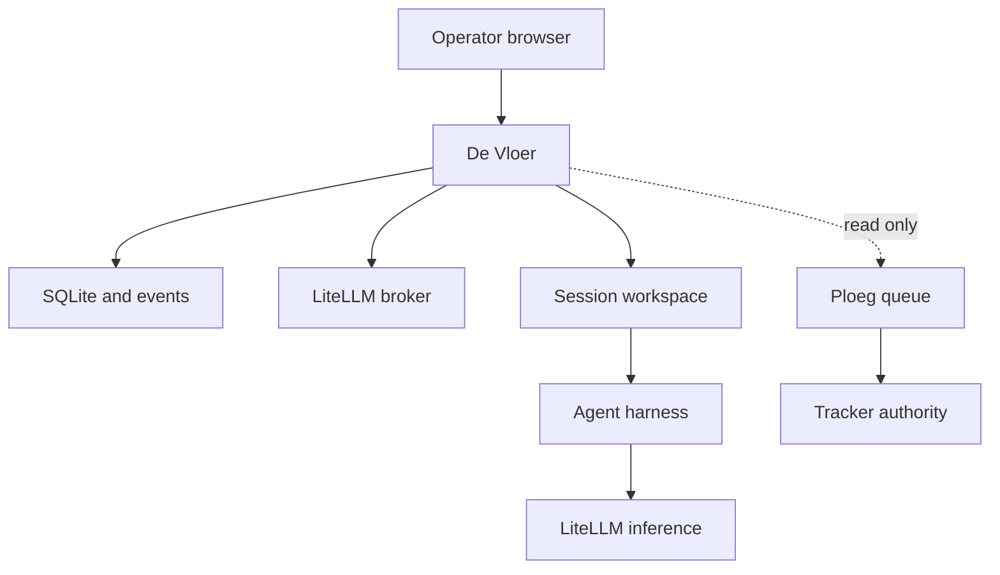

# Architecture

De Vloer is a human workbench for remote agent crews. A person chooses a registered repository, objective, reusable crew and spending limit; the server owns the session after the browser disconnects. People return to a consistent view of progress, changes, checks, blockers and decisions.

The design shifts repeated workspace setup and supervision out of individual terminals. The useful outcome is a reviewable change with evidence. More simultaneous agents alone is not the success criterion.

## Boundaries

| System | Authority |
| --- | --- |
| Tracker | Work content, priority and assignment |
| Ploeg | Unattended dispatch and its existing Shift/Run lifecycle |
| De Vloer | Interactive operator sessions, human intervention and their audit trail |
| Agent harness | Native reasoning/tool loop and opaque conversation state |
| LiteLLM | Model routing, scoped virtual credentials and available spend records |
| Docker Engine | Container isolation of workspaces on the workbench host |
| Kubernetes | Pod isolation of workspaces in a team deployment |

The Ploeg connector reads its configured queue endpoint. It neither invents a dispatch API nor claims to mutate tracker state. A tracker link provides context; it does not grant authority over the linked item. Converting interactive work into unattended work remains an explicit tracker workflow.

## Implementation map

| Path | Responsibility |
| --- | --- |
| `src/main.ts`, `src/config.ts` | Explicit demo/live startup and administrator configuration |
| `src/http.ts`, `src/auth.ts`, `public/` | HTTP, identity, object authorization, browser workbench |
| `src/store.ts`, `src/engine.ts` | Durable state, events and session lifecycle |
| `src/runtime/` | Runtime adapters and the local, Docker and Kubernetes workspace backends |
| `src/broker.ts` | LiteLLM credential lifecycle and spend reconciliation |
| `src/types.ts` | Shared domain and adapter contracts |
| `ops/` | Images and Kubernetes deployment |
| `skills/`, `.agents/contracts/` | Portable operator procedure and repository-specific facts |

Node 24 runs erasable TypeScript directly. The production application has zero third-party npm runtime dependencies; browser JavaScript uses native modules. There is no frontend build step or package installation in the demo path. This is a deliberate small-service choice, recorded in [ADR 0002](adrs/0002-native-node-and-single-writer-storage.md), rather than an inferred organization-wide frontend standard.

## Sessions, runs and handoffs

A session owns its objective, repository, branch, budget and human history. Crew roles become runs, executed sequentially in v0.1. A crew may begin with one writer and must contain at least one reviewer; all subsequent roles are readers. Reviewers produce findings and must explicitly approve for the session to complete. This is a delivery/review sequence, not distributed negotiation or parallel writers.

Native harness session IDs are adapter details. They can support continuation within that harness, but are not portable conversation formats. The portable handoff consists of repository changes, an objective, remaining constraints, a summary, checks and review findings. Changing a model or harness does not migrate its hidden context.

Session events are persisted before they are exposed through the event stream. A browser can fetch history or reconnect with a numeric cursor. Sending a message records an instruction; applying it to an already executing model call requires an explicit supported intervention. Pause and cancel are deliberate lifecycle outcomes. Server recovery must not automatically repeat paid work.

## Trust and spending

Configuration supplies the allowed repository, crew, model and runtime IDs. User requests select from those registrations. Arbitrary process arguments and workspace endpoints are administrator configuration, not prompt-controlled inputs.

The control plane holds its login secrets, LiteLLM minting credential, Docker socket and Kubernetes authority. A worker receives only its session's inference key, explicitly provisioned repository access and the environment names or Kubernetes Secrets an administrator listed for it. Placement is chosen per session from the backends a deployment enables ([ADR 0009](adrs/0009-workspace-placement-is-a-session-choice.md)). The `docker` backend runs the clone and the harness in a hardened container from the pinned agent image on the workbench host; it is the default for a workstation. The `local` backend shares the control server’s OS user and permits access to server files through approved shell commands; use it only for trusted single-user development. Kubernetes is the intended isolated team backend for a workbench deployed in the cluster, with network policy enforcement dependent on the target cluster. Remote HTTP adapters are integrations with trusted, authenticated endpoints. A read-only role instruction is not a filesystem or credential boundary; review actual adapter and workspace enforcement before giving it production push access.

`budgetUsd` is authorized spend. `spentUsd` is observed spend, accompanied by `costStatus`. Demo work has no model calls. Pending or unavailable live metering must remain visible, and an administrator must explicitly authorize an increase. Gateway budgets, TTL and revocation reduce exposure; they are not proof of an exact monetary ceiling for in-flight requests.

## v0.1 operating envelope

SQLite is a **single writer, single application replica** store in this release. Durable storage does not provide distributed leases, high availability or cross-replica scheduling. Keep one server and one persistent volume. Scale remote workspace capacity independently; do not scale the server Deployment to obtain more control-plane throughput.

The local demo executes a real repository fixture and checks without AI calls. OpenCode, command runners, LiteLLM and Kubernetes have different prerequisites and validation levels. [Validation evidence](validation.md) is the source for what was actually exercised; [live operation](operations/live.md) describes deployment requirements. A rendered Helm chart or mock API test is not a live-cluster qualification.

## Decisions and next thresholds

The [ADRs](adrs/README.md) record chosen constraints and concrete reasons to revisit them. Before broad team rollout, validate one real repository end to end: authentication, remote workspace, one scoped paid run, human intervention, disconnect/reconnect, cost settlement, retained evidence and cleanup. Measure time to first reviewed result and human intervention time. Do not use agent count as a proxy for developer freedom.
