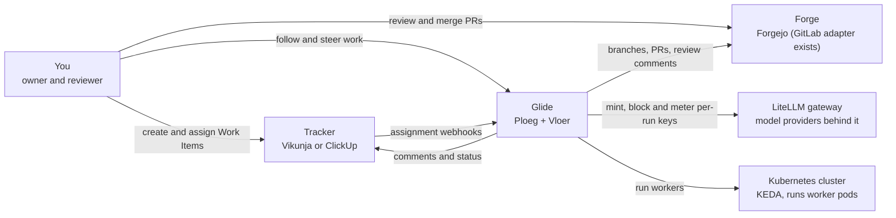
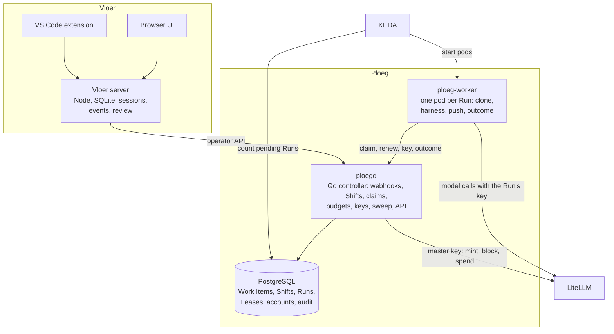

# Architecture

Glide has two deployable applications:

* **Ploeg** runs agent work. It is a Go controller with PostgreSQL, plus short-lived worker pods.
* **Vloer** is the front end where a person follows and steers that work. It is a Node web server, with a VS Code extension.

Both run on your own Kubernetes cluster and use your own tracker, forge and model gateway. This page gives the goals, the two diagrams that matter and the main decisions. [How work flows](how-work-flows.md) follows one ticket through the system.

## Goals

The goal is one loop: create Work Items (units of work), assign them to agents, and let the agents do all of the code work until a pull request is ready for human review and merge. The loop is complete when the throughput limit is cluster size rather than your time, and a new model can be adopted by changing configuration.

Quality goals, in priority order:

1. **Bounded spend.** Every Run has a budget and a model key that stops working when the Run ends.
2. **A pull request is the only output.** Agents push to a leased branch. People merge.
3. **Recoverable.** A dead worker loses its Lease. The sweep recovers the Run, and a paid step never repeats silently.
4. **Replaceable parts.** The tracker, forge, harness and model sit behind adapters.

## Constraints

* Self-hosted: Kubernetes, PostgreSQL, a LiteLLM gateway, Forgejo (the leading forge) and Vikunja or ClickUp.
* One owner operates and maintains it. Simplicity outranks generality.
* Production desired state lives in the separate `homelab-cluster` repository. Glide builds images and Helm charts.

## Context

## Containers

| Container | Source | Responsibility |
| --- | --- | --- |
| `ploegd` | [`apps/ploeg/cmd/ploegd`](../../apps/ploeg/cmd/ploegd/main.go) | The only holder of the LiteLLM master key, forge admin token and database. Turns webhooks into Shifts, admits and leases Runs, mints keys, and advances or closes Shifts. |
| `ploeg-worker` | [`apps/ploeg/cmd/ploeg-worker`](../../apps/ploeg/cmd/ploeg-worker/main.go) | Runs one Run and exits. Refuses to start if it can see controller secrets. |
| Vloer server | [`apps/vloer/src`](../../apps/vloer/src/main.ts) | Front end: sessions, live events, human review. It still contains an execution engine, which [ADR-0002](../adr/adr-0002-ploeg-is-the-only-engine.md) retires. |
| VS Code extension | [`apps/vloer/extensions/vscode`](../../apps/vloer/extensions/vscode/) | Follows Vloer sessions from the editor. |

## Solution strategy

| Choice | Decision |
| --- | --- |
| A dedicated dispatch service instead of an off-the-shelf agent platform | [Ploeg ADR-0005](../../apps/ploeg/docs/adrs/0005-build-a-dedicated-dispatch-plane.md) |
| LiteLLM as the credential and metering seam | [Ploeg ADR-0008](../../apps/ploeg/docs/adrs/0008-litellm-is-the-credential-and-metering-seam.md) |
| The Shift owns the Work Item; the Lease owns the branch | [Ploeg ADR-0010](../../apps/ploeg/docs/adrs/0010-shift-owns-the-item-lease-owns-the-branch.md) |
| The pull request is where agents and people exchange results | [Ploeg ADR-0011](../../apps/ploeg/docs/adrs/0011-the-pull-request-is-the-blackboard.md) |
| Budgets are authorized before a Run and settled after it | [Ploeg ADR-0012](../../apps/ploeg/docs/adrs/0012-two-level-budgets-authorized-and-settled.md) |
| Push rights are minted per Run | [Ploeg ADR-0013](../../apps/ploeg/docs/adrs/0013-push-rights-are-minted-per-run.md) |
| Ploeg is the only engine; Vloer is the front end | [Glide ADR-0002](../adr/adr-0002-ploeg-is-the-only-engine.md) |

Every decision across the three ledgers is listed in the [decision register](../reference/decisions.md).

## Risks and known gaps

| Risk | State |
| --- | --- |
| Two execution engines until Vloer delegates to `ploeg-worker` | Accepted in ADR-0002; migration not started |
| Candidate delivery stores approvals, but nothing publishes | Delivery ends at the pull request |
| Forge events are recorded but not acted on | Failing CI does not create a repair Round |
| Releases have not moved to Glide yet | See [first cutover](../operations/first-cutover.md) |
| Agent quality is unmeasured beyond single fixtures | A comparison on real Work Items is an open option |

Related: [Ploeg architecture](../../apps/ploeg/docs/architecture.md), [Vloer architecture](../../apps/vloer/docs/architecture.md), [historical C4 views](../landscape/c4.md).
