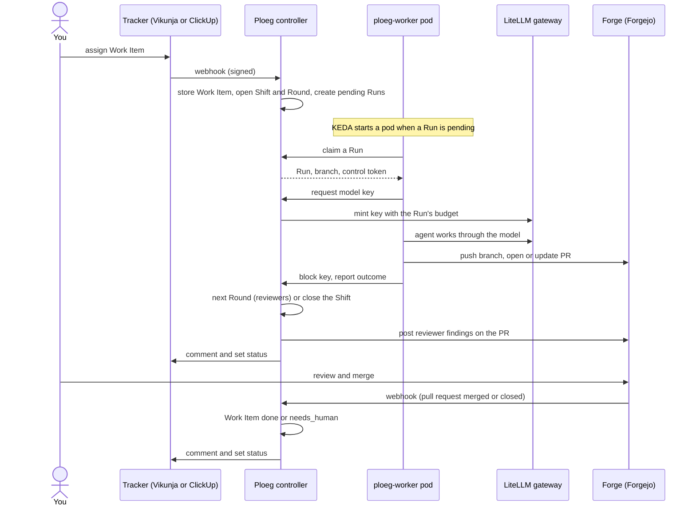

# How work flows

A **Work Item** is a unit of work: something you have decided to do, or a problem described well enough that a solution can be formulated or at least conceived. A Work Item becomes a pull request in four steps:

1. You assign a Work Item to an agent team. Today Work Items arrive from your tracker or from Vloer.
2. Ploeg turns the assignment into a **Shift**: one team's attempt at that Work Item.
3. Short-lived worker pods run the Shift's agents, each within a budget and with a credential that expires.
4. The Shift ends with a pull request for you to review and merge.

This page explains that loop and who holds authority at each step. The [glossary](../reference/glossary.md) defines each **bold** term.

## The loop



## Step by step

1. **Intake.** When a tracker item is assigned, the tracker calls Ploeg's webhook ([`server.go`](../../apps/ploeg/pkg/httpapi/server.go)). Ploeg checks the signature, reads the ticket, picks the **Team** and target repository, and stores a **Work Item**. Ploeg ignores events other than assignment today.
2. **Plan.** Ploeg opens a **Shift** for the Work Item, with its own branch and budget pool ([`shiftengine/engine.go`](../../apps/ploeg/pkg/shiftengine/engine.go)). A Shift proceeds in **Rounds**. A Round contains either one writer or several read-only reviewers, never both. Each **Role** in a Round gets one pending **Run**. A team without a plan gets one Round with one writer.
3. **Scale.** KEDA, the Kubernetes autoscaler, counts pending Runs in PostgreSQL and starts one `ploeg-worker` pod for each. Your cluster size limits how many run at once.
4. **Claim.** The worker claims a Run and receives a signed control token for that Run only. A writer also gets a **Lease**, the exclusive right to push to the Shift's branch until it expires. The worker renews the Lease while it works. If the worker dies, the Lease lapses and the sweep recovers the Run.
5. **Budget.** The worker asks Ploeg for a model key. Ploeg alone holds the LiteLLM master key, and mints a key for this Run with a spending limit ([`llm_control.go`](../../apps/ploeg/pkg/httpapi/llm_control.go)). The worker refuses to start if it can see the master key, the forge admin token or the database URL.
6. **Work.** The worker clones the repository and runs a **harness**, the agent program that loops between the model and tools. OpenHands is the default; Claude Code, any executable, or an ACP agent are alternatives. The writer pushes the branch and opens or updates the pull request.
7. **Outcome.** The worker blocks the key, checks the forge for the pull request and reports an **Outcome**, such as `pr_opened`, `stuck` or `failed`. A harness that runs too long or goes silent is stopped and reported as failed with reason `timeout`. Later, ploegd settles the Run's real cost from LiteLLM's spend logs into the Shift's budget.
8. **Review Rounds.** Reviewer Runs read the branch and return a verdict and findings. Ploeg posts the findings as pull request comments. When a reviewer asks for changes, Ploeg opens a fix Round, up to the plan's limit. A failed writer retries its Round.
9. **Close.** When the plan is done, Ploeg closes the Shift and comments on the tracker item. If a writer opened or updated the pull request, the Work Item moves to `awaiting_review`: ready for you. A `stuck` outcome or an exhausted fix loop moves it to `needs_human`.
10. **Merge.** You review the pull request on the forge and merge it. Ploeg never merges.
11. **Settle.** When the forge reports the pull request merged, the Work Item moves from `awaiting_review` to `done`, and the tracker item gets a comment and, where the tracker supports it, the done status. A pull request closed without merging moves the Work Item to `needs_human` instead ([`shiftengine/review.go`](../../apps/ploeg/pkg/shiftengine/review.go)). Ploeg acts on the forge's webhook, and also asks the forge directly on a slower schedule in case a webhook was missed.

A sweep runs every 15 seconds. It expires dead Leases and Runs, blocks their keys, settles spend and repairs Shifts ([`cmd/ploegd/sweep.go`](../../apps/ploeg/cmd/ploegd/sweep.go)). A separate reconcile runs every 10 minutes by default (`PLOEG_REVIEW_RECONCILE_INTERVAL`) and reads the state of every `awaiting_review` pull request from the forge.

## Work that creates work

Not every unit of work is code. Deciding what to build, splitting a large Work Item into smaller ones, or turning a vague problem into one that is **Ready** is work too, and agents can do it under the same authority, budget and review as code ([Product R12](../domain/rules.md#r12)).

| Source of new work | State |
| --- | --- |
| You, through the tracker or Vloer | Implemented |
| A Run that splits a Work Item, makes it Ready or records work it discovered | Intended. Ploeg has the `follow_up_created` Outcome and the `follow_up` origin, but no Run creates Work Items yet |
| A failed check on a Ploeg pull request | Implemented, off by default. With `repairFailedChecks`, Ploeg queues a repair Follow-Up for the Team that owns the branch |
| A person's review requesting changes on a Ploeg pull request | Implemented, off by default. With `reworkOnChangesRequested`, the review goes back to the same Work Item: it creates no new Work Item |
| Other forge events, such as a merge conflict or a review comment | Recorded only |

A Work Item created by work is a **Follow-Up**. It names its source, and it states whether it is Ready. Work that is not Ready can be given to agents whose job is to make it Ready.

### Forge events that act

Both switches are per Team, under `teams.<name>.forgeFollowUps` in the `PLOEG_CONFIG` file ([configuration reference](../../apps/ploeg/docs/reference/configuration.md)). A Team without them acts on no forge event, so deploying this changes nothing until you turn it on.

```yaml
teams:
  bronze:
    forgeFollowUps:
      repairFailedChecks: true
      maxRepairs: 2                  # per pull request; 0 or unset means 2
      reworkOnChangesRequested: true
```

Ploeg only acts on a pull request branch that one of its Shifts worked, in the repository the Work Item targets ([`forge_followup.go`](../../apps/ploeg/pkg/httpapi/forge_followup.go), [`store/followup.go`](../../apps/ploeg/pkg/store/followup.go)).

* **Failed check.** When the source Work Item is `awaiting_review`, Ploeg creates a queued Follow-Up with origin `follow_up`. The Follow-Up names the source Work Item, the pull request and the branch. It carries the source's Work Target and Team, and its Shift pushes to the same branch, so the open pull request is updated. The failure text from the forge is quoted in the task as evidence. At most one repair Follow-Up per pull request is open at a time. After `maxRepairs` repairs, later failures are recorded with reason `capped` and nothing runs. A failure while the source is queued or has a live Shift is skipped, because that Shift is already working the branch.
* **Changes requested.** A review that requests changes, from anyone except Ploeg's own forge user (`PLOEG_FORGEJO_BOT`), is stored against the Work Item. The review body reaches the next writer in its briefing, marked as evidence. If a Shift is still live, its plan continues and then runs a fix Round for the review, within the plan's `maxFixRounds` and budget. If the Work Item is `awaiting_review`, Ploeg queues it again and opens a new Shift on the same branch.

## Who holds authority

| Decision | Holder |
| --- | --- |
| What work exists and its priority | The tracker, through you |
| Whether a Run may execute, and with which budget | Ploeg |
| Who may push to the Shift's branch | The Lease holder |
| Which model a Run may use, and how much it may spend | Ploeg, through the key it minted |
| Whether the change is merged | You, on the forge |
| Whether a Work Item awaiting review is `done` | The forge's merge, which Ploeg observes |

Every agent run goes through Ploeg ([ADR-0002](../adr/adr-0002-ploeg-is-the-only-engine.md)).

## Where Vloer fits

Vloer is the front end. It is where you watch Shifts, steer work, read evidence and review results. Today Vloer can also execute an interactive crew itself. In that shared mode, Ploeg admits and budgets the session, but the agents run inside Vloer. ADR-0002 retires that path: Vloer will send work to Ploeg's workers instead. Until then, a session admitted by Ploeg never falls back to running without it.

## Limits today

* Your own tracker, forge, LiteLLM gateway and Kubernetes cluster are required. There is no hosted service.
* Ploeg records the pull request but does not merge or publish anything. Candidate delivery stores approvals without a publisher.
* An operator-owned Work Item ignores unassignment in the tracker. Cancel its execution instead.
* Runs cannot create Work Items yet; see below.
* Forge webhooks act on merged and closed pull requests. Failed checks and requested changes act only for Teams that turned on `forgeFollowUps`. Other forge events, including merge conflicts and plain review comments, are recorded but not acted on.
* Failed-check repairs parse Forgejo commit-status events and GitLab pipeline events. Only Forgejo reviews are classified, so a GitLab review never sends work back.
* A requested change that arrives after a live Shift's fix-round cap or budget has run out stays stored. The Work Item goes to `needs_human`, and a later assignment gives the review to the next Shift.
* Merge detection needs a Work Item whose target repository resolved. An item that ran on the worker's fallback repository stays `awaiting_review` after its merge.

Related: [Architecture](architecture.md), [Ploeg architecture](../../apps/ploeg/docs/architecture.md), [worker control contract](../../apps/ploeg/docs/contracts/worker-control.md).
