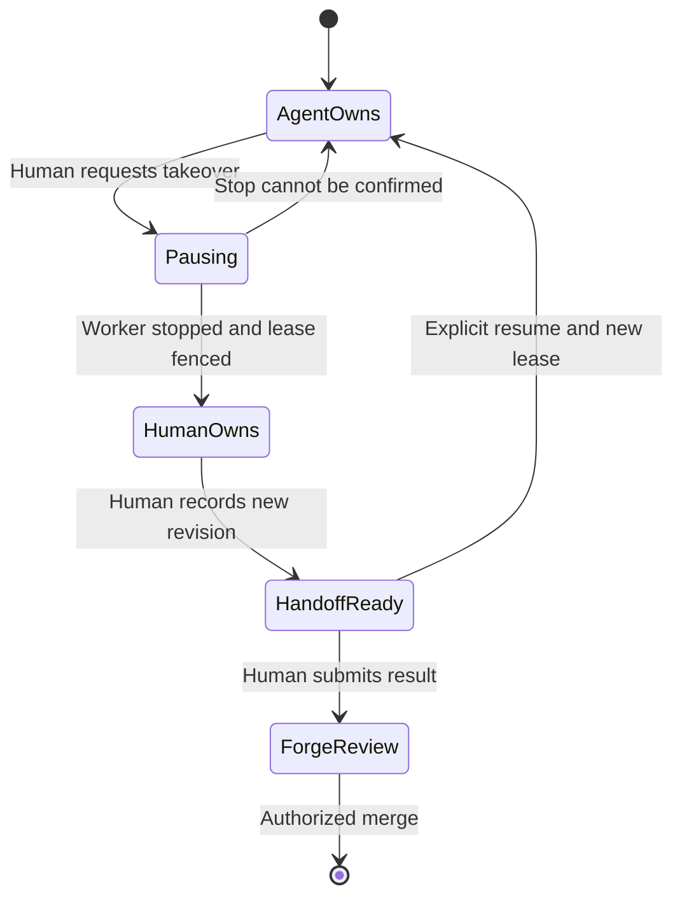

# IDE and operator experience

Status: target design with an implementation baseline. Research checked 9 September 2026. This document specifies behavior to build; it does not certify that proposed endpoints, team sharing, remote editor attachment or tracker dispatch already exist. The extension's [README](../../extensions/vscode/README.md), [HTTP contract](../contracts/api.md), source and tests describe the shipped slice.

## 1. The experience we are building

A developer should be able to identify useful work, authorize a bounded attempt, continue their own work, and return to a small set of decisions supported by inspectable evidence. Closing a laptop must not abandon the work. Opening a different editor must not create another owner of the same execution.

The primary object is a **work order**: a versioned brief, source ticket, repository revision, acceptance criteria, execution authority and budget. The browser supports team oversight and preparation; the editor supports focused intervention and code review. Both project the same server state. Neither becomes another tracker with its own competing priority field.

The distinctive product interaction is a reviewable handoff between unattended work and human attention. A chat transcript alone does not answer what changed, whether checks ran against those changes, how much authorization remains, or who can act next.

| Surface | Primary jobs | Default information |
| --- | --- | --- |
| Browser workbench | Prepare work, supervise a team, unblock decisions, inspect spend and handoffs | Attention queue, active work, review queue, integration health |
| VS Code sidebar | Stay oriented while editing | Selected deployment, sessions relevant to this repository, decisions needing this operator |
| VS Code session editor | Inspect one engagement | Brief, execution status, changes, checks, decisions and retained instructions |
| Native editor documents | Read exact evidence | Immutable patch, source snapshots, test output and handoff text |
| Tracker | Prioritize and accept business work | Original ticket, execution link, concise result and review link |
| Forge review | Review and merge code | Exact branch revision, CI, required human approval |

Use native TreeViews, Quick Picks, command menus, documents and editor diffs where they fit. VS Code explicitly offers these surfaces and reserves webviews for experiences beyond its native controls. A focused session summary warrants a webview; replicating the entire browser application in a sidebar does not. [VS Code UX guidelines](https://code.visualstudio.com/api/ux-guidelines/overview)

## 2. What exists, and what this design adds

The server currently supports owned sessions, registered repositories and crews, sequential implementation/review, durable events, explicit pause/resume/cancel, operator instructions, structured permission responses, retained artifacts, scoped spending and a read-only Ploeg queue view. Its three roles are administrator, operator and viewer. There is no shared team membership, work-order claim protocol, tracker ticket intake or human merge API in that baseline.

The first extension slice uses those existing routes: grouped session navigation; creation and lifecycle commands; a themed session panel; read-only artifact/history documents; explicitly confirmed context attachments; and cookie authentication through SecretStorage. It polls server state and fetches durable history using a cursor. It does not yet promise native per-file base/head diffs, OAuth device sign-in, team queues or a connection into the worker's filesystem. Verify the exact shipped commands in the extension manifest before demonstrating them.

| Capability | Baseline | Target and prerequisite |
| --- | --- | --- |
| Start work from VS Code | Create a session from registered profiles | Materialize a versioned work order from a ticket; require tracker connector and dispatch authority |
| See results in VS Code | Read retained patch/check/handoff artifacts | Per-file immutable base/head documents; require artifact manifest and content API |
| Send context | Explicit bounded attachment included in an instruction | Revision-aware context pack with separate provenance records |
| Follow execution | Poll snapshot and durable history | Snapshot watermark plus SSE replay and retention contract |
| Sign in | Current first-party username/password login; retain cookie only | Browser SSO using PKCE or device authorization; separate client credentials |
| Work with a teammate | Owner/admin access only | Team membership, assignment, observer rights and atomic claim transfer |
| Open remote workspace | Evidence inspection, no filesystem attachment | Workspace access broker and a qualified Coder/SSH adapter |
| Merge | Human uses the forge | Evidence-bound review deep links; merge remains the forge's authorized operation |

## 3. Information architecture and visual behavior

One Vloer activity icon opens three collapsible native sections: **Needs attention**, **Working**, and **Recent**. Relevant repository sessions appear first, followed by other visible sessions. Every row contains a short title, status icon plus text, and one useful secondary value: decision age, active role or review readiness. Avoid tiny progress percentages inferred from tool calls. The tree is navigable without opening a dashboard.

The session editor uses a stable hierarchy:

1. A compact identity row: ticket, repository, branch, operator and deployment.
2. A short status sentence and next permitted action.
3. A decision card when a response is required.
4. Four evidence tabs: **Brief**, **Changes**, **Checks**, **Activity**.
5. A narrow instruction composer with an explicit delivery state.

Budget is always available beside identity, expanded when attention is necessary. The active role and last observed event time are more useful than animated agent avatars. A completed machine review reads **Ready for human review**, not **Done**, until the product's acceptance authority has acted. Current API `completed` means required agent reviewers approved; the UI must preserve that distinction from merged or deployed.

In the browser, the default team view prioritizes blocked decisions and reviewable outcomes over a wall of running agents. Filters are deployment, team, repository, tracker and operator; priority is projected from the tracker. Saved filters never mutate assignments. Every queue includes its last successful synchronization time. The future shared attention queue is authorization filtered on the server, including aggregate counts.

Theme tokens drive the extension: `--vscode-editor-background`, `--vscode-editor-foreground`, `--vscode-descriptionForeground`, `--vscode-panel-border`, `--vscode-focusBorder`, button, input, list and validation tokens. Use the same semantic states as the browser, translated into the active editor theme. Vloer's orange may identify the product icon; it must not override a user's contrast theme. [VS Code theme color reference](https://code.visualstudio.com/api/references/theme-color)

Keep typography to inherited UI and editor fonts. Use an 8-pixel spacing base, compact 4-pixel subdivisions, a readable line length and visible focus rings. Controls receive at least a 28-pixel interaction height in dense editor views and 40 pixels in browser forms. Do not ship the deprecated Microsoft webview UI toolkit as the foundation; use maintained native primitives and a small local stylesheet. [Toolkit repository and deprecation notice](https://github.com/microsoft/vscode-webview-ui-toolkit)

## 4. Connection identity across machines and windows

A connection profile comprises deployment origin, stable server identity when available, selected organization/team, authenticated principal and capability version. A repository binding maps a VS Code workspace-folder URI to a registered server repository ID. The binding grants no authority and does not copy repository contents.

Configure deployment addresses at application/user scope. A cloned repository must not change the destination to which an existing credential is sent. Reject URL user information, query strings and fragments; require HTTPS except explicit loopback development. Do not follow authenticated redirects to another origin or offer a disable-certificate-validation switch. Internal deployments should distribute the appropriate CA trust and VPN instructions.

| Editor context | Connection behavior | Repository behavior |
| --- | --- | --- |
| Desktop with local folder | UI extension connects from the operator machine | Explicitly map the folder; default context contains no local source |
| Desktop over Remote SSH | UI extension still needs deployment reachability from the laptop | Read selected documents through VS Code APIs; do not treat a remote URI as a local path |
| Desktop in a dev container | Same control-plane identity; container credentials are irrelevant | Workspace binding records the container folder independently |
| Multi-root workspace | One selected deployment; show repository choice on each draft | Do not infer that all roots belong to one repository or one work order |
| Two windows | Independent selection and drafts; common server truth | Each window can observe; only the server grants mutation/claim authority |
| Browser editor / code-server | Separate qualification target with explicit runtime and CORS requirements | No claim of support merely because the desktop VSIX installs |

Declare the desktop control extension as `extensionKind: ["ui"]`. Future filesystem helpers may require a separate workspace extension, with a narrow typed command boundary and no transfer of the control-plane cookie. Use `workspace.fs` and URI-aware document APIs instead of filesystem path assumptions. VS Code distinguishes local UI and remote workspace extension hosts and provides APIs to identify the actual execution location. [Remote extension guidance](https://code.visualstudio.com/api/advanced-topics/remote-extensions)

Persist filters, selected session and folder bindings in appropriate VS Code state storage. Store only credential material in SecretStorage, keyed by deployment identity and principal. SecretStorage is encrypted and not synced across machines; it does not eliminate the need for a protected operator OS. Do not put cookies in settings, webview state, source control, diagnostic bundles or command arguments. [VS Code storage capabilities](https://code.visualstudio.com/api/extension-capabilities/common-capabilities)

The target onboarding flow opens first-party Vloer sign-in in the browser and returns a scoped client credential. Prefer an authorization-code flow with PKCE where supported; offer OAuth device authorization when callbacks are unsuitable. Device approval displays the actual deployment and client, expires promptly, follows server polling intervals and never asks the operator to paste an IdP password into a ticket. These are Vloer identity credentials, unrelated to model-provider subscription entitlements. Device authorization behavior follows [RFC 8628](https://datatracker.ietf.org/doc/html/rfc8628).

On expiry, stop authenticated streaming, disable mutations and show **Sign in to refresh this session**. A local draft survives without being sent. Reauthentication fetches current server state before enabling actions. Logout removes local credentials and cached sensitive views, revokes the first-party session where reachable and reports if server revocation could not be confirmed. Existing authorized work continues unless the operator separately cancels it.

## 5. Commands and keyboard design

The following is the target command catalogue, not a statement that every command is implemented. Register only available commands; hide unsupported capability actions rather than routing them to dead ends. Command IDs remain stable after publication.

| Command label | Intended action and guard |
| --- | --- |
| Vloer: Connect / Switch Deployment | Select trusted destination and authenticate |
| Vloer: Sign Out | Remove credentials and revoke login session |
| Vloer: New Session | Registered repository, brief, crew, runtime and budget; preview before creation |
| Vloer: Start from Ticket | Select an eligible normalized ticket; show source revision and readiness gaps |
| Vloer: Find Session | Search visible sessions by title, ticket, repository or ID |
| Vloer: Review Next Decision | Select the oldest relevant unresolved decision; never grant permission merely by navigating |
| Vloer: Attach Selection / Attach File | Preview bounded content and destination; explicitly send |
| Vloer: Save Instruction | Persist instruction with delivery semantics visible |
| Vloer: Pause / Resume / Cancel | Show current authority and state; record acknowledged server outcome |
| Vloer: Open Changes / Open Checks | Open retained immutable evidence, not the local working tree |
| Vloer: Open Review Workspace | Future access broker flow; exclusive write ownership required for editing |
| Vloer: Hand Off Session | Future teammate assignment with a structured summary and accepted claim transfer |
| Vloer: Open Ticket / Open Forge Review | Validated external link; no implicit state mutation |
| Vloer: Export Evidence / Export Diagnostics | Preview contents and destination; separate code evidence from operational diagnostics |

Use native multi-step Quick Picks for short choices and a full editor form for a long brief. Always retain a back action and the entered draft. A Quick Pick item has a clear action label, a short consequence and a stable ID; names alone are not identifiers. [Quick Pick UX guidance](https://code.visualstudio.com/api/ux-guidelines/quick-picks)

Every mouse action has a Command Palette route. Avoid registering global single-letter shortcuts or colliding with common editor bindings. Inside an explicitly focused decision form, arrow keys navigate options, Space toggles a checkbox, Enter confirms the selected answer and Escape dismisses the form without answering. Never make Enter in an instruction textarea approve a tool request. Notifications are reserved for this operator's newly required decision, session failure and sign-in interruption; token streams and ordinary tool completions stay in Activity.

## 6. Decisions, questions and durable instructions

A permission card identifies the requesting role, exact tool or action, affected resource/pattern, relevant policy and authorization lifetime. The default prominent action is **Allow once**; **Reject** is equally reachable. A broader grant requires an explicitly displayed scope and expiration. If the adapter cannot explain what an `always` response covers or how it is revoked, the extension must omit that option. The current browser exposes the harness's broader-grant choice; consistent scope disclosure is an identified gap.

Questions preserve the adapter's question boundaries, descriptions, single/multiple selection semantics and free-text rules. A separate confirmation shows the answers being submitted. Do not collapse multiple answers into one chat string, invent an option, or treat a message as permission. Batch decisions are only appropriate after a future policy capability proves identical scope; a global **Approve everything** control is excluded.

Instruction copy must distinguish four states: **Draft on this device**, **Sending**, **Saved for next execution**, and **Delivery unknown—refresh before resending**. Current messages apply to a subsequent execution, not necessarily the active model turn. Offer a deliberate **Pause, then apply instruction** workflow only when the backend can establish the pause boundary. Do not optimistically announce an instruction as applied.

Mutations need future operation IDs and idempotency keys, optimistic concurrency and a queryable outcome. Until those exist, a timeout on create/start/decision is ambiguous: refetch session and pending-request state before asking the operator whether to retry. HTTP success acknowledges the stored transition; execution completion is a later event. A permission resolved by another authorized operator disappears with its actor and time rather than producing another grant.

## 7. Source context and evidence provenance

Opening a workspace, activating the extension, highlighting text or viewing a session must not upload code. `Attach Selection` prepares a local preview showing destination deployment, target session, repository binding, filename, line range, byte count and exact content. Unsaved editor content is marked **Unsaved buffer**; it is never represented as the checked-in revision. Sending remains an explicit action after preview.

Exclude binary files, secrets and generated directories by default and enforce administrator size limits. Users can see and remove each attachment. Repository deny rules and secret detection reduce accidental disclosure; they are not proof that selected text is safe. A configured model provider may receive accepted context during execution, so the preview also exposes the approved processing route without showing credentials.

The target context manifest records origin, source revision or buffer hash, attachment hash, author, capture time, trust classification and operator approval. Ticket text, comments, repository files, pasted terminal output and retrieved pages remain attributed input. An agent cannot promote an instruction found inside a file into a higher-trust operator decision. Show the effective brief separately from its supporting context.

The target artifact manifest includes work-order ID, attempt ID, repository ID, base/head commit, content digest, creation event, producer, check command/exit code, and the revision that a reviewer approved. Credentials and opaque harness state are excluded. A successful check against an older head must become **Outdated evidence** when new commits arrive.

Open per-file changes using `vscode.diff` and read-only `vloer-artifact:` documents, with a server-side authorization check on each retrieval. URIs identify immutable artifacts and contain no tokens. Normalize paths, reject traversal and enforce size bounds. Preserve deleted files, renames, binary markers and text encoding. A plain unified patch is the honest fallback until base and head file contents exist; never synthesize missing source and present it as a real side of a diff.

Findings can open a line in the immutable reviewed snapshot. Mapping that finding to the user's current file is a separate best-effort action requiring matching repository and revision evidence. If it cannot be mapped, show the remote snapshot. Review links bind to the exact forge head revision, not a mutable branch name alone.

## 8. Remote editing and human handoff

The first release's read-only evidence requires no remote shell on the laptop. The next step is **Open review workspace**, issued by a server access broker after object authorization. Reuse a qualified workspace provider, particularly Coder where already deployed, instead of building a new SSH credential manager. Coder's existing desktop button authenticates and opens the selected workspace, making it a useful integration baseline. [Coder VS Code workspace access](https://coder.com/docs/user-guides/workspace-access/vscode)

Offer two explicit modes: inspect an immutable result in a separate review workspace, or take over a paused execution workspace. Takeover first stops the agent, confirms its writer lease is fenced, records the current revision and grants the human a short-lived access lease. A stale worker must be unable to publish after that transfer. A note saying “agent paused” without an enforced boundary is insufficient.

If the operator prefers local editing, provide a reviewed fetch/worktree plan. Show the exact repository, target branch and revision. Check dirty tracked files, untracked collisions, existing worktrees and branch conflicts before mutation. Never auto-stash, reset, force checkout, overwrite a branch or clean untracked files. Prefer a new sibling worktree, preserving the existing workspace. Creation or checkout remains an explicit user action.

Human changes form a new revision. Returning work to the agent requires a summary, accepted snapshot and fresh authorization check; it does not silently overwrite human edits or revive a cancelled attempt. The next reviewer assesses the new head. Team handoff changes responsibility through an atomic server claim and retains the previous operator's notes; copying a URL is only sharing a reference.

## 9. Freshness, reconnect and uncertain cost

Connection health, execution state and accounting state are independent. A disconnected editor does not imply a stopped agent. A reachable server does not prove an executing worker is healthy. Display **Last observed 14:32:08 UTC** on stale state and retain the last evidence without presenting it as current.

Current event IDs are globally allocated by SQLite. Events 10 and 15 can be consecutive events for one session, so `id + 1` is not a valid gap detector. For the baseline, fetch history after the last applied cursor, merge by ID and periodically refetch the authoritative session snapshot. The shipped extension uses polling; this is deliberate and must not be marketed as an SSE client.

The future stream contract should return a snapshot with a high-water cursor, then allow replay strictly after it; advertise minimum retained cursor, stream generation and optional per-session revision. On retention expiry or generation mismatch, fetch a new snapshot and label unavailable historical detail. A normal reconnect replays from the last **applied** event, deduplicates and resynchronizes decisions. Never automatically replay paid start/resume mutations while reconnecting. Bounded queues and backoff protect both client and server.

| Observed condition | Operator-facing message | Available next action |
| --- | --- | --- |
| Network unavailable | Connection lost; remote work may continue | Reconnect; inspect cached evidence |
| Worker heartbeat stale | Execution state is being reconciled | Inspect diagnostics; request stop |
| Intentional pause | Paused by the named operator | Resume after confirming brief and authorization |
| Process recovery | Interrupted; no replacement run started | Inspect retained result and reconciliation |
| Metering pending | Last recorded spend; awaiting settlement | Inspect evidence; wait for settlement |
| Metering unknown | Spend unconfirmed; prior authorization remains reserved | Reconcile; request administrator review |
| Review revision changed | Previous approval applies to an older revision | Run required checks and obtain a new review |

Unknown cost never becomes `$0`. Show authorized, last observed and reserved amounts as distinct values where the server supplies them. Do not calculate precise remaining allowance from incomplete spend. An authorized increase does not erase unresolved prior usage. Accounting warnings should state the blocker and permitted action in one sentence, keeping API and gateway internals in an expandable diagnostic section.

## 10. Three complete workflows

### Ticket to a human-reviewed merge

1. A PO prepares a ClickUp or Forgejo ticket using the agreed Definition of Ready. The connector materializes a versioned work order; missing acceptance criteria appear as a readiness gap.
2. An operator selects the eligible item in VS Code or the browser, reviews repository mapping, crew, execution owner and budget, then dispatches through the designated authority. The UI displays Ploeg or Vloer ownership explicitly.
3. Ploeg allocates a remote workspace and starts the authorized attempt. Vloer presents its projected state and intervention link. Closing VS Code leaves the run intact.
4. A specific tool permission or domain question appears in Needs attention. The operator inspects and answers that request; unrelated requests remain unanswered.
5. The run produces a branch and evidence manifest. VS Code opens the patch and checks against the recorded head. Agent approval is labeled machine review; human acceptance remains outstanding.
6. The developer opens a separate review workspace, optionally commits an adjustment, then reruns checks and obtains review of the new revision. The forge supplies branch protection and human merge authority.
7. A reconciled merge event updates the tracker through its configured mapping. The work order records outcome, observed cost, human intervention time and retained evidence. Delayed tracker updates are visible and retried idempotently.

Steps involving normalized tickets, cross-plane handoff, editor workspace access and merge reconciliation are target capabilities. They must not be represented by a fake dispatch button against the current read-only Ploeg endpoint.

### Vloer improves Vloer

1. Run a stable Vloer release as the supervisor. Register this repository and a bounded crew; give candidate workers no access to the supervisor's state, keys or deployment authority.
2. Select a small backlog issue with executable acceptance criteria, such as cursor replay behavior. Pin the base revision and required checks. Self-modification means producing a reviewed candidate branch, not editing the running supervisor.
3. The agent implements in an isolated workspace; a separate verification environment executes server and extension checks. The result includes the changed contract, relevant tests and diff.
4. Use the installed stable extension to inspect that candidate. Test a candidate extension in an isolated VS Code profile connected to a disposable candidate server, with a distinguishable deployment label.
5. A human reviews and merges. CI builds immutable release artifacts and a controlled deployment job upgrades the supervisor after migration and rollback checks. The worker cannot approve its own production deployment.
6. Record escaped defects and operator effort against the ticket to improve the crew procedure. Promote changed skills through the same review path; do not let a successful run silently rewrite global instructions.

### Interrupted run with unconfirmed spend

1. An operator's laptop disconnects while a remote run is active. The UI reports stale observation without suggesting the agent has stopped.
2. The control server restarts. Recovery marks the attempt interrupted, stops or fences remaining execution, revokes its credential and attempts settlement. No replacement attempt starts.
3. On reconnect, the extension fetches the current snapshot and history. It shows retained changes, the last observed spend and the unresolved reservation. Resume is unavailable while its server precondition fails.
4. The operator inspects evidence; an administrator resolves accounting or authorizes an explicit bounded recovery decision according to policy. This is recorded with actor and reason.
5. A permitted resume starts a new identifiable attempt or continues the supported harness state under the server's declared semantics. The UI states which occurred. Existing instructions and previous evidence remain attributable to their original attempts.

## 11. Accessibility, security and acceptance gates

Target WCAG 2.2 AA for web content: text contrast, keyboard operation, visible focus, meaningful labels and status announcements. These are acceptance targets, not a present certification. Respect reduced motion; expose status in text plus icon; announce decision arrival politely once, not every streamed token. Restore focus after dialogs and keep streamed content from moving the keyboard target. [WCAG 2.2](https://www.w3.org/TR/WCAG22/)

Webviews load packaged assets only under a restrictive CSP. Keep credentials and network requests in the extension host, disable command URIs, validate every message by an allowlisted schema, bind actions to the current session and render external strings as text. Local resources are limited to packaged media. No remote HTML, script, fonts or tracking pixels are loaded from tickets or agent output. Persist only view state; closing a panel disposes its subscriptions. These controls follow the official [webview security and lifecycle guidance](https://code.visualstudio.com/api/extension-guides/webview).

Restricted Mode should still allow observation of already authorized remote sessions where no workspace content is needed. Local attachment, task execution, checkout and repository configuration loading require explicit trust and feature checks. Never import executable configuration from the opened repository into the extension host. Declare the supported Restricted Mode subset in the manifest. [Workspace Trust guide](https://code.visualstudio.com/api/extension-guides/workspace-trust)

| Acceptance area | Required scenario | Passing result |
| --- | --- | --- |
| First use | Fresh VS Code profile, no model tools installed | Connect, inspect a demo and read results without installing a local harness |
| Theme and layout | Light, dark, high contrast; 280-pixel sidebar; 200% zoom | No clipped actions; content remains readable and keyboard reachable |
| Accessibility | Screen reader, keyboard-only and reduced motion | Controls named; focus stable; no repeated token announcements |
| Authorization | Operator A attempts operator B's session/action/artifact | Server denies access; client hides stale unauthorized evidence |
| Auth lifecycle | Expired cookie, logout offline, new deployment same window | No credential reuse across origins; drafts not silently submitted |
| Remote contexts | Local, Remote SSH, dev container, two roots, two windows | Correct host reachability and repository binding shown |
| Context privacy | Activate, select text, preview then cancel attachment | No source leaves the editor before explicit send |
| Context safety | Unsaved file, secret-like text, oversized file, binary | Correct provenance; bounded handling; no silent substitution |
| Evidence | Rename, deletion, binary patch, stale head and missing content | Honest immutable evidence; no fabricated base file |
| Decisions | Two questions; multi-select; duplicate response; broad grant | Preserve semantics and scope; reject stale decisions |
| Network | Duplicate events, cursor jumps, downtime, retained-history expiry | Deduplication, fresh snapshot, honest gap label; no paid replay |
| Monetary ambiguity | Unknown spend with a successful-looking diff | Reservation remains visible; no invented remaining allowance |
| Local takeover | Dirty tree and untracked file collide with candidate | No destructive mutation; offer a separate worktree |
| Remote takeover | Old agent continues after lease transfer | Fencing rejects stale publication and records the attempt |
| Injection | Ticket HTML, command link, malicious file path or webview payload | Render inert text; reject unauthorized host commands |
| Performance | 500 sessions, 10,000 events, large bounded artifacts | Paginated/virtualized target behavior; disposal releases resources |
| Packaging | Clean install of published VSIX on supported editors | No missing assets, runtime downloads, embedded credentials or dev files |

Initial usability targets: find a relevant session within 10 seconds; understand its blocker within 15 seconds; open exact check evidence in two actions; return to the previous file without losing selection. Measure these with coworkers using real tasks. Set performance budgets after measuring the first implementation; do not publish achieved latency or productivity claims from this specification.

## 12. Distribution and product boundary

Package a source-linked Apache-2.0 VSIX and publish the same verified artifact to Visual Studio Marketplace and Open VSX when accounts and release approval are available. Keep the publisher identity consistent, check namespace availability, include repository/license/privacy/support metadata, and generate checksums plus a dependency inventory. Use a pinned packaging toolchain and a clean package allowlist. Marketplace publication uses its publisher workflow; Open VSX requires its own namespace, account agreement and publishing authorization. [VS Code publishing guide](https://code.visualstudio.com/api/working-with-extensions/publishing-extension), [Open VSX publishing guide](https://github.com/eclipse-openvsx/openvsx/wiki/Publishing-Extensions)

Do not bundle proprietary remote-editor extensions or assume their distribution permissions transfer to this project. Qualify VS Code, VSCodium and code-server separately; identify optional integrations and their terms. Use original Vloer branding and descriptive compatibility language without implying endorsement by Microsoft, Eclipse, ClickUp or any agent vendor.

The extension's product flow contains work, evidence and decisions. It contains no ads in generated code, ticket comments or pull requests; no acquisition popups in approval flows; and no required hosted telemetry. Optional diagnostics are local, bounded and previewed before export. Marketing should demonstrate a real interruption, real recovery and a real human review, with the exact tested compatibility matrix. A beautiful control panel earns its place by making those operational facts easier to understand.
