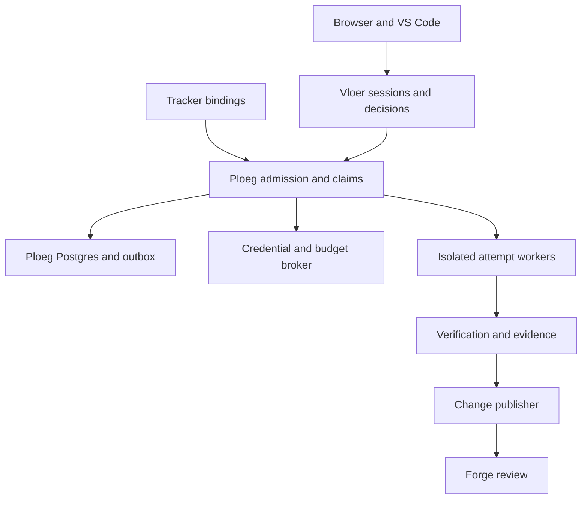

# Platform, governance and reliable execution

Status: proposed target design. Research checked 2026-09-09. This document describes implementation work to schedule; it does not upgrade the qualification claims in [validation](../validation.md).

## 1. The operating model

Ploeg and De Vloer should let an agency buy reviewed progress without requiring every developer to become a cluster administrator. The product boundary is the controlled journey from authorized work to evidence and a proposed change. The tracker retains business priority and acceptance. The forge retains code review and merge authority. Ploeg owns `WorkOrder`, `DeliveryAttempt`, claims and execution authority. De Vloer owns `Session`, `HumanDecision` and human interaction. Interactive and unattended work must enter the same Ploeg execution and authorization contract.

For a Code14-style organization, the first useful deployment is one private service operated by a small platform team, used by three development teams serving several clients. Talos, Flux, Authentik, Harbor, Longhorn and S3 are suitable integration points where those services are already operated. Their existence, versions and readiness must be checked against the actual installation; this design does not assume that an earlier infrastructure inventory remains accurate.

The uniform operator path is: select a permitted project, choose a reviewed procedure, see the effective model/tool/budget policy, authorize work, handle exceptions, inspect evidence, and send a proposed change for normal review. The browser and VS Code extension use the same APIs and permissions. No cluster token, gateway administration key or client-wide forge credential belongs on a coworker's laptop.

### Current implementation and the next boundary

| Area | v0.1 evidence in this repository | Required evolution |
| --- | --- | --- |
| Identity | Local passwords, admin/operator/viewer, owner-based sessions in `src/auth.ts` and `src/http.ts` | OIDC identity, project membership, session collaborators and scoped automation identities |
| State | Vloer SQLite, persisted events and encrypted internal state in `src/store.ts`; Ploeg already uses Postgres | Versioned Vloer commands/events; Ploeg-owned attempt leases, claim ledger and delivery outbox |
| Execution | Sequential crew roles, explicit review verdict, interruption recovery in `src/engine.ts` | Trusted verification, independently fenced attempts and bounded fan-out |
| Placement | Local server processes or per-session Kubernetes Pod/PVC/Secret/Service in `src/runtime/` | Project isolation profiles, quota admission, orphan sweeper and verified termination |
| Spending | Session virtual key, block-and-reconcile lifecycle and unresolved holds in `src/broker.ts` | Atomic project/client/team reservations and an append-only settlement ledger |
| Integration | Configured repository and read-only Ploeg queue visibility | Tracker inbox, claim ownership, change publishing and integration reconciliation |
| Operations | Helm assets, health endpoints, automated local qualification | Qualified cluster deployment, observability, restore drills and release recovery |

Local execution shares the server OS identity and remains a trusted development mode. Kubernetes restrictions already supplied are useful foundations; neither a namespace nor an agent's read-only instruction establishes hostile-tenant isolation by itself. Kubernetes distinguishes several tenancy models and calls out separate control planes and sandboxing where stronger separation is required. [Kubernetes multi-tenancy](https://kubernetes.io/docs/concepts/security/multi-tenancy/)

## 2. Data ownership and access

Use `organization → client → project` for data and commercial ownership. A team has grants to projects; it is not the parent of client data, because agency staffing changes. Repositories, tracker bindings, environment profiles, procedures and model policies belong to a project. Every work item, execution, attempt, approval, artifact and ledger entry carries immutable organization and project IDs. Client reassignment is a controlled migration, never a display-field edit on a running job.

One work item may have multiple execution attempts and several linked repositories. The first implementation supports one repository per execution. A cross-repository initiative becomes linked work items with explicit prerequisites; atomic distributed merges are out of scope. Shared skills are versioned organization assets, while proprietary client context remains project scoped. There is no organization-wide agent memory store containing all client source or conversations.

### Identity and authorization decisions

| Principal | Default capabilities | Explicit exclusions |
| --- | --- | --- |
| Operator | Start permitted procedures within an assigned allowance; steer owned/shared sessions | Grant membership, enlarge own allowance, publish to other projects |
| Reviewer | Read assigned evidence, record review findings and approve a fixed artifact revision | Edit the producing attempt or count as independent approval of own change |
| Project maintainer | Register repositories, reviewed procedures, integration mappings and contributors | Read other clients or override organization ceilings |
| Budget owner | Allocate project allowance and approve exceptional increases | Source-code access unless independently granted |
| Platform operator | Diagnose deployment metadata, stop compromised execution, manage approved profiles | Routine access to client prompts/source; content access requires a reasoned break-glass grant |
| Automation identity | Narrowly scoped intake, dispatch or publication capabilities | Impersonate a human approver, widen its scope or administer the platform |
| Client observer | Read explicitly shared outcomes and acceptance previews | Tool transcripts, internal discussions, secrets and other project sessions |

Implement an explicit capability policy with contextual checks, not a large collection of global roles. A decision evaluates `principal + organization + project grant + action + resource + policy revision + risk class`. Group claims establish eligibility; persisted grants establish object access. Server authorization applies to list filtering, event replay, artifacts, exports and extension requests, including guessed identifiers. Unauthorized objects return a uniform not-found response where enumeration matters.

Policy precedence is organization limits, then client/project restrictions, then procedure requirements, then session choices. A lower layer may narrow a permission; it cannot broaden one. A repository instruction or ticket attachment is task data and cannot change this hierarchy. Record the resolved policy digest when work is admitted and re-evaluate current policy before any new privileged action. A later restriction can stop future work; it does not rewrite historical authorization.

Use Authentik's OIDC authorization-code flow for the browser, with state, nonce and PKCE, server-side token handling and a short-lived application cookie. Validate issuer, audience, expiry and signature against a configured issuer; never discover an issuer from an untrusted token. Preserve `(issuer, subject)` as identity instead of email. A native VS Code client uses public-client PKCE through the system browser; device authorization is the fallback for remote/headless contexts. Authentik documents both flows. Do not embed a confidential-client secret in the extension. [Authentik OAuth/OIDC provider](https://docs.goauthentik.io/add-secure-apps/providers/oauth2/), [device flow](https://docs.goauthentik.io/add-secure-apps/providers/oauth2/device_code/)

Keep extension credentials in the editor's secret storage, outside webview JavaScript and workspace settings. Access tokens target the Vloer API, not Kubernetes or LiteLLM. Machine dispatch uses a separate client credential or a narrowly scoped platform credential with rotation. Membership revocation invalidates application grants and subscriptions promptly; define a five-minute maximum cache window as a target and test it. Existing runs follow the project's documented leave/disable policy, with security revocation immediately initiating the independent stop path. Termination is confirmed separately. The v0.1 local-login/cookie API is a compatibility path; it must not be described as implementing this proposed OIDC flow.

## 3. One execution authority

Avoid two independent schedulers creating two paid attempts for the same ticket. Extend Ploeg with a versioned execution API and one authoritative claim ledger. Its existing dispatcher and Vloer's interactive operator commands both use this boundary. Ploeg commits `WorkOrder`/`DeliveryAttempt` transitions; Vloer holds a correlated session and commands with durable idempotency keys. Vloer's local session projection may be briefly behind, but must display that condition and cannot independently authorize another attempt. Standalone v0.1 demo execution remains useful; tracked team operation must not run both dispatch paths against the same project.

Required identities are `work_order_id`, `delivery_attempt_id`, `session_id`, `human_decision_id`, `command_id`, `claim_generation`, `policy_digest` and `candidate_digest`. Tracker-native IDs remain opaque external references. The claim key includes binding and repository identity, so identical ticket numbers from two forges cannot collide. Model/provider request IDs and workspace Pod UIDs are retained as evidence, not as domain identities. Human decisions forwarded to Ploeg include their originating actor and authorization scope; accepting a decision and applying its effect are separate observable states.

Every mutating command has an idempotency key, expected aggregate version and actor. Persist the command result, state transition and outbox events in one transaction. Repeating a command returns its original result. Conflicting versions fail visibly instead of silently overwriting a newer instruction. Cancellation records stop intent and blocks new publication reservations before network calls. A previously reserved external write may still be in flight; reconcile that effect before claiming stop or transferring ownership. An obsolete completion cannot advance execution state.

### Leases and event delivery

An admitted attempt receives a lease containing an increasing fencing generation, owner, expiry and last acknowledged sequence. The worker heartbeats; only the current lease can append authoritative results, request new credentials or publish a candidate. Lease expiry enters `reconciling`, never an automatic second paid attempt. The reconciler confirms old-worker termination, revocation and candidate state before explicit retry or a policy-authorized infrastructure retry. A duplicate completion is idempotent; a stale completion is retained as diagnostic evidence but cannot advance state.

The governed publisher retains the only Git write credentials. It validates and reserves publication under the same serialized authority as ownership transfer. A durable barrier prevents takeover while the forge effect is in flight or unknown. Establish that the old actor and remote request ended or are fenced, then reconcile the remote ref/proposal to close it. A timer, expired publisher lease or negative remote read alone cannot release the barrier. If termination/fencing cannot be established, handover remains blocked. Checking a generation immediately before a network request is insufficient because transfer can race the external effect. A direct-write compatibility mode must explicitly disclaim this guarantee.

Keep durable events in the database, with stable execution-local sequence numbers and a globally unique event ID. Event delivery is at least once. The outbox publisher marks delivery independently; consumers deduplicate transactionally. Browser/extension subscriptions reconnect from a cursor and fetch a snapshot when history has been compacted. Small transcript fragments can be batched; approval, cost and lifecycle events are committed before acknowledgement. A broker or SSE connection is a transport, never the source of truth.

### SQLite and Postgres

Keep Vloer's SQLite with one writer for the first deliberately bounded pilot. Ploeg already uses Postgres through `pgx/v5`, with persisted runs/shifts and SQL migrations under `pkg/store/`; extend that database for work claims, attempt fences, aggregate allowance and delivery outbox. Do not recreate the claim or money ledger in Vloer's SQLite. Vloer persists its own sessions, human decisions, command delivery and event projection, referencing the Ploeg attempt IDs. Add schema migrations and transactional command/outbox writes to each service's own aggregates.

Move Vloer's interaction store to Postgres before enabling multiple Vloer writers or a requirement for interaction-service failover during maintenance. Also trigger migration if measured write latency or retention jobs violate its pilot SLO. Ploeg can use its existing database transactions and row-level claim locking; `FOR UPDATE SKIP LOCKED` is appropriate for a queue consumer, but not a replacement for lease generations and idempotency. PostgreSQL explicitly describes the queue-like use case and its inconsistent-view limitation. [PostgreSQL SELECT locking](https://www.postgresql.org/docs/current/sql-select.html)

The Vloer migration procedure drains new operator commands, takes a restorable snapshot, imports immutable IDs and event order, validates row counts/digests, and switches one writer. Ploeg remains authoritative for running attempts, but first qualify whether those can continue safely while the interaction service is unavailable; otherwise drain paid admission as well. Do not dual-write ledgers during a PoC migration. Read APIs can fail over only after writer ownership is proven. Add NATS JetStream later if independently deployed consumers need sustained fan-out or backpressure beyond an outbox poller; durable acknowledgement and possible redelivery still require consumer idempotency. [NATS durable consumers](https://docs.nats.io/learn/jetstream/pull-consumers)

## 4. Money is a separate state machine

Authorize total exposure, not merely observed spend. Admission atomically reserves allowance across organization, client, team allocation and project scopes before a key is minted. A single execution consumes each applicable envelope once; parent/child scopes are views of the same exposure, not separate charges. Budget policy specifies currency, period, model profile and maximum outstanding reservations.

Use integer micro-units or fixed-precision decimals for the ledger. Store provider-native amounts and currency, normalized accounting amount, rate source/time when conversion is needed, and whether the value is estimated, observed or reconciled. Do not silently label USD token estimates as euro invoices. Distinguish model cost, allocated infrastructure cost and an agency's commercial charge; the last follows client agreement and is not inferred from a token counter.

The admission invariant is:

`observed period spend + outstanding authorized exposure + new reservation ≤ authorized period allowance`

An outstanding reservation includes unreported requests and unknown post-cancellation spend. Settlement atomically replaces a reservation with recorded spend, releasing only the unused amount. Delayed charges produce adjustment entries and can put an envelope into debt, which blocks fresh admission. Period rollover does not discard unfinished exposure: retain it against the original period and apply a separate outstanding-exposure cap to the new period. Refunds, corrections and transfers use entries with provenance; never edit a settled amount in place.

The broker alone can mint/block credentials. Each attempt receives a TTL-bound model allowlist and a reference tagged with organization/project/execution/attempt IDs. Native runtime cost is provisional; gateway records settle the reservation. Publish `authorized`, `reserved`, `observed`, `unknown` and `settled` separately in UI/API. A missing spend record never becomes zero.

LiteLLM's current documentation describes request budget reservations and fail-closed budget enforcement, including concurrency and stale Redis considerations. Qualify those exact features against the pinned deployed version, model routes and outage conditions. Retain the application reservation ledger even when gateway reservations are enabled, because it also spans retries, project allocations and admission. Some higher-level budget tiers are documented as Enterprise features; this open-source design must not silently depend on them. [LiteLLM budget enforcement](https://docs.litellm.ai/docs/proxy/users), [budget tiers](https://docs.litellm.ai/docs/proxy/rate_limit_tiers)

Neither cancellation nor key blocking can undo an upstream request already accepted. The product therefore offers bounded admission and conservative accounting, with a measured maximum residual exposure, not a universal exact spend ceiling. Cap request concurrency, output tokens, retries, speculative branches and tool calls; pause when metering becomes unavailable. Apply a gateway circuit breaker to a project or entire installation when unexplained exposure exceeds policy.

### Model capability profiles

Offer reviewed profiles such as `code-small`, `code-complex`, `review`, and `sensitive-internal`, rather than a dropdown containing every advertised model. A profile specifies required tool calling, context/input/output limits, structured-output behavior, image support, permitted data destinations, exact route revision, expected price range and tested harness compatibility.

Fallbacks are explicit ordered routes with the same required privacy and capability policy. A provider outage may select only a pre-authorized fallback; a model that costs more or changes data destination requires a new approval unless the existing policy explicitly covers that change. Record the original and actual route, reason and new estimate. A resumable handoff carries the objective, patch and evidence; it does not claim to translate hidden reasoning between models.

Separate planning allowance from implementation allowance. Suggested pilot defaults are one planning pass, one writer, one independent review, and at most one explicitly approved correction cycle. A no-progress detector uses repeated failing checks, repeated tool errors and token/time consumption since the last verified change; it requests intervention rather than concluding that long reasoning is inherently wasteful. Wall-clock timeout, token limit, financial allowance and queue timeout remain distinct controls.

## 5. Workspace isolation and trusted evidence

Register named environment profiles under Git review. Operators select a profile ID; they do not supply arbitrary Pod manifests, shell launchers, container images or destinations. A profile pins an image digest, resource limits, runtime class, dependency mirrors, approved verification commands, allowed egress and artifact limits. The worker cannot edit its effective profile or obtain a more privileged one by changing repository configuration.

Use separate namespaces per client or explicit isolation class, with platform-maintained namespace/RBAC bindings. Repositories requiring stronger separation get dedicated nodes, a sandboxed runtime or a separate cluster after compatibility testing. The admission controller checks project-to-namespace mapping from trusted configuration; it never accepts a namespace or Secret name from an agent response. Apply Restricted Pod Security, no privilege escalation, dropped capabilities, non-root UID, read-only root filesystem, no host mounts and no service-account token. Budget actual CPU/memory/PID/ephemeral-storage/PVC consumption, including paused workspaces.

Network policy starts with denied ingress and egress. Permit the coordinator to the harness, and workers to approved inference, forge-read and package mirror endpoints. Standard Kubernetes NetworkPolicy requires an enforcing network plugin and does not provide arbitrary DNS-name allowlisting. Use an authenticated egress proxy or qualified CNI-specific FQDN rules for external package/provider hosts; deny direct internet access and test DNS, IPv6 and link-local metadata paths. A label selector in a chart is not proof of isolation. [Kubernetes NetworkPolicy](https://kubernetes.io/docs/concepts/services-networking/network-policies/)

Credential separation is concrete:

| Operation | Credential placement | Lifetime and authority |
| --- | --- | --- |
| Clone approved revision | Separate init/fetch operation | Repository read only; removed before arbitrary project code runs |
| Model calls | Attempt-scoped runtime secret or authenticated gateway relay | Approved aliases, TTL and reservation; never gateway master access |
| Check project code | Fresh verifier workspace | No model, write-to-forge, cluster or production credentials |
| Publish candidate branch/PR | Separate publisher service | Repository-scoped write, allowed branch prefix, approved candidate and publication reservation serialized with ownership transfer |
| Deploy approved release | Existing CI/GitOps identity | Environment policy, protected review and immutable release artifact |

The agent's model key is intentionally usable inside its sandbox; treat repository code as capable of stealing it. Reduce its authority and egress, rotate it per attempt and block it on termination. Encryption of internal state with a key stored beside SQLite protects some accidental disclosure but does not defend against a compromised control-plane OS identity. For shared operation, use envelope encryption with separately managed key material and a broker credential rotation procedure.

Do not mount a Docker socket or run privileged Docker-in-Docker to make arbitrary integration tests convenient. Use an approved isolated builder or ephemeral test services in the attempt's namespace. Cache immutable dependency downloads by registry, lockfile hash, toolchain and isolation scope. Avoid writable cross-client caches, cached credentials and trusting executable cache contents produced by an agent. Shared warm images come from a reviewed build pipeline; private packages remain scoped to the client/project.

### Verification is not another agent saying “looks good”

The writer produces an immutable candidate commit and canonical bundle, including base/candidate SHAs, full binary-capable patch and manifest of added/deleted/untracked files, submodule changes and large-file references. Publication rejects unresolved external objects or an incomplete export. The current native diff display is useful for inspection but is not this canonical publication artifact. A verifier checks out the candidate in a new workspace using a policy revision from protected configuration, runs independently controlled checks and emits machine evidence. A reviewer receives source, exact candidate digest, findings and actual check output. The reviewer may request further checks through the verifier; it does not receive an unrestricted shell with publishing credentials. Approval binds candidate, base revision and policy digest; a later patch invalidates it.

Treat modified test files and build scripts as part of the candidate under review. Running the candidate's own tests is useful but cannot by itself prove the checks were not weakened. Protected verification includes baseline comparison, test-removal/change detection, trusted harness checks and application-specific acceptance criteria. Preserve stdout/stderr, exit code, command/profile digest, image digest, start/end timestamps, dependency inputs and artifact hashes. Evidence provenance identifies who built what from which inputs; it is not a claim that the output is correct. SLSA's provenance structure is a suitable export model without prematurely claiming a SLSA assurance level. [SLSA provenance](https://slsa.dev/spec/v1.2/provenance)

Ticket text, repository docs, webpages, MCP results and test logs are untrusted inputs. Keep their source attribution, bound their size, render them inertly, and prevent them from changing tool grants or connection destinations. Secrets scanning, suspicious instructions and malware scanning of downloaded binaries provide signals; none makes prompt injection solved. The enforceable controls are narrow capabilities, isolated execution, explicit action approval and verification outside the producing agent's authority. [OWASP prompt-injection guidance](https://cheatsheetseries.owasp.org/cheatsheets/LLM_Prompt_Injection_Prevention_Cheat_Sheet.html)

## 6. Cancellation, quotas and failure handling

Give stop controls truthful progress states: `stop requested → gateway blocked → runtime termination confirmed → accounting reconciled`. The UI can report an intention immediately, but reports “stopped” only after runtime confirmation. A node/API partition produces `stop unconfirmed` and an alert. Stop worker admission, block credentials through an independent management path, prevent publication and preserve the exposure hold; eventual expiry is a fallback rather than an instantaneous guarantee.

Reserve concurrency before provisioning. Initial pilot limits should be deliberately small, for example two active paid executions per team and six globally, adjusted from measured capacity. Bound per-project backlog, waiting approvals, fan-out, retained storage and gateway requests independently. Weighted fair admission prevents one project consuming all workers; each team may hold an interactive slot so unattended work cannot starve people. Cancellation and reconciliation bypass the ordinary work queue.

| Failure | Required behavior | Evidence and recovery |
| --- | --- | --- |
| Duplicate webhook or command | Deduplicate before admission | Return original claim/execution; retain delivery metadata |
| Coordinator crash after key mint | Discover orphan attempt key; block and reconcile | No new attempt until exposure and worker state are known |
| Lost worker heartbeat | Fence attempt, stop future privileged actions | Reconcile Pod UID, native session and key before retry |
| Stop cannot reach Kubernetes | Block model key and publishing; show unconfirmed stop | Alert platform operator; terminate out of band when reachable |
| Gateway unavailable/stale metering | Deny fresh paid admission; retain holds | Resume only after recorded reconciliation or explicit policy decision |
| Tracker/forge unavailable | Keep outcome/evidence durable; retry bounded delivery | Outbox exposes pending publication; never rerun the model to retry a comment |
| Human edits ticket during execution | Detect changed revision and assess material scope change | Pause for changed acceptance/scope; do not silently replace objective |
| Lease holder returns after failover | Reject obsolete generation; reconcile existing publication barrier | Keep diagnostic output, reject new effects and block handover while a prior effect remains unknown |
| Reviewer unavailable/inconclusive | `needs review`, not completed | Preserve candidate; allow another authorized reviewer |
| Disk full or artifact quota exceeded | Stop accepting writes/work; retain terminal control capacity | Export protected evidence, recover storage, avoid forged success |
| Node loss and retained volume conflict | One writer per workspace; do not attach a second writer blindly | Fence old attempt; restore candidate into a fresh volume if necessary |
| Clock skew | Database time owns leases; expiry uses validated bounds | Alert excessive drift; never extend authorization from worker clocks |

## 7. LAN operation and external integrations

Private services cannot automatically receive ClickUp cloud webhooks. For the first LAN-only pilot, prefer outbound authenticated polling with cursors, overlap windows, deduplication and periodic full reconciliation. Internal Forgejo/GitLab can deliver webhooks directly if routing and TLS are verified. The operator's laptop also needs LAN/VPN reachability to both Vloer and the OIDC issuer; a successful browser login outside the LAN does not prove that a remote extension host can reach the API.

If lower-latency cloud events justify ingress, deploy a narrow public webhook receiver/relay in a separate boundary. It verifies provider signatures where available, enforces body/rate limits, records a durable delivery receipt, and queues an opaque notification. An outbound authenticated connection from the private connector fetches receipts and retrieves the authoritative ticket through the provider API. The relay has no agent execution, Kubernetes access or gateway administration credential. Relay metadata is still client data; define retention and hosting accordingly. Do not expose the whole workbench solely to receive a webhook.

Each integration has a named owner, authorized project binding, credential reference, connectivity mode, last successful reconciliation, rate-limit/backoff state and a visible disable switch. A connection test checks authorization scope and metadata without creating a ticket or paid execution. Failed credentials put that binding into attention state; one client's connector failure does not stop unrelated projects. Intake detail and writeback semantics belong in the tracker integration design; this boundary makes them operable.

## 8. Retention, observability and release recovery

Store structured control/audit events separately from potentially sensitive transcripts and artifacts. Suggested pilot defaults, subject to project approval, are seven days for abandoned workspace volumes, thirty days for raw tool output, ninety days for reviewed change evidence and one year for minimal authorization/financial audit metadata. These are product defaults, not legal retention requirements. Legal hold, deletion and client-specific policy override them through an audited administrative workflow.

Use S3-compatible storage for bounded artifacts with project-prefixed authorization, encryption and lifecycle rules. A manifest references hashes and sizes; downloads require current project access and short-lived authorization. Do not render agent-supplied HTML or SVG in the workbench origin. Exports contain a redacted execution manifest, timeline, diff, checks, approvals and accounting uncertainty, not bearer tokens or private native-harness state. Deleting a project records a tombstone, deletes derived caches and artifacts, and accounts for the documented backup expiry; do not promise instant removal from immutable backups.

Instrument API, admission, provisioning, model routing, verification, publishing and reconciliation with OpenTelemetry. Keep execution IDs in traces and structured logs, not as unbounded Prometheus labels. Do not emit prompt bodies, credentials or source by default. Adopt stable conventions where suitable and isolate experimental GenAI fields behind a versioned mapping, because that specification continues to evolve. [OpenTelemetry GenAI conventions](https://opentelemetry.io/docs/specs/semconv/gen-ai/)

| Signal | Operator use |
| --- | --- |
| Oldest admissible work and time to first worker | Find capacity/provisioning bottlenecks |
| Time waiting for human decision, by reason | Identify unclear briefs and review constraints |
| Reviewed accepted outcomes and human minutes per outcome | Evaluate useful leverage without rewarding token consumption |
| Spend observed, reserved and unknown; oldest unknown hold | Detect exposure and reconciliation failure |
| Stop acknowledgement and termination confirmation latency | Verify intervention works under load |
| Leases expired, stale results rejected, orphan resources | Detect lifecycle bugs and recover safely |
| Connector lag, 429s and unpublished outcomes | Explain tracker/forge divergence |
| Verification failure, rework and escaped defects | Avoid optimizing speed at quality's expense |

Proposed pilot SLOs are 99.5% availability during agreed operating hours, p95 durable command acknowledgement under one second, p95 warm workspace readiness under sixty seconds, and p95 confirmed cancellation under thirty seconds when control dependencies are healthy. Report cold starts and partitions separately. Targets are not achieved claims. Start with RPO ≤24 hours and RTO ≤4 hours for the small pilot; moving to business-critical unattended delivery requires a tested tighter target, for example RPO ≤15 minutes and RTO ≤1 hour.

Back up the database consistently, encryption key material separately, protected configuration and evidence manifests/artifacts. Longhorn replication alone does not establish a recoverable backup. Restore quarterly into an isolated environment, disable paid admission and outbound publication, verify event/digest/accounting consistency, then reconcile external keys and attempts before enabling work. A restored snapshot must never replay old publication commands or mint replacement keys because it forgot a completion.

Release through the existing forge CI and Flux repository. Build immutable control-plane, worker and extension artifacts, record SBOM and provenance, scan dependencies, sign release metadata and pin deployment digests in reviewed Git changes. Restrict Flux reconciliation identities and cross-namespace references to the intended scope. [Flux security guidance](https://fluxcd.io/flux/security/)

Self-improvement uses a stable deployed Vloer to propose changes to a candidate version in a separate environment. Agent-generated changes cannot modify the running deployment, rotate their own policy, relax protected checks or publish directly to the production registry. A human-reviewed GitOps change promotes the candidate after demo, protocol, security, migration and rollback checks. Keep schema changes backward-compatible during a canary; worker-version capability negotiation drains incompatible attempts rather than changing them mid-run.

Keep recovery outside the product being repaired: an operator runbook and restricted kubectl/GitOps path can disable intake, block Vloer gateway credentials, terminate workspace Pods and roll back a known image digest while Vloer is unavailable. Store that procedure in the infrastructure repo and make its credentials inaccessible to agents. A system that can only repair itself through its broken UI has not completed this design.

## 9. Delivery gates

| Gate | Deliverable | Exit evidence |
| --- | --- | --- |
| A: controlled dogfooding | One project, protected base, durable publication handoff, trusted verifier, stop/reconcile drill | One real Vloer improvement reviewed through the forge; live spend and teardown recorded |
| B: agency pilot | OIDC, project grants, aggregate reservations, connector ownership, isolated Kubernetes profiles | Two teams cannot read/spend/publish across projects; duplicate intake and outage drills pass |
| C: repeatable offering | Installer/preflight, supported-version matrix, project onboarding, export/deletion and restore process | A coworker operates without cluster privileges; another operator restores the system from documented artifacts |
| D: scaled service | Fenced Ploeg workers; Vloer Postgres migration when triggered; transport only as needed | Failover does not duplicate paid work or publishing; measured SLO and cost exposure meet agreed targets |

The platform is ready to market as a team operating system for agent-assisted delivery when it can demonstrate this chain with real evidence: authorized ticket, bounded remote execution, visible human control, independent checks, reviewed change, attributable cost and recoverable operations. Until those gates pass, market it as an open-source pilot with explicit qualification boundaries.
