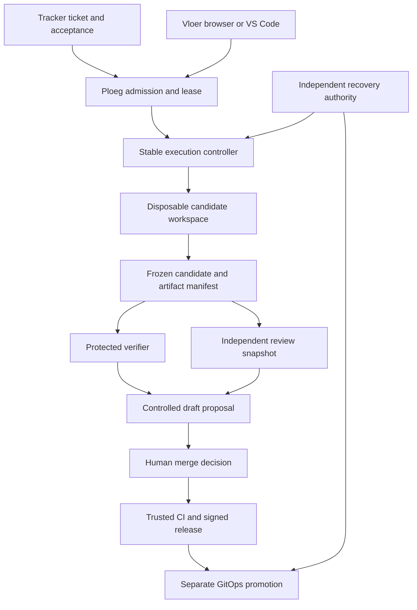

# Using Vloer and Ploeg to improve Vloer and Ploeg

Status: proposed operating and delivery design. Baseline: De Vloer v0.1, audited 2026-09-09. This is a practical route from today's working operator session to a governed ticket-to-proposal loop. It does not claim that tracker intake, automatic publishing or deployment promotion already exist in Vloer.

The first useful step is straightforward: register the Vloer repository as an allowed target, run the existing stable workbench somewhere remote, and ask a small crew to implement a bounded ticket in an isolated checkout. Humans can already steer that work through the browser. The missing pieces are trustworthy automated verification, complete change publication, shared task authority and operational recovery. Those are the first features the system should help build.

Self-improvement should mean **the current trusted release helps propose the next release**. An agent must not become the authority that determines whether its own patch is safe, grants itself broader tools, replenishes its budget, or deploys itself.

## Three progressively useful operating lanes

| Lane | What happens | Human responsibility | Exit condition |
| --- | --- | --- | --- |
| A: assisted dogfood, usable with the current core | Operator creates a Vloer session against its registered repository; OpenCode runs remotely through LiteLLM; operator answers permissions and inspects retained work | Select task, run independent checks/CI, recover/export changed files if needed, create proposal, review and merge | Five normal bounded tickets delivered with preserved evidence and no lost work; this is a proposed pilot gate, not an existing result |
| B: governed delivery | Canonical task admission, frozen candidate, trusted verification, draft proposal and cost reconciliation | Approve scope/risk, review proposal and merge; intervene on blockers | All task, code, checks, decisions and cost are correlated; crash/duplicate tests pass |
| C: unattended dispatch with interactive takeover | Tracker eligibility admits work to Ploeg; crews run under leases; Vloer/web/IDE can observe, answer or take over through the same authority | Set explicit policy and spending envelopes; manage exceptions and merge eligible changes | Measured pilot demonstrates useful outcomes without hidden retries, conflicting writers or unreviewed promotion |

Lane A does not wait for the complete platform. It deliberately retains the manual steps where the baseline has no reliable automation. Lane C must not be achieved by giving every agent a tracker token and asking it to poll.

## First real run: concrete setup

### 1. Establish a durable source and stable controller

Push the delivered Git repository to an authorized forge remote. Use `development` as the target branch; do not silently adopt `main` from a generic example. A local ZIP on a developer's laptop is not a repository a remote Kubernetes worker can clone.

Build the control and agent images from a reviewed commit. Pin the deployed controller to its image digest. Deploy one application replica with durable state, HTTPS and one initial operator account; confirm the backup includes SQLite, its encryption sidecar and retained workspace data. Keep the known-good image and a recovery procedure outside the candidate repository/workspace.

For a shared team pilot use the Kubernetes backend and its separate workspace namespace. The `local` backend runs under the server's OS user: an approved shell command or test script can read server files and sibling workspaces. It is suitable for a dedicated trusted single-user host, and should not be presented as tenant isolation.

### 2. Register Vloer explicitly

Adapt the existing live configuration, rather than placing secrets in this document. The relevant repository record is:

```json
{
  "id": "vloer",
  "name": "De Vloer",
  "description": "The workbench's own source; target development and preserve the intentional demo fixture.",
  "url": "https://forgejo.example/organization/de-vloer.git",
  "baseBranch": "development",
  "verify": ["npm", "test"],
  "trackerUrl": "https://forgejo.example/organization/de-vloer/issues"
}
```

Replace the example host/organization with the authorized real repository. This is one entry in `repositories`, not a complete configuration file. Configure `runtime.kind=opencode`, `runtime.backend=kubernetes`, the actual namespace, storage, image, gateway and egress. Use the complete setup in [live operation](../operations/live.md).

**Do not use `node --test` as the Vloer repository's blanket gate.** The original order-service fixture intentionally fails. The product command `npm test` limits discovery to `test/*.test.ts` and `test/*.test.mjs`; recursive discovery can tempt an agent to “repair” the demo's deliberately broken starting point. Such a change would weaken the demonstration while making the wrong command green.

The single `verify` argv field is a baseline limitation. For now it is a useful agent instruction and artifact-recognition hint; it is not an independently enforced acceptance plan. The protected verifier design below replaces it with named mandatory gates.

### 3. Prepare the actual toolchain and network

The shipped agent image contains Node24, Git and pinned OpenCode. Vloer development checks additionally need its npm development dependencies; browser checks need Chromium and any required system libraries; chart checks need Helm. A successfully cloned repository does not imply that these are available.

Choose one explicit preparation strategy:

- For the first pilot, build a reviewed Vloer development image with the locked dependencies and toolchain available, using an approved package mirror during image build. Package installation executes code: keep it outside control-plane credentials.
- Alternatively, permit a tightly scoped dependency preparation step against approved registries/cache endpoints. Record the lockfile digest and dependency inventory. Keep unrestricted dependency downloads out of the default execution lane.

The remote workspace must reach its forge and inference gateway. It must not reach the control-plane state volume, Kubernetes API through a mounted service account, LiteLLM management endpoint or an unrelated client's repository. Qualify these controls on the real cluster; a NetworkPolicy object existing in YAML is not proof of enforcement.

For a private repository, provision a dedicated clone credential in the workspace namespace. The current Kubernetes design exposes it to the clone init container, not the agent process. Do not give the initial dogfood agent an administrator forge token simply to make publishing convenient.

### 4. Qualify one paid session before assigning product work

Configure an actual LiteLLM model alias that supports the required tools and a small explicitly authorized session budget. A suggested first qualification authorization is at most USD10; this is a chosen spending ceiling, not a cost prediction. Keep concurrency at one until stop, resume and accounting have been exercised.

Verify the chain: browser login → configured target → authenticated OpenCode → session-scoped inference key → actual model response → permission request → response → retained events → key blocking → visible cost settlement. Exercise a disconnect, deliberate pause and explicit resume. Wait for settlement instead of creating a replacement session when prior spend is unknown.

Record the exact control/agent image digests, target repository SHA, OpenCode version, gateway/model alias and routing configuration revision, Kubernetes/CNI/storage versions and evidence locations. Do not include raw tokens in the qualification record.

### 5. Assign a narrow, reviewable first task

Start with documentation, a focused test or a small UX correction. A good first task is “document and validate the Vloer-specific repository onboarding profile, including the intentional fixture and exact checks.” It exercises real source changes, tests and review without authorizing the candidate to change its own control-plane permissions.

Use this objective template in the workbench:

```text
Work item: <canonical tracker URL or approved temporary ticket ID>
Repository: the registered vloer target, branch development.
Task: <one bounded outcome>

Acceptance criteria:
1. <observable result>
2. <regression condition that must remain true>
3. <evidence a reviewer can reproduce>

Scope: <specific files/components and permitted supporting tests>.
The order-service starting fixture is intentionally broken. Preserve it.
Do not change deployment permissions, credentials, budgets, protected check
definitions, branch protections or CI trust settings. Do not merge or deploy.

Read AGENTS.md and the relevant architecture/contract before editing.
Run the configured product checks when the required tools are available.
Report each exact command, exit status, skipped gate and actual failure.
Missing dependencies or blocked egress are blockers, not permission to invent
successful results. Stop for operator input when acceptance is ambiguous.

Return a concise change summary, modified files, actual verification evidence
and remaining risks. A human will independently verify and publish the result.
```

The current optional tracker URL on a Vloer session is a configured repository-level link, not a structured issue identity. Put the exact issue link in the objective for this initial manual lane. The canonical work-order integration supersedes that temporary convention.

### 6. Preserve and independently review the result

The baseline live adapter retains native OpenCode diff JSON and reported tool output. It does not produce a complete Git bundle or open a PR. On terminal Kubernetes completion it removes the Pod and retains the PVC. Plan the recovery/export step before running an important task.

For Lane A, a trusted operator can inspect the retained workspace volume using a separate recovery workload that has no model or publish credentials, copy the selected changed files into a clean checkout, and review the resulting diff. Preserve new files, deletions, renames, modes and any binary changes. Do not assume `git diff` or `git bundle --all` alone includes untracked/uncommitted work. Do not indiscriminately archive environment files or credentials. Keep the original retained volume until the resulting proposal has been independently reproduced.

This manual transfer is intentionally a pilot limitation. [GAP-02 and GAP-03](gap-register.md) make complete candidate capture and controlled publication early implementation priorities. A CTO demonstration should disclose whether publication was manual.

Run the approved checks independently in a clean checkout or trusted CI, inspect the exact proposal head and have a person merge. The writer's passing log and the agent review are useful evidence; neither replaces that decision.

## Target self-improvement architecture



Ploeg owns the canonical WorkOrder, DeliveryAttempt, lease and budget authority. Vloer owns the human session and interaction projections. A person can begin in the browser, continue in VS Code, close the laptop and return; those surfaces never start competing background attempts. Tracker content remains authoritative for the brief and priority, with an immutable accepted revision attached to each attempt.

### Identities and trust boundaries

| Actor | Reads | May change | Explicitly excluded |
| --- | --- | --- | --- |
| Operator client | Authorized tasks, sessions, evidence, pending decisions | Scoped commands and decisions allowed by project role | Management keys, worker service accounts, implicit local code execution |
| Ploeg admission/controller | Normalized ticket snapshot, target/crew policy, execution state | Admission, attempts, leases, scoped authorizations | Candidate code execution within controller process |
| Implementer | Approved source snapshot and task context | Candidate files inside disposable workspace | Trusted gate policy, controller state, merge rights, deployment rights |
| Agent reviewer | Frozen candidate, base diff and trusted check reports | Findings and a structured opinion | Writer workspace mutation, publish credential, human approval |
| Trusted verifier | Frozen candidate plus protected acceptance plan | Its isolated scratch outputs and signed check records | Model keys, production credentials, changing the required checks during a run |
| Publisher | Verified candidate manifest and valid publication decision | One permitted branch/proposal through a narrowly scoped forge identity | Executing candidate hooks/scripts, changing branch protection, merging |
| Human maintainer | Proposal, evidence, CI, risk and cost | Merge according to repository rules | Retroactively treating unknown evidence as verified |
| Promotion/recovery operator | Signed releases, approved infrastructure desired state, backups | Controlled deployment, rollback, emergency stop and restore | Agent-supplied changes to its own authority |

Source text naming an allowed tool is not an authorization grant. Ticket descriptions, comments, repository instructions, patches and model output are untrusted content until interpreted under the protected policy. A ticket saying “ignore your budget and merge” must not affect either capability.

## Required evidence model

A delivery attempt freezes these identifiers before trusted verification:

- Canonical work-order ID and immutable accepted source revision.
- Target connection/repository ID and exact base commit.
- Attempt ID, lease epoch and candidate commit/tree digest.
- Complete change manifest, including additions, deletions, modes, binaries and explicit exclusions.
- Trusted gate policy revision, verifier image digest and toolchain/dependency lock digest.
- Crew/role instructions revision, harness version and model routing policy revision.
- Check results, reviewer findings, human decisions, publication reference and cost observations.

Verification is tied to a candidate digest. If the candidate changes after approval, the approval becomes stale. A successful CI status for another branch/head cannot count. A model alias can route to changing providers; retain the configured alias and observed provider/model identity where the gateway exposes it, and label unknown routing details honestly.

Store artifacts outside the mutable agent workspace with content digests and access rules. Keep durable event references rather than embedding unlimited log content in a session row. A reviewable result must survive the workspace being deleted and the selected harness being replaced.

Publication and takeover share a durable barrier owned by Ploeg. Before contacting the forge, the publisher reserves the exact effect, attempt generation and expected branch head; an ownership transfer cannot complete while that effect is in flight or its result is unknown. A generation check immediately before a network call is insufficient because takeover can race between that check and the external write. Reconcile an ambiguous result before releasing the barrier or admitting successor publication. If an old publication actor can still issue the reserved write, barrier recovery must fence that actor or confirm its termination; merely expiring another database lease is not proof.

## Verification that an agent cannot grade itself

The verifier must use a protected plan chosen before the candidate runs. The candidate may add and improve tests, but cannot redefine which required checks count as success. Running a trusted command such as `npm test` is insufficient if the candidate changes the package script to `true` or deletes the assertions.

Use three complementary layers:

1. **Protected regression checks:** security/lifecycle/API invariants and fixed acceptance probes from a reviewed policy revision. They execute against the candidate application and cannot be replaced by candidate content.
2. **Candidate repository checks:** the ordinary source test suite, typecheck, lint/check, browser checks and chart checks. Changes to test scripts, CI, assertions and fixtures are included in the human diff and can trigger elevated review.
3. **Task-specific acceptance evidence:** a reviewer-approved reproduction or external assertion tied to the ticket. For a UI task, browser interaction and screenshot evidence; for lifecycle work, crash/partition tests; for accounting, delayed/unknown spend fixtures.

Protected evaluation code may be stored in a separate repository or a signed immutable artifact derived from a trusted base revision. The important properties are separate authority and explicit revision binding. Keeping every useful test secret is unnecessary; an external evaluator must simply remain outside the current writer's ability to change the result definition.

For Vloer, the initial named gates are:

| Gate | Baseline command or mechanism | Interpretation |
| --- | --- | --- |
| Dependency preparation | `npm ci` in an isolated prepared environment | Install success is prerequisite, not product correctness |
| Types | `npm run typecheck` | Required for TypeScript source changes |
| Product tests | `npm test` | Deliberately excludes running the intentionally broken fixture as a standalone product gate |
| Repository checks | `npm run check` | Syntax/import/config/secret-hygiene check; not a security certification |
| Browser | `npm run test:browser` with pinned Chromium/tooling | Required for operator flow changes; artifacts bound to candidate |
| Deployment | Helm lint and relevant demo/live render validations | Required for chart changes; rendering is not a live-cluster test |
| Protected invariants | External fixture suite against candidate | Ownership, CSRF, no lost/replayed paid commands, safe cancellation, no false check approval and no secret exposure |
| Live integration qualification | Controlled opt-in staging exercise | Required for integration behavior changed beyond contract fixtures; actual gateway/cluster versions recorded |

No required gate is silently skipped because an agent image lacks a tool. Mark it pending and hand it to CI. A task can produce a useful draft while checks are pending; it cannot be labeled verified or ready to merge.

## Risk-based autonomy

The policy classifies both the initial task and the actual diff. File paths are a useful signal, but not the sole classifier: a seemingly ordinary dependency change can alter credential handling or execute an installation hook.

| Tier | Examples | Agent lane | Human gate |
| --- | --- | --- | --- |
| R0 | Documentation, copy, diagrams, task templates | Automatic proposal creation after required checks within a small preauthorized budget | Normal review/merge |
| R1 | Bounded application behavior, tests and ordinary extension UI | Governed implement/verify/review sequence; bounded rework | Code-owner review of exact candidate |
| R2 | Auth, permissions, budget ledger, broker, executor, intake signatures, trusted check definitions, dependency execution or schema migrations | Explicit task admission; isolated staging; adversarial/rollback evidence | Design/code-owner approval before execution and separate merge review |
| R3 | Production deployment, cluster policy, secrets, identity provider configuration, forge/admin rights or deletion of retained evidence | Agent may investigate and propose source changes; privileged effects remain outside worker lane | Authorized infrastructure operator controls plan/promotion; no agent self-approval |

Protected areas in this repository include `src/auth.ts`, authorization in `src/http.ts`, budget/lifecycle logic in `src/engine.ts`, `src/broker.ts`, workspace provisioning, CI workflows, check definitions and deployment policy. They are legitimate improvement targets, but the stable release continues enforcing its old authorization until reviewed promotion. Editing the candidate copy never edits the current execution policy.

## Bootstrap implementation order

The following are deliberately small enough to become independent tickets. The main backlog owns final identifiers, dependencies, estimates and acceptance criteria.

| Order | Change | Why it comes here | Can current Vloer assist? |
| --- | --- | --- | --- |
| 1 | Vloer target onboarding and reproducible toolchain profile | Prevents incorrect test discovery and missing-tools loops | Yes, in Lane A with manual CI |
| 2 | Canonical candidate capture and complete artifact export | Prevents useful work being trapped in an ephemeral workspace | Yes; human reviews Git edge cases |
| 3 | Separate protected verification executor | Gives completion an externally supported meaning | Yes; R2 design/acceptance requires maintainer ownership |
| 4 | Controlled publisher and exact-head approval | Turns verified work into the normal forge review flow | Yes; no agent receives publisher admin rights |
| 5 | Fix Ploeg scope, environment, verdict and crash-accounting gaps | Makes existing unattended foundation suitable for its expanded role | Yes; use fixture-based regression tickets and protected review |
| 6 | Canonical work orders, idempotent inbox/outbox and fenced attempts | Connects tracker/browser/IDE to one authority | Yes; staged behind existing behavior with migration tests |
| 7 | Forgejo issue/ClickUp admission and human takeover | Unlocks real ticket pickup with revision-aware control | Yes; test adapters against fixtures before real writebacks |
| 8 | Team identity, native IDE evidence and measured pilots | Makes the workflow usable across coworkers and repeatable beyond the author | Yes; avoid taking administrative shortcuts for the demo |

Each successfully merged ticket can improve the lane used for the next ticket. Keep the full platform roadmap out of a single giant agent objective. An agent may propose a task split; creating new paid work still passes normal admission and total-budget rules.

## Failure handling and recovery drills

| Situation | Required behavior | Recovery evidence |
| --- | --- | --- |
| Laptop closes or IDE disconnects | Authorized remote run continues; next client replays durable events | No duplicate attempt; same session, candidate and event cursor |
| Controller restarts | Current paid work is interrupted/reconciled; no hidden automatic replay | Visible recovery state, confirmed stop/fencing, key discovery and retained budget holds |
| Controller is unavailable for a prolonged period | Independent lease/credential enforcement prevents indefinite authority | Simulated network partition; old worker cannot publish after lease epoch changes |
| Worker dies after spending but before reporting | External reconciler blocks key and retains unknown-spend reservation | Cost eventually reconciles or explicit audited accountant resolution; no free replacement budget |
| Source ticket changes materially | Current accepted revision remains immutable; future work pauses or re-plans under policy | UI shows old/new acceptance, actor and explicit decision |
| Candidate weakens tests/check scripts | Protected evaluator remains unchanged; risk elevates | Expected adversarial fixture fails despite green candidate-local command |
| Candidate changes after review | Previous checks/approval become stale | Publisher rejects mismatched digest/head |
| Forge push succeeds but response is lost | Publication barrier remains unresolved; reconcile exact branch/proposal state before retry or takeover | One proposal, one publication record, no duplicated comments; no successor writer admitted while the old effect is ambiguous |
| Candidate release breaks its own UI | Stable release/recovery tooling remains available | Rollback from independently retained image and restore-tested state |
| SQLite key sidecar or workspace is lost | Fail visibly; do not fabricate decrypted state or evidence | Documented restoration test and explicit unrecoverable records |

The current baseline covers several local pause/restart cases, but it has no complete distributed lease/recovery controller. [GAP-12 and GAP-18 through GAP-23](gap-register.md) are the implementation/qualification work, not merely documentation chores.

## Release and promotion discipline

The workbench must never deploy by replacing its own running source directory. After human merge, trusted CI builds the next immutable image and produces release metadata. A separate promotion identity changes the approved GitOps deployment reference. The user's existing infrastructure repository can own that desired state; agent workspaces receive no write credential for it by default.

Before promoting a self-improvement release:

1. Complete all required candidate checks and human review against the exact proposal head.
2. Build a reproducible release from the merged revision and record image/dependency provenance.
3. Exercise migrations against a restored non-production snapshot; define forward recovery and rollback compatibility explicitly.
4. Drain or deliberately interrupt live work, preserve candidate artifacts and confirm unresolved accounting holds.
5. Promote through an authorized deployment process and qualify one controlled session.
6. Retain the previous image, compatible recovery tools and a tested state restoration route.

Database schema changes may make application rollback unsafe. Record that constraint in the release; do not promise that swapping the image always restores service. The user interface cannot be the only place from which the service can be stopped or repaired.

## What to show a CTO or prospective pilot customer

Demonstrate one traceable loop with an ordinary real ticket:

1. A person marks a well-scoped ticket eligible in the existing tracker.
2. Vloer displays the accepted brief, repository, crew, policy and authorized budget before execution.
3. The remote crew runs while the operator changes workstation or closes the IDE.
4. A meaningful permission or ambiguity becomes a clear human decision, with the same decision visible in browser and VS Code.
5. The system produces a complete candidate, independent checks, reviewer findings and a draft proposal.
6. A person merges; the tracker receives a reconciled delivery update and the platform shows actual cost and human intervention time.

Until the corresponding integrations are implemented, mark the manual steps in that story. The deterministic no-model demonstration remains useful for a fast first look; it is not the evidence for economic claims.

Measure the bottleneck you intended to move: minutes of human setup/supervision/review per accepted result, queue-to-review time, accepted-change rate, rework and total model/infrastructure cost. Compare against the team's existing process on similarly scoped work and include abandoned attempts. The success claim is a more reusable, governable development workflow; a higher agent count alone is not a result.

## Related design

- [Gap register](gap-register.md): implementation evidence, severity and acceptance gates.
- [Ticket integration](ticket-integration.md): tracker authority, canonical work orders, intake and writeback contracts.
- [Current architecture](../architecture.md): what v0.1 owns today.
- [Live operation](../operations/live.md): actual setup and limitations.
- [Validation record](../validation.md): what has been exercised and what remains unqualified.
