# C4 views: from the reason to the running software

Vloer provides human interaction and workspace execution; Ploeg authorizes shared sessions and coordinates unattended work. Local work must remain usable without Ploeg. Whether both applications should use a common runner remains an [open implementation choice](questions.md). Product diagrams show proposals; deployment diagrams record the 11 September inspection. Repository-free conversation is not current session behavior.

C4 uses different zoom levels: software systems, independently running applications or stores, components inside an application, and selected code detail. Its word “container” means an application or data store; it does not mean every box is a Docker container. Infrastructure belongs in a separate deployment view. See [C4 diagrams](https://c4model.com/diagrams), [containers](https://c4model.com/diagrams/container), and [deployment views](https://c4model.com/diagrams/deployment).

Every diagram names its scope and state. Rectangles identify their type in the label. Arrows state an interaction. Dashed arrows marked “proposed” identify future behavior, not an existing integration. These are C4 views expressed in Mermaid notation, with supporting sequence diagrams; they are not new services to deploy.

## 1. System landscape — intended responsibilities

**Audience:** everyone. **Question:** who participates, and why does each system exist? **State:** intended product boundary, with proposed automation identified.

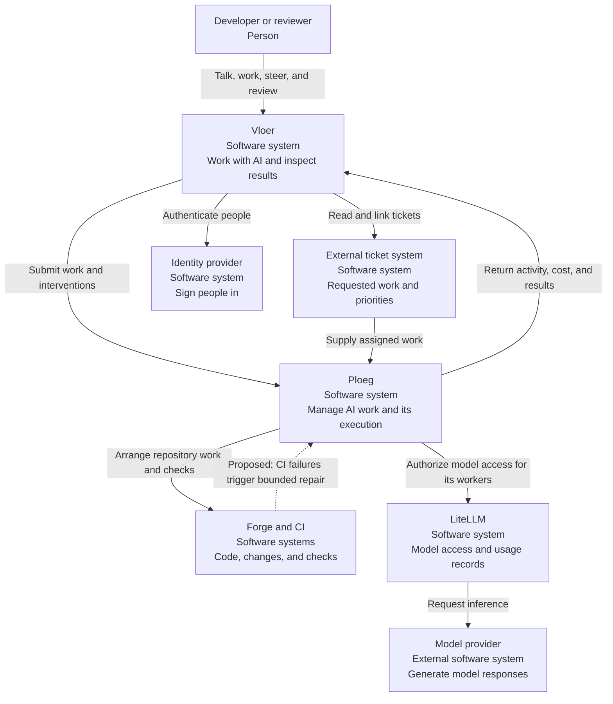

This view deliberately leaves machines and scaling out. “Arrange repository work” includes work done by Ploeg-managed executors; it is a system-level responsibility, not a claim that the controller process edits files. Detailed provider traffic appears in view 10.

## 2. Vloer system context — intended

**Audience:** product and engineering. **Question:** what must Vloer own? **State:** working direction from the domain discussion.

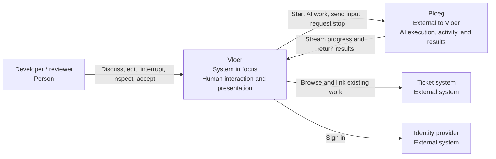

An open conversation can start without a ticket or repository. If the conversation becomes implementation work, the needed target and acceptance conditions must become explicit. That transition is not fully modeled or implemented yet. Vloer can have a server for authentication, account connections, and presentation; “does no execution” does not require it to be static HTML.

## 3. Ploeg system context — intended

**Audience:** product and platform engineers. **Question:** what inputs can start work, and what must Ploeg arrange? **State:** working direction; general agent and CI inputs are proposed.

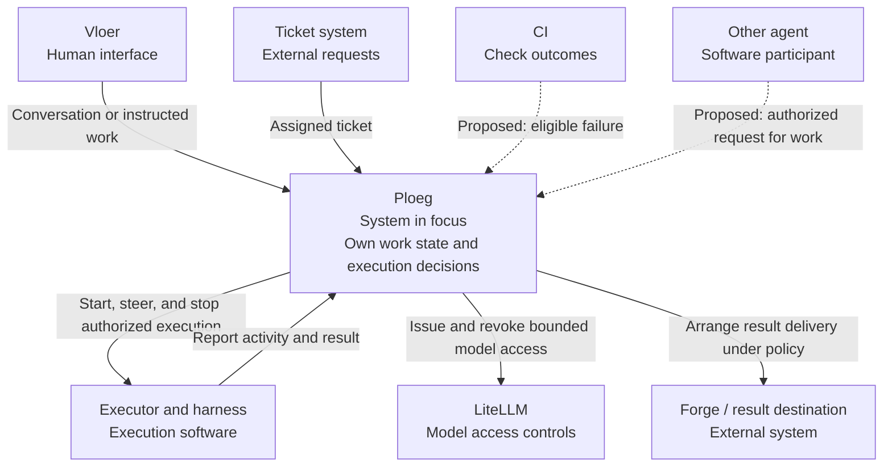

Human and non-human participants share work identifiers and execution rules. They need not use the same screen. A future agent API must identify its caller, its authority, and the work it may affect; agent-to-agent communication is not established merely by drawing an arrow.

## 4. Vloer containers — implemented shared mode

**Audience:** developers. **Question:** what actually runs today? **State:** De Vloer rc.14 with Ploeg shared execution enabled.

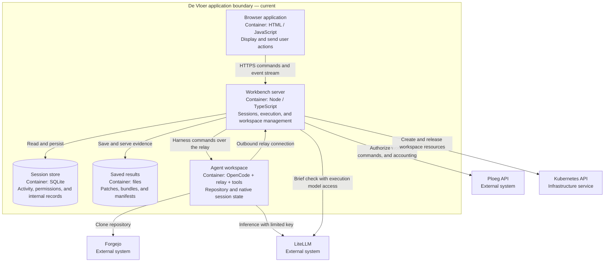

The workspace and model calls are the main differences from the intended Vloer boundary. The browser is replaceable; the current server is required to coordinate this execution path. Source: [composition](../../apps/vloer/src/main.ts), [engine](../../apps/vloer/src/engine.ts), [Kubernetes resources](../../apps/vloer/src/runtime/kubernetes.ts), [relay](../../apps/vloer/src/runtime/relay.ts), and [store](../../apps/vloer/src/store.ts).

## 5. Ploeg containers — implemented

**Audience:** developers and operations. **Question:** how does unattended work differ from Vloer-managed work? **State:** current source and homelab configuration; bronze autoscaling is paused for the Vloer pilot.

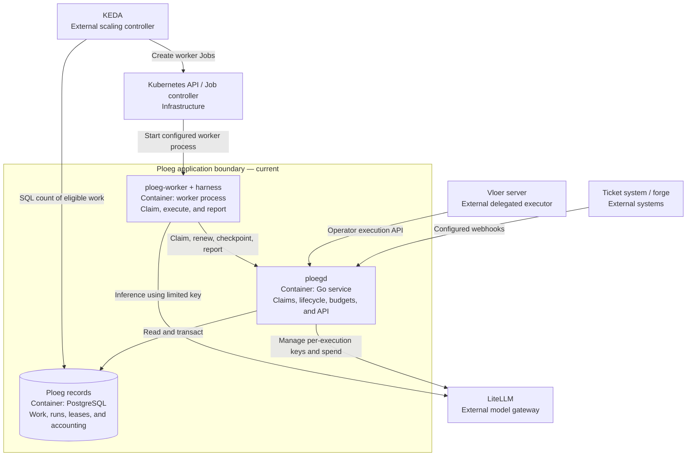

KEDA currently queries PostgreSQL directly for its scaling signal; it does not claim the work. Worker claims go through Ploeg. Vloer's own workspace Pods are not those KEDA Jobs. Sources: [controller](https://forgejo.webgrip.dev/webgrip/ploeg/src/commit/023c29fd8380ac1d0cfa375fe0098e99006fc2e8/cmd/ploegd/main.go), [worker](https://forgejo.webgrip.dev/webgrip/ploeg/src/commit/023c29fd8380ac1d0cfa375fe0098e99006fc2e8/pkg/worker/worker.go), and [ScaledJob template](https://forgejo.webgrip.dev/webgrip/ploeg/src/commit/023c29fd8380ac1d0cfa375fe0098e99006fc2e8/ops/helm/ploeg/templates/scaledjob.yaml).

## 6. Vloer server components — implemented

**Audience:** engineers investigating the split. **Question:** which responsibilities are still coupled inside Vloer? **State:** source implementation, with the optional delivery service separated in view 11.

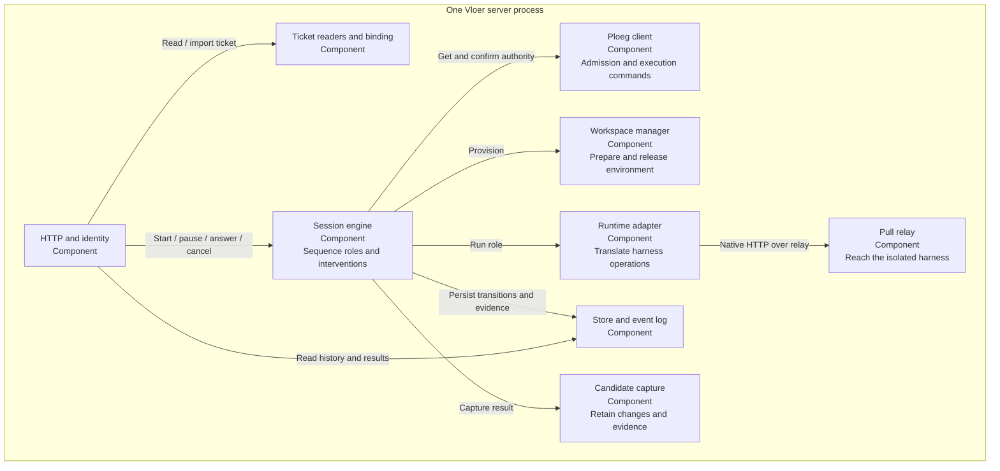

These boxes are modules, not microservices. Consolidating execution would concern the engine, runtime, workspace, and parts of result handling; it does not imply moving the human UI into Ploeg. Exact files and connections are listed in the [implementation inventory](../../apps/vloer/docs/research/2026-09-11-ecosystem-implementation.md#c4-components-inside-de-vloer).

## 7. Ploeg controller components — implemented

**Audience:** backend engineers. **Question:** what rules does Ploeg add beyond a queue and an autoscaler? **State:** current implementation.

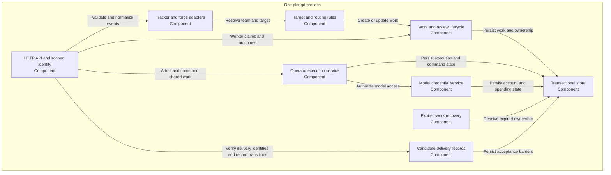

Ploeg's “Run” and Vloer's role run are not one object: one current Ploeg operator Run covers a Vloer execution containing multiple sequential role runs. Do not equate their counts in telemetry. Source details are in the [implementation inventory](../../apps/vloer/docs/research/2026-09-11-ecosystem-implementation.md#c4-components-inside-ploeg) and [shared execution contract](../../apps/vloer/docs/contracts/ploeg-execution.md).

## 8. Selected code boundary — implemented

**Audience:** engineers assessing replacement. **Question:** what abstractions let a different harness or workspace fit? **State:** selected interfaces, not a complete class model.

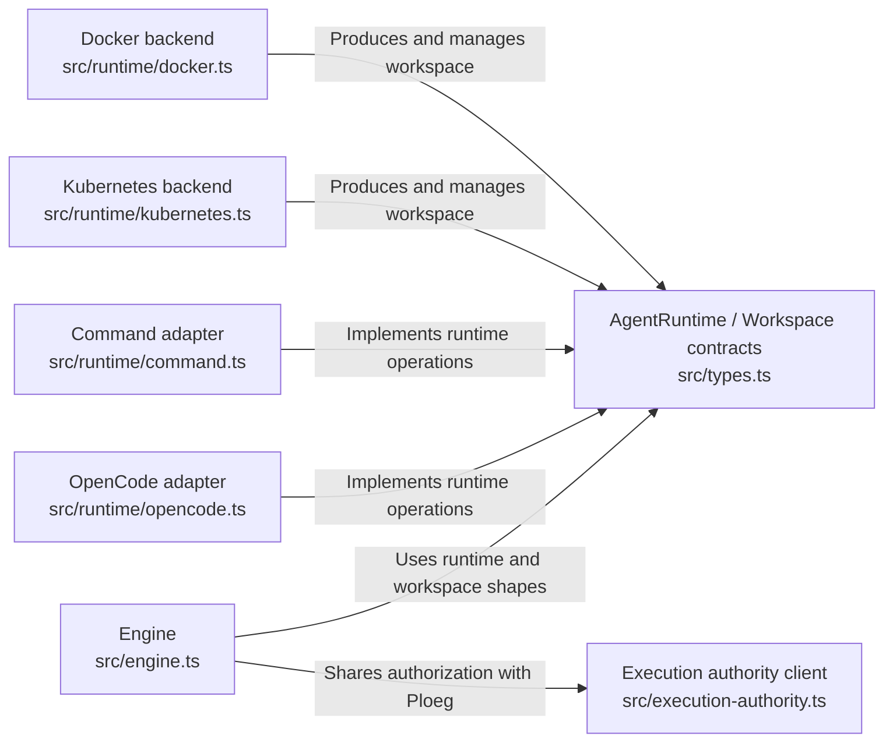

This is the useful code-level view for the present discussion. The [types](../../apps/vloer/src/types.ts), [OpenCode adapter](../../apps/vloer/src/runtime/opencode.ts), and [authority client](../../apps/vloer/src/execution-authority.ts) are the actual contracts. Adding a compatible adapter does not prove native conversation transfer or equivalent permissions. A future consolidation may move these contracts; that is not implied by this current-code view.

## 9. Start an imported ticket — observed path with a known failure

**Audience:** developers and testers. **Question:** what happens between clicking Start and receiving an agent action? **State:** current cluster path; manual permission handling has an unresolved defect.

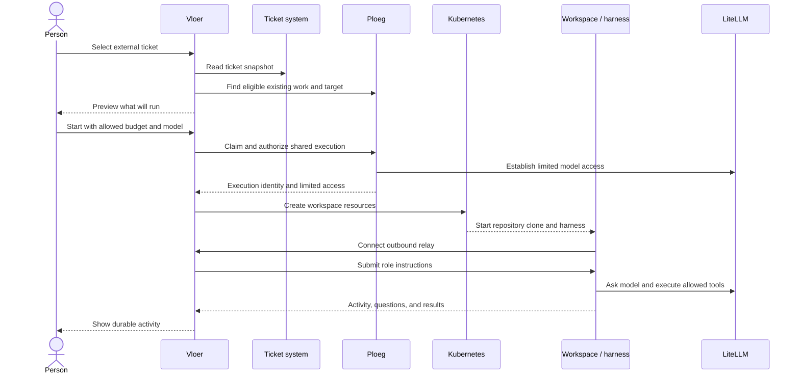

The ticket test reached tool-permission requests, then OpenCode returned an invalid permission-list response and the adapter failed the run. The automatic-approval coding fixture completed separately. The diagram is not evidence that every permission interaction passed. Sources: [task binding](../../apps/vloer/docs/contracts/ploeg-tracker-binding.md), [engine](../../apps/vloer/src/engine.ts), and [runtime defect evidence](../../apps/vloer/docs/research/2026-09-11-ecosystem-implementation.md#runtime-evidence-and-current-limits).

## 10. One model request — authority and traffic are different

**Audience:** security, finance, and engineering. **Question:** where do requests, credentials, and cost records go? **State:** current shared execution pattern; Fireworks is intended but not configured in the homelab test.

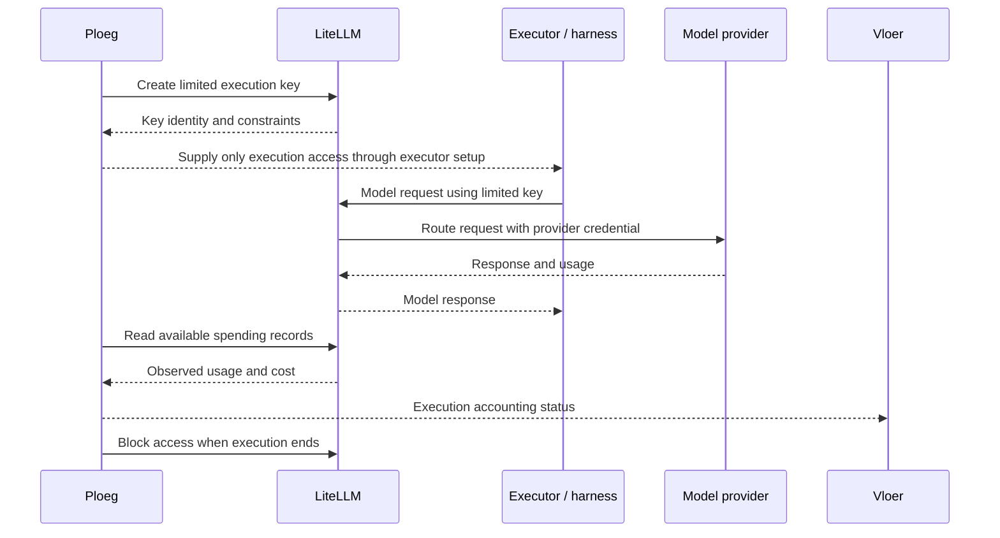

Ploeg determines authorization. LiteLLM supplies gateway enforcement and estimates. The provider supplies inference and eventual billing. None is a guarantee of an exact cost ceiling for requests already in flight. Source: [credential ownership](https://forgejo.webgrip.dev/webgrip/ploeg/src/branch/development/docs/adrs/0025-management-authority-stays-in-the-control-plane.md), [virtual keys](https://docs.litellm.ai/docs/proxy/virtual_keys), and [shared accounting contract](../../apps/vloer/docs/contracts/ploeg-execution.md).

## 11. Software result and repair cycle — intended

**Audience:** developers, reviewers, and leadership. **Question:** what should happen before human review? **State:** intended operating policy; a general automatic CI-to-ticket-to-fix loop is not yet demonstrated.

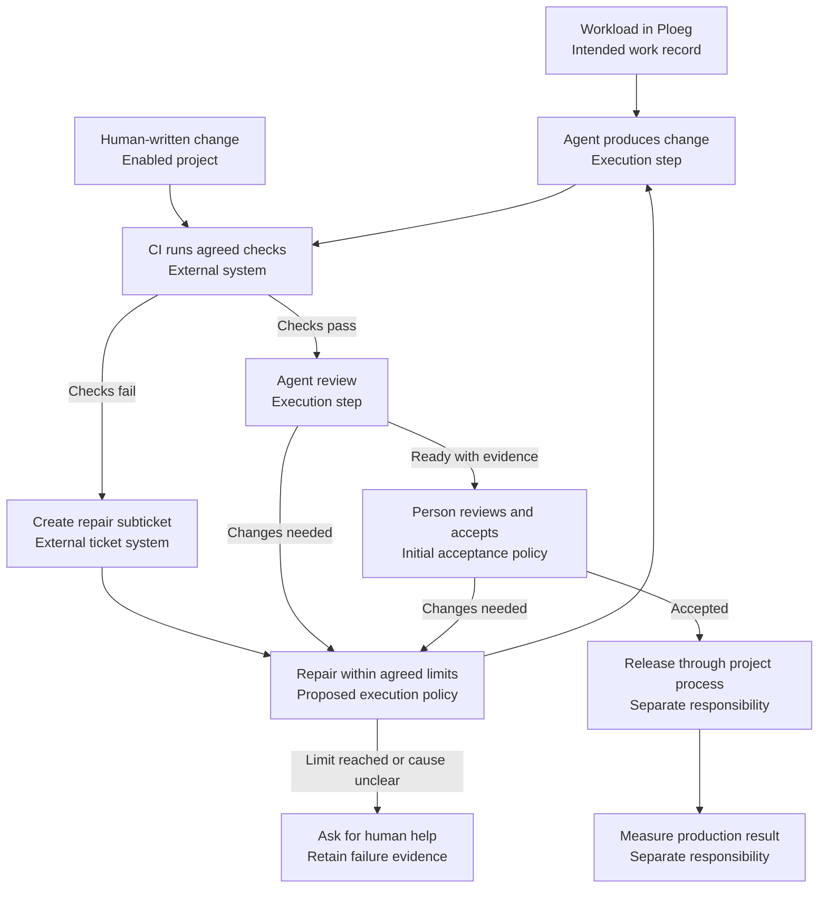

The owner chose automatic repair subtickets in projects where the behavior is enabled, including human-written changes. How repeated failures map to existing subtickets, what parent to use when a change has no ticket, and what limits stop the loop remain open. The repair process must preserve the agreed check's meaning; weakening a check to obtain a green result cannot establish acceptance. Infrastructure failures and flaky checks need an explicit disposition as well as code defects. Human acceptance initially remains required, as agreed with the owner.

Today the ordinary Vloer path saves changes and review reports. Its additional trusted verifier requires Docker and is disabled in the Talos deployment. Automatic publication is disabled. Some Ploeg unattended paths have their own review and forge behavior; they do not establish this whole proposed loop. See [candidate delivery](../../apps/vloer/docs/contracts/candidate-delivery.md) and the [implementation differences](../../apps/vloer/docs/research/2026-09-11-ecosystem-implementation.md).

## 12. Homelab deployment — current, not a production reference architecture

**Audience:** CTO and operations. **Question:** where does each running part live? **State:** inspected cluster configuration at the start of this documentation exercise.

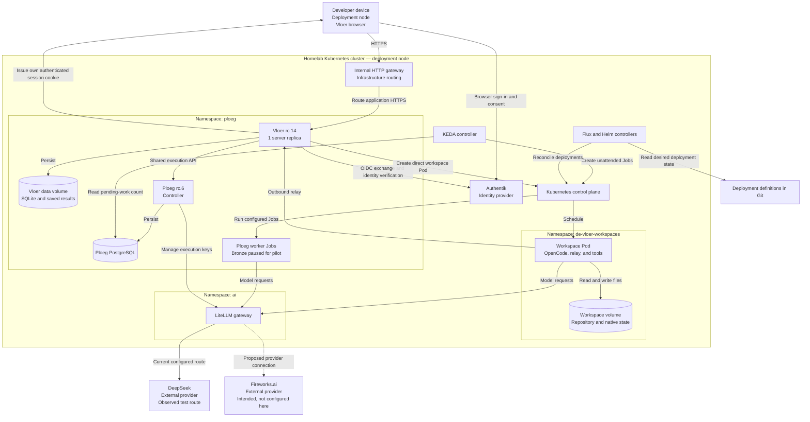

The pilot permits one concurrent Vloer session and a maximum authorized budget of $0.25. These are test settings, not throughput measurements. The real provider test cost is provisional gateway accounting. Workspace isolation depends on the configured access, network, storage, and process restrictions. Sources: [homelab values](https://forgejo.webgrip.dev/webgrip/homelab-cluster/src/commit/8b2d069897415b3d42763966e94ef9b6eee16f83/kubernetes/apps/ploeg/de-vloer/app/helmrelease.yaml), [Ploeg values](https://forgejo.webgrip.dev/webgrip/homelab-cluster/src/commit/8b2d069897415b3d42763966e94ef9b6eee16f83/kubernetes/apps/ploeg/ploeg/app/helmrelease.yaml), and [recorded checks](index.md#how-to-read-the-evidence).

## 13. Possible consolidated containers — proposal, not a migration plan

**Audience:** CTO and product owner. **Question:** can both applications reuse execution machinery while local work stays independent of Ploeg? **State:** proposed implementation to compare against the existing paths.

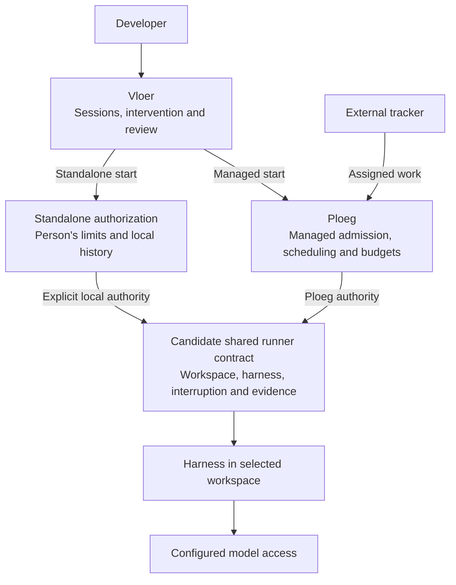

The runner returns evidence to Vloer and reports results to Ploeg only for managed work. Its box represents possible shared behavior, not one service every execution must contact. A standalone installation has no Ploeg dependency. Each execution retains the authority selected at start; a failed Ploeg connection cannot switch it to local authority. Compare these paths before choosing a library, process protocol or extraction. The [transition proposal](../migration-proposal.md) defines the comparison and migration sequence.

## 14. Research and improvement — future behavior to define

**Audience:** product and leadership. **Question:** how does the broader ambition differ from coding automation? **State:** proposed future workflow.

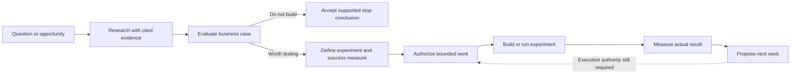

A research role, an implementation role, and a reviewer can share evidence without requiring an unrestricted agent chat network. The rules for creating follow-up tickets, approving spending, and accepting experiments remain to be defined. External telemetry must supply actual product outcomes; model output cannot stand in for market evidence. See [open questions](questions.md) and [bottleneck measurements](bottlenecks.md).
